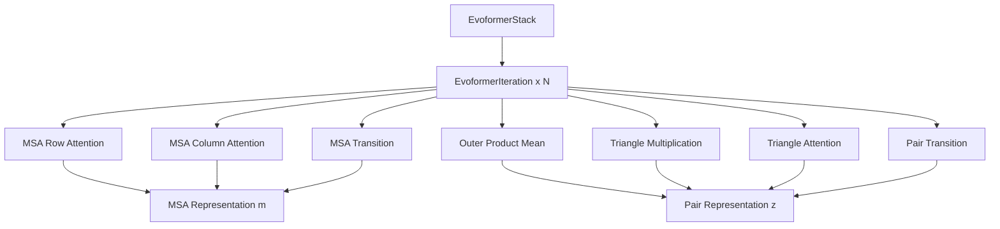

---
slug:7-evoformer-module-and-attention-mechanisms
blog_type:normal
---


Evoformer 模块是 AlphaFold 类蛋白质结构预测中的核心架构创新，它实现了一种复杂的注意力机制，通过协调的信息交换迭代地优化多序列比对（MSA）和成对表示。

## Evoformer 架构概述

Evoformer 由堆叠的迭代组成，通过精心编排的注意力操作序列和几何变换，逐步更新 MSA 表示（`m`）和成对表示（`z`）。每次迭代遵循特定的计算模式，旨在捕获基于序列的进化信息和残基之间的空间关系。

### 核心组件



该架构维护两条并行的信息流：**MSA 表示**（`m`）捕获序列间的进化约束，**成对表示**（`z`）建模残基间的关系 [unifold/modules/evoformer.py#L116-L128](unifold/modules/evoformer.py#L116-L128)。

## 注意力机制

### MSA 注意力模式

Evoformer 为 MSA 处理实现了专门的注意力机制：

**带成对偏置的 MSA 行注意力**沿序列维度操作，通过偏置项整合成对信息 [unifold/modules/evoformer.py#L53-L58](unifold/modules/evoformer.py#L53-L58)：

```python
self.msa_att_row = MSARowAttentionWithPairBias(
    d_msa=d_msa,
    d_pair=d_pair,
    d_hid=d_hid_msa_att,
    num_heads=num_heads_msa,
)
```

**MSA 列注意力**处理 MSA 中不同序列的信息，包含标准和全局注意力模式的变体 [unifold/modules/evoformer.py#L60-L73](unifold/modules/evoformer.py#L60-L73)。

<CgxTip>
MSA 注意力机制支持分块处理以提高内存效率，当序列长度超过 2560 个残基时自动切换到分块计算 [unifold/modules/attentions.py#L237-L244](unifold/modules/attentions.py#L237-L244)。
</CgxTip>

### 三角注意力机制

三角注意力作用于成对表示以捕获几何关系：

**三角注意力起始**和**三角注意力结束**从不同视角处理二维成对表示矩阵，使模型能够从行向和列向两个方向推理残基关系 [unifold/modules/evoformer.py#L95-L104](unifold/modules/evoformer.py#L95-L104)。

三角注意力实现包含从成对表示自身生成复杂偏置 [unifold/modules/attentions.py#L388-L390](unifold/modules/attentions.py#L388-L390)：

```python
triangle_bias = (
    permute_final_dims(self.linear(x), (2, 0, 1)).unsqueeze(-4).contiguous()
)
```

## Evoformer 迭代中的信息流

每个 Evoformer 迭代遵循精确的计算序列：

1. **MSA 处理阶段**：
   - 带成对偏置的行注意力整合空间信息
   - 列注意力处理跨序列信息
   - 过渡层应用前馈变换

2. **成对表示更新**：
   - 外积均值将 MSA 信息转换到成对空间
   - 三角乘法操作捕获几何约束
   - 三角注意力优化残基间关系
   - 成对过渡应用最终变换

前向传播通过精心设计的残差连接和 dropout 实现此序列 [unifold/modules/evoformer.py#L136-L210](unifold/modules/evoformer.py#L136-L210)：

<CgxTip>
外积均值操作可以置于 MSA 处理之前或之后，由 `outer_product_mean_first` 参数控制，提供信息流模式的灵活性 [unifold/modules/evoformer.py#L130-L168](unifold/modules/evoformer.py#L130-L168)。
</CgxTip>

## 三角乘法操作

三角乘法通过出边和入边处理实现几何推理：

**TriangleMultiplicationOutgoing** 处理从每个残基流向其他残基的信息，而 **TriangleMultiplicationIncoming** 处理流向每个残基的信息 [unifold/modules/triangle_multiplication.py#L154-L159](unifold/modules/triangle_multiplication.py#L154-L159)。

这些操作使用二维分块处理大型蛋白质结构以提高内存效率 [unifold/modules/triangle_multiplication.py#L30-L35](unifold/modules/triangle_multiplication.py#L30-L35)。

## 堆叠架构和训练

**EvoformerStack** 通过梯度检查点协调多次迭代以提高内存效率 [unifold/modules/evoformer.py#L295-L298](unifold/modules/evoformer.py#L295-L298)：

```python
m, z = checkpoint_sequential(
    blocks,
    input=(m, z),
)
```

对于标准堆叠，最终 MSA 表示通过对第一个序列的线性投影投影到单一序列表示 [unifold/modules/evoformer.py#L301-L305](unifold/modules/evoformer.py#L301-L305)。

## 专用变体

### ExtraMSAStack

**ExtraMSAStack** 变体处理额外的 MSA 信息，使用全局注意力模式而非标准列注意力修改列注意力 [unifold/modules/evoformer.py#L310-L363](unifold/modules/evoformer.py#L310-L363)。这使得在保持计算可行性的同时高效处理大型 MSA。

## 内存优化特性

Evoformer 实现包含多种内存优化策略：

- **分块处理**：自动对大型序列和成对矩阵进行分块
- **梯度检查点**：在深度堆叠中以计算换内存
- **二维分块**：为三角乘法操作专门设计的分块
- **偏置共享**：跨注意力头高效计算偏置

这些优化使训练大型蛋白质复合物成为可能，同时保持原始 AlphaFold 架构的完整表达能力。

## 与整体模型的集成

Evoformer 作为中央信息处理枢纽，接收来自输入处理模块的嵌入并生成精细的表示用于下游结构预测。其输出直接馈入结构模块以生成 3D 坐标 [unifold/modules/alphafold.py](unifold/modules/alphafold.py)。

模块化设计允许灵活配置注意力头、隐藏维度和堆叠深度，以平衡计算资源与预测准确性要求。

要了解 Evoformer 输出如何在 3D 结构预测中使用，参见[结构模块和 3D 坐标预测](8-structure-module-and-3d-coordinate-prediction)。有关输入处理和特征提取的详细信息，请参考[特征提取和 MSA 处理](9-feature-extraction-and-msa-processing)。