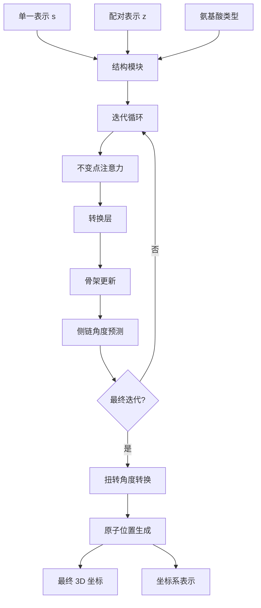

---
slug:8-structure-module-and-3d-coordinate-prediction
blog_type:normal
---


结构模块是 Uni-Fold 蛋白质结构预测流程中的最后一个关键组件，它将抽象的序列嵌入转换为精确的 3D 原子坐标。该模块通过不变点注意力和基于坐标系的变换实现复杂的几何推理，从而生成物理上真实的蛋白质结构。

## 架构概览

结构模块作为一个迭代优化过程运行，通过多个注意力块逐步改进 3D 结构预测。每个块将序列级表示与几何约束相结合，以产生越来越精确的原子坐标。



## 核心组件

### 不变点注意力 (IPA)

结构模块的核心是不变点注意力机制，它通过将 3D 坐标信息直接整合到注意力计算中来实现几何感知的注意力 [unifold/modules/structure_module.py#L165-L338](unifold/modules/structure_module.py#L165-L338)。

IPA 通过三个并行的注意力路径运行：

1. **标量注意力**：使用序列嵌入 `s` 和配对表示 `z` 的标准注意力
2. **点注意力**：使用从当前坐标导出的 3D 查询/关键点的几何注意力
3. **配对偏差整合**：整合配对关系信息

注意力机制同时计算标量和几何贡献：

```python
# 标量注意力组件
attn = torch.matmul(
    permute_final_dims(q, (1, 0, 2)),
    permute_final_dims(k, (1, 2, 0)),
)

# 点注意力组件（几何）
pt_att = q_pts.unsqueeze(-4) - k_pts.unsqueeze(-5)
pt_att = pt_att.float() ** 2
pt_att = pt_att.sum(dim=-1)
```

<CgxTip>
IPA 的不变点表示确保了旋转和平移等变性，使预测独立于全局坐标系的方向。
</CgxTip>

### 基于坐标系的坐标系统

Uni-Fold 使用 `Frame` 和 `Quaternion` 类采用复杂的基于坐标系的坐标系统 [unifold/modules/frame.py#L174-L442](unifold/modules/frame.py#L174-L442)。每个残基都由一个局部坐标系表示，该坐标系由以下部分定义：

- **旋转分量**：使用四元数表示的 3D 方向
- **平移分量**：3D 空间中的位置

坐标系系统支持高效的组合和变换操作：

```python
# 用于分层坐标变换的坐标系组合
chi1_frame_to_bb = all_frames[..., 4]
chi2_frame_to_bb = chi1_frame_to_bb.compose(chi2_frame_to_frame)
chi3_frame_to_bb = chi2_frame_to_bb.compose(chi3_frame_to_frame)
```

### 迭代优化过程

结构模块执行多次优化迭代（通常为 8 个块）[unifold/modules/structure_module.py#L494-L541](unifold/modules/structure_module.py#L494-L541)：

1. **IPA 处理**：几何感知注意力更新
2. **转换层**：带 dropout 的前馈处理
3. **骨架更新**：基于四元数的坐标调整
4. **侧链预测**：基于 ResNet 的角度预测

每次迭代逐步优化坐标预测，同时通过仔细的梯度停止机制保持梯度流。

## 坐标生成流程

### 扭转角度到坐标系的转换

模块使用分层组合将预测的扭转角度转换为 3D 坐标系 [unifold/modules/structure_module.py#L30-74](unifold/modules/structure_module.py#L30-74)：

1. **默认坐标系选择**：每种氨基酸类型的基于文献的参考坐标系
2. **角度整合**：从预测角度构建旋转矩阵
3. **坐标系组合**：骨架和侧链坐标系的分层组合

```python
def torsion_angles_to_frames(frame, alpha, aatype, default_frames):
    default_frame = Frame.from_tensor_4x4(default_frames[aatype, ...])
    # 从角度构建旋转矩阵
    all_rots = Frame(Rotation(mat=all_rots), None)
    # 与骨架坐标系组合
    all_frames_to_global = frame[..., None].compose(all_frames_to_bb)
```

### 原子位置生成

最终原子坐标通过将坐标系变换应用于基于文献的原子位置来生成 [unifold/modules/structure_module.py#L77-L100](unifold/modules/structure_module.py#L77-L100)：

```python
def frames_and_literature_positions_to_atom14_pos(frame, aatype, ...):
    # 将文献位置转换为全局坐标
    pred_positions = t_atoms_to_global.apply(lit_positions)
    # 对残基特定原子应用原子掩码
    pred_positions = pred_positions * atom_mask
```

## 与 AlphaFold 流程的集成

结构模块通过 `iteration_evoformer_structure_module` 方法与主 AlphaFold 架构无缝集成 [unifold/modules/alphafold.py#L359-L416](unifold/modules/alphafold.py#L359-L416)：

```python
outputs["sm"] = self.structure_module(
    s,  # 来自 Evoformer 的单一表示
    z,  # 来自 Evoformer 的配对表示  
    feats["aatype"],  # 氨基酸序列
    mask=feats["seq_mask"],  # 序列掩码
)
```

该模块接收来自 Evoformer 的处理后嵌入并生成最终预测，包括：
- **原子位置**：所有原子的 3D 坐标（每个残基 14 个）
- **坐标系表示**：每个残基的局部坐标系
- **扭转角度**：预测的骨架和侧链角度

## 关键设计原则

### 几何一致性

结构模块通过以下方式保持严格的几何一致性：
- **等变操作**：所有变换保持旋转和平移对称性
- **四元数表示**：数值稳定的旋转编码
- **坐标系组合**：分层坐标系统维护

### 梯度流优化

仔细的梯度管理确保稳定的训练：
- **梯度停止**：防止深度迭代堆栈中的梯度爆炸
- **残差连接**：保持跨迭代的信息流
- **混合精度**：支持训练和推理精度模式

<CgxTip>
模块的设计允许在推理期间使用可变的迭代次数，从而在预测准确性和计算成本之间进行权衡。
</CgxTip>

## 配置和参数

结构模块通过其初始化参数支持广泛的配置 [unifold/modules/structure_module.py#L397-L462](unifold/modules/structure_module.py#L397-L462)：

| 参数 | 描述 | 典型值 |
|-----------|-------------|----------------|
| `num_blocks` | 优化迭代次数 | 8 |
| `d_ipa` | IPA 隐藏维度 | 256 |
| `num_heads_ipa` | IPA 注意力头数 | 12 |
| `num_qk_points` | 每个头的查询/关键点数 | 4 |
| `num_v_points` | 每个头的值点数 | 8 |
| `trans_scale_factor` | 平移缩放 | 0.38 |

## 后续步骤

要完成对 Uni-Fold 架构的理解，请探索：

- [特征提取和 MSA 处理](9-feature-extraction-and-msa-processing)：了解如何为结构模块准备输入特征
- [损失函数和训练目标](13-loss-functions-and-training-objectives)：了解如何在训练期间优化结构模块预测
- [用于大型复合物预测的 UF-Symmetry](15-uf-symmetry-for-large-complex-prediction)：发现对称蛋白质复合物的扩展

结构模块代表了 Uni-Fold 几何推理能力的顶点，通过复杂的注意力机制和基于坐标系的坐标变换，将学习的序列模式转换为物理上有意义的 3D 蛋白质结构。