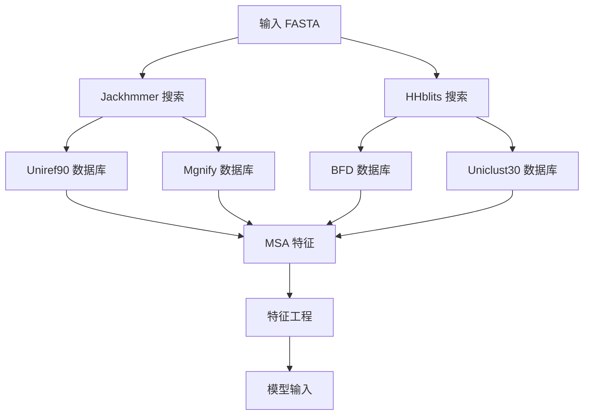

---
slug:9-feature-extraction-and-msa-processing
blog_type:normal
---

Uni-Fold 中的特征提取和 MSA 处理流水线将原始蛋白质序列和多序列比对转换为 AlphaFold 架构所需的丰富特征表示。该流水线包含序列编码、MSA 处理、特征工程和数据增强策略，使模型能够利用进化信息进行准确的蛋白质结构预测。

## MSA 流水线架构

MSA 处理流水线通过 [`unifold/msa/pipeline.py`](unifold/msa/pipeline.py#L107) 中的 `DataPipeline` 类进行协调，该类管理多个比对工具和特征生成过程。流水线集成了包括 Uniref90、BFD、Mgnify 在内的多个关键数据库以及各种模板搜索方法，以构建全面的进化谱系。

## 序列特征生成

流水线首先通过 [`make_sequence_features()`](unifold/msa/pipeline.py#L35) 函数将原始蛋白质序列转换为数值表示。该函数创建基本的序列级特征，包括：

- **One-hot 氨基酸编码**，使用标准 20 种氨基酸加未知残基
- **残基索引**，用于位置信息
- **序列长度元数据**，用于模型处理
- **结构域名称编码**，用于识别目的

one-hot 编码遵循 [`residue_constants.restype_order_with_x`](unifold/data/residue_constants.py) 中定义的残基顺序，确保整个流水线中表示的一致性。

## MSA 特征构建

核心 MSA 处理在 [`make_msa_features()`](unifold/msa/pipeline.py#L53) 中进行，该函数将多序列比对转换为结构化特征张量。该函数处理几个关键方面：

- **序列去重**，移除冗余条目
- **氨基酸整数编码**，使用 HHblits 映射
- **删除矩阵处理**，处理比对间隙
- **物种标识符提取**，用于多样性分析

生成的特征包括整数编码的 MSA、删除矩阵、比对计数和物种标识符，为下游特征工程提供基础。

## 特征工程流水线

### MSA 特征增强

[`make_msa_feat()`](unifold/data/data_ops.py#L685) 和 [`make_msa_feat_v2()`](unifold/data/data_ops.py#L718) 函数通过组合以下内容创建全面的 MSA 特征表示：

- **One-hot 编码的 MSA 序列**（23 维：20 种氨基酸 + X + 间隙 + 掩码）
- **删除指示符**，显示比对完整性
- **删除值**，使用反正切变换处理间隙
- **聚类谱系**，表示序列保守模式
- **聚类删除均值**，用于间隙分布统计

反正切变换 `torch.atan(deletion_matrix / 3.0) * (2.0 / np.pi)` 将删除值归一化到 [0, 1] 范围，在训练期间提供更好的数值稳定性。

### MSA 采样和选择

为了管理计算复杂性，流水线通过 [`sample_msa()`](unifold/data/data_ops.py#L220) 实现了复杂的 MSA 采样策略：

- **均匀排列**，用于随机采样
- **Gumbel 排列**，基于链信息进行有偏采样
- **选定和额外 MSA 序列的分别存储**
- **可配置的序列限制**，控制内存使用

<CgxTip>
Gumbel 排列采样支持多聚体预测的链感知 MSA 选择，确保采样序列中不同蛋白质链的更好表示。</CgxTip>

### 聚类和谱系生成

流水线通过 [`nearest_neighbor_clusters()`](unifold/data/data_ops.py#L336) 采用最近邻聚类来分组相似序列并生成共识谱系：

- **加权相似度计算**，使用间隙一致性加权
- **高效矩阵操作**，用于大规模聚类
- **额外 MSA 序列的聚类分配**
- **谱系汇总**，通过 [`summarize_clusters()`](unifold/data/data_ops.py#L371)

## 数据增强策略

### 掩码 MSA 生成

[`make_masked_msa()`](unifold/data/data_ops.py#L560) 函数实现了 BERT 风格的掩码，用于自监督学习：

- **基于概率的替换**，结合均匀、谱系和相同残基概率
- **可配置的掩码分数**，通常设置为 15% 的位置
- **实体感知掩码**，当 `share_mask=True` 时用于多聚体复合物
- **Gumbel 采样**，用于随机掩码生成

掩码策略通过混合真实 MSA 数据和掩码版本创建训练目标，使模型能够通过重建任务学习进化模式。

## 模板集成

虽然主要关注 MSA 处理，流水线还通过裁剪和选择函数处理模板特征：

- [`crop_templates()`](unifold/data/data_ops.py#L1183) 管理模板数量限制
- 模板特征与 MSA 特征集成，用于全面的输入表示

## 处理流水线编排

完整的特征处理流水线通过 [`process_features()`](unifold/data/process.py#L162) 进行协调，该函数应用一系列转换：

1. **非集成转换**，在所有样本中一致应用
2. **集成转换**，可以平均化以提高预测鲁棒性
3. **裁剪和大小调整操作**，标准化输入维度
4. **特征组合和堆叠**，用于最终模型输入

## 数据类型处理和优化

流水线包括通过 [`cast_to_64bit_ints()`](unifold/data/data_ops.py#L36) 等函数进行仔细的数据类型管理，以确保数值精度和跨不同计算后端的兼容性。

<CgxTip>
所有整数操作都转换为 int64，以保持与原始 AlphaFold 实现的一致性，避免训练和推理过程中的潜在数值问题。</CgxTip>

## 与模型架构的集成

处理后的特征通过标准化张量格式直接输入 Evoformer 模块。MSA 特征特别提供了进化上下文，使注意力机制能够捕获长程依赖性和结构约束。

特征提取流水线确保所有输入都经过适当的归一化、掩码和格式化，以获得最佳模型性能，同时保持对不同预测场景（单体 vs 多聚体，有或无模板）的灵活性。

## 后续步骤

特征提取和 MSA 处理后，数据流入 Evoformer 模块进行基于注意力的处理。要全面了解特征到结构的流水线，请继续阅读 [模板集成和配对表示](10-template-integration-and-pair-representation)，然后阅读 [Evoformer 模块和注意力机制](7-evoformer-module-and-attention-mechanisms)。