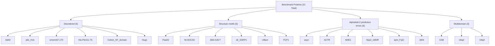

# Benchmark Dataset

> **Relevant source files**
> * [benchmark/README.md](https://github.com/COSBlab/bAIes-IDP/blob/16faa7f7/benchmark/README.md?plain=1)
> * [benchmark/bAIes/Ab40/Ab40.pdb](https://github.com/COSBlab/bAIes-IDP/blob/16faa7f7/benchmark/bAIes/Ab40/Ab40.pdb)
> * [benchmark/bAIes/Ab40/Ab40_nvt.data](https://github.com/COSBlab/bAIes-IDP/blob/16faa7f7/benchmark/bAIes/Ab40/Ab40_nvt.data)
> * [benchmark/bAIes/Ab40/Ab40_nvt.in](https://github.com/COSBlab/bAIes-IDP/blob/16faa7f7/benchmark/bAIes/Ab40/Ab40_nvt.in)
> * [benchmark/bAIes/Ab40/atom_list_matrix.ndx](https://github.com/COSBlab/bAIes-IDP/blob/16faa7f7/benchmark/bAIes/Ab40/atom_list_matrix.ndx)
> * [benchmark/bAIes/Ab40/baies_gauss_matrix.dat](https://github.com/COSBlab/bAIes-IDP/blob/16faa7f7/benchmark/bAIes/Ab40/baies_gauss_matrix.dat)
> * [benchmark/bAIes/Ab40/dry_ff_20240524_correct.cmap](https://github.com/COSBlab/bAIes-IDP/blob/16faa7f7/benchmark/bAIes/Ab40/dry_ff_20240524_correct.cmap)
> * [benchmark/bAIes/Ab40/plumed_Ab40.dat](https://github.com/COSBlab/bAIes-IDP/blob/16faa7f7/benchmark/bAIes/Ab40/plumed_Ab40.dat)
> * [scripts/README.md](https://github.com/COSBlab/bAIes-IDP/blob/16faa7f7/scripts/README.md?plain=1)
> * [tutorial/README.md](https://github.com/COSBlab/bAIes-IDP/blob/16faa7f7/tutorial/README.md?plain=1)

This page provides a high-level overview of the benchmark dataset used to validate bAIes-IDP. The benchmark consists of 21 proteins, categorized by their structural characteristics and AlphaFold-2 prediction behavior. We explore three distinct simulation variants: bAIes, bAIes-N, and coil, each serving a specific purpose in understanding IDP ensembles. Detailed information for each simulation variant, including file structures and reproduction steps, is provided in their respective child pages.

## Benchmark Proteins and Categories

The benchmark dataset comprises 21 proteins, carefully selected to represent a range of intrinsically disordered protein (IDP) characteristics and AlphaFold-2 prediction scenarios. These proteins are grouped into four categories: Disordered, Structure motifs, Alphafold-2 prediction errors, and Multidomain. This categorization helps in evaluating the performance of bAIes-IDP across different types of IDPs and prediction challenges. The full list of proteins and their categories can be found in the `benchmark/README.md` file [benchmark/README.md L9-L33](https://github.com/COSBlab/bAIes-IDP/blob/16faa7f7/benchmark/README.md?plain=1#L9-L33)

### Benchmark Protein Categories

Sources: [benchmark/README.md L9-L33](https://github.com/COSBlab/bAIes-IDP/blob/16faa7f7/benchmark/README.md?plain=1#L9-L33)

## Simulation Variants

To thoroughly validate bAIes-IDP, three distinct simulation variants are employed for the benchmark proteins. Each variant provides unique insights into the conformational ensembles of IDPs.

### bAIes Benchmark Simulations

The `bAIes` simulations represent the core bAIes-IDP methodology, incorporating AlphaFold-2 derived distance restraints with a Jeffreys prior. This variant aims to generate ensembles that reflect the structural preferences predicted by AlphaFold-2. For details on the file structure, the 21 proteins covered, and how to reproduce these results, see [bAIes Benchmark Simulations](/COSBlab/bAIes-IDP/5.1-baies-benchmark-simulations).

### bAIes-N Benchmark Simulations

The `bAIes-N` simulations are a variant of the `bAIes` approach where the Jeffreys prior is omitted (`PRIOR=NONE`) [benchmark/bAIes/Ab40/plumed_Ab40.dat L3](https://github.com/COSBlab/bAIes-IDP/blob/16faa7f7/benchmark/bAIes/Ab40/plumed_Ab40.dat#L3-L3)

 This variant is crucial for understanding the impact of the Jeffreys prior on the resulting conformational ensembles and for exploring scenarios where a less biased approach might be preferred. This variant covers 18 of the benchmark proteins. For more information, refer to [bAIes-N Benchmark Simulations](/COSBlab/bAIes-IDP/5.2-baies-n-benchmark-simulations).

### Coil Benchmark Simulations

The `coil` simulations serve as an unbiased reference ensemble, representing the behavior of proteins in a random coil state without any AlphaFold-2 derived restraints. These simulations are essential for comparison with the biased `bAIes` and `bAIes-N` ensembles, highlighting the effect of the AlphaFold-2 bias. This variant covers 18 of the benchmark proteins. For a detailed description, see [Coil Benchmark Simulations](/COSBlab/bAIes-IDP/5.3-coil-benchmark-simulations).

### Benchmark Simulation Workflow Overview

Sources:
[benchmark/bAIes/Ab40/baies_gauss_matrix.dat](https://github.com/COSBlab/bAIes-IDP/blob/16faa7f7/benchmark/bAIes/Ab40/baies_gauss_matrix.dat)

[benchmark/bAIes/Ab40/plumed_Ab40.dat L3](https://github.com/COSBlab/bAIes-IDP/blob/16faa7f7/benchmark/bAIes/Ab40/plumed_Ab40.dat#L3-L3)

[benchmark/bAIes/Ab40/Ab40_nvt.data](https://github.com/COSBlab/bAIes-IDP/blob/16faa7f7/benchmark/bAIes/Ab40/Ab40_nvt.data)

[benchmark/bAIes/Ab40/Ab40_nvt.in](https://github.com/COSBlab/bAIes-IDP/blob/16faa7f7/benchmark/bAIes/Ab40/Ab40_nvt.in)

[benchmark/bAIes/Ab40/atom_list_matrix.ndx](https://github.com/COSBlab/bAIes-IDP/blob/16faa7f7/benchmark/bAIes/Ab40/atom_list_matrix.ndx)

[scripts/README.md L12-L15](https://github.com/COSBlab/bAIes-IDP/blob/16faa7f7/scripts/README.md?plain=1#L12-L15)

[tutorial/README.md L9-L10](https://github.com/COSBlab/bAIes-IDP/blob/16faa7f7/tutorial/README.md?plain=1#L9-L10)