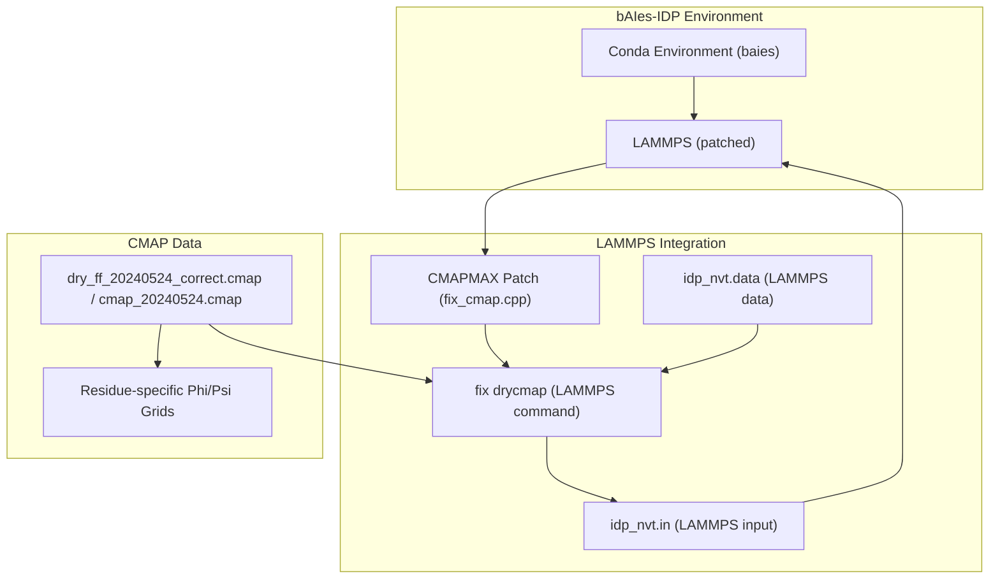

# CMAP Backbone Correction (fix drycmap)

> **Relevant source files**
> * [benchmark/bAIes-N/Ab40/dry_ff_20240524_correct.cmap](https://github.com/COSBlab/bAIes-IDP/blob/16faa7f7/benchmark/bAIes-N/Ab40/dry_ff_20240524_correct.cmap)
> * [benchmark/bAIes/Ab40/Ab40.pdb](https://github.com/COSBlab/bAIes-IDP/blob/16faa7f7/benchmark/bAIes/Ab40/Ab40.pdb)
> * [benchmark/bAIes/Ab40/Ab40_nvt.data](https://github.com/COSBlab/bAIes-IDP/blob/16faa7f7/benchmark/bAIes/Ab40/Ab40_nvt.data)
> * [benchmark/bAIes/Ab40/Ab40_nvt.in](https://github.com/COSBlab/bAIes-IDP/blob/16faa7f7/benchmark/bAIes/Ab40/Ab40_nvt.in)
> * [benchmark/bAIes/Ab40/atom_list_matrix.ndx](https://github.com/COSBlab/bAIes-IDP/blob/16faa7f7/benchmark/bAIes/Ab40/atom_list_matrix.ndx)
> * [benchmark/bAIes/Ab40/baies_gauss_matrix.dat](https://github.com/COSBlab/bAIes-IDP/blob/16faa7f7/benchmark/bAIes/Ab40/baies_gauss_matrix.dat)
> * [benchmark/bAIes/Ab40/dry_ff_20240524_correct.cmap](https://github.com/COSBlab/bAIes-IDP/blob/16faa7f7/benchmark/bAIes/Ab40/dry_ff_20240524_correct.cmap)
> * [benchmark/bAIes/Ab40/plumed_Ab40.dat](https://github.com/COSBlab/bAIes-IDP/blob/16faa7f7/benchmark/bAIes/Ab40/plumed_Ab40.dat)
> * [installation/baies.yml](https://github.com/COSBlab/bAIes-IDP/blob/16faa7f7/installation/baies.yml)
> * [installation/patch_cmap.txt](https://github.com/COSBlab/bAIes-IDP/blob/16faa7f7/installation/patch_cmap.txt)
> * [tutorial/bAIes/3-conversion/cmap_20240524.cmap](https://github.com/COSBlab/bAIes-IDP/blob/16faa7f7/tutorial/bAIes/3-conversion/cmap_20240524.cmap)
> * [tutorial/bAIes/3-conversion/idp.gro](https://github.com/COSBlab/bAIes-IDP/blob/16faa7f7/tutorial/bAIes/3-conversion/idp.gro)
> * [tutorial/bAIes/3-conversion/idp.pdb](https://github.com/COSBlab/bAIes-IDP/blob/16faa7f7/tutorial/bAIes/3-conversion/idp.pdb)
> * [tutorial/bAIes/3-conversion/idp.top](https://github.com/COSBlab/bAIes-IDP/blob/16faa7f7/tutorial/bAIes/3-conversion/idp.top)
> * [tutorial/bAIes/3-conversion/idp_nvt.data](https://github.com/COSBlab/bAIes-IDP/blob/16faa7f7/tutorial/bAIes/3-conversion/idp_nvt.data)
> * [tutorial/bAIes/3-conversion/idp_nvt.in](https://github.com/COSBlab/bAIes-IDP/blob/16faa7f7/tutorial/bAIes/3-conversion/idp_nvt.in)
> * [tutorial/bAIes/3-conversion/step3-conversion.bash](https://github.com/COSBlab/bAIes-IDP/blob/16faa7f7/tutorial/bAIes/3-conversion/step3-conversion.bash)

This page details the CMAP (Correction Map) backbone correction system used in bAIes-IDP simulations. It covers the format of the `dry_ff_20240524_correct.cmap` and `cmap_20240524.cmap` files, the residue-type-specific phi/psi grids, the implementation within LAMMPS via `fix drycmap`, and the `CMAPMAX` patch that extends the per-atom CMAP limit.

## CMAP File Format

The CMAP files, such as `dry_ff_20240524_correct.cmap` [benchmark/bAIes/Ab40/dry_ff_20240524_correct.cmap L1-L6802](https://github.com/COSBlab/bAIes-IDP/blob/16faa7f7/benchmark/bAIes/Ab40/dry_ff_20240524_correct.cmap#L1-L6802)

 and `cmap_20240524.cmap` [tutorial/bAIes/3-conversion/cmap_20240524.cmap L1-L6802](https://github.com/COSBlab/bAIes-IDP/blob/16faa7f7/tutorial/bAIes/3-conversion/cmap_20240524.cmap#L1-L6802)

 contain residue-type-specific correction energy grids for backbone dihedral angles (phi and psi). These files are plain text and structured to define energy corrections for various residue types.

Each residue type (e.g., `ARG-(XXX)`, `ARG-(PRO)`) has its own section within the file, identified by a comment line like `# ARG-(XXX), type 1` [benchmark/bAIes/Ab40/dry_ff_20240524_correct.cmap L3](https://github.com/COSBlab/bAIes-IDP/blob/16faa7f7/benchmark/bAIes/Ab40/dry_ff_20240524_correct.cmap#L3-L3)

 Following this, the file lists 24 rows, each corresponding to a specific phi angle value, starting from -180.0 degrees and incrementing by 15 degrees. Each row then contains 24 floating-point numbers, representing the energy correction values for 24 psi angle values, also incrementing by 15 degrees. This creates a 24x24 grid for each residue type, covering the full 360-degree range for both phi and psi angles.

For example, the first row for `ARG-(XXX)` corresponds to a phi angle of -180.0 degrees, and the 24 values in that row are the energy corrections for psi angles from -180.0 to 165.0 degrees in 15-degree steps [benchmark/bAIes/Ab40/dry_ff_20240524_correct.cmap L6-L10](https://github.com/COSBlab/bAIes-IDP/blob/16faa7f7/benchmark/bAIes/Ab40/dry_ff_20240524_correct.cmap#L6-L10)

## LAMMPS fix drycmap Implementation

The CMAP corrections are applied during LAMMPS simulations using the `fix drycmap` command. This fix reads the CMAP data from the specified file and applies the energy corrections to the system based on the current phi and psi dihedral angles of the backbone.

The `fix drycmap` command is typically included in the LAMMPS input script (`idp_nvt.in`) as follows:

```
fix drycmap all cmap dry_ff_20240524_correct.cmap
read_data Ab40_nvt.data fix drycmap crossterm CMAP
fix_modify drycmap energy yes
```

[benchmark/bAIes/Ab40/Ab40_nvt.in L14-L16](https://github.com/COSBlab/bAIes-IDP/blob/16faa7f7/benchmark/bAIes/Ab40/Ab40_nvt.in#L14-L16)

Here:

* `fix drycmap all cmap dry_ff_20240524_correct.cmap`: Initializes the `drycmap` fix for all atoms, specifying the CMAP file to use.
* `read_data Ab40_nvt.data fix drycmap crossterm CMAP`: Instructs LAMMPS to read CMAP crossterm definitions from the `data` file. The `Ab40_nvt.data` file [benchmark/bAIes/Ab40/Ab40_nvt.data L7](https://github.com/COSBlab/bAIes-IDP/blob/16faa7f7/benchmark/bAIes/Ab40/Ab40_nvt.data#L7-L7)  explicitly lists `38 crossterms`.
* `fix_modify drycmap energy yes`: Ensures that the energy contributions from the CMAP fix are included in the total system energy.

The `make_ff.py` script is responsible for integrating the CMAP corrections into the LAMMPS input files. It takes the CMAP file as an argument (`-cmap ${cmap}`) and generates the `idp_nvt.in` and `idp_nvt.data` files with the appropriate `fix drycmap` commands and crossterm definitions [tutorial/bAIes/3-conversion/step3-conversion.bash L23-L29](https://github.com/COSBlab/bAIes-IDP/blob/16faa7f7/tutorial/bAIes/3-conversion/step3-conversion.bash#L23-L29)

### CMAPMAX Patch

A critical modification to the standard LAMMPS `fix_cmap.cpp` source code is applied to increase the maximum number of CMAP terms that can be stored per atom. The default `CMAPMAX` value in LAMMPS is 6 [installation/patch_cmap.txt L7](https://github.com/COSBlab/bAIes-IDP/blob/16faa7f7/installation/patch_cmap.txt#L7-L7)

 which is insufficient for many protein systems. The bAIes-IDP codebase applies a patch to raise this limit to 40 [installation/patch_cmap.txt L8](https://github.com/COSBlab/bAIes-IDP/blob/16faa7f7/installation/patch_cmap.txt#L8-L8)

This patch modifies three lines in `src/MOLECULE/fix_cmap.cpp`:

1. `static constexpr int CMAPMAX = 40;`: Changes the constant definition to 40 [installation/patch_cmap.txt L8](https://github.com/COSBlab/bAIes-IDP/blob/16faa7f7/installation/patch_cmap.txt#L8-L8)
2. `for (i = 0; i < CMAPMAX; i++)`: Updates the loop bound for pre-computing map derivatives [installation/patch_cmap.txt L15](https://github.com/COSBlab/bAIes-IDP/blob/16faa7f7/installation/patch_cmap.txt#L15-L15)
3. `if (t1 < 0 || t1 > CMAPMAX-1) error->all(FLERR,"Invalid CMAP crossterm_type");`: Adjusts the bounds check for CMAP crossterm types [installation/patch_cmap.txt L26](https://github.com/COSBlab/bAIes-IDP/blob/16faa7f7/installation/patch_cmap.txt#L26-L26)

This `CMAPMAX` patch is essential for correctly handling the CMAP corrections for larger or more complex protein systems, as it allows for a greater number of dihedral corrections to be applied per atom. The patch is applied during the LAMMPS compilation process, as described in the [1.1. Getting Started](https://github.com/COSBlab/bAIes-IDP/blob/16faa7f7/1.1. Getting Started)

 page.

## Data Flow for CMAP Correction

The following diagram illustrates the data flow involved in applying CMAP corrections during the bAIes-IDP simulation pipeline.


**Diagram 1: CMAP Correction Data Flow**

Sources:

* [tutorial/bAIes/3-conversion/step3-conversion.bash L1-L31](https://github.com/COSBlab/bAIes-IDP/blob/16faa7f7/tutorial/bAIes/3-conversion/step3-conversion.bash#L1-L31)
* [benchmark/bAIes/Ab40/Ab40_nvt.in L14-L16](https://github.com/COSBlab/bAIes-IDP/blob/16faa7f7/benchmark/bAIes/Ab40/Ab40_nvt.in#L14-L16)
* [benchmark/bAIes/Ab40/Ab40_nvt.data L7](https://github.com/COSBlab/bAIes-IDP/blob/16faa7f7/benchmark/bAIes/Ab40/Ab40_nvt.data#L7-L7)

## CMAP System Components

The CMAP system involves several key components working together to apply the backbone dihedral corrections.



**Diagram 2: CMAP System Components and Interactions**

Sources:

* [installation/patch_cmap.txt L1-L29](https://github.com/COSBlab/bAIes-IDP/blob/16faa7f7/installation/patch_cmap.txt#L1-L29)
* [installation/baies.yml L1-L31](https://github.com/COSBlab/bAIes-IDP/blob/16faa7f7/installation/baies.yml#L1-L31)
* [tutorial/bAIes/3-conversion/step3-conversion.bash L10](https://github.com/COSBlab/bAIes-IDP/blob/16faa7f7/tutorial/bAIes/3-conversion/step3-conversion.bash#L10-L10)
* [benchmark/bAIes/Ab40/dry_ff_20240524_correct.cmap L1-L6802](https://github.com/COSBlab/bAIes-IDP/blob/16faa7f7/benchmark/bAIes/Ab40/dry_ff_20240524_correct.cmap#L1-L6802)
* [benchmark/bAIes/Ab40/Ab40_nvt.in L14-L16](https://github.com/COSBlab/bAIes-IDP/blob/16faa7f7/benchmark/bAIes/Ab40/Ab40_nvt.in#L14-L16)