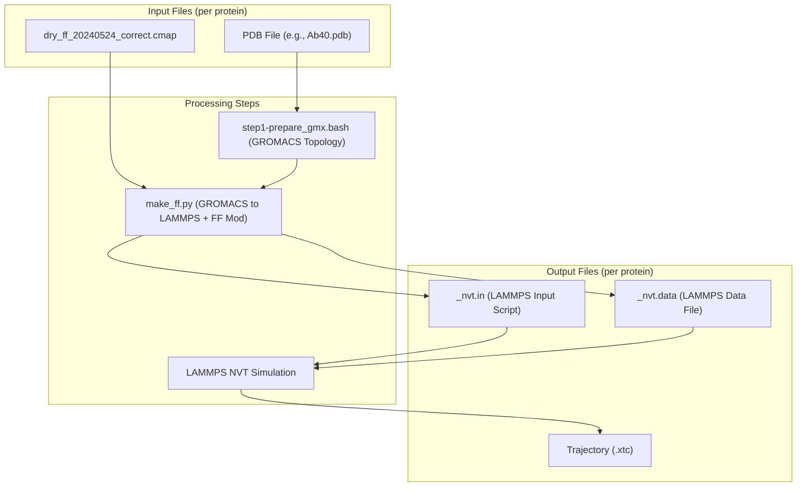

# Coil Benchmark Simulations

> **Relevant source files**
> * [benchmark/coil/ACTR/ACTR.pdb](https://github.com/COSBlab/bAIes-IDP/blob/16faa7f7/benchmark/coil/ACTR/ACTR.pdb)
> * [benchmark/coil/ACTR/ACTR_nvt.data](https://github.com/COSBlab/bAIes-IDP/blob/16faa7f7/benchmark/coil/ACTR/ACTR_nvt.data)
> * [benchmark/coil/ACTR/ACTR_nvt.in](https://github.com/COSBlab/bAIes-IDP/blob/16faa7f7/benchmark/coil/ACTR/ACTR_nvt.in)
> * [benchmark/coil/ACTR/dry_ff_20240524_correct.cmap](https://github.com/COSBlab/bAIes-IDP/blob/16faa7f7/benchmark/coil/ACTR/dry_ff_20240524_correct.cmap)
> * [benchmark/coil/Ab40/Ab40.pdb](https://github.com/COSBlab/bAIes-IDP/blob/16faa7f7/benchmark/coil/Ab40/Ab40.pdb)
> * [benchmark/coil/Ab40/Ab40_nvt.data](https://github.com/COSBlab/bAIes-IDP/blob/16faa7f7/benchmark/coil/Ab40/Ab40_nvt.data)
> * [benchmark/coil/Ab40/Ab40_nvt.in](https://github.com/COSBlab/bAIes-IDP/blob/16faa7f7/benchmark/coil/Ab40/Ab40_nvt.in)
> * [benchmark/coil/Ab40/dry_ff_20240524_correct.cmap](https://github.com/COSBlab/bAIes-IDP/blob/16faa7f7/benchmark/coil/Ab40/dry_ff_20240524_correct.cmap)
> * [benchmark/coil/Alb3-A3CT/Alb3-A3CT.pdb](https://github.com/COSBlab/bAIes-IDP/blob/16faa7f7/benchmark/coil/Alb3-A3CT/Alb3-A3CT.pdb)
> * [benchmark/coil/Alb3-A3CT/Alb3-A3CT_nvt.data](https://github.com/COSBlab/bAIes-IDP/blob/16faa7f7/benchmark/coil/Alb3-A3CT/Alb3-A3CT_nvt.data)
> * [benchmark/coil/Alb3-A3CT/Alb3-A3CT_nvt.in](https://github.com/COSBlab/bAIes-IDP/blob/16faa7f7/benchmark/coil/Alb3-A3CT/Alb3-A3CT_nvt.in)
> * [benchmark/coil/Alb3-A3CT/dry_ff_20240524_correct.cmap](https://github.com/COSBlab/bAIes-IDP/blob/16faa7f7/benchmark/coil/Alb3-A3CT/dry_ff_20240524_correct.cmap)
> * [benchmark/coil/Colicin_N_T_domain/Colicin_N_T_domain.pdb](https://github.com/COSBlab/bAIes-IDP/blob/16faa7f7/benchmark/coil/Colicin_N_T_domain/Colicin_N_T_domain.pdb)
> * [benchmark/coil/Colicin_N_T_domain/Colicin_N_T_domain_nvt.data](https://github.com/COSBlab/bAIes-IDP/blob/16faa7f7/benchmark/coil/Colicin_N_T_domain/Colicin_N_T_domain_nvt.data)
> * [benchmark/coil/Colicin_N_T_domain/Colicin_N_T_domain_nvt.in](https://github.com/COSBlab/bAIes-IDP/blob/16faa7f7/benchmark/coil/Colicin_N_T_domain/Colicin_N_T_domain_nvt.in)
> * [benchmark/coil/Colicin_N_T_domain/dry_ff_20240524_correct.cmap](https://github.com/COSBlab/bAIes-IDP/blob/16faa7f7/benchmark/coil/Colicin_N_T_domain/dry_ff_20240524_correct.cmap)
> * [benchmark/coil/FCP1/FCP1.pdb](https://github.com/COSBlab/bAIes-IDP/blob/16faa7f7/benchmark/coil/FCP1/FCP1.pdb)
> * [benchmark/coil/FCP1/FCP1_nvt.data](https://github.com/COSBlab/bAIes-IDP/blob/16faa7f7/benchmark/coil/FCP1/FCP1_nvt.data)
> * [benchmark/coil/FCP1/FCP1_nvt.in](https://github.com/COSBlab/bAIes-IDP/blob/16faa7f7/benchmark/coil/FCP1/FCP1_nvt.in)
> * [benchmark/coil/Nsp2_CtlIDR/Nsp2_CtlIDR.pdb](https://github.com/COSBlab/bAIes-IDP/blob/16faa7f7/benchmark/coil/Nsp2_CtlIDR/Nsp2_CtlIDR.pdb)
> * [benchmark/coil/Nsp2_CtlIDR/Nsp2_CtlIDR_nvt.data](https://github.com/COSBlab/bAIes-IDP/blob/16faa7f7/benchmark/coil/Nsp2_CtlIDR/Nsp2_CtlIDR_nvt.data)
> * [benchmark/coil/Nsp2_CtlIDR/Nsp2_CtlIDR_nvt.in](https://github.com/COSBlab/bAIes-IDP/blob/16faa7f7/benchmark/coil/Nsp2_CtlIDR/Nsp2_CtlIDR_nvt.in)
> * [benchmark/coil/Nsp2_CtlIDR/dry_ff_20240524_correct.cmap](https://github.com/COSBlab/bAIes-IDP/blob/16faa7f7/benchmark/coil/Nsp2_CtlIDR/dry_ff_20240524_correct.cmap)
> * [benchmark/coil/Nt-SOCS5/Nt-SOCS5.pdb](https://github.com/COSBlab/bAIes-IDP/blob/16faa7f7/benchmark/coil/Nt-SOCS5/Nt-SOCS5.pdb)
> * [benchmark/coil/Nt-SOCS5/Nt-SOCS5_nvt.data](https://github.com/COSBlab/bAIes-IDP/blob/16faa7f7/benchmark/coil/Nt-SOCS5/Nt-SOCS5_nvt.data)
> * [benchmark/coil/Nt-SOCS5/Nt-SOCS5_nvt.in](https://github.com/COSBlab/bAIes-IDP/blob/16faa7f7/benchmark/coil/Nt-SOCS5/Nt-SOCS5_nvt.in)
> * [benchmark/coil/Nt-SOCS5/dry_ff_20240524_correct.cmap](https://github.com/COSBlab/bAIes-IDP/blob/16faa7f7/benchmark/coil/Nt-SOCS5/dry_ff_20240524_correct.cmap)
> * [benchmark/coil/PaaA2/PaaA2.pdb](https://github.com/COSBlab/bAIes-IDP/blob/16faa7f7/benchmark/coil/PaaA2/PaaA2.pdb)
> * [benchmark/coil/PaaA2/PaaA2_nvt.data](https://github.com/COSBlab/bAIes-IDP/blob/16faa7f7/benchmark/coil/PaaA2/PaaA2_nvt.data)
> * [benchmark/coil/PaaA2/PaaA2_nvt.in](https://github.com/COSBlab/bAIes-IDP/blob/16faa7f7/benchmark/coil/PaaA2/PaaA2_nvt.in)

This page details the `benchmark/coil/` directory, which contains the input files for running unbiased random coil simulations for a set of 18 intrinsically disordered proteins (IDPs). These simulations serve as a crucial reference ensemble, representing the behavior of IDPs in the absence of any specific structural bias, such as those derived from AlphaFold predictions.

## Purpose and Scope

The `coil` simulations are designed to generate an unbiased reference ensemble for IDPs. Unlike the `bAIes` and `bAIes-N` simulations, which incorporate AlphaFold-derived distance restraints, `coil` simulations model the IDPs as random coils, primarily governed by the underlying force field and excluded volume interactions. This allows for a direct comparison to assess the impact of AlphaFold-derived biases on the conformational landscape of IDPs.

## Directory Structure and File Set

Each protein in the `benchmark/coil/` directory has its own subdirectory, containing the necessary files for a LAMMPS simulation. For example, for the protein `Ab40`, the files are located in `benchmark/coil/Ab40/`.

The standard file set for each protein includes:

* `[protein_name].pdb`: The initial protein structure in PDB format. This file defines the atomic coordinates and connectivity. * Example: `benchmark/coil/Ab40/Ab40.pdb` [benchmark/coil/Ab40/Ab40.pdb L1-L4](https://github.com/COSBlab/bAIes-IDP/blob/16faa7f7/benchmark/coil/Ab40/Ab40.pdb#L1-L4) * Example: `benchmark/coil/ACTR/ACTR.pdb` [benchmark/coil/ACTR/ACTR.pdb L1-L4](https://github.com/COSBlab/bAIes-IDP/blob/16faa7f7/benchmark/coil/ACTR/ACTR.pdb#L1-L4)
* `[protein_name]_nvt.in`: The LAMMPS input script for the NVT simulation. This script defines the simulation parameters, force field, and CMAP corrections. * Example: `benchmark/coil/Ab40/Ab40_nvt.in` [benchmark/coil/Ab40/Ab40_nvt.in L1-L17](https://github.com/COSBlab/bAIes-IDP/blob/16faa7f7/benchmark/coil/Ab40/Ab40_nvt.in#L1-L17) * Example: `benchmark/coil/ACTR/ACTR_nvt.in` [benchmark/coil/ACTR/ACTR_nvt.in L1-L17](https://github.com/COSBlab/bAIes-IDP/blob/16faa7f7/benchmark/coil/ACTR/ACTR_nvt.in#L1-L17)
* `[protein_name]_nvt.data`: The LAMMPS data file, containing the molecular topology (atom types, masses, bond, angle, and dihedral parameters) and initial coordinates. * Example: `benchmark/coil/Ab40/Ab40_nvt.data` [benchmark/coil/Ab40/Ab40_nvt.data L1-L18](https://github.com/COSBlab/bAIes-IDP/blob/16faa7f7/benchmark/coil/Ab40/Ab40_nvt.data#L1-L18) * Example: `benchmark/coil/ACTR/ACTR_nvt.data` [benchmark/coil/ACTR/ACTR_nvt.data L1-L18](https://github.com/COSBlab/bAIes-IDP/blob/16faa7f7/benchmark/coil/ACTR/ACTR_nvt.data#L1-L18)
* `dry_ff_20240524_correct.cmap`: The CMAP correction map file, which provides backbone dihedral corrections for the force field. This file is identical across all proteins in the `coil` benchmark. * Example: `benchmark/coil/Ab40/dry_ff_20240524_correct.cmap` [benchmark/coil/Ab40/dry_ff_20240524_correct.cmap L1-L3](https://github.com/COSBlab/bAIes-IDP/blob/16faa7f7/benchmark/coil/Ab40/dry_ff_20240524_correct.cmap#L1-L3) * Example: `benchmark/coil/ACTR/dry_ff_20240524_correct.cmap` [benchmark/coil/ACTR/dry_ff_20240524_correct.cmap L1-L3](https://github.com/COSBlab/bAIes-IDP/blob/16faa7f7/benchmark/coil/ACTR/dry_ff_20240524_correct.cmap#L1-L3)

### Protein List

The `coil` benchmark covers 18 proteins. These proteins are a subset of the larger 21-protein benchmark used in bAIes-IDP. The specific proteins included are:

* Ab40
* ACTR
* Alb3-A3CT
* Colicin_N_T_domain
* FCP1
* Nsp2_CtlIDR
* Nt-SOCS5
* PaaA2
* ... (and 10 other proteins)

Sources:

* `benchmark/coil/Ab40/Ab40.pdb`
* `benchmark/coil/ACTR/ACTR.pdb`
* `benchmark/coil/Ab40/Ab40_nvt.in`
* `benchmark/coil/ACTR/ACTR_nvt.in`
* `benchmark/coil/Ab40/Ab40_nvt.data`
* `benchmark/coil/ACTR/ACTR_nvt.data`
* `benchmark/coil/Ab40/dry_ff_20240524_correct.cmap`
* `benchmark/coil/ACTR/dry_ff_20240524_correct.cmap`

## Simulation Setup

The `coil` simulations are performed using LAMMPS. The `_nvt.in` file for each protein defines the simulation parameters. Key aspects of the simulation setup include:

* **Units and Atom Style**: `units real` and `atom_style full` are used, indicating real units for energy, mass, etc., and full atom representation including bonds, angles, and dihedrals. [benchmark/coil/Ab40/Ab40_nvt.in L1-L2](https://github.com/COSBlab/bAIes-IDP/blob/16faa7f7/benchmark/coil/Ab40/Ab40_nvt.in#L1-L2)
* **Boundary Conditions**: Periodic boundary conditions (`boundary p p p`) are applied in all three dimensions. [benchmark/coil/Ab40/Ab40_nvt.in L5](https://github.com/COSBlab/bAIes-IDP/blob/16faa7f7/benchmark/coil/Ab40/Ab40_nvt.in#L5-L5)
* **Force Field Styles**: The simulations use hybrid styles for bonds (`bond_style hybrid harmonic`), angles (`angle_style hybrid harmonic`), and dihedrals (`dihedral_style hybrid charmm multi/harmonic`). [benchmark/coil/Ab40/Ab40_nvt.in L7-L9](https://github.com/COSBlab/bAIes-IDP/blob/16faa7f7/benchmark/coil/Ab40/Ab40_nvt.in#L7-L9)
* **Pair Style**: A Lennard-Jones potential with a cutoff of 2.0 is used for non-bonded interactions (`pair_style lj/cut 2.0`). [benchmark/coil/Ab40/Ab40_nvt.in L12](https://github.com/COSBlab/bAIes-IDP/blob/16faa7f7/benchmark/coil/Ab40/Ab40_nvt.in#L12-L12)
* **CMAP Correction**: A crucial component is the `fix drycmap` command, which applies the backbone Phi/Psi dihedral correction map defined in `dry_ff_20240524_correct.cmap`. This correction is essential for accurately modeling protein backbone conformations. * `fix drycmap all cmap dry_ff_20240524_correct.cmap` [benchmark/coil/Ab40/Ab40_nvt.in L14](https://github.com/COSBlab/bAIes-IDP/blob/16faa7f7/benchmark/coil/Ab40/Ab40_nvt.in#L14-L14) * `read_data Ab40_nvt.data fix drycmap crossterm CMAP` [benchmark/coil/Ab40/Ab40_nvt.in L15](https://github.com/COSBlab/bAIes-IDP/blob/16faa7f7/benchmark/coil/Ab40/Ab40_nvt.in#L15-L15) * `fix_modify drycmap energy yes` [benchmark/coil/Ab40/Ab40_nvt.in L16](https://github.com/COSBlab/bAIes-IDP/blob/16faa7f7/benchmark/coil/Ab40/Ab40_nvt.in#L16-L16)
* **Pair Coefficients**: The `pair_coeff` commands define the Lennard-Jones parameters (epsilon and sigma) for all atom type pairs. These parameters are derived from the force field. [benchmark/coil/Ab40/Ab40_nvt.in L20-L336](https://github.com/COSBlab/bAIes-IDP/blob/16faa7f7/benchmark/coil/Ab40/Ab40_nvt.in#L20-L336)

### Coil Simulation Workflow

The workflow for a `coil` simulation is simpler than the `bAIes` or `bAIes-N` variants because it does not involve distogram preprocessing or the application of AlphaFold-derived biases.

The general steps are:

1. **GROMACS Topology Preparation**: An initial PDB structure is converted into GROMACS `.gro`, `.top`, and `.itp` files using `step1-prepare_gmx.bash`.
2. **GROMACS-to-LAMMPS Conversion**: The GROMACS topology is converted to LAMMPS input files (`_nvt.in`, `_nvt.data`) using `make_ff.py`. This script also applies the Random Coil force field modifications and integrates the CMAP corrections.
3. **LAMMPS Simulation**: The generated `_nvt.in` and `_nvt.data` files are used to run an NVT simulation in LAMMPS.

The absence of a PLUMED input file (`plumed.dat`) in the `coil` directory signifies that no external biasing potential (like the BAIES bias) is applied during these simulations.

### Diagram: Coil Simulation Data Flow

Diagram: "Coil Simulation Data Flow"
Sources:

* `benchmark/coil/Ab40/Ab40.pdb`
* `benchmark/coil/Ab40/dry_ff_20240524_correct.cmap`
* `benchmark/coil/Ab40/Ab40_nvt.in`
* `benchmark/coil/Ab40/Ab40_nvt.data`

## Unbiased Reference Ensembles

The `coil` simulations are critical for establishing an unbiased reference. By comparing the conformational ensembles generated by `bAIes` and `bAIes-N` simulations against these `coil` ensembles, researchers can quantify the extent to which AlphaFold-derived restraints influence the predicted structural properties of IDPs. This comparison helps in understanding the intrinsic flexibility of IDPs and the impact of structural predictions on their conformational sampling.

Sources:

* `benchmark/coil/Ab40/Ab40_nvt.in`
* `benchmark/coil/ACTR/ACTR_nvt.in`