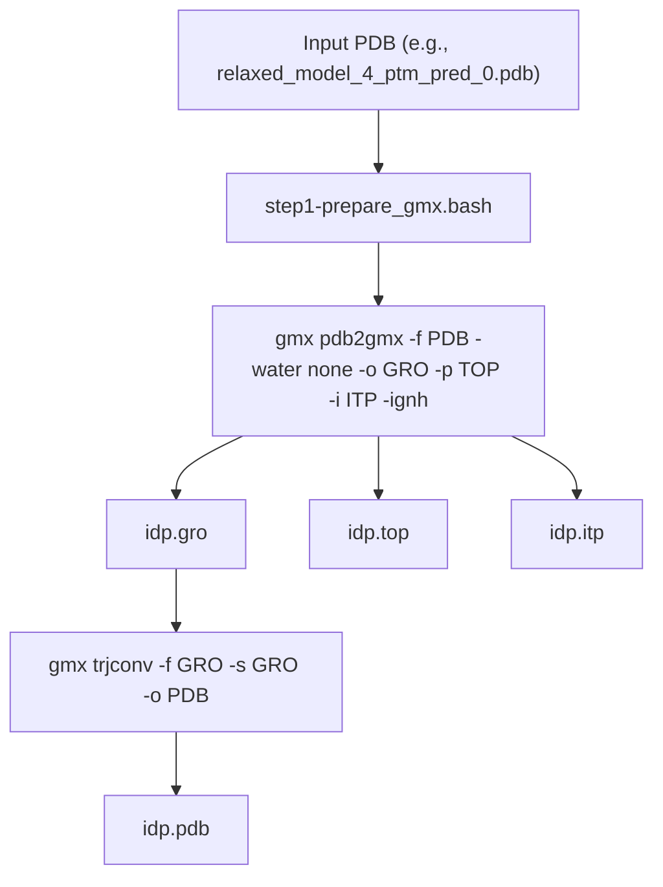
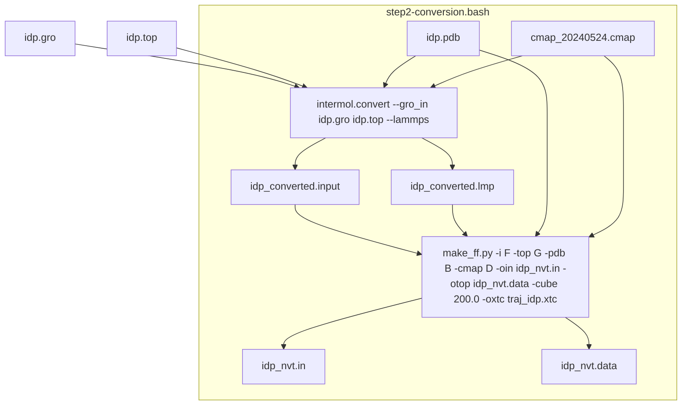
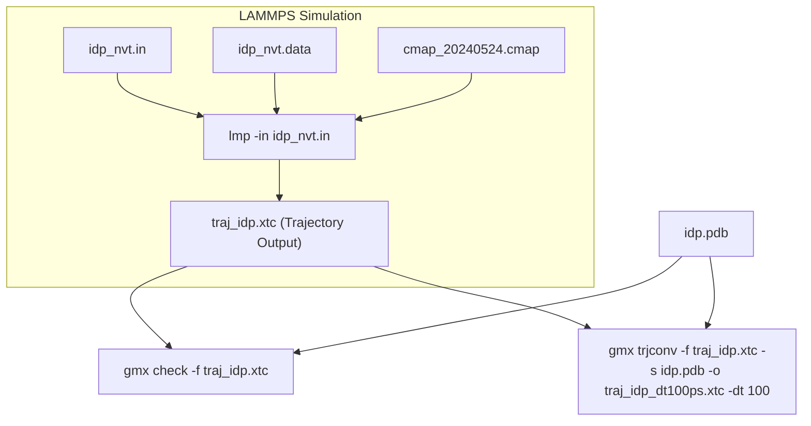

# 4.2. Coil Tutorial (Random Coil Ensemble)

> **Relevant source files**
> * [tutorial/coil/1-preparation/idp.gro](https://github.com/COSBlab/bAIes-IDP/blob/16faa7f7/tutorial/coil/1-preparation/idp.gro)
> * [tutorial/coil/1-preparation/idp.itp](https://github.com/COSBlab/bAIes-IDP/blob/16faa7f7/tutorial/coil/1-preparation/idp.itp)
> * [tutorial/coil/1-preparation/idp.pdb](https://github.com/COSBlab/bAIes-IDP/blob/16faa7f7/tutorial/coil/1-preparation/idp.pdb)
> * [tutorial/coil/1-preparation/idp.top](https://github.com/COSBlab/bAIes-IDP/blob/16faa7f7/tutorial/coil/1-preparation/idp.top)
> * [tutorial/coil/1-preparation/relaxed_model_4_ptm_pred_0.pdb](https://github.com/COSBlab/bAIes-IDP/blob/16faa7f7/tutorial/coil/1-preparation/relaxed_model_4_ptm_pred_0.pdb)
> * [tutorial/coil/1-preparation/step1-prepare_gmx.bash](https://github.com/COSBlab/bAIes-IDP/blob/16faa7f7/tutorial/coil/1-preparation/step1-prepare_gmx.bash)
> * [tutorial/coil/2-conversion/cmap_20240524.cmap](https://github.com/COSBlab/bAIes-IDP/blob/16faa7f7/tutorial/coil/2-conversion/cmap_20240524.cmap)
> * [tutorial/coil/2-conversion/idp.gro](https://github.com/COSBlab/bAIes-IDP/blob/16faa7f7/tutorial/coil/2-conversion/idp.gro)
> * [tutorial/coil/2-conversion/idp.pdb](https://github.com/COSBlab/bAIes-IDP/blob/16faa7f7/tutorial/coil/2-conversion/idp.pdb)
> * [tutorial/coil/2-conversion/idp.top](https://github.com/COSBlab/bAIes-IDP/blob/16faa7f7/tutorial/coil/2-conversion/idp.top)
> * [tutorial/coil/2-conversion/idp_nvt.data](https://github.com/COSBlab/bAIes-IDP/blob/16faa7f7/tutorial/coil/2-conversion/idp_nvt.data)
> * [tutorial/coil/2-conversion/step2-conversion.bash](https://github.com/COSBlab/bAIes-IDP/blob/16faa7f7/tutorial/coil/2-conversion/step2-conversion.bash)
> * [tutorial/coil/3-simulation/idp_nvt.in](https://github.com/COSBlab/bAIes-IDP/blob/16faa7f7/tutorial/coil/3-simulation/idp_nvt.in)
> * [tutorial/coil/README.md](https://github.com/COSBlab/bAIes-IDP/blob/16faa7f7/tutorial/coil/README.md?plain=1)

This page provides a step-by-step guide for performing a random coil ensemble simulation using the bAIes-IDP framework. This tutorial focuses on generating an unbiased ensemble, contrasting with the bAIes tutorial by omitting distogram-derived biases. The workflow involves three main stages: GROMACS topology preparation, conversion to LAMMPS format with a random coil force field, and the LAMMPS simulation.

## 1. Preparation

The first step involves preparing the necessary GROMACS topology files from an initial PDB structure. This is handled by the `step1-prepare_gmx.bash` script.

**Working directory**: `tutorial/coil/1-preparation`

### Workflow

1. **Input**: A PDB model of the protein, such as `relaxed_model_4_ptm_pred_0.pdb` [tutorial/coil/1-preparation/relaxed_model_4_ptm_pred_0.pdb](https://github.com/COSBlab/bAIes-IDP/blob/16faa7f7/tutorial/coil/1-preparation/relaxed_model_4_ptm_pred_0.pdb)  This PDB can originate from sources like AlphaFold outputs.
2. **Execution**: Run the `step1-prepare_gmx.bash` script with the PDB file as an argument: ``` ./step1-prepare_gmx.bash relaxed_model_4_ptm_pred_0.pdb ``` [tutorial/coil/1-preparation/step1-prepare_gmx.bash L6](https://github.com/COSBlab/bAIes-IDP/blob/16faa7f7/tutorial/coil/1-preparation/step1-prepare_gmx.bash#L6-L6)
3. **Script Details**: The `step1-prepare_gmx.bash` script [tutorial/coil/1-preparation/step1-prepare_gmx.bash](https://github.com/COSBlab/bAIes-IDP/blob/16faa7f7/tutorial/coil/1-preparation/step1-prepare_gmx.bash)  uses GROMACS commands to convert the input PDB into GROMACS-compatible files. * It first calls `gmx pdb2gmx` to generate `.gro`, `.top`, and `.itp` files, applying the `amber99SB-ILDN` force field and ignoring hydrogen atoms (`-ignh`). [tutorial/coil/1-preparation/step1-prepare_gmx.bash L5](https://github.com/COSBlab/bAIes-IDP/blob/16faa7f7/tutorial/coil/1-preparation/step1-prepare_gmx.bash#L5-L5) * Subsequently, `gmx trjconv` is used to create a clean `.pdb` file from the generated `.gro` file. [tutorial/coil/1-preparation/step1-prepare_gmx.bash L6](https://github.com/COSBlab/bAIes-IDP/blob/16faa7f7/tutorial/coil/1-preparation/step1-prepare_gmx.bash#L6-L6)
4. **Outputs**: The directory will contain: * `idp.gro`: GROMACS structure file [tutorial/coil/1-preparation/idp.gro](https://github.com/COSBlab/bAIes-IDP/blob/16faa7f7/tutorial/coil/1-preparation/idp.gro) * `idp.top`: GROMACS topology file [tutorial/coil/1-preparation/idp.top](https://github.com/COSBlab/bAIes-IDP/blob/16faa7f7/tutorial/coil/1-preparation/idp.top) * `idp.itp`: GROMACS include topology file. * `idp.pdb`: A PDB file generated from the GROMACS structure [tutorial/coil/1-preparation/idp.pdb](https://github.com/COSBlab/bAIes-IDP/blob/16faa7f7/tutorial/coil/1-preparation/idp.pdb)

### Diagram: GROMACS Preparation



Sources:

* [tutorial/coil/1-preparation/step1-prepare_gmx.bash L5-L6](https://github.com/COSBlab/bAIes-IDP/blob/16faa7f7/tutorial/coil/1-preparation/step1-prepare_gmx.bash#L5-L6)
* [tutorial/coil/1-preparation/relaxed_model_4_ptm_pred_0.pdb](https://github.com/COSBlab/bAIes-IDP/blob/16faa7f7/tutorial/coil/1-preparation/relaxed_model_4_ptm_pred_0.pdb)
* [tutorial/coil/1-preparation/idp.gro](https://github.com/COSBlab/bAIes-IDP/blob/16faa7f7/tutorial/coil/1-preparation/idp.gro)
* [tutorial/coil/1-preparation/idp.top](https://github.com/COSBlab/bAIes-IDP/blob/16faa7f7/tutorial/coil/1-preparation/idp.top)
* [tutorial/coil/1-preparation/idp.pdb](https://github.com/COSBlab/bAIes-IDP/blob/16faa7f7/tutorial/coil/1-preparation/idp.pdb)

## 2. Conversion to LAMMPS

This stage converts the GROMACS files into LAMMPS input files, applying the Random Coil force field and CMAP corrections. This step does **not** involve the `preprocess_bAIes.py` script or distogram inputs, which is a key difference from the bAIes tutorial.

**Working directory**: `tutorial/coil/2-conversion`

### Environment Requirement

Ensure the `baies` conda environment is activated, as it contains the `intermol` library required for conversion.

```
conda activate baies
```

[tutorial/coil/2-conversion/step2-conversion.bash L3](https://github.com/COSBlab/bAIes-IDP/blob/16faa7f7/tutorial/coil/2-conversion/step2-conversion.bash#L3-L3)

### Workflow

1. **Inputs**: * GROMACS files generated in Step 1: `idp.gro`, `idp.pdb`, `idp.top`. * A CMAP correction file: `cmap_20240524.cmap` [tutorial/coil/2-conversion/cmap_20240524.cmap](https://github.com/COSBlab/bAIes-IDP/blob/16faa7f7/tutorial/coil/2-conversion/cmap_20240524.cmap)
2. **Execution**: Run the `step2-conversion.bash` script with the GROMACS files as arguments: ``` ./step2-conversion.bash idp.gro idp.pdb idp.top ``` [tutorial/coil/README.md L42](https://github.com/COSBlab/bAIes-IDP/blob/16faa7f7/tutorial/coil/README.md?plain=1#L42-L42)
3. **Script Details**: The `step2-conversion.bash` script [tutorial/coil/2-conversion/step2-conversion.bash](https://github.com/COSBlab/bAIes-IDP/blob/16faa7f7/tutorial/coil/2-conversion/step2-conversion.bash)  performs two main operations: * **GROMACS to LAMMPS Conversion**: It uses `intermol.convert` to translate the GROMACS `.gro` and `.top` files into intermediate LAMMPS files (`idp_converted.input`, `idp_converted.lmp`). [tutorial/coil/2-conversion/step2-conversion.bash L18](https://github.com/COSBlab/bAIes-IDP/blob/16faa7f7/tutorial/coil/2-conversion/step2-conversion.bash#L18-L18) * **Force Field Modification**: It then calls `make_ff.py` to read these intermediate LAMMPS files and the `cmap_20240524.cmap` file. `make_ff.py` applies the Random Coil force field modifications, integrates the CMAP corrections, sets the simulation box size (e.g., `200.0`), and generates the final LAMMPS input files. [tutorial/coil/2-conversion/step2-conversion.bash L21-L28](https://github.com/COSBlab/bAIes-IDP/blob/16faa7f7/tutorial/coil/2-conversion/step2-conversion.bash#L21-L28) * **Cleanup**: Intermediate files are removed after successful conversion. [tutorial/coil/2-conversion/step2-conversion.bash L31](https://github.com/COSBlab/bAIes-IDP/blob/16faa7f7/tutorial/coil/2-conversion/step2-conversion.bash#L31-L31)
4. **Outputs**: * `idp_nvt.in`: The LAMMPS input script, containing simulation settings and force field parameters [tutorial/coil/3-simulation/idp_nvt.in](https://github.com/COSBlab/bAIes-IDP/blob/16faa7f7/tutorial/coil/3-simulation/idp_nvt.in) * `idp_nvt.data`: The LAMMPS data file, containing atomic coordinates, topology, and force field parameters [tutorial/coil/2-conversion/idp_nvt.data](https://github.com/COSBlab/bAIes-IDP/blob/16faa7f7/tutorial/coil/2-conversion/idp_nvt.data)

### Diagram: LAMMPS Conversion



Sources:

* [tutorial/coil/2-conversion/step2-conversion.bash L18-L28](https://github.com/COSBlab/bAIes-IDP/blob/16faa7f7/tutorial/coil/2-conversion/step2-conversion.bash#L18-L28)
* [tutorial/coil/2-conversion/cmap_20240524.cmap](https://github.com/COSBlab/bAIes-IDP/blob/16faa7f7/tutorial/coil/2-conversion/cmap_20240524.cmap)
* [tutorial/coil/2-conversion/idp.gro](https://github.com/COSBlab/bAIes-IDP/blob/16faa7f7/tutorial/coil/2-conversion/idp.gro)
* [tutorial/coil/2-conversion/idp.pdb](https://github.com/COSBlab/bAIes-IDP/blob/16faa7f7/tutorial/coil/2-conversion/idp.pdb)
* [tutorial/coil/2-conversion/idp.top](https://github.com/COSBlab/bAIes-IDP/blob/16faa7f7/tutorial/coil/2-conversion/idp.top)
* [tutorial/coil/2-conversion/idp_nvt.data](https://github.com/COSBlab/bAIes-IDP/blob/16faa7f7/tutorial/coil/2-conversion/idp_nvt.data)
* [tutorial/coil/3-simulation/idp_nvt.in](https://github.com/COSBlab/bAIes-IDP/blob/16faa7f7/tutorial/coil/3-simulation/idp_nvt.in)

## 3. Simulation

The final step is to run the molecular dynamics simulation using LAMMPS with the generated input files. This tutorial performs an unbiased random coil simulation, meaning there is no PLUMED bias applied, unlike the bAIes tutorial.

**Working directory**: `tutorial/coil/3-simulation`

### Workflow

1. **Inputs**: * `idp_nvt.in`: LAMMPS input script [tutorial/coil/3-simulation/idp_nvt.in](https://github.com/COSBlab/bAIes-IDP/blob/16faa7f7/tutorial/coil/3-simulation/idp_nvt.in) * `idp_nvt.data`: LAMMPS data file [tutorial/coil/2-conversion/idp_nvt.data](https://github.com/COSBlab/bAIes-IDP/blob/16faa7f7/tutorial/coil/2-conversion/idp_nvt.data) * `cmap_20240524.cmap`: CMAP correction file [tutorial/coil/2-conversion/cmap_20240524.cmap](https://github.com/COSBlab/bAIes-IDP/blob/16faa7f7/tutorial/coil/2-conversion/cmap_20240524.cmap) * `idp.pdb`: PDB file from Step 1 [tutorial/coil/1-preparation/idp.pdb](https://github.com/COSBlab/bAIes-IDP/blob/16faa7f7/tutorial/coil/1-preparation/idp.pdb)
2. **Execution**: Run the LAMMPS simulation using the command: ``` lmp -in idp_nvt.in ``` [tutorial/README.md L10](https://github.com/COSBlab/bAIes-IDP/blob/16faa7f7/tutorial/README.md?plain=1#L10-L10)
3. **LAMMPS Input Script (`idp_nvt.in`) Details**: * **Units and Atom Style**: `units real` and `atom_style full` are set [tutorial/coil/3-simulation/idp_nvt.in L1-L2](https://github.com/COSBlab/bAIes-IDP/blob/16faa7f7/tutorial/coil/3-simulation/idp_nvt.in#L1-L2) * **Boundary Conditions**: Periodic boundary conditions (`p p p`) are applied in all dimensions [tutorial/coil/3-simulation/idp_nvt.in L4](https://github.com/COSBlab/bAIes-IDP/blob/16faa7f7/tutorial/coil/3-simulation/idp_nvt.in#L4-L4) * **Force Field Styles**: Hybrid styles are used for bonds, angles, and dihedrals, including `multi/harmonic charmm` for dihedrals [tutorial/coil/3-simulation/idp_nvt.in L7-L9](https://github.com/COSBlab/bAIes-IDP/blob/16faa7f7/tutorial/coil/3-simulation/idp_nvt.in#L7-L9) * **Pair Style**: `lj/cut` with a cutoff of 2.0 is used for non-bonded interactions [tutorial/coil/3-simulation/idp_nvt.in L12](https://github.com/COSBlab/bAIes-IDP/blob/16faa7f7/tutorial/coil/3-simulation/idp_nvt.in#L12-L12) * **CMAP Correction**: The `fix drycmap` command integrates the `cmap_20240524.cmap` file, applying residue-specific dihedral corrections [tutorial/coil/3-simulation/idp_nvt.in L14-L16](https://github.com/COSBlab/bAIes-IDP/blob/16faa7f7/tutorial/coil/3-simulation/idp_nvt.in#L14-L16)  This is crucial for the Random Coil force field. * **Pair Coefficients**: Extensive `pair_coeff` entries define the Lennard-Jones parameters for all atom type combinations [tutorial/coil/3-simulation/idp_nvt.in L20-L140](https://github.com/COSBlab/bAIes-IDP/blob/16faa7f7/tutorial/coil/3-simulation/idp_nvt.in#L20-L140) * **Thermostat**: A `fix NVT` command with a `temp/csvr` thermostat maintains the temperature at 300K [tutorial/coil/3-simulation/idp_nvt.in L387](https://github.com/COSBlab/bAIes-IDP/blob/16faa7f7/tutorial/coil/3-simulation/idp_nvt.in#L387-L387) * **Timestep**: The simulation uses a 1 fs timestep [tutorial/coil/3-simulation/idp_nvt.in L387](https://github.com/COSBlab/bAIes-IDP/blob/16faa7f7/tutorial/coil/3-simulation/idp_nvt.in#L387-L387) * **Output**: Trajectory data is dumped to `traj_idp.xtc` every 10000 steps [tutorial/coil/3-simulation/idp_nvt.in L387](https://github.com/COSBlab/bAIes-IDP/blob/16faa7f7/tutorial/coil/3-simulation/idp_nvt.in#L387-L387) * **Run Length**: The simulation is set to run for 2,000,000,000 steps (2 microseconds) [tutorial/coil/3-simulation/idp_nvt.in L387](https://github.com/COSBlab/bAIes-IDP/blob/16faa7f7/tutorial/coil/3-simulation/idp_nvt.in#L387-L387)
4. **Analysis (Post-simulation)**: * Basic trajectory information can be obtained using `gmx check -f traj_idp.xtc`. [tutorial/README.md L10](https://github.com/COSBlab/bAIes-IDP/blob/16faa7f7/tutorial/README.md?plain=1#L10-L10) * To extract frames at a specific interval (e.g., every 100 ps), `gmx trjconv` can be used: `gmx trjconv -f traj_idp.xtc -s idp.pdb -o traj_idp_dt100ps.xtc -dt 100`. [tutorial/README.md L10](https://github.com/COSBlab/bAIes-IDP/blob/16faa7f7/tutorial/README.md?plain=1#L10-L10)

### Diagram: LAMMPS Simulation



Sources:

* [tutorial/coil/README.md L69-L78](https://github.com/COSBlab/bAIes-IDP/blob/16faa7f7/tutorial/coil/README.md?plain=1#L69-L78)
* [tutorial/coil/3-simulation/idp_nvt.in L1-L387](https://github.com/COSBlab/bAIes-IDP/blob/16faa7f7/tutorial/coil/3-simulation/idp_nvt.in#L1-L387)
* [tutorial/coil/2-conversion/idp_nvt.data](https://github.com/COSBlab/bAIes-IDP/blob/16faa7f7/tutorial/coil/2-conversion/idp_nvt.data)
* [tutorial/coil/2-conversion/cmap_20240524.cmap](https://github.com/COSBlab/bAIes-IDP/blob/16faa7f7/tutorial/coil/2-conversion/cmap_20240524.cmap)
* [tutorial/coil/1-preparation/idp.pdb](https://github.com/COSBlab/bAIes-IDP/blob/16faa7f7/tutorial/coil/1-preparation/idp.pdb)