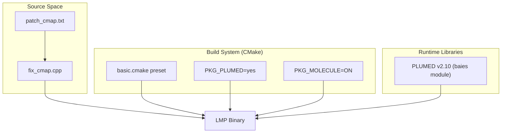
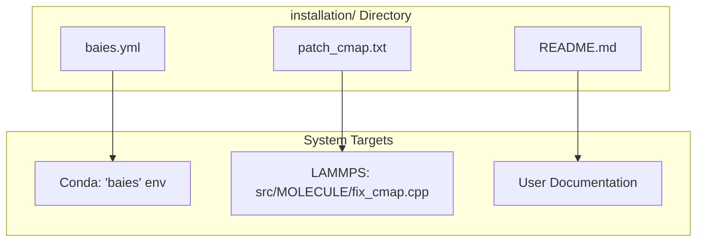

# Getting Started

> **Relevant source files**
> * [installation/README.md](https://github.com/COSBlab/bAIes-IDP/blob/16faa7f7/installation/README.md?plain=1)
> * [installation/baies.yml](https://github.com/COSBlab/bAIes-IDP/blob/16faa7f7/installation/baies.yml)
> * [installation/patch_cmap.txt](https://github.com/COSBlab/bAIes-IDP/blob/16faa7f7/installation/patch_cmap.txt)

This page provides a step-by-step technical guide for setting up the **bAIes-IDP** framework. It covers hardware and software prerequisites, the creation of the specialized Conda environment for topology conversion, and the compilation of a modified LAMMPS binary featuring the BAIES-compatible CMAP patch and PLUMED integration.

## Prerequisites

### Hardware Requirements

The framework is designed for execution on Linux-based systems.

* **Operating System:** Linux workstation [installation/README.md L5](https://github.com/COSBlab/bAIes-IDP/blob/16faa7f7/installation/README.md?plain=1#L5-L5)
* **Processor:** Multicore CPU (8 cores recommended for efficient sampling) [installation/README.md L6](https://github.com/COSBlab/bAIes-IDP/blob/16faa7f7/installation/README.md?plain=1#L6-L6)

### Software Dependencies

Users must have access to the following components for generating structural priors and performing simulations:

* **Structural Priors:** Either a local **AlphaFold-2** installation or **ColabFold** modified for distance distribution output [installation/README.md L11-L12](https://github.com/COSBlab/bAIes-IDP/blob/16faa7f7/installation/README.md?plain=1#L11-L12)
* **Simulation Engines:** **GROMACS** (for initial topology preparation) and **LAMMPS** (version 2 Aug 2023) [installation/README.md L16-L17](https://github.com/COSBlab/bAIes-IDP/blob/16faa7f7/installation/README.md?plain=1#L16-L17)
* **Package Management:** **Conda** for managing the Python environment [installation/README.md L15](https://github.com/COSBlab/bAIes-IDP/blob/16faa7f7/installation/README.md?plain=1#L15-L15)

**Sources:** [installation/README.md L1-L18](https://github.com/COSBlab/bAIes-IDP/blob/16faa7f7/installation/README.md?plain=1#L1-L18)

---

## Conda Environment Setup

The conversion of GROMACS topologies to LAMMPS format relies on the `intermol` library and specific Python dependencies. A pre-configured environment file, `baies.yml`, is provided in the `installation/` directory [installation/README.md L21-L26](https://github.com/COSBlab/bAIes-IDP/blob/16faa7f7/installation/README.md?plain=1#L21-L26)

### Environment Configuration

The environment, named `baies`, uses Python 3.8 and includes critical libraries for structural data handling:

* `intermol==0.1.0.dev0`: Core conversion utility [installation/baies.yml L27](https://github.com/COSBlab/bAIes-IDP/blob/16faa7f7/installation/baies.yml#L27-L27)
* `parmed==3.4.4`: For processing molecular topology files [installation/baies.yml L31](https://github.com/COSBlab/bAIes-IDP/blob/16faa7f7/installation/baies.yml#L31-L31)
* `numpy==1.24.4`: Numerical backend for preprocessing scripts [installation/baies.yml L28](https://github.com/COSBlab/bAIes-IDP/blob/16faa7f7/installation/baies.yml#L28-L28)

To create the environment, execute:

```sql
conda env create -f installation/baies.yml
```

[installation/README.md L24](https://github.com/COSBlab/bAIes-IDP/blob/16faa7f7/installation/README.md?plain=1#L24-L24)

**Sources:** [installation/README.md L19-L60](https://github.com/COSBlab/bAIes-IDP/blob/16faa7f7/installation/README.md?plain=1#L19-L60)

 [installation/baies.yml L1-L32](https://github.com/COSBlab/bAIes-IDP/blob/16faa7f7/installation/baies.yml#L1-L32)

---

## LAMMPS and PLUMED Installation

Simulating Intrinsically Disordered Proteins (IDPs) with bAIes requires a specific version of LAMMPS patched to handle expanded CMAP (Correction Map) terms and integrated with the BAIES module in PLUMED.

### 1. The CMAP Patch

Standard LAMMPS (2 Aug 2023) restricts the number of CMAP terms per atom to 6. Because IDP force fields and the bAIes workflow require higher capacity, the `patch_cmap.txt` file must be applied to the LAMMPS source code [installation/README.md L70-L72](https://github.com/COSBlab/bAIes-IDP/blob/16faa7f7/installation/README.md?plain=1#L70-L72)

**Implementation Details:**
The patch modifies `src/MOLECULE/fix_cmap.cpp` to increase the `CMAPMAX` constant from 6 to 40 [installation/patch_cmap.txt L7-L8](https://github.com/COSBlab/bAIes-IDP/blob/16faa7f7/installation/patch_cmap.txt#L7-L8)

 It also updates the derivative computation loops and error checking to accommodate this higher limit [installation/patch_cmap.txt L16-L26](https://github.com/COSBlab/bAIes-IDP/blob/16faa7f7/installation/patch_cmap.txt#L16-L26)

### 2. PLUMED Integration

The bAIes Bayesian bias is implemented as a PLUMED action. Users should ensure their PLUMED installation includes the `baies` module, typically found in PLUMED v2.10 [installation/README.md L97](https://github.com/COSBlab/bAIes-IDP/blob/16faa7f7/installation/README.md?plain=1#L97-L97)

### 3. Compilation Procedure

LAMMPS should be compiled using CMake with the `MOLECULE` package (which provides CMAP support) and `PKG_PLUMED` enabled [installation/README.md L79-L84](https://github.com/COSBlab/bAIes-IDP/blob/16faa7f7/installation/README.md?plain=1#L79-L84)

**System Integration Diagram**
The following diagram illustrates how the patched code entities and external libraries interface during the build process.

### Build Entity Relationship



**Sources:** [installation/README.md L66-L100](https://github.com/COSBlab/bAIes-IDP/blob/16faa7f7/installation/README.md?plain=1#L66-L100)

 [installation/patch_cmap.txt L1-L29](https://github.com/COSBlab/bAIes-IDP/blob/16faa7f7/installation/patch_cmap.txt#L1-L29)

---

## Installation Summary Table

| Component | Version/Source | Purpose |
| --- | --- | --- |
| **Conda Env** | `baies.yml` | Supports `intermol` and `make_ff.py` [installation/README.md L24-L28](https://github.com/COSBlab/bAIes-IDP/blob/16faa7f7/installation/README.md?plain=1#L24-L28) |
| **LAMMPS** | 2 Aug 2023 | Main MD engine [installation/README.md L68](https://github.com/COSBlab/bAIes-IDP/blob/16faa7f7/installation/README.md?plain=1#L68-L68) |
| **CMAP Patch** | `patch_cmap.txt` | Increases `CMAPMAX` from 6 to 40 [installation/patch_cmap.txt L7-L8](https://github.com/COSBlab/bAIes-IDP/blob/16faa7f7/installation/patch_cmap.txt#L7-L8) |
| **PLUMED** | v2.10 | Provides the `BAIES` PLUMED action [installation/README.md L97](https://github.com/COSBlab/bAIes-IDP/blob/16faa7f7/installation/README.md?plain=1#L97-L97) |
| **Python** | 3.8.19 | Runtime for conversion scripts [installation/baies.yml L18](https://github.com/COSBlab/bAIes-IDP/blob/16faa7f7/installation/baies.yml#L18-L18) |

### Code Entity Mapping

This diagram bridges the physical files in the `installation/` directory to their functional roles in the system setup.

### Installation Directory Logic



**Sources:** [installation/README.md L1-L101](https://github.com/COSBlab/bAIes-IDP/blob/16faa7f7/installation/README.md?plain=1#L1-L101)

 [installation/baies.yml L1-L32](https://github.com/COSBlab/bAIes-IDP/blob/16faa7f7/installation/baies.yml#L1-L32)

 [installation/patch_cmap.txt L1-L29](https://github.com/COSBlab/bAIes-IDP/blob/16faa7f7/installation/patch_cmap.txt#L1-L29)