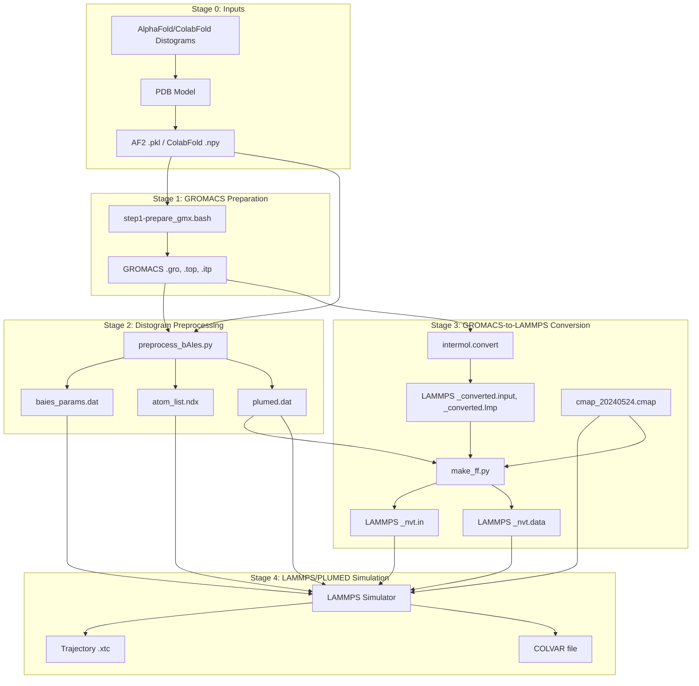

# Glossary

> **Relevant source files**
> * [README.md](https://github.com/COSBlab/bAIes-IDP/blob/16faa7f7/README.md?plain=1)
> * [benchmark/bAIes/Ab40/Ab40.pdb](https://github.com/COSBlab/bAIes-IDP/blob/16faa7f7/benchmark/bAIes/Ab40/Ab40.pdb)
> * [benchmark/bAIes/Ab40/Ab40_nvt.data](https://github.com/COSBlab/bAIes-IDP/blob/16faa7f7/benchmark/bAIes/Ab40/Ab40_nvt.data)
> * [benchmark/bAIes/Ab40/Ab40_nvt.in](https://github.com/COSBlab/bAIes-IDP/blob/16faa7f7/benchmark/bAIes/Ab40/Ab40_nvt.in)
> * [benchmark/bAIes/Ab40/atom_list_matrix.ndx](https://github.com/COSBlab/bAIes-IDP/blob/16faa7f7/benchmark/bAIes/Ab40/atom_list_matrix.ndx)
> * [benchmark/bAIes/Ab40/baies_gauss_matrix.dat](https://github.com/COSBlab/bAIes-IDP/blob/16faa7f7/benchmark/bAIes/Ab40/baies_gauss_matrix.dat)
> * [benchmark/bAIes/Ab40/dry_ff_20240524_correct.cmap](https://github.com/COSBlab/bAIes-IDP/blob/16faa7f7/benchmark/bAIes/Ab40/dry_ff_20240524_correct.cmap)
> * [benchmark/bAIes/Ab40/plumed_Ab40.dat](https://github.com/COSBlab/bAIes-IDP/blob/16faa7f7/benchmark/bAIes/Ab40/plumed_Ab40.dat)
> * [installation/README.md](https://github.com/COSBlab/bAIes-IDP/blob/16faa7f7/installation/README.md?plain=1)
> * [installation/baies.yml](https://github.com/COSBlab/bAIes-IDP/blob/16faa7f7/installation/baies.yml)
> * [installation/patch_cmap.txt](https://github.com/COSBlab/bAIes-IDP/blob/16faa7f7/installation/patch_cmap.txt)
> * [tutorial/bAIes/3-conversion/cmap_20240524.cmap](https://github.com/COSBlab/bAIes-IDP/blob/16faa7f7/tutorial/bAIes/3-conversion/cmap_20240524.cmap)
> * [tutorial/bAIes/3-conversion/idp.gro](https://github.com/COSBlab/bAIes-IDP/blob/16faa7f7/tutorial/bAIes/3-conversion/idp.gro)
> * [tutorial/bAIes/3-conversion/idp.pdb](https://github.com/COSBlab/bAIes-IDP/blob/16faa7f7/tutorial/bAIes/3-conversion/idp.pdb)
> * [tutorial/bAIes/3-conversion/idp.top](https://github.com/COSBlab/bAIes-IDP/blob/16faa7f7/tutorial/bAIes/3-conversion/idp.top)
> * [tutorial/bAIes/3-conversion/idp_nvt.data](https://github.com/COSBlab/bAIes-IDP/blob/16faa7f7/tutorial/bAIes/3-conversion/idp_nvt.data)
> * [tutorial/bAIes/3-conversion/idp_nvt.in](https://github.com/COSBlab/bAIes-IDP/blob/16faa7f7/tutorial/bAIes/3-conversion/idp_nvt.in)
> * [tutorial/bAIes/3-conversion/step3-conversion.bash](https://github.com/COSBlab/bAIes-IDP/blob/16faa7f7/tutorial/bAIes/3-conversion/step3-conversion.bash)
> * [tutorial/bAIes/README.md](https://github.com/COSBlab/bAIes-IDP/blob/16faa7f7/tutorial/bAIes/README.md?plain=1)

This page provides definitions for key terms, acronyms, file formats, and domain concepts used throughout the bAIes-IDP codebase. Each entry includes pointers to relevant code or documentation for further detail.

## Acronyms and Terms

### AF2

AlphaFold-2. A deep learning system developed by Google DeepMind that predicts protein structures from amino acid sequences. bAIes-IDP uses distograms generated by AF2 as input for biasing simulations.
Sources: [README.md L23-L25](https://github.com/COSBlab/bAIes-IDP/blob/16faa7f7/README.md?plain=1#L23-L25)

 [tutorial/bAIes/README.md L12-L13](https://github.com/COSBlab/bAIes-IDP/blob/16faa7f7/tutorial/bAIes/README.md?plain=1#L12-L13)

### bAIes

The Bayesian bias module implemented as a PLUMED action. It applies a Bayesian inference framework to incorporate AlphaFold-2 predicted distance distributions into molecular dynamics simulations. The `PRIOR=JEFFREYS` setting is characteristic of bAIes simulations.
Sources: [tutorial/bAIes/README.md L87-L88](https://github.com/COSBlab/bAIes-IDP/blob/16faa7f7/tutorial/bAIes/README.md?plain=1#L87-L88)

 [benchmark/bAIes/Ab40/plumed_Ab40.dat L3](https://github.com/COSBlab/bAIes-IDP/blob/16faa7f7/benchmark/bAIes/Ab40/plumed_Ab40.dat#L3-L3)

### bAIes-N

A variant of the bAIes simulation where the Bayesian bias module is configured with `PRIOR=NONE`. This means no Jeffreys prior is applied, distinguishing it from the standard bAIes setup.
Sources: (Conceptual, not explicitly defined in provided files but implied by `PRIES=JEFFREYS` in bAIes)

### CMAP

A correction map for backbone phi/psi dihedral angles in molecular dynamics force fields. It is used to improve the accuracy of protein simulations, particularly for intrinsically disordered proteins. In bAIes-IDP, LAMMPS is patched to increase the `CMAPMAX` limit.
Sources: [installation/patch_cmap.txt L7](https://github.com/COSBlab/bAIes-IDP/blob/16faa7f7/installation/patch_cmap.txt#L7-L7)

 [tutorial/bAIes/3-conversion/cmap_20240524.cmap L1](https://github.com/COSBlab/bAIes-IDP/blob/16faa7f7/tutorial/bAIes/3-conversion/cmap_20240524.cmap#L1-L1)

### ColabFold

A fast and accessible version of AlphaFold-2, often run on cloud platforms like Google Colab. bAIes-IDP supports distograms generated by ColabFold as an alternative to local AF2 installations.
Sources: [README.md L27-L30](https://github.com/COSBlab/bAIes-IDP/blob/16faa7f7/README.md?plain=1#L27-L30)

 [tutorial/bAIes/README.md L14-L15](https://github.com/COSBlab/bAIes-IDP/blob/16faa7f7/tutorial/bAIes/README.md?plain=1#L14-L15)

### IDP

Intrinsically Disordered Protein. Proteins or regions of proteins that lack a stable, well-defined three-dimensional structure under physiological conditions. bAIes-IDP is specifically designed for ensemble predictions of IDPs.
Sources: [README.md L7](https://github.com/COSBlab/bAIes-IDP/blob/16faa7f7/README.md?plain=1#L7-L7)

### InterMol

A Python library used to convert molecular simulation files between different force field and simulation packages, such as GROMACS and LAMMPS. It is a crucial component in `step3-conversion.bash`.
Sources: [README.md L32-L35](https://github.com/COSBlab/bAIes-IDP/blob/16faa7f7/README.md?plain=1#L32-L35)

 [installation/README.md L20-L21](https://github.com/COSBlab/bAIes-IDP/blob/16faa7f7/installation/README.md?plain=1#L20-L21)

 [tutorial/bAIes/3-conversion/step3-conversion.bash L18](https://github.com/COSBlab/bAIes-IDP/blob/16faa7f7/tutorial/bAIes/3-conversion/step3-conversion.bash#L18-L18)

### LAMMPS

Large-scale Atomic/Molecular Massively Parallel Simulator. A classical molecular dynamics simulator. bAIes-IDP uses LAMMPS for the biased MD simulations, requiring a specific version patched with PLUMED and a CMAP fix.
Sources: [README.md L40-L53](https://github.com/COSBlab/bAIes-IDP/blob/16faa7f7/README.md?plain=1#L40-L53)

 [installation/README.md L17](https://github.com/COSBlab/bAIes-IDP/blob/16faa7f7/installation/README.md?plain=1#L17-L17)

### MD

Molecular Dynamics. A computer simulation method for analyzing the physical movements of atoms and molecules. bAIes-IDP performs biased MD simulations.

### PLUMED

A plugin for molecular dynamics codes that allows for enhanced sampling and free energy calculations. bAIes-IDP integrates PLUMED with LAMMPS to apply the Bayesian bias.
Sources: [README.md L40-L53](https://github.com/COSBlab/bAIes-IDP/blob/16faa7f7/README.md?plain=1#L40-L53)

 [installation/README.md L17](https://github.com/COSBlab/bAIes-IDP/blob/16faa7f7/installation/README.md?plain=1#L17-L17)

### Random Coil Force Field

A simplified force field model used in bAIes-IDP, particularly for the 'coil' simulations, which represent an unbiased reference ensemble. The `make_ff.py` script applies modifications to the force field to achieve this.
Sources: (Conceptual, implied by `make_ff.py`'s role in modifying force fields)

## File Formats

### .cmap

CMAP correction map file. These files contain grid-based energy corrections for specific residue-type phi/psi dihedral angles. They are used by the `fix drycmap` in LAMMPS.
Example: `dry_ff_20240524_correct.cmap` [benchmark/bAIes/Ab40/dry_ff_20240524_correct.cmap L1](https://github.com/COSBlab/bAIes-IDP/blob/16faa7f7/benchmark/bAIes/Ab40/dry_ff_20240524_correct.cmap#L1-L1)

Sources: [tutorial/bAIes/README.md L128](https://github.com/COSBlab/bAIes-IDP/blob/16faa7f7/tutorial/bAIes/README.md?plain=1#L128-L128)

 [benchmark/bAIes/Ab40/dry_ff_20240524_correct.cmap L1](https://github.com/COSBlab/bAIes-IDP/blob/16faa7f7/benchmark/bAIes/Ab40/dry_ff_20240524_correct.cmap#L1-L1)

### .COLVAR

PLUMED output file containing collective variable data, including the energy from the bAIes bias (`baies.ene`).
Sources: [tutorial/bAIes/README.md L89](https://github.com/COSBlab/bAIes-IDP/blob/16faa7f7/tutorial/bAIes/README.md?plain=1#L89-L89)

 [benchmark/bAIes/Ab40/plumed_Ab40.dat L4](https://github.com/COSBlab/bAIes-IDP/blob/16faa7f7/benchmark/bAIes/Ab40/plumed_Ab40.dat#L4-L4)

### .dat

Generic data file. In bAIes-IDP, this often refers to `baies_params.dat` (or `baies_gauss_matrix.dat`), which stores parameters for the bAIes bias, such as atom pairs, mean distances (`mu`), and standard deviations (`sigma`).
Example: `baies_gauss_matrix.dat` [benchmark/bAIes/Ab40/baies_gauss_matrix.dat L1](https://github.com/COSBlab/bAIes-IDP/blob/16faa7f7/benchmark/bAIes/Ab40/baies_gauss_matrix.dat#L1-L1)

Sources: [tutorial/bAIes/README.md L77](https://github.com/COSBlab/bAIes-IDP/blob/16faa7f7/tutorial/bAIes/README.md?plain=1#L77-L77)

 [benchmark/bAIes/Ab40/baies_gauss_matrix.dat L1](https://github.com/COSBlab/bAIes-IDP/blob/16faa7f7/benchmark/bAIes/Ab40/baies_gauss_matrix.dat#L1-L1)

### .gro

GROMACS structure file. Contains atomic coordinates and velocities. Generated by GROMACS in Stage 1 and used as input for InterMol conversion.
Sources: [tutorial/bAIes/README.md L50](https://github.com/COSBlab/bAIes-IDP/blob/16faa7f7/tutorial/bAIes/README.md?plain=1#L50-L50)

 [tutorial/bAIes/3-conversion/idp.gro](https://github.com/COSBlab/bAIes-IDP/blob/16faa7f7/tutorial/bAIes/3-conversion/idp.gro)

### .in

LAMMPS input script. This file contains all commands and settings for a LAMMPS simulation, including force field parameters, simulation box, thermostat, and integration steps.
Example: `idp_nvt.in` [tutorial/bAIes/3-conversion/idp_nvt.in](https://github.com/COSBlab/bAIes-IDP/blob/16faa7f7/tutorial/bAIes/3-conversion/idp_nvt.in)

Sources: [tutorial/bAIes/README.md L116](https://github.com/COSBlab/bAIes-IDP/blob/16faa7f7/tutorial/bAIes/README.md?plain=1#L116-L116)

 [benchmark/bAIes/Ab40/Ab40_nvt.in L1](https://github.com/COSBlab/bAIes-IDP/blob/16faa7f7/benchmark/bAIes/Ab40/Ab40_nvt.in#L1-L1)

### .data

LAMMPS data file. This file contains the molecular topology information (atoms, bonds, angles, dihedrals, etc.) and force field parameters for a LAMMPS simulation. It is read by the `.in` file.
Example: `idp_nvt.data` [tutorial/bAIes/3-conversion/idp_nvt.data](https://github.com/COSBlab/bAIes-IDP/blob/16faa7f7/tutorial/bAIes/3-conversion/idp_nvt.data)

Sources: [tutorial/bAIes/README.md L119](https://github.com/COSBlab/bAIes-IDP/blob/16faa7f7/tutorial/bAIes/README.md?plain=1#L119-L119)

 [benchmark/bAIes/Ab40/Ab40_nvt.data L1](https://github.com/COSBlab/bAIes-IDP/blob/16faa7f7/benchmark/bAIes/Ab40/Ab40_nvt.data#L1-L1)

### .ndx

GROMACS index file. In bAIes-IDP, `atom_list.ndx` (or `atom_list_matrix.ndx`) defines the `batoms` group, which lists the atom indices involved in the bAIes restraints.
Example: `atom_list_matrix.ndx` [benchmark/bAIes/Ab40/atom_list_matrix.ndx L1](https://github.com/COSBlab/bAIes-IDP/blob/16faa7f7/benchmark/bAIes/Ab40/atom_list_matrix.ndx#L1-L1)

Sources: [tutorial/bAIes/README.md L79](https://github.com/COSBlab/bAIes-IDP/blob/16faa7f7/tutorial/bAIes/README.md?plain=1#L79-L79)

 [benchmark/bAIes/Ab40/atom_list_matrix.ndx L1](https://github.com/COSBlab/bAIes-IDP/blob/16faa7f7/benchmark/bAIes/Ab40/atom_list_matrix.ndx#L1-L1)

### .npy

NumPy array file. Used by ColabFold to store distance probability distributions (distograms).
Sources: [tutorial/bAIes/README.md L30-L31](https://github.com/COSBlab/bAIes-IDP/blob/16faa7f7/tutorial/bAIes/README.md?plain=1#L30-L31)

 [tutorial/bAIes/README.md L73](https://github.com/COSBlab/bAIes-IDP/blob/16faa7f7/tutorial/bAIes/README.md?plain=1#L73-L73)

### .pdb

Protein Data Bank file. A standard format for atomic coordinates of proteins. Used as initial input for GROMACS and for defining the `MOLINFO STRUCTURE` in PLUMED.
Sources: [tutorial/bAIes/README.md L26](https://github.com/COSBlab/bAIes-IDP/blob/16faa7f7/tutorial/bAIes/README.md?plain=1#L26-L26)

 [tutorial/bAIes/README.md L46](https://github.com/COSBlab/bAIes-IDP/blob/16faa7f7/tutorial/bAIes/README.md?plain=1#L46-L46)

 [tutorial/bAIes/3-conversion/idp.pdb](https://github.com/COSBlab/bAIes-IDP/blob/16faa7f7/tutorial/bAIes/3-conversion/idp.pdb)

### .pkl

Python pickle file. Used by AlphaFold-2 to store distograms.
Sources: [tutorial/bAIes/README.md L23](https://github.com/COSBlab/bAIes-IDP/blob/16faa7f7/tutorial/bAIes/README.md?plain=1#L23-L23)

 [tutorial/bAIes/README.md L68](https://github.com/COSBlab/bAIes-IDP/blob/16faa7f7/tutorial/bAIes/README.md?plain=1#L68-L68)

### .top

GROMACS topology file. Describes the molecular structure, force field parameters, and connectivity of a system. Generated by GROMACS and used as input for InterMol conversion.
Sources: [tutorial/bAIes/README.md L50](https://github.com/COSBlab/bAIes-IDP/blob/16faa7f7/tutorial/bAIes/README.md?plain=1#L50-L50)

 [tutorial/bAIes/3-conversion/idp.top](https://github.com/COSBlab/bAIes-IDP/blob/16faa7f7/tutorial/bAIes/3-conversion/idp.top)

### .xtc

GROMACS trajectory file. A compressed binary format for storing molecular dynamics trajectories. LAMMPS outputs trajectories in this format.
Sources: [tutorial/bAIes/README.md L140](https://github.com/COSBlab/bAIes-IDP/blob/16faa7f7/tutorial/bAIes/README.md?plain=1#L140-L140)

## Key Concepts and Components

### atom_list.ndx

An index file generated by `preprocess_bAIes.py` that lists the atom indices participating in the bAIes restraints. This file is referenced by the `GROUP` command in `plumed.dat`.
Sources: [tutorial/bAIes/README.md L79](https://github.com/COSBlab/bAIes-IDP/blob/16faa7f7/tutorial/bAIes/README.md?plain=1#L79-L79)

 [benchmark/bAIes/Ab40/atom_list_matrix.ndx L1-L3](https://github.com/COSBlab/bAIes-IDP/blob/16faa7f7/benchmark/bAIes/Ab40/atom_list_matrix.ndx#L1-L3)

### BAIES (PLUMED action)

The core PLUMED action that implements the Bayesian bias. It takes `ATOMS`, `DATA_FILE` (e.g., `baies_params.dat`), `PRIOR` (e.g., `JEFFREYS` or `NONE`), and `TEMP` as arguments.
Sources: [tutorial/bAIes/README.md L87-L88](https://github.com/COSBlab/bAIes-IDP/blob/16faa7f7/tutorial/bAIes/README.md?plain=1#L87-L88)

 [benchmark/bAIes/Ab40/plumed_Ab40.dat L3](https://github.com/COSBlab/bAIes-IDP/blob/16faa7f7/benchmark/bAIes/Ab40/plumed_Ab40.dat#L3-L3)

### baies_params.dat / baies_gauss_matrix.dat

Data files generated by `preprocess_bAIes.py` that contain the parameters for the bAIes bias. Each line specifies an atom pair (`atom_i`, `atom_j`), the mean distance (`mu`), and standard deviation (`sigma`) derived from the AlphaFold-2 distograms. The header `#! FIELDS Id atom_i atom_j mu sigma` and `#! SET model gaussian` define its structure.
Sources: [tutorial/bAIes/README.md L77](https://github.com/COSBlab/bAIes-IDP/blob/16faa7f7/tutorial/bAIes/README.md?plain=1#L77-L77)

 [benchmark/bAIes/Ab40/baies_gauss_matrix.dat L1-L2](https://github.com/COSBlab/bAIes-IDP/blob/16faa7f7/benchmark/bAIes/Ab40/baies_gauss_matrix.dat#L1-L2)

### batoms (PLUMED group)

A PLUMED `GROUP` defined in `plumed.dat` that refers to the atoms listed in `atom_list.ndx`. These are the atoms for which the bAIes bias is applied.
Sources: [tutorial/bAIes/README.md L86](https://github.com/COSBlab/bAIes-IDP/blob/16faa7f7/tutorial/bAIes/README.md?plain=1#L86-L86)

 [benchmark/bAIes/Ab40/plumed_Ab40.dat L2](https://github.com/COSBlab/bAIes-IDP/blob/16faa7f7/benchmark/bAIes/Ab40/plumed_Ab40.dat#L2-L2)

### BIASVALUE (PLUMED action)

A PLUMED action that outputs the value of a specified collective variable (in this case, `baies.ene`) to the `COLVAR` file.
Sources: [tutorial/bAIes/README.md L89](https://github.com/COSBlab/bAIes-IDP/blob/16faa7f7/tutorial/bAIes/README.md?plain=1#L89-L89)

 [benchmark/bAIes/Ab40/plumed_Ab40.dat L5](https://github.com/COSBlab/bAIes-IDP/blob/16faa7f7/benchmark/bAIes/Ab40/plumed_Ab40.dat#L5-L5)

### fix drycmap (LAMMPS)

A LAMMPS fix that applies CMAP corrections to the simulation. It reads the CMAP data from a specified `.cmap` file. The bAIes-IDP installation includes a patch to increase the `CMAPMAX` limit for this fix.
Sources: [benchmark/bAIes/Ab40/Ab40_nvt.in L14](https://github.com/COSBlab/bAIes-IDP/blob/16faa7f7/benchmark/bAIes/Ab40/Ab40_nvt.in#L14-L14)

 [installation/patch_cmap.txt L7](https://github.com/COSBlab/bAIes-IDP/blob/16faa7f7/installation/patch_cmap.txt#L7-L7)

### make_ff.py

A Python script (`scripts/make_ff.py`) that processes the LAMMPS files generated by InterMol. It integrates CMAP corrections, applies the Random Coil force field modifications, sets the simulation box, and produces the final `_nvt.in` and `_nvt.data` files for LAMMPS.
Sources: [tutorial/bAIes/README.md L113](https://github.com/COSBlab/bAIes-IDP/blob/16faa7f7/tutorial/bAIes/README.md?plain=1#L113-L113)

 [tutorial/bAIes/3-conversion/step3-conversion.bash L22-L29](https://github.com/COSBlab/bAIes-IDP/blob/16faa7f7/tutorial/bAIes/3-conversion/step3-conversion.bash#L22-L29)

### plumed.dat

The PLUMED input file that configures the PLUMED actions for the simulation. It defines the `batoms` group, the `BAIES` action, and the `PRINT` and `BIASVALUE` commands.
Sources: [tutorial/bAIes/README.md L81-L90](https://github.com/COSBlab/bAIes-IDP/blob/16faa7f7/tutorial/bAIes/README.md?plain=1#L81-L90)

 [benchmark/bAIes/Ab40/plumed_Ab40.dat L1-L5](https://github.com/COSBlab/bAIes-IDP/blob/16faa7f7/benchmark/bAIes/Ab40/plumed_Ab40.dat#L1-L5)

### preprocess_bAIes.py

A Python script (`scripts/preprocess_bAIes.py`) responsible for parsing AlphaFold-2 or ColabFold distograms, fitting Gaussian or lognormal models to the distance distributions, applying residue-pair cutoff matrices, and generating `baies_params.dat`, `atom_list.ndx`, and `plumed.dat`.
Sources: [tutorial/bAIes/README.md L57-L58](https://github.com/COSBlab/bAIes-IDP/blob/16faa7f7/tutorial/bAIes/README.md?plain=1#L57-L58)

### step1-prepare_gmx.bash

A bash script (`scripts/step1-prepare_gmx.bash`) that uses GROMACS to convert an initial PDB structure into GROMACS-compatible `.gro`, `.top`, and `.itp` files, typically using the `amber99SB-ILDN` force field.
Sources: [tutorial/bAIes/README.md L47-L51](https://github.com/COSBlab/bAIes-IDP/blob/16faa7f7/tutorial/bAIes/README.md?plain=1#L47-L51)

### step2-preprocess.bash

A bash script (`scripts/step2-preprocess.bash`) that orchestrates the execution of `preprocess_bAIes.py`. It takes the GROMACS PDB, AlphaFold PDB, and distogram files as input and generates the PLUMED-related files (`baies.dat`, `atom_list.ndx`, `plumed.dat`).
Sources: [tutorial/bAIes/README.md L66-L75](https://github.com/COSBlab/bAIes-IDP/blob/16faa7f7/tutorial/bAIes/README.md?plain=1#L66-L75)

### step3-conversion.bash

A bash script (`scripts/step3-conversion.bash`) that handles the conversion from GROMACS to LAMMPS format. It first uses `intermol.convert` and then calls `make_ff.py` to finalize the LAMMPS input files (`_nvt.in`, `_nvt.data`).
Sources: [tutorial/bAIes/README.md L107-L114](https://github.com/COSBlab/bAIes-IDP/blob/16faa7f7/tutorial/bAIes/README.md?plain=1#L107-L114)

 [tutorial/bAIes/3-conversion/step3-conversion.bash L1-L32](https://github.com/COSBlab/bAIes-IDP/blob/16faa7f7/tutorial/bAIes/3-conversion/step3-conversion.bash#L1-L32)

## Workflow Diagrams

### bAIes-IDP Core Workflow

Sources: [README.md L1-L18](https://github.com/COSBlab/bAIes-IDP/blob/16faa7f7/README.md?plain=1#L1-L18)

 [tutorial/bAIes/README.md L1-L147](https://github.com/COSBlab/bAIes-IDP/blob/16faa7f7/tutorial/bAIes/README.md?plain=1#L1-L147)

 [tutorial/bAIes/3-conversion/step3-conversion.bash L1-L32](https://github.com/COSBlab/bAIes-IDP/blob/16faa7f7/tutorial/bAIes/3-conversion/step3-conversion.bash#L1-L32)

### PLUMED Configuration Data Flow

Sources: [tutorial/bAIes/README.md L81-L90](https://github.com/COSBlab/bAIes-IDP/blob/16faa7f7/tutorial/bAIes/README.md?plain=1#L81-L90)

 [benchmark/bAIes/Ab40/plumed_Ab40.dat L1-L5](https://github.com/COSBlab/bAIes-IDP/blob/16faa7f7/benchmark/bAIes/Ab40/plumed_Ab40.dat#L1-L5)