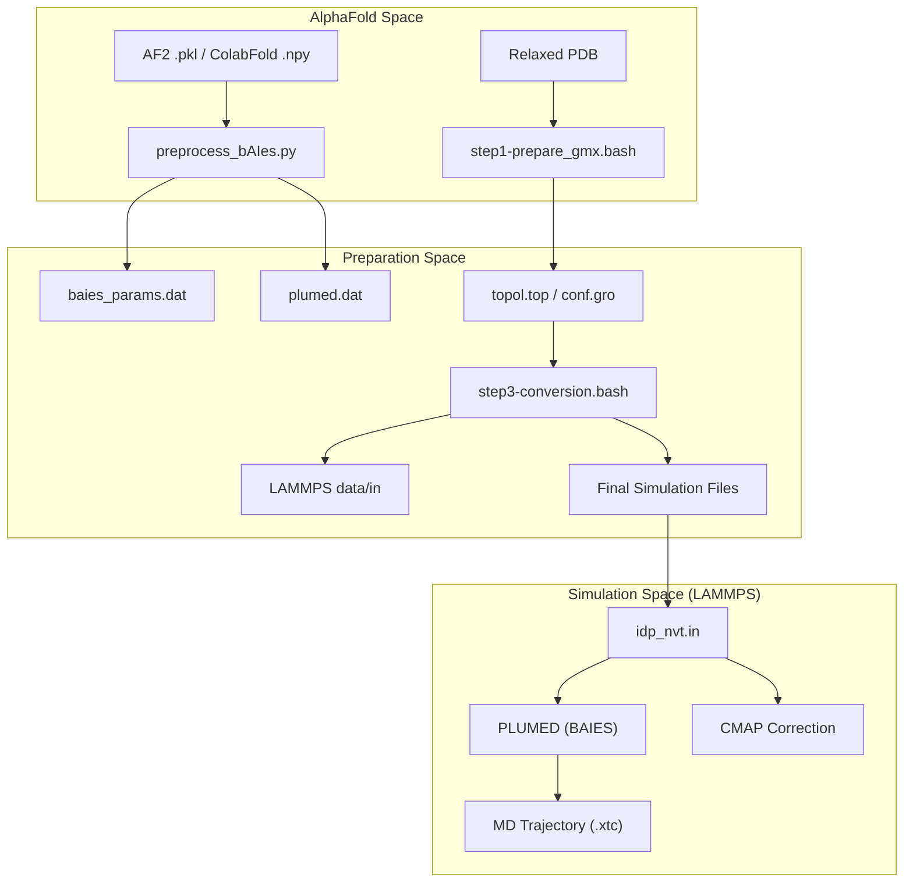
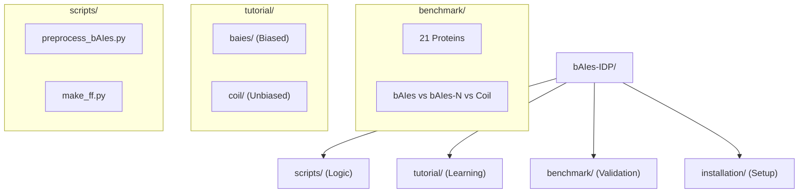

# Overview

> **Relevant source files**
> * [README.md](https://github.com/COSBlab/bAIes-IDP/blob/16faa7f7/README.md?plain=1)
> * [baies-idp.png](https://github.com/COSBlab/bAIes-IDP/blob/16faa7f7/baies-idp.png)
> * [benchmark/README.md](https://github.com/COSBlab/bAIes-IDP/blob/16faa7f7/benchmark/README.md?plain=1)
> * [scripts/README.md](https://github.com/COSBlab/bAIes-IDP/blob/16faa7f7/scripts/README.md?plain=1)
> * [tutorial/README.md](https://github.com/COSBlab/bAIes-IDP/blob/16faa7f7/tutorial/README.md?plain=1)

**bAIes-IDP** is a computational framework designed for the atomic-resolution ensemble prediction of **Intrinsically Disordered Proteins (IDPs)** and **Multi-domain Proteins**. By integrating the structural insights of AlphaFold-2 with the sampling power of Molecular Dynamics (MD), bAIes-IDP bridges the gap between static structural predictions and the dynamic conformational ensembles characteristic of disordered systems.

The core philosophy of bAIes-IDP is **Predict-Restrain-Sample**:

1. **Predict**: Utilize AlphaFold-2 (or ColabFold) to generate distance distributions (distograms) that capture the local and long-range structural tendencies of the protein.
2. **Restrain**: Convert these probabilistic distributions into Bayesian energy potentials using the `BAIES` module within PLUMED.
3. **Sample**: Perform biased MD simulations in LAMMPS, utilizing a customized Random Coil force field and CMAP corrections to explore the conformational space consistent with AlphaFold's predictions.

### System Architecture

The following diagram illustrates the transition from AlphaFold data to a running simulation, mapping the conceptual workflow to specific code entities and scripts.

**Data Flow: From Prediction to Simulation**

Sources: [README.md L1-L17](https://github.com/COSBlab/bAIes-IDP/blob/16faa7f7/README.md?plain=1#L1-L17)

 [scripts/README.md L1-L15](https://github.com/COSBlab/bAIes-IDP/blob/16faa7f7/scripts/README.md?plain=1#L1-L15)

 [tutorial/README.md L1-L10](https://github.com/COSBlab/bAIes-IDP/blob/16faa7f7/tutorial/README.md?plain=1#L1-L10)

---

### Key Components

The framework relies on a specialized software stack to handle the unique requirements of IDP simulations:

| Component | Role in bAIes-IDP | Source Reference |
| --- | --- | --- |
| **AlphaFold-2 / ColabFold** | Provides the `distogram` (distance probability distributions) used as the basis for the Bayesian bias. | [README.md L23-L27](https://github.com/COSBlab/bAIes-IDP/blob/16faa7f7/README.md?plain=1#L23-L27) |
| **PLUMED** | Implements the `BAIES` action, which applies the Bayesian bias to the simulation based on AlphaFold inputs. | [scripts/README.md L12-L13](https://github.com/COSBlab/bAIes-IDP/blob/16faa7f7/scripts/README.md?plain=1#L12-L13) |
| **LAMMPS** | The MD engine. Requires a specific `patch_cmap.txt` to handle high-density backbone corrections. | [README.md L41-L49](https://github.com/COSBlab/bAIes-IDP/blob/16faa7f7/README.md?plain=1#L41-L49) |
| **InterMol** | Facilitates the conversion of GROMACS topologies to LAMMPS-compatible formats. | [README.md L29-L35](https://github.com/COSBlab/bAIes-IDP/blob/16faa7f7/README.md?plain=1#L29-L35) |
| **Custom Force Field** | A "Random Coil" model generated by `make_ff.py` to ensure the bias is the primary driver of structure. | [scripts/README.md L14-L15](https://github.com/COSBlab/bAIes-IDP/blob/16faa7f7/scripts/README.md?plain=1#L14-L15) |

---

### Repository Structure and Navigation

The codebase is organized to support both the reproduction of benchmark results and the application of the method to new systems.

**Repository Entity Relationship**

Sources: [README.md L13-L17](https://github.com/COSBlab/bAIes-IDP/blob/16faa7f7/README.md?plain=1#L13-L17)

 [benchmark/README.md L9-L34](https://github.com/COSBlab/bAIes-IDP/blob/16faa7f7/benchmark/README.md?plain=1#L9-L34)

#### 1.1 Getting Started

For hardware/software prerequisites, conda environment setup, and instructions on patching LAMMPS with the CMAP correction, see [Getting Started](/COSBlab/bAIes-IDP/1.1-getting-started).

#### 1.2 Repository Layout

For a detailed breakdown of the directory structure and the specific roles of the orchestration scripts (e.g., `step1`, `step2`, `step3`), see [Repository Layout](/COSBlab/bAIes-IDP/1.2-repository-layout).

#### 2. Core Architecture and Workflow

To understand the full pipeline from raw AlphaFold outputs to the final production MD run, see [Core Architecture and Workflow](/COSBlab/bAIes-IDP/2-core-architecture-and-workflow).

#### 3. The BAIES Bayesian Bias Module

For technical details on the Bayesian inference framework, the `fix drycmap` implementation, and PLUMED configuration, see [The BAIES Bayesian Bias Module](/COSBlab/bAIes-IDP/3-the-baies-bayesian-bias-module).

#### 4. Tutorials

Step-by-step walkthroughs for simulating the PaaA2 protein or generating a random coil reference ensemble are available in [Tutorials](/COSBlab/bAIes-IDP/4-tutorials).

#### 5. Benchmark Dataset

The framework has been validated against a 21-protein benchmark covering disordered proteins, structural motifs, and multi-domain proteins. Details can be found in [Benchmark Dataset](/COSBlab/bAIes-IDP/5-benchmark-dataset).