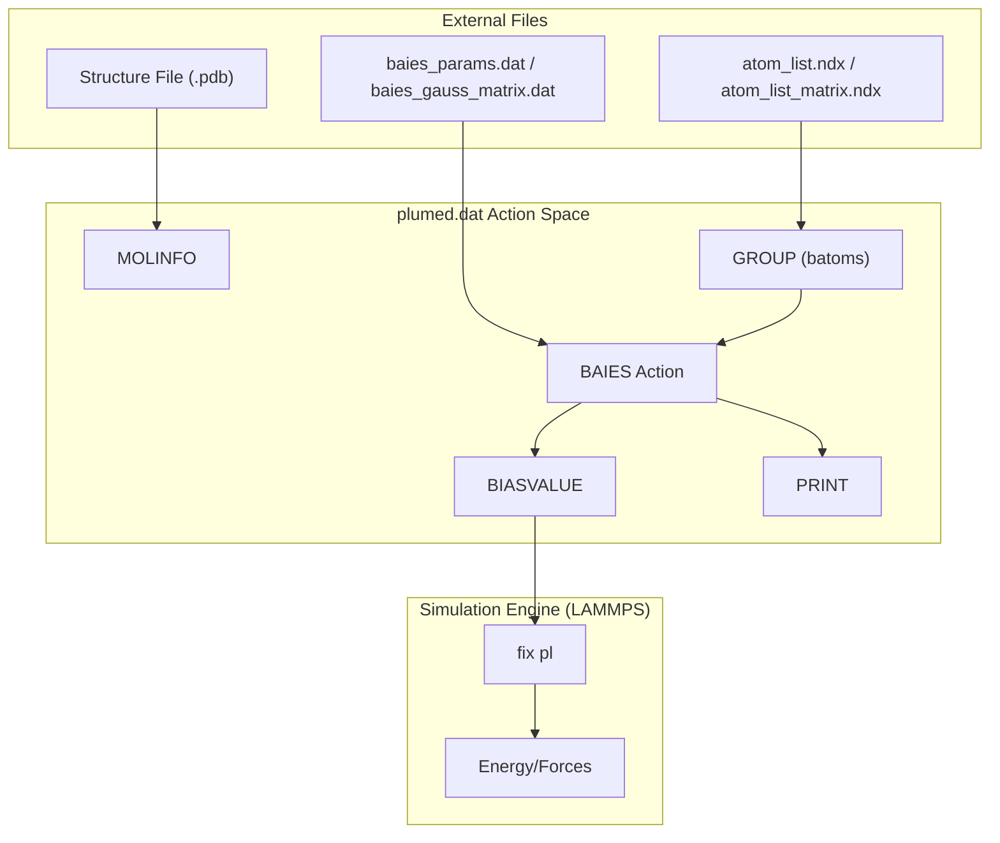

# PLUMED Configuration Files

> **Relevant source files**
> * [benchmark/bAIes/ACTR/ACTR.pdb](https://github.com/COSBlab/bAIes-IDP/blob/16faa7f7/benchmark/bAIes/ACTR/ACTR.pdb)
> * [benchmark/bAIes/ACTR/ACTR_nvt.data](https://github.com/COSBlab/bAIes-IDP/blob/16faa7f7/benchmark/bAIes/ACTR/ACTR_nvt.data)
> * [benchmark/bAIes/ACTR/ACTR_nvt.in](https://github.com/COSBlab/bAIes-IDP/blob/16faa7f7/benchmark/bAIes/ACTR/ACTR_nvt.in)
> * [benchmark/bAIes/ACTR/atom_list_matrix.ndx](https://github.com/COSBlab/bAIes-IDP/blob/16faa7f7/benchmark/bAIes/ACTR/atom_list_matrix.ndx)
> * [benchmark/bAIes/ACTR/baies_gauss_matrix.dat](https://github.com/COSBlab/bAIes-IDP/blob/16faa7f7/benchmark/bAIes/ACTR/baies_gauss_matrix.dat)
> * [benchmark/bAIes/ACTR/dry_ff_20240524_correct.cmap](https://github.com/COSBlab/bAIes-IDP/blob/16faa7f7/benchmark/bAIes/ACTR/dry_ff_20240524_correct.cmap)
> * [benchmark/bAIes/ACTR/plumed_ACTR.dat](https://github.com/COSBlab/bAIes-IDP/blob/16faa7f7/benchmark/bAIes/ACTR/plumed_ACTR.dat)
> * [benchmark/bAIes/Ab40/Ab40.pdb](https://github.com/COSBlab/bAIes-IDP/blob/16faa7f7/benchmark/bAIes/Ab40/Ab40.pdb)
> * [benchmark/bAIes/Ab40/Ab40_nvt.data](https://github.com/COSBlab/bAIes-IDP/blob/16faa7f7/benchmark/bAIes/Ab40/Ab40_nvt.data)
> * [benchmark/bAIes/Ab40/Ab40_nvt.in](https://github.com/COSBlab/bAIes-IDP/blob/16faa7f7/benchmark/bAIes/Ab40/Ab40_nvt.in)
> * [benchmark/bAIes/Ab40/atom_list_matrix.ndx](https://github.com/COSBlab/bAIes-IDP/blob/16faa7f7/benchmark/bAIes/Ab40/atom_list_matrix.ndx)
> * [benchmark/bAIes/Ab40/baies_gauss_matrix.dat](https://github.com/COSBlab/bAIes-IDP/blob/16faa7f7/benchmark/bAIes/Ab40/baies_gauss_matrix.dat)
> * [benchmark/bAIes/Ab40/dry_ff_20240524_correct.cmap](https://github.com/COSBlab/bAIes-IDP/blob/16faa7f7/benchmark/bAIes/Ab40/dry_ff_20240524_correct.cmap)
> * [benchmark/bAIes/Ab40/plumed_Ab40.dat](https://github.com/COSBlab/bAIes-IDP/blob/16faa7f7/benchmark/bAIes/Ab40/plumed_Ab40.dat)
> * [benchmark/bAIes/NHE1/baies_gauss_matrix.dat](https://github.com/COSBlab/bAIes-IDP/blob/16faa7f7/benchmark/bAIes/NHE1/baies_gauss_matrix.dat)
> * [benchmark/bAIes/NHE1/dry_ff_20240524_correct.cmap](https://github.com/COSBlab/bAIes-IDP/blob/16faa7f7/benchmark/bAIes/NHE1/dry_ff_20240524_correct.cmap)
> * [benchmark/bAIes/NHE1/plumed_NHE1.dat](https://github.com/COSBlab/bAIes-IDP/blob/16faa7f7/benchmark/bAIes/NHE1/plumed_NHE1.dat)
> * [benchmark/bAIes/Nsp2_CtlIDR/Nsp2_CtlIDR.pdb](https://github.com/COSBlab/bAIes-IDP/blob/16faa7f7/benchmark/bAIes/Nsp2_CtlIDR/Nsp2_CtlIDR.pdb)
> * [benchmark/bAIes/Nsp2_CtlIDR/Nsp2_CtlIDR_nvt.data](https://github.com/COSBlab/bAIes-IDP/blob/16faa7f7/benchmark/bAIes/Nsp2_CtlIDR/Nsp2_CtlIDR_nvt.data)
> * [benchmark/bAIes/Nsp2_CtlIDR/Nsp2_CtlIDR_nvt.in](https://github.com/COSBlab/bAIes-IDP/blob/16faa7f7/benchmark/bAIes/Nsp2_CtlIDR/Nsp2_CtlIDR_nvt.in)
> * [benchmark/bAIes/Nsp2_CtlIDR/atom_list_matrix.ndx](https://github.com/COSBlab/bAIes-IDP/blob/16faa7f7/benchmark/bAIes/Nsp2_CtlIDR/atom_list_matrix.ndx)
> * [tutorial/bAIes/1-preparation/relaxed_model_4_ptm_pred_0.pdb](https://github.com/COSBlab/bAIes-IDP/blob/16faa7f7/tutorial/bAIes/1-preparation/relaxed_model_4_ptm_pred_0.pdb)
> * [tutorial/bAIes/1-preparation/step1-prepare_gmx.bash](https://github.com/COSBlab/bAIes-IDP/blob/16faa7f7/tutorial/bAIes/1-preparation/step1-prepare_gmx.bash)
> * [tutorial/bAIes/2-preprocessing/alphafold2_ptm_model_1_seed_000_prob_distributions.npy](https://github.com/COSBlab/bAIes-IDP/blob/16faa7f7/tutorial/bAIes/2-preprocessing/alphafold2_ptm_model_1_seed_000_prob_distributions.npy)
> * [tutorial/bAIes/2-preprocessing/atom_list.ndx](https://github.com/COSBlab/bAIes-IDP/blob/16faa7f7/tutorial/bAIes/2-preprocessing/atom_list.ndx)
> * [tutorial/bAIes/2-preprocessing/baies_params.dat](https://github.com/COSBlab/bAIes-IDP/blob/16faa7f7/tutorial/bAIes/2-preprocessing/baies_params.dat)
> * [tutorial/bAIes/2-preprocessing/idp.pdb](https://github.com/COSBlab/bAIes-IDP/blob/16faa7f7/tutorial/bAIes/2-preprocessing/idp.pdb)
> * [tutorial/bAIes/2-preprocessing/plumed.dat](https://github.com/COSBlab/bAIes-IDP/blob/16faa7f7/tutorial/bAIes/2-preprocessing/plumed.dat)

This page serves as a technical reference for the PLUMED configuration files used in the bAIes-IDP framework. These files orchestrate the interaction between the LAMMPS MD engine and the custom `BAIES` bias action, enabling the Predict-Restrain-Sample workflow for intrinsically disordered proteins (IDPs).

## Overview of PLUMED Integration

The bAIes-IDP workflow utilizes PLUMED to apply a Bayesian-derived potential based on AlphaFold-2 distograms. The configuration is typically defined in `plumed.dat` (for tutorials) or `plumed_<protein>.dat` (for benchmarks). These files define atom groups, invoke the `BAIES` action to calculate energy, and wire that energy into the MD engine via `BIASVALUE`.

### Data Flow and Logic

The following diagram illustrates how the PLUMED configuration bridges the gap between static parameter files and the dynamic MD simulation.

**Diagram: PLUMED Configuration Data Flow**



**Sources:** [benchmark/bAIes/Ab40/plumed_Ab40.dat L1-L5](https://github.com/COSBlab/bAIes-IDP/blob/16faa7f7/benchmark/bAIes/Ab40/plumed_Ab40.dat#L1-L5)

 [tutorial/bAIes/2-preprocessing/plumed.dat L1-L5](https://github.com/COSBlab/bAIes-IDP/blob/16faa7f7/tutorial/bAIes/2-preprocessing/plumed.dat#L1-L5)

---

## Action Syntax Reference

### 1. MOLINFO and GROUP

The `MOLINFO` action provides structural context, while `GROUP` defines the specific atoms (usually $C_\beta$ or $C_\alpha$) involved in the Bayesian restraints.

* **`MOLINFO`**: Used to define the reference structure for atom naming/indexing [benchmark/bAIes/Ab40/plumed_Ab40.dat L1](https://github.com/COSBlab/bAIes-IDP/blob/16faa7f7/benchmark/bAIes/Ab40/plumed_Ab40.dat#L1-L1)
* **`GROUP`**: Defines the label `batoms`. It reads indices from an NDX file generated during Stage 2 preprocessing [tutorial/bAIes/2-preprocessing/plumed.dat L2](https://github.com/COSBlab/bAIes-IDP/blob/16faa7f7/tutorial/bAIes/2-preprocessing/plumed.dat#L2-L2)

### 2. The BAIES Action

The `BAIES` action is the core of the framework. It calculates the Bayesian bias energy based on the distance distribution models provided in the parameter files.

| Parameter | Description |
| --- | --- |
| `ATOMS` | Reference to the `batoms` group [benchmark/bAIes/Ab40/plumed_Ab40.dat L3](https://github.com/COSBlab/bAIes-IDP/blob/16faa7f7/benchmark/bAIes/Ab40/plumed_Ab40.dat#L3-L3) |
| `DATA_FILE` | The file containing $\mu$ and $\sigma$ parameters (e.g., `baies_gauss_matrix.dat`) [benchmark/bAIes/Ab40/baies_gauss_matrix.dat L1-L2](https://github.com/COSBlab/bAIes-IDP/blob/16faa7f7/benchmark/bAIes/Ab40/baies_gauss_matrix.dat#L1-L2) |
| `PRIOR` | Set to `JEFFREYS` for the standard bAIes model or `NONE` for the bAIes-N variant [benchmark/bAIes/Ab40/plumed_Ab40.dat L3](https://github.com/COSBlab/bAIes-IDP/blob/16faa7f7/benchmark/bAIes/Ab40/plumed_Ab40.dat#L3-L3) |
| `TEMP` | Simulation temperature in energy units (typically $k_B T \approx 2.478$ kJ/mol for 298K) [tutorial/bAIes/2-preprocessing/plumed.dat L3](https://github.com/COSBlab/bAIes-IDP/blob/16faa7f7/tutorial/bAIes/2-preprocessing/plumed.dat#L3-L3) |

### 3. BIASVALUE and PRINT

PLUMED does not apply the `BAIES` energy as a force automatically; it must be explicitly wired into the MD engine's potential energy.

* **`BIASVALUE`**: Takes the `baies.ene` value and adds it to the simulation's potential energy, effectively applying the restraining forces derived from the Bayesian potential [benchmark/bAIes/Ab40/plumed_Ab40.dat L5](https://github.com/COSBlab/bAIes-IDP/blob/16faa7f7/benchmark/bAIes/Ab40/plumed_Ab40.dat#L5-L5)
* **`PRINT`**: Exports the bias energy to the `COLVAR` file for post-simulation analysis [tutorial/bAIes/2-preprocessing/plumed.dat L4](https://github.com/COSBlab/bAIes-IDP/blob/16faa7f7/tutorial/bAIes/2-preprocessing/plumed.dat#L4-L4)

**Sources:** [benchmark/bAIes/Ab40/plumed_Ab40.dat L1-L5](https://github.com/COSBlab/bAIes-IDP/blob/16faa7f7/benchmark/bAIes/Ab40/plumed_Ab40.dat#L1-L5)

 [tutorial/bAIes/2-preprocessing/plumed.dat L1-L5](https://github.com/COSBlab/bAIes-IDP/blob/16faa7f7/tutorial/bAIes/2-preprocessing/plumed.dat#L1-L5)

---

## Configuration Variants

The repository contains two main flavors of PLUMED files: those generated for the **Tutorial** and those used for the **Benchmark** dataset.

### Tutorial plumed.dat

Generated by `preprocess_bAIes.py` in the `2-preprocessing` directory. It uses generic filenames like `baies_params.dat` and `atom_list.ndx`.

```python
# Example from TutorialMOLINFO STRUCTURE=idp.pdbbatoms: GROUP NDX_FILE=atom_list.ndx NDX_GROUP=batomsbaies: BAIES ATOMS=batoms DATA_FILE=baies_params.dat PRIOR=JEFFREYS TEMP=2.478541306PRINT ARG=baies.ene FILE=COLVAR STRIDE=500bbias: BIASVALUE ARG=baies.ene STRIDE=2
```

**Sources:** [tutorial/bAIes/2-preprocessing/plumed.dat L1-L5](https://github.com/COSBlab/bAIes-IDP/blob/16faa7f7/tutorial/bAIes/2-preprocessing/plumed.dat#L1-L5)

### Benchmark plumed_<name>.dat

These are protein-specific files found in `benchmark/bAIes/<protein>/`. They reference the specific matrix files produced by the benchmark preparation scripts.

```python
# Example from Ab40 Benchmark#MOLINFO STRUCTURE=Ab40.pdbbatoms: GROUP NDX_FILE=atom_list_matrix.ndx NDX_GROUP=batomsbaies: BAIES ATOMS=batoms DATA_FILE=baies_gauss_matrix.dat PRIOR=JEFFREYS TEMP=2.478541306PRINT ARG=baies.ene FILE=COLVAR STRIDE=500bbias: BIASVALUE ARG=baies.ene STRIDE=2
```

**Sources:** [benchmark/bAIes/Ab40/plumed_Ab40.dat L1-L5](https://github.com/COSBlab/bAIes-IDP/blob/16faa7f7/benchmark/bAIes/Ab40/plumed_Ab40.dat#L1-L5)

---

## Implementation Details: From Parameters to Forces

The `BAIES` action relies on the format of the `DATA_FILE`. This file specifies the mathematical model (e.g., Gaussian) and the atom pairs to be restrained.

**Diagram: Entity Mapping (Parameters to PLUMED)**


### Parameter File Format (baies_gauss_matrix.dat)

The parameter file defines the specific constraints:

1. **Header**: Defines fields (`Id`, `atom_i`, `atom_j`, `mu`, `sigma`) and the model type (`gaussian`) [benchmark/bAIes/Ab40/baies_gauss_matrix.dat L1-L2](https://github.com/COSBlab/bAIes-IDP/blob/16faa7f7/benchmark/bAIes/Ab40/baies_gauss_matrix.dat#L1-L2)
2. **Data Rows**: Each row represents a pair of atoms from the `batoms` group and their associated AlphaFold-derived distance distribution parameters [benchmark/bAIes/Ab40/baies_gauss_matrix.dat L3-L15](https://github.com/COSBlab/bAIes-IDP/blob/16faa7f7/benchmark/bAIes/Ab40/baies_gauss_matrix.dat#L3-L15)

**Sources:** [benchmark/bAIes/Ab40/baies_gauss_matrix.dat L1-L15](https://github.com/COSBlab/bAIes-IDP/blob/16faa7f7/benchmark/bAIes/Ab40/baies_gauss_matrix.dat#L1-L15)

 [tutorial/bAIes/2-preprocessing/baies_params.dat L1-L100](https://github.com/COSBlab/bAIes-IDP/blob/16faa7f7/tutorial/bAIes/2-preprocessing/baies_params.dat#L1-L100)