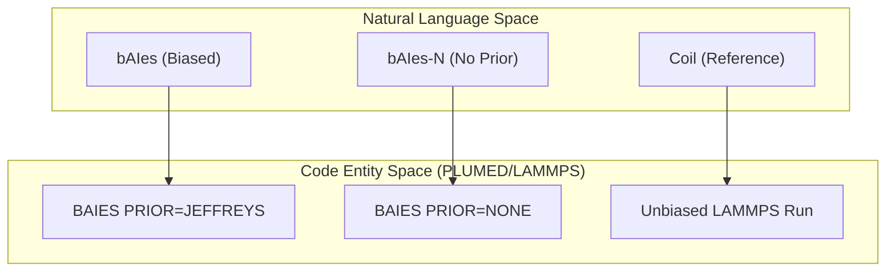
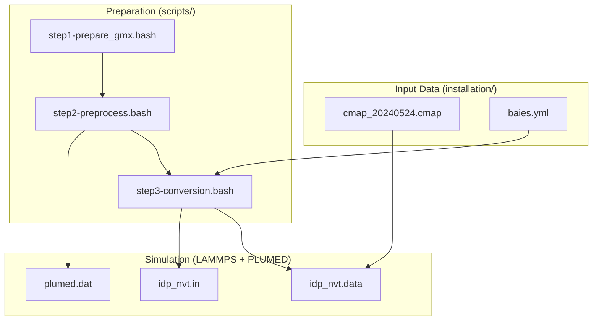

# Repository Layout

> **Relevant source files**
> * [README.md](https://github.com/COSBlab/bAIes-IDP/blob/16faa7f7/README.md?plain=1)
> * [benchmark/README.md](https://github.com/COSBlab/bAIes-IDP/blob/16faa7f7/benchmark/README.md?plain=1)
> * [scripts/README.md](https://github.com/COSBlab/bAIes-IDP/blob/16faa7f7/scripts/README.md?plain=1)
> * [scripts/step1-prepare_gmx.bash](https://github.com/COSBlab/bAIes-IDP/blob/16faa7f7/scripts/step1-prepare_gmx.bash)
> * [scripts/step2-preprocess.bash](https://github.com/COSBlab/bAIes-IDP/blob/16faa7f7/scripts/step2-preprocess.bash)
> * [scripts/step3-conversion.bash](https://github.com/COSBlab/bAIes-IDP/blob/16faa7f7/scripts/step3-conversion.bash)
> * [tutorial/README.md](https://github.com/COSBlab/bAIes-IDP/blob/16faa7f7/tutorial/README.md?plain=1)

The **bAIes-IDP** repository is structured to facilitate the transition from static AlphaFold-2 (AF2) predictions to dynamic atomic-resolution ensembles of Intrinsically Disordered Proteins (IDPs). The layout separates production-ready orchestration scripts, educational tutorials, and the validated benchmark dataset used in the associated publication.

The workflow generally moves from `scripts/` (for preparation) to `tutorial/` (for learning) or `benchmark/` (for reproduction), utilizing configuration files provided in `installation/`.

## Top-Level Directory Structure

The repository is organized into four primary functional areas:

| Directory | Purpose | Key Contents |
| --- | --- | --- |
| `scripts/` | Core logic for pipeline execution. | Python preprocessing and Bash orchestration scripts. |
| `tutorial/` | Step-by-step guides for new systems. | Workflows for both `bAIes` (biased) and `coil` (unbiased) ensembles. |
| `benchmark/` | Data for 21 proteins. | Input files (`.in`, `.data`, `.dat`) to reproduce published results. |
| `installation/` | Environment and patch files. | `baies.yml` for Conda and `patch_cmap.txt` for LAMMPS. |

**Sources:** [README.md L13-L18](https://github.com/COSBlab/bAIes-IDP/blob/16faa7f7/README.md?plain=1#L13-L18)

 [scripts/README.md L1-L15](https://github.com/COSBlab/bAIes-IDP/blob/16faa7f7/scripts/README.md?plain=1#L1-L15)

---

## The scripts/ Directory

This directory contains the implementation of the **Predict-Restrain-Sample** pipeline. It bridges the gap between GROMACS (used for initial topology) and LAMMPS (used for production MD with PLUMED).

### Data Flow and Orchestration

The pipeline is executed through three sequential shell scripts that handle data transformation:

1. **`step1-prepare_gmx.bash`**: Uses `gmx pdb2gmx` to generate GROMACS topology (`.top`) and coordinate (`.gro`) files using the `amber99SB-ILDN` force field [scripts/step1-prepare_gmx.bash L1-L6](https://github.com/COSBlab/bAIes-IDP/blob/16faa7f7/scripts/step1-prepare_gmx.bash#L1-L6)
2. **`step2-preprocess.bash`**: Orchestrates the Bayesian parameter generation. It calls `preprocess_bAIes.py` to parse AF2 distograms and produces the `baies_params.dat` and `plumed.dat` files [scripts/step2-preprocess.bash L1-L35](https://github.com/COSBlab/bAIes-IDP/blob/16faa7f7/scripts/step2-preprocess.bash#L1-L35)
3. **`step3-conversion.bash`**: Converts GROMACS files to LAMMPS format via `intermol` and applies the Random Coil force field modifications using `remove_nonbonded_cmap_plumed.py` (referred to as `make_ff.py` in documentation) [scripts/step3-conversion.bash L1-L32](https://github.com/COSBlab/bAIes-IDP/blob/16faa7f7/scripts/step3-conversion.bash#L1-L32)

### Technical Components

* **`preprocess_bAIes.py`**: The core logic for fitting Gaussian models to AF2 distance distributions and applying residue-pair cutoffs [scripts/README.md L13](https://github.com/COSBlab/bAIes-IDP/blob/16faa7f7/scripts/README.md?plain=1#L13-L13)
* **`remove_nonbonded_cmap_plumed.py`**: Modifies the LAMMPS data file to zero out non-bonded interactions (creating the Random Coil model) and injects the `fix drycmap` cross-terms [scripts/README.md L15](https://github.com/COSBlab/bAIes-IDP/blob/16faa7f7/scripts/README.md?plain=1#L15-L15)  [scripts/step3-conversion.bash L22-L29](https://github.com/COSBlab/bAIes-IDP/blob/16faa7f7/scripts/step3-conversion.bash#L22-L29)

**Sources:** [scripts/README.md L10-L15](https://github.com/COSBlab/bAIes-IDP/blob/16faa7f7/scripts/README.md?plain=1#L10-L15)

 [scripts/step2-preprocess.bash L18-L36](https://github.com/COSBlab/bAIes-IDP/blob/16faa7f7/scripts/step2-preprocess.bash#L18-L36)

 [scripts/step3-conversion.bash L17-L29](https://github.com/COSBlab/bAIes-IDP/blob/16faa7f7/scripts/step3-conversion.bash#L17-L29)

---

## The benchmark/ Directory

This directory contains the complete input sets for the 21-protein benchmark, categorized by protein features such as "Disordered," "Structure motifs," and "Multidomain" [benchmark/README.md L9-L34](https://github.com/COSBlab/bAIes-IDP/blob/16faa7f7/benchmark/README.md?plain=1#L9-L34)

### Logic Space to Code Entity Mapping: Benchmark Variants

The benchmark demonstrates how different `PRIOR` settings in the `BAIES` PLUMED action affect the ensemble.

**Sources:** [benchmark/README.md L1-L34](https://github.com/COSBlab/bAIes-IDP/blob/16faa7f7/benchmark/README.md?plain=1#L1-L34)

 [scripts/step2-preprocess.bash L14-L15](https://github.com/COSBlab/bAIes-IDP/blob/16faa7f7/scripts/step2-preprocess.bash#L14-L15)

 [scripts/step2-preprocess.bash L33](https://github.com/COSBlab/bAIes-IDP/blob/16faa7f7/scripts/step2-preprocess.bash#L33-L33)

---

## The tutorial/ Directory

The tutorials provide a hands-on implementation of the `scripts/` logic. They are divided into two paths:

* **`baies/`**: Full pipeline including AF2 distogram biasing [tutorial/README.md L9](https://github.com/COSBlab/bAIes-IDP/blob/16faa7f7/tutorial/README.md?plain=1#L9-L9)
* **`coil/`**: Simplified pipeline for generating random coil ensembles without external biases [tutorial/README.md L10](https://github.com/COSBlab/bAIes-IDP/blob/16faa7f7/tutorial/README.md?plain=1#L10-L10)

### Workflow Integration Diagram

This diagram illustrates how the directories interact to produce a simulation.

**Sources:** [scripts/step2-preprocess.bash L18-L36](https://github.com/COSBlab/bAIes-IDP/blob/16faa7f7/scripts/step2-preprocess.bash#L18-L36)

 [scripts/step3-conversion.bash L10-L29](https://github.com/COSBlab/bAIes-IDP/blob/16faa7f7/scripts/step3-conversion.bash#L10-L29)

 [README.md L31-L33](https://github.com/COSBlab/bAIes-IDP/blob/16faa7f7/README.md?plain=1#L31-L33)

---

## The installation/ Directory

This directory provides the foundational environment for the scripts to function:

* **`baies.yml`**: Defines the Conda environment required for the `intermol` library and the Python preprocessing scripts [README.md L31-L33](https://github.com/COSBlab/bAIes-IDP/blob/16faa7f7/README.md?plain=1#L31-L33)
* **`patch_cmap.txt`**: A critical patch for the LAMMPS source code (`fix_cmap.cpp`) that allows the simulation to handle the high number of CMAP terms required for IDPs [README.md L45-L48](https://github.com/COSBlab/bAIes-IDP/blob/16faa7f7/README.md?plain=1#L45-L48)

**Sources:** [README.md L31-L51](https://github.com/COSBlab/bAIes-IDP/blob/16faa7f7/README.md?plain=1#L31-L51)

 [scripts/README.md L19-L29](https://github.com/COSBlab/bAIes-IDP/blob/16faa7f7/scripts/README.md?plain=1#L19-L29)