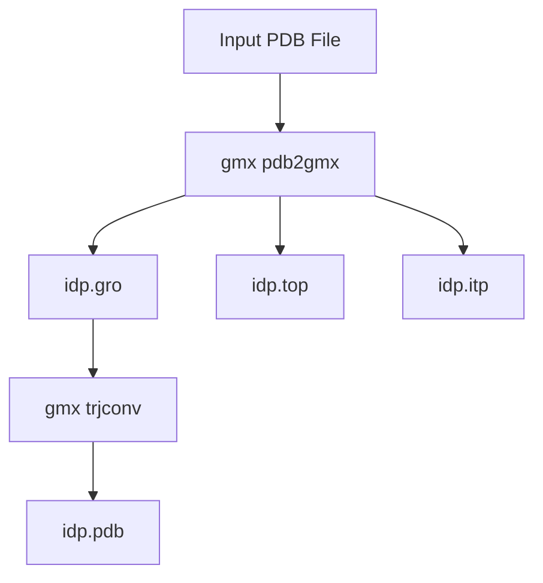

# Shell Scripts (step1, step2, step3)

> **Relevant source files**
> * [scripts/step1-prepare_gmx.bash](https://github.com/COSBlab/bAIes-IDP/blob/16faa7f7/scripts/step1-prepare_gmx.bash)
> * [scripts/step2-preprocess.bash](https://github.com/COSBlab/bAIes-IDP/blob/16faa7f7/scripts/step2-preprocess.bash)
> * [scripts/step3-conversion.bash](https://github.com/COSBlab/bAIes-IDP/blob/16faa7f7/scripts/step3-conversion.bash)
> * [tutorial/bAIes/3-conversion/cmap_20240524.cmap](https://github.com/COSBlab/bAIes-IDP/blob/16faa7f7/tutorial/bAIes/3-conversion/cmap_20240524.cmap)
> * [tutorial/bAIes/3-conversion/idp.gro](https://github.com/COSBlab/bAIes-IDP/blob/16faa7f7/tutorial/bAIes/3-conversion/idp.gro)
> * [tutorial/bAIes/3-conversion/idp.pdb](https://github.com/COSBlab/bAIes-IDP/blob/16faa7f7/tutorial/bAIes/3-conversion/idp.pdb)
> * [tutorial/bAIes/3-conversion/idp.top](https://github.com/COSBlab/bAIes-IDP/blob/16faa7f7/tutorial/bAIes/3-conversion/idp.top)
> * [tutorial/bAIes/3-conversion/idp_nvt.data](https://github.com/COSBlab/bAIes-IDP/blob/16faa7f7/tutorial/bAIes/3-conversion/idp_nvt.data)
> * [tutorial/bAIes/3-conversion/idp_nvt.in](https://github.com/COSBlab/bAIes-IDP/blob/16faa7f7/tutorial/bAIes/3-conversion/idp_nvt.in)
> * [tutorial/bAIes/3-conversion/step3-conversion.bash](https://github.com/COSBlab/bAIes-IDP/blob/16faa7f7/tutorial/bAIes/3-conversion/step3-conversion.bash)
> * [tutorial/coil/2-conversion/step2-conversion.bash](https://github.com/COSBlab/bAIes-IDP/blob/16faa7f7/tutorial/coil/2-conversion/step2-conversion.bash)

This page provides a detailed reference for the three primary orchestration bash scripts located in the `scripts/` directory: `step1-prepare_gmx.bash`, `step2-preprocess.bash`, and `step3-conversion.bash`. These scripts automate key stages of the bAIes-IDP pipeline, from GROMACS topology preparation to distogram preprocessing and final LAMMPS input file generation. For each script, we cover its purpose, arguments, environment requirements, and expected outputs.

## 6.3.1 step1-prepare_gmx.bash

The `step1-prepare_gmx.bash` script is responsible for generating GROMACS topology and coordinate files from an initial PDB structure. It uses `gmx pdb2gmx` to process the PDB and then `gmx trjconv` to reformat the output.

**Purpose:** Convert a protein PDB file into GROMACS-compatible `.gro`, `.top`, and `.itp` files, using the `amber99SB-ILDN` force field.

**Location:** `scripts/step1-prepare_gmx.bash`

**Usage:**

```
./step1-prepare_gmx.bash <input_pdb_file>
```

**Arguments:**

* `<input_pdb_file>`: The path to the input protein PDB file.

**Environment Requirements:**

* GROMACS must be installed and accessible in the system's PATH. The script specifically calls `gmx pdb2gmx` and `gmx trjconv` [scripts/step1-prepare_gmx.bash L5-L6](https://github.com/COSBlab/bAIes-IDP/blob/16faa7f7/scripts/step1-prepare_gmx.bash#L5-L6)

**Implementation Details:**

1. **GROMACS Topology Generation:** The script first calls `gmx pdb2gmx` with the input PDB file. * `-f ${1}`: Specifies the input PDB file [scripts/step1-prepare_gmx.bash L5](https://github.com/COSBlab/bAIes-IDP/blob/16faa7f7/scripts/step1-prepare_gmx.bash#L5-L5) * `-water none`: Disables the addition of water molecules [scripts/step1-prepare_gmx.bash L5](https://github.com/COSBlab/bAIes-IDP/blob/16faa7f7/scripts/step1-prepare_gmx.bash#L5-L5) * `-o ${name}.gro`: Specifies the output GROMACS coordinate file (`idp.gro`) [scripts/step1-prepare_gmx.bash L5](https://github.com/COSBlab/bAIes-IDP/blob/16faa7f7/scripts/step1-prepare_gmx.bash#L5-L5) * `-p ${name}.top`: Specifies the output GROMACS topology file (`idp.top`) [scripts/step1-prepare_gmx.bash L5](https://github.com/COSBlab/bAIes-IDP/blob/16faa7f7/scripts/step1-prepare_gmx.bash#L5-L5) * `-i ${name}.itp`: Specifies the output GROMACS include topology file (`idp.itp`) [scripts/step1-prepare_gmx.bash L5](https://github.com/COSBlab/bAIes-IDP/blob/16faa7f7/scripts/step1-prepare_gmx.bash#L5-L5) * `-ignh`: Ignores hydrogen atoms present in the input PDB, allowing GROMACS to add them according to the force field [scripts/step1-prepare_gmx.bash L5](https://github.com/COSBlab/bAIes-IDP/blob/16faa7f7/scripts/step1-prepare_gmx.bash#L5-L5) * `echo 6`: Selects the `amber99sb-ildn` force field from the `pdb2gmx` interactive prompt [scripts/step1-prepare_gmx.bash L5](https://github.com/COSBlab/bAIes-IDP/blob/16faa7f7/scripts/step1-prepare_gmx.bash#L5-L5)
2. **PDB Reformatting:** After `pdb2gmx`, `gmx trjconv` is used to convert the generated `.gro` file back into a `.pdb` file. This step is often used to ensure a consistent PDB format or to extract a single frame from a trajectory, though here it seems to primarily reformat the `idp.gro` into `idp.pdb` [scripts/step1-prepare_gmx.bash L6](https://github.com/COSBlab/bAIes-IDP/blob/16faa7f7/scripts/step1-prepare_gmx.bash#L6-L6) * `-f ${name}.gro`: Input GROMACS coordinate file [scripts/step1-prepare_gmx.bash L6](https://github.com/COSBlab/bAIes-IDP/blob/16faa7f7/scripts/step1-prepare_gmx.bash#L6-L6) * `-s ${name}.gro`: Input GROMACS run input file (here, the same `.gro` file is used as a structure reference) [scripts/step1-prepare_gmx.bash L6](https://github.com/COSBlab/bAIes-IDP/blob/16faa7f7/scripts/step1-prepare_gmx.bash#L6-L6) * `-o ${name}.pdb`: Output PDB file (`idp.pdb`) [scripts/step1-prepare_gmx.bash L6](https://github.com/COSBlab/bAIes-IDP/blob/16faa7f7/scripts/step1-prepare_gmx.bash#L6-L6) * `echo 0`: Selects the "System" group from the `trjconv` interactive prompt [scripts/step1-prepare_gmx.bash L6](https://github.com/COSBlab/bAIes-IDP/blob/16faa7f7/scripts/step1-prepare_gmx.bash#L6-L6)

**Expected Outputs:**

* `idp.gro`: GROMACS coordinate file [scripts/step1-prepare_gmx.bash L5](https://github.com/COSBlab/bAIes-IDP/blob/16faa7f7/scripts/step1-prepare_gmx.bash#L5-L5)
* `idp.top`: GROMACS master topology file [scripts/step1-prepare_gmx.bash L5](https://github.com/COSBlab/bAIes-IDP/blob/16faa7f7/scripts/step1-prepare_gmx.bash#L5-L5)
* `idp.itp`: GROMACS include topology file (for the protein chain) [scripts/step1-prepare_gmx.bash L5](https://github.com/COSBlab/bAIes-IDP/blob/16faa7f7/scripts/step1-prepare_gmx.bash#L5-L5)
* `idp.pdb`: Reformatted PDB file [scripts/step1-prepare_gmx.bash L6](https://github.com/COSBlab/bAIes-IDP/blob/16faa7f7/scripts/step1-prepare_gmx.bash#L6-L6)

**Diagram: `step1-prepare_gmx.bash` Workflow**



Sources: [scripts/step1-prepare_gmx.bash L1-L6](https://github.com/COSBlab/bAIes-IDP/blob/16faa7f7/scripts/step1-prepare_gmx.bash#L1-L6)

## 6.3.2 step2-preprocess.bash

The `step2-preprocess.bash` script orchestrates the preprocessing of AlphaFold distograms and the generation of PLUMED input files for bAIes simulations. It leverages the `preprocess_bAIes.py` Python script.

**Purpose:** Process AlphaFold distogram data, fit Gaussian models, apply residue-pair cutoffs, and generate `baies_params.dat`, `atom_list.ndx`, and `plumed.dat` for PLUMED-enhanced simulations.

**Location:** `scripts/step2-preprocess.bash`

**Usage:**

```html
./step2-preprocess.bash <md_pdb_file> <pdb_file> <distogram_pkl_file>
```

**Arguments:**

* `<md_pdb_file>`: PDB file used for MD simulation (e.g., `idp.pdb` from `step1`). This is used by PLUMED for structure information [scripts/step2-preprocess.bash L5](https://github.com/COSBlab/bAIes-IDP/blob/16faa7f7/scripts/step2-preprocess.bash#L5-L5)
* `<pdb_file>`: PDB file used by `preprocess_bAIes.py` to map atom indices [scripts/step2-preprocess.bash L6](https://github.com/COSBlab/bAIes-IDP/blob/16faa7f7/scripts/step2-preprocess.bash#L6-L6)
* `<distogram_pkl_file>`: AlphaFold distogram `.pkl` file [scripts/step2-preprocess.bash L7](https://github.com/COSBlab/bAIes-IDP/blob/16faa7f7/scripts/step2-preprocess.bash#L7-L7)

**Environment Requirements:**

* The `preprocess_bAIes.py` script must be executable and located in the same directory or accessible via PATH.
* A Python environment with necessary dependencies for `preprocess_bAIes.py` (e.g., `baies` conda environment) must be active.

**Implementation Details:**

1. **Define Output File Names:** The script sets default names for the output files: `atom_list.ndx`, `baies_params.dat`, and `plumed.dat` [scripts/step2-preprocess.bash L10-L12](https://github.com/COSBlab/bAIes-IDP/blob/16faa7f7/scripts/step2-preprocess.bash#L10-L12)
2. **Set Prior:** The `prior` variable is set to `JEFFREYS`, indicating the use of the Jeffreys prior in the BAIES bias. This can be changed to `NONE` for bAIes-N simulations [scripts/step2-preprocess.bash L15](https://github.com/COSBlab/bAIes-IDP/blob/16faa7f7/scripts/step2-preprocess.bash#L15-L15)
3. **Run `preprocess_bAIes.py`:** The core of this script is the call to `preprocess_bAIes.py`. * `-pdb ${pdb}`: Input PDB file for atom mapping [scripts/step2-preprocess.bash L19](https://github.com/COSBlab/bAIes-IDP/blob/16faa7f7/scripts/step2-preprocess.bash#L19-L19) * `-mdpdb ${mdpdb}`: PDB file for MD simulation, used for PLUMED `MOLINFO` [scripts/step2-preprocess.bash L20](https://github.com/COSBlab/bAIes-IDP/blob/16faa7f7/scripts/step2-preprocess.bash#L20-L20) * `-pkl ${dist}`: AlphaFold distogram pickle file [scripts/step2-preprocess.bash L21](https://github.com/COSBlab/bAIes-IDP/blob/16faa7f7/scripts/step2-preprocess.bash#L21-L21) * `-out ${dat}`: Output file for BAIES parameters (`baies_params.dat`) [scripts/step2-preprocess.bash L22](https://github.com/COSBlab/bAIes-IDP/blob/16faa7f7/scripts/step2-preprocess.bash#L22-L22) * `-model gauss`: Specifies a Gaussian model for fitting distances [scripts/step2-preprocess.bash L23](https://github.com/COSBlab/bAIes-IDP/blob/16faa7f7/scripts/step2-preprocess.bash#L23-L23) * `-cutoff matrix`: Applies a residue-pair specific cutoff matrix for selecting contacts [scripts/step2-preprocess.bash L24](https://github.com/COSBlab/bAIes-IDP/blob/16faa7f7/scripts/step2-preprocess.bash#L24-L24) * `-ndxout ${ndx}`: Output file for atom list index (`atom_list.ndx`) [scripts/step2-preprocess.bash L25](https://github.com/COSBlab/bAIes-IDP/blob/16faa7f7/scripts/step2-preprocess.bash#L25-L25) * `--verbose`: Enables verbose output from `preprocess_bAIes.py` [scripts/step2-preprocess.bash L26](https://github.com/COSBlab/bAIes-IDP/blob/16faa7f7/scripts/step2-preprocess.bash#L26-L26)
4. **Generate `plumed.dat`:** The script then dynamically creates the `plumed.dat` file by appending several lines. * `#MOLINFO STRUCTURE=${mdpdb}`: Specifies the MD PDB file for PLUMED [scripts/step2-preprocess.bash L31](https://github.com/COSBlab/bAIes-IDP/blob/16faa7f7/scripts/step2-preprocess.bash#L31-L31) * `batoms: GROUP NDX_FILE=${ndx} NDX_GROUP=batoms`: Defines a PLUMED `GROUP` named `batoms` using the generated `atom_list.ndx` [scripts/step2-preprocess.bash L32](https://github.com/COSBlab/bAIes-IDP/blob/16faa7f7/scripts/step2-preprocess.bash#L32-L32) * `baies: BAIES ATOMS=batoms DATA_FILE=${dat} PRIOR=${prior} TEMP=2.478541306`: Defines the `BAIES` collective variable, linking it to the `batoms` group, `baies_params.dat`, the specified `PRIOR`, and a temperature [scripts/step2-preprocess.bash L33](https://github.com/COSBlab/bAIes-IDP/blob/16faa7f7/scripts/step2-preprocess.bash#L33-L33) * `PRINT ARG=baies.ene FILE=COLVAR STRIDE=500`: Instructs PLUMED to print the `baies.ene` (energy contribution from the BAIES bias) to `COLVAR` file every 500 steps [scripts/step2-preprocess.bash L34](https://github.com/COSBlab/bAIes-IDP/blob/16faa7f7/scripts/step2-preprocess.bash#L34-L34) * `bbias: BIASVALUE ARG=baies.ene STRIDE=2`: Defines a `BIASVALUE` action named `bbias` that applies the `baies.ene` as a bias every 2 steps [scripts/step2-preprocess.bash L35](https://github.com/COSBlab/bAIes-IDP/blob/16faa7f7/scripts/step2-preprocess.bash#L35-L35)

**Expected Outputs:**

* `atom_list.ndx`: Index file listing atoms involved in the BAIES bias.
* `baies_params.dat`: Parameter file for the BAIES bias, containing Gaussian model parameters for selected residue pairs.
* `plumed.dat`: PLUMED configuration file for applying the BAIES bias during simulation.

**Diagram: `step2-preprocess.bash` Workflow**


Sources: [scripts/step2-preprocess.bash L1-L37](https://github.com/COSBlab/bAIes-IDP/blob/16faa7f7/scripts/step2-preprocess.bash#L1-L37)

## 6.3.3 step3-conversion.bash

The `step3-conversion.bash` script (or `step2-conversion.bash` in the `tutorial/coil` directory) handles the conversion of GROMACS topology files to LAMMPS format and applies the Random Coil force field modifications, including CMAP corrections and PLUMED integration. It uses `intermol` and `make_ff.py` (or `remove_nonbonded_cmap_plumed.py` in the `scripts` directory, which is functionally similar to `make_ff.py` for this purpose).

**Purpose:** Convert GROMACS `.gro` and `.top` files into LAMMPS `.in` and `.data` files, apply the Random Coil force field, integrate CMAP corrections, and set up the simulation box. It also links the generated PLUMED file if provided.

**Location:**

* `scripts/step3-conversion.bash`
* `tutorial/bAIes/3-conversion/step3-conversion.bash`
* `tutorial/coil/2-conversion/step2-conversion.bash`

**Usage:**

```markdown
# For bAIes simulations (includes PLUMED)./step3-conversion.bash <gromacs_gro_file> <gromacs_pdb_file> <gromacs_top_file> # For coil simulations (no PLUMED argument)./step2-conversion.bash <gromacs_gro_file> <gromacs_pdb_file> <gromacs_top_file>
```

**Arguments:**

* `<gromacs_gro_file>`: GROMACS coordinate file (e.g., `idp.gro`) [scripts/step3-conversion.bash L6](https://github.com/COSBlab/bAIes-IDP/blob/16faa7f7/scripts/step3-conversion.bash#L6-L6)
* `<gromacs_pdb_file>`: PDB file (e.g., `idp.pdb`) [scripts/step3-conversion.bash L7](https://github.com/COSBlab/bAIes-IDP/blob/16faa7f7/scripts/step3-conversion.bash#L7-L7)
* `<gromacs_top_file>`: GROMACS topology file (e.g., `idp.top`) [scripts/step3-conversion.bash L8](https://github.com/COSBlab/bAIes-IDP/blob/16faa7f7/scripts/step3-conversion.bash#L8-L8)

**Environment Requirements:**

* A Python environment with `intermol` installed must be active (e.g., `conda activate baies`) [scripts/step3-conversion.bash L3](https://github.com/COSBlab/bAIes-IDP/blob/16faa7f7/scripts/step3-conversion.bash#L3-L3)
* The `make_ff.py` (or `remove_nonbonded_cmap_plumed.py`) script must be executable and located in the same directory or accessible via PATH.

**Implementation Details:**

1. **Define Auxiliary Files:** * `cmap`: Path to the CMAP correction file (`cmap_20240524.cmap`) [scripts/step3-conversion.bash L11](https://github.com/COSBlab/bAIes-IDP/blob/16faa7f7/scripts/step3-conversion.bash#L11-L11) * `plumed`: Path to the PLUMED configuration file (`baies.dat` in `scripts/`, `plumed.dat` in `tutorial/bAIes/`) [scripts/step3-conversion.bash L12](https://github.com/COSBlab/bAIes-IDP/blob/16faa7f7/scripts/step3-conversion.bash#L12-L12)  This argument is omitted in the `tutorial/coil/2-conversion/step2-conversion.bash` script [tutorial/coil/2-conversion/step2-conversion.bash L21-L29](https://github.com/COSBlab/bAIes-IDP/blob/16faa7f7/tutorial/coil/2-conversion/step2-conversion.bash#L21-L29)  as coil simulations do not use PLUMED. * `name`: Generic prefix for output files (`idp`) [scripts/step3-conversion.bash L15](https://github.com/COSBlab/bAIes-IDP/blob/16faa7f7/scripts/step3-conversion.bash#L15-L15)
2. **GROMACS to LAMMPS Conversion with `intermol`:** * `python -m intermol.convert --gro_in ${gro} ${top} --lammps`: `intermol` is used to convert the GROMACS `.gro` and `.top` files into intermediate LAMMPS files (`idp_converted.input` and `idp_converted.lmp`) [scripts/step3-conversion.bash L18](https://github.com/COSBlab/bAIes-IDP/blob/16faa7f7/scripts/step3-conversion.bash#L18-L18)  The output is logged to `idp_conversion.log`.
3. **Force Field Modification and LAMMPS Input Generation with `make_ff.py`:** * The `make_ff.py` script (or `remove_nonbonded_cmap_plumed.py` in `scripts/`) takes the `intermol` output and performs several critical modifications: * `-i ${name}_converted.input`: Input LAMMPS data file from `intermol` [scripts/step3-conversion.bash L22](https://github.com/COSBlab/bAIes-IDP/blob/16faa7f7/scripts/step3-conversion.bash#L22-L22) * `-top ${name}_converted.lmp`: Input LAMMPS topology file from `intermol` [scripts/step3-conversion.bash L23](https://github.com/COSBlab/bAIes-IDP/blob/16faa7f7/scripts/step3-conversion.bash#L23-L23) * `-pdb ${pdb}`: Input PDB file for atom mapping [scripts/step3-conversion.bash L24](https://github.com/COSBlab/bAIes-IDP/blob/16faa7f7/scripts/step3-conversion.bash#L24-L24) * `-cmap ${cmap}`: Path to the CMAP correction file [scripts/step3-conversion.bash L24](https://github.com/COSBlab/bAIes-IDP/blob/16faa7f7/scripts/step3-conversion.bash#L24-L24)  This file contains residue-specific dihedral correction maps [tutorial/bAIes/3-conversion/cmap_20240524.cmap L1](https://github.com/COSBlab/bAIes-IDP/blob/16faa7f7/tutorial/bAIes/3-conversion/cmap_20240524.cmap#L1-L1) * `-oin ${name}_nvt.in`: Output LAMMPS input script (`idp_nvt.in`) [scripts/step3-conversion.bash L25](https://github.com/COSBlab/bAIes-IDP/blob/16faa7f7/scripts/step3-conversion.bash#L25-L25)  This file will contain the `fix drycmap` command and pair coefficients [tutorial/bAIes/3-conversion/idp_nvt.in L14-L15](https://github.com/COSBlab/bAIes-IDP/blob/16faa7f7/tutorial/bAIes/3-conversion/idp_nvt.in#L14-L15) * `-otop ${name}_nvt.data`: Output LAMMPS data file (`idp_nvt.data`) [scripts/step3-conversion.bash L26](https://github.com/COSBlab/bAIes-IDP/blob/16faa7f7/scripts/step3-conversion.bash#L26-L26)  This file contains the atom, bond, angle, dihedral, and crossterm definitions [tutorial/bAIes/3-conversion/idp_nvt.data L3-L7](https://github.com/COSBlab/bAIes-IDP/blob/16faa7f7/tutorial/bAIes/3-conversion/idp_nvt.data#L3-L7) * `-cube 200.0`: Sets the simulation box size to 200.0 Å in each dimension [scripts/step3-conversion.bash L27](https://github.com/COSBlab/bAIes-IDP/blob/16faa7f7/scripts/step3-conversion.bash#L27-L27) * `-oxtc traj_${name}.xtc`: Specifies the output trajectory file name [scripts/step3-conversion.bash L28](https://github.com/COSBlab/bAIes-IDP/blob/16faa7f7/scripts/step3-conversion.bash#L28-L28) * `-plumed ${plumed}`: (Conditional) Path to the PLUMED configuration file. This argument is included for bAIes simulations [scripts/step3-conversion.bash L29](https://github.com/COSBlab/bAIes-IDP/blob/16faa7f7/scripts/step3-conversion.bash#L29-L29)  but omitted for coil simulations [tutorial/coil/2-conversion/step2-conversion.bash L29](https://github.com/COSBlab/bAIes-IDP/blob/16faa7f7/tutorial/coil/2-conversion/step2-conversion.bash#L29-L29)
4. **Cleanup:** Removes intermediate `intermol` files (`idp_converted.input`, `idp_converted.lmp`, `idp_conversion.log`) [scripts/step3-conversion.bash L31](https://github.com/COSBlab/bAIes-IDP/blob/16faa7f7/scripts/step3-conversion.bash#L31-L31)

**Expected Outputs:**

* `idp_nvt.in`: LAMMPS input script for NVT simulation.
* `idp_nvt.data`: LAMMPS data file containing force field parameters and atomic coordinates.
* `traj_idp.xtc`: Placeholder for the simulation trajectory (created during simulation).
* `idp_conversion.log`: Log file from the `intermol` conversion.

**Diagram: `step3-conversion.bash` Workflow**


Sources: [scripts/step3-conversion.bash L1-L32](https://github.com/COSBlab/bAIes-IDP/blob/16faa7f7/scripts/step3-conversion.bash#L1-L32)

 [tutorial/bAIes/3-conversion/step3-conversion.bash L1-L32](https://github.com/COSBlab/bAIes-IDP/blob/16faa7f7/tutorial/bAIes/3-conversion/step3-conversion.bash#L1-L32)

 [tutorial/coil/2-conversion/step2-conversion.bash L1-L31](https://github.com/COSBlab/bAIes-IDP/blob/16faa7f7/tutorial/coil/2-conversion/step2-conversion.bash#L1-L31)

 [tutorial/bAIes/3-conversion/cmap_20240524.cmap L1](https://github.com/COSBlab/bAIes-IDP/blob/16faa7f7/tutorial/bAIes/3-conversion/cmap_20240524.cmap#L1-L1)

 [tutorial/bAIes/3-conversion/idp_nvt.in L14-L15](https://github.com/COSBlab/bAIes-IDP/blob/16faa7f7/tutorial/bAIes/3-conversion/idp_nvt.in#L14-L15)

 [tutorial/bAIes/3-conversion/idp_nvt.data L3-L7](https://github.com/COSBlab/bAIes-IDP/blob/16faa7f7/tutorial/bAIes/3-conversion/idp_nvt.data#L3-L7)