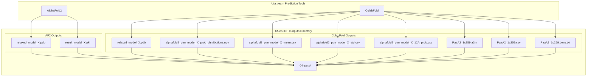
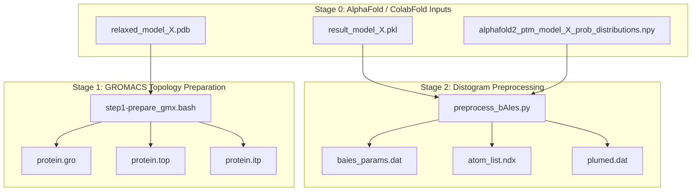

# Stage 0 – AlphaFold / ColabFold Inputs

> **Relevant source files**
> * [tutorial/bAIes/0-inputs/PaaA2_AF2/relaxed_model_4_ptm_pred_0.pdb](https://github.com/COSBlab/bAIes-IDP/blob/16faa7f7/tutorial/bAIes/0-inputs/PaaA2_AF2/relaxed_model_4_ptm_pred_0.pdb)
> * [tutorial/bAIes/0-inputs/PaaA2_AF2/result_model_4_ptm_pred_0.pkl](https://github.com/COSBlab/bAIes-IDP/blob/16faa7f7/tutorial/bAIes/0-inputs/PaaA2_AF2/result_model_4_ptm_pred_0.pkl)
> * [tutorial/bAIes/0-inputs/PaaA2_Colabfold/PaaA2_1c259.a3m](https://github.com/COSBlab/bAIes-IDP/blob/16faa7f7/tutorial/bAIes/0-inputs/PaaA2_Colabfold/PaaA2_1c259.a3m)
> * [tutorial/bAIes/0-inputs/PaaA2_Colabfold/PaaA2_1c259.csv](https://github.com/COSBlab/bAIes-IDP/blob/16faa7f7/tutorial/bAIes/0-inputs/PaaA2_Colabfold/PaaA2_1c259.csv)
> * [tutorial/bAIes/0-inputs/PaaA2_Colabfold/PaaA2_1c259.done.txt](https://github.com/COSBlab/bAIes-IDP/blob/16faa7f7/tutorial/bAIes/0-inputs/PaaA2_Colabfold/PaaA2_1c259.done.txt)
> * [tutorial/bAIes/0-inputs/PaaA2_Colabfold/PaaA2_1c259_distmat/alphafold2_ptm_model_1_seed_000_12A_prob.csv](https://github.com/COSBlab/bAIes-IDP/blob/16faa7f7/tutorial/bAIes/0-inputs/PaaA2_Colabfold/PaaA2_1c259_distmat/alphafold2_ptm_model_1_seed_000_12A_prob.csv)
> * [tutorial/bAIes/0-inputs/PaaA2_Colabfold/PaaA2_1c259_distmat/alphafold2_ptm_model_1_seed_000_mean.csv](https://github.com/COSBlab/bAIes-IDP/blob/16faa7f7/tutorial/bAIes/0-inputs/PaaA2_Colabfold/PaaA2_1c259_distmat/alphafold2_ptm_model_1_seed_000_mean.csv)
> * [tutorial/bAIes/0-inputs/PaaA2_Colabfold/PaaA2_1c259_distmat/alphafold2_ptm_model_1_seed_000_prob_distributions.npy](https://github.com/COSBlab/bAIes-IDP/blob/16faa7f7/tutorial/bAIes/0-inputs/PaaA2_Colabfold/PaaA2_1c259_distmat/alphafold2_ptm_model_1_seed_000_prob_distributions.npy)
> * [tutorial/bAIes/0-inputs/PaaA2_Colabfold/PaaA2_1c259_distmat/alphafold2_ptm_model_1_seed_000_std.csv](https://github.com/COSBlab/bAIes-IDP/blob/16faa7f7/tutorial/bAIes/0-inputs/PaaA2_Colabfold/PaaA2_1c259_distmat/alphafold2_ptm_model_1_seed_000_std.csv)
> * [tutorial/bAIes/0-inputs/PaaA2_Colabfold/PaaA2_1c259_distmat/alphafold2_ptm_model_2_seed_000_12A_prob.csv](https://github.com/COSBlab/bAIes-IDP/blob/16faa7f7/tutorial/bAIes/0-inputs/PaaA2_Colabfold/PaaA2_1c259_distmat/alphafold2_ptm_model_2_seed_000_12A_prob.csv)
> * [tutorial/bAIes/0-inputs/PaaA2_Colabfold/PaaA2_1c259_distmat/alphafold2_ptm_model_2_seed_000_mean.csv](https://github.com/COSBlab/bAIes-IDP/blob/16faa7f7/tutorial/bAIes/0-inputs/PaaA2_Colabfold/PaaA2_1c259_distmat/alphafold2_ptm_model_2_seed_000_mean.csv)
> * [tutorial/bAIes/2-preprocessing/relaxed_model_4_ptm_pred_0.pdb](https://github.com/COSBlab/bAIes-IDP/blob/16faa7f7/tutorial/bAIes/2-preprocessing/relaxed_model_4_ptm_pred_0.pdb)
> * [tutorial/bAIes/2-preprocessing/result_model_4_ptm_pred_0.pkl](https://github.com/COSBlab/bAIes-IDP/blob/16faa7f7/tutorial/bAIes/2-preprocessing/result_model_4_ptm_pred_0.pkl)

This page details the initial data sources required by the bAIes-IDP pipeline, focusing on the outputs from AlphaFold2 (AF2) and ColabFold. These inputs, primarily distograms and relaxed PDB models, form the foundation for subsequent topology generation and biased molecular dynamics simulations. The `0-inputs` directory serves as the designated location for these raw data files.

## Upstream Data Sources

The bAIes-IDP pipeline can utilize distograms generated by either AlphaFold2 or ColabFold. Both tools predict inter-residue distances, which are crucial for defining the Bayesian bias in the simulations.

### AlphaFold2 Distograms

AlphaFold2 generates distograms as Python pickle files. These files contain the raw probability distributions of inter-residue distances.

* **File Format**: `.pkl` (Python pickle file)
* **Content**: A dictionary containing a `'distogram'` key, which holds a NumPy array representing the probability distribution of distances between all residue pairs. The `'bin_edges'` key defines the distance bins.
* **Example**: `result_model_4_ptm_pred_0.pkl` [tutorial/bAIes/2-preprocessing/result_model_4_ptm_pred_0.pkl L1-L3](https://github.com/COSBlab/bAIes-IDP/blob/16faa7f7/tutorial/bAIes/2-preprocessing/result_model_4_ptm_pred_0.pkl#L1-L3) * This file contains a serialized Python dictionary. When unpickled, it reveals a `'distogram'` entry, which is a 3D NumPy array (`(N, N, B)` where N is the number of residues and B is the number of distance bins) storing the probability distributions. The `'bin_edges'` entry is a 1D NumPy array defining the boundaries of these distance bins.

### ColabFold Distograms

ColabFold, a simplified version of AlphaFold2, also produces distograms. These are typically provided as NumPy `.npy` files, which are often accompanied by CSV files containing mean, standard deviation, and probability values for specific distance cutoffs.

* **File Format**: `.npy` (NumPy array file) and `.csv` (Comma Separated Values)
* **Content**: * `.npy` files (e.g., `alphafold2_ptm_model_1_seed_000_prob_distributions.npy` [tutorial/bAIes/0-inputs/PaaA2_Colabfold/PaaA2_1c259_distmat/alphafold2_ptm_model_1_seed_000_prob_distributions.npy L1-L76](https://github.com/COSBlab/bAIes-IDP/blob/16faa7f7/tutorial/bAIes/0-inputs/PaaA2_Colabfold/PaaA2_1c259_distmat/alphafold2_ptm_model_1_seed_000_prob_distributions.npy#L1-L76) ) store the full probability distributions as a 3D NumPy array, similar to the AF2 pickle files. * `.csv` files (e.g., `alphafold2_ptm_model_1_seed_000_mean.csv` [tutorial/bAIes/0-inputs/PaaA2_Colabfold/PaaA2_1c259_distmat/alphafold2_ptm_model_1_seed_000_mean.csv L1-L7](https://github.com/COSBlab/bAIes-IDP/blob/16faa7f7/tutorial/bAIes/0-inputs/PaaA2_Colabfold/PaaA2_1c259_distmat/alphafold2_ptm_model_1_seed_000_mean.csv#L1-L7)  `alphafold2_ptm_model_1_seed_000_std.csv` [tutorial/bAIes/0-inputs/PaaA2_Colabfold/PaaA2_1c259_distmat/alphafold2_ptm_model_1_seed_000_std.csv L1-L7](https://github.com/COSBlab/bAIes-IDP/blob/16faa7f7/tutorial/bAIes/0-inputs/PaaA2_Colabfold/PaaA2_1c259_distmat/alphafold2_ptm_model_1_seed_000_std.csv#L1-L7)  `alphafold2_ptm_model_1_seed_000_12A_prob.csv` [tutorial/bAIes/0-inputs/PaaA2_Colabfold/PaaA2_1c259_distmat/alphafold2_ptm_model_1_seed_000_12A_prob.csv L1-L7](https://github.com/COSBlab/bAIes-IDP/blob/16faa7f7/tutorial/bAIes/0-inputs/PaaA2_Colabfold/PaaA2_1c259_distmat/alphafold2_ptm_model_1_seed_000_12A_prob.csv#L1-L7) ) provide summary statistics (mean, standard deviation, and probability of being within 12 Å) for each residue pair. These CSV files are not directly used by `preprocess_bAIes.py` but can be useful for analysis.
* **ColabFold_distmats notebook**: This Jupyter notebook is typically used to generate these `.npy` and `.csv` files from ColabFold outputs.

### Relaxed PDB Models

Both AlphaFold2 and ColabFold produce predicted protein structures in Protein Data Bank (PDB) format. These "relaxed" models represent the predicted 3D coordinates of the protein atoms.

* **File Format**: `.pdb` (Protein Data Bank file)
* **Content**: Standard PDB format, listing atom types, coordinates (X, Y, Z), residue names, chain identifiers, residue numbers, occupancy, and B-factor.
* **Example**: `relaxed_model_4_ptm_pred_0.pdb` [tutorial/bAIes/2-preprocessing/relaxed_model_4_ptm_pred_0.pdb L1-L93](https://github.com/COSBlab/bAIes-IDP/blob/16faa7f7/tutorial/bAIes/2-preprocessing/relaxed_model_4_ptm_pred_0.pdb#L1-L93) * This file provides the initial 3D structure of the protein, which is essential for generating the GROMACS topology in the next stage.

## The 0-inputs Directory

The `0-inputs` directory is where all raw AlphaFold/ColabFold outputs are expected to reside. For the tutorial example, `PaaA2`, the directory structure is as follows:

```
0-inputs/
├── PaaA2_AF2/
│   ├── result_model_4_ptm_pred_0.pkl
│   └── relaxed_model_4_ptm_pred_0.pdb
└── PaaA2_Colabfold/
    ├── PaaA2_1c259.a3m
    ├── PaaA2_1c259.csv
    ├── PaaA2_1c259.done.txt
    └── PaaA2_1c259_distmat/
        ├── alphafold2_ptm_model_1_seed_000_12A_prob.csv
        ├── alphafold2_ptm_model_1_seed_000_mean.csv
        ├── alphafold2_ptm_model_1_seed_000_prob_distributions.npy
        ├── alphafold2_ptm_model_1_seed_000_std.csv
        ├── alphafold2_ptm_model_2_seed_000_12A_prob.csv
        ├── alphafold2_ptm_model_2_seed_000_mean.csv
        ├── alphafold2_ptm_model_2_seed_000_prob_distributions.npy
        └── alphafold2_ptm_model_2_seed_000_std.csv
```

### Directory Structure and File Formats

The `0-inputs` directory is organized by protein and by the prediction tool used (AF2 or ColabFold).

#### AlphaFold2 Outputs (PaaA2_AF2/)

* `result_model_4_ptm_pred_0.pkl`: AlphaFold2 distogram pickle file. [tutorial/bAIes/2-preprocessing/result_model_4_ptm_pred_0.pkl L1-L3](https://github.com/COSBlab/bAIes-IDP/blob/16faa7f7/tutorial/bAIes/2-preprocessing/result_model_4_ptm_pred_0.pkl#L1-L3)
* `relaxed_model_4_ptm_pred_0.pdb`: AlphaFold2 relaxed PDB structure. [tutorial/bAIes/2-preprocessing/relaxed_model_4_ptm_pred_0.pdb L1-L93](https://github.com/COSBlab/bAIes-IDP/blob/16faa7f7/tutorial/bAIes/2-preprocessing/relaxed_model_4_ptm_pred_0.pdb#L1-L93)

#### ColabFold Outputs (PaaA2_Colabfold/)

* `PaaA2_1c259.a3m`: Multiple sequence alignment (MSA) file used by ColabFold. [tutorial/bAIes/0-inputs/PaaA2_Colabfold/PaaA2_1c259.a3m L1-L116](https://github.com/COSBlab/bAIes-IDP/blob/16faa7f7/tutorial/bAIes/0-inputs/PaaA2_Colabfold/PaaA2_1c259.a3m#L1-L116)
* `PaaA2_1c259.csv`: A simple CSV file containing the protein ID and sequence. [tutorial/bAIes/0-inputs/PaaA2_Colabfold/PaaA2_1c259.csv L1-L2](https://github.com/COSBlab/bAIes-IDP/blob/16faa7f7/tutorial/bAIes/0-inputs/PaaA2_Colabfold/PaaA2_1c259.csv#L1-L2)
* `PaaA2_1c259.done.txt`: A marker file indicating completion of a ColabFold run. [tutorial/bAIes/0-inputs/PaaA2_Colabfold/PaaA2_1c259.done.txt L1](https://github.com/COSBlab/bAIes-IDP/blob/16faa7f7/tutorial/bAIes/0-inputs/PaaA2_Colabfold/PaaA2_1c259.done.txt#L1-L1)
* `PaaA2_1c259_distmat/`: A subdirectory containing the distogram-related files. * `alphafold2_ptm_model_X_seed_000_prob_distributions.npy`: NumPy array files storing the full probability distributions for each model. [tutorial/bAIes/0-inputs/PaaA2_Colabfold/PaaA2_1c259_distmat/alphafold2_ptm_model_1_seed_000_prob_distributions.npy L1-L76](https://github.com/COSBlab/bAIes-IDP/blob/16faa7f7/tutorial/bAIes/0-inputs/PaaA2_Colabfold/PaaA2_1c259_distmat/alphafold2_ptm_model_1_seed_000_prob_distributions.npy#L1-L76) * `alphafold2_ptm_model_X_seed_000_mean.csv`: CSV files containing the mean predicted distances for each residue pair. [tutorial/bAIes/0-inputs/PaaA2_Colabfold/PaaA2_1c259_distmat/alphafold2_ptm_model_1_seed_000_mean.csv L1-L7](https://github.com/COSBlab/bAIes-IDP/blob/16faa7f7/tutorial/bAIes/0-inputs/PaaA2_Colabfold/PaaA2_1c259_distmat/alphafold2_ptm_model_1_seed_000_mean.csv#L1-L7) * `alphafold2_ptm_model_X_seed_000_std.csv`: CSV files containing the standard deviation of predicted distances for each residue pair. [tutorial/bAIes/0-inputs/PaaA2_Colabfold/PaaA2_1c259_distmat/alphafold2_ptm_model_1_seed_000_std.csv L1-L7](https://github.com/COSBlab/bAIes-IDP/blob/16faa7f7/tutorial/bAIes/0-inputs/PaaA2_Colabfold/PaaA2_1c259_distmat/alphafold2_ptm_model_1_seed_000_std.csv#L1-L7) * `alphafold2_ptm_model_X_seed_000_12A_prob.csv`: CSV files containing the probability of each residue pair being within 12 Å. [tutorial/bAIes/0-inputs/PaaA2_Colabfold/PaaA2_1c259_distmat/alphafold2_ptm_model_1_seed_000_12A_prob.csv L1-L7](https://github.com/COSBlab/bAIes-IDP/blob/16faa7f7/tutorial/bAIes/0-inputs/PaaA2_Colabfold/PaaA2_1c259_distmat/alphafold2_ptm_model_1_seed_000_12A_prob.csv#L1-L7)

### Data Flow Diagram

The following diagram illustrates the origin and types of input files for the bAIes-IDP pipeline.



Sources:

* [tutorial/bAIes/2-preprocessing/relaxed_model_4_ptm_pred_0.pdb L1-L93](https://github.com/COSBlab/bAIes-IDP/blob/16faa7f7/tutorial/bAIes/2-preprocessing/relaxed_model_4_ptm_pred_0.pdb#L1-L93)
* [tutorial/bAIes/2-preprocessing/result_model_4_ptm_pred_0.pkl L1-L3](https://github.com/COSBlab/bAIes-IDP/blob/16faa7f7/tutorial/bAIes/2-preprocessing/result_model_4_ptm_pred_0.pkl#L1-L3)
* [tutorial/bAIes/0-inputs/PaaA2_Colabfold/PaaA2_1c259_distmat/alphafold2_ptm_model_1_seed_000_mean.csv L1-L7](https://github.com/COSBlab/bAIes-IDP/blob/16faa7f7/tutorial/bAIes/0-inputs/PaaA2_Colabfold/PaaA2_1c259_distmat/alphafold2_ptm_model_1_seed_000_mean.csv#L1-L7)
* [tutorial/bAIes/0-inputs/PaaA2_Colabfold/PaaA2_1c259_distmat/alphafold2_ptm_model_2_seed_000_12A_prob.csv L1-L7](https://github.com/COSBlab/bAIes-IDP/blob/16faa7f7/tutorial/bAIes/0-inputs/PaaA2_Colabfold/PaaA2_1c259_distmat/alphafold2_ptm_model_2_seed_000_12A_prob.csv#L1-L7)
* [tutorial/bAIes/0-inputs/PaaA2_Colabfold/PaaA2_1c259_distmat/alphafold2_ptm_model_1_seed_000_std.csv L1-L7](https://github.com/COSBlab/bAIes-IDP/blob/16faa7f7/tutorial/bAIes/0-inputs/PaaA2_Colabfold/PaaA2_1c259_distmat/alphafold2_ptm_model_1_seed_000_std.csv#L1-L7)
* [tutorial/bAIes/0-inputs/PaaA2_Colabfold/PaaA2_1c259.done.txt L1](https://github.com/COSBlab/bAIes-IDP/blob/16faa7f7/tutorial/bAIes/0-inputs/PaaA2_Colabfold/PaaA2_1c259.done.txt#L1-L1)
* [tutorial/bAIes/0-inputs/PaaA2_Colabfold/PaaA2_1c259_distmat/alphafold2_ptm_model_2_seed_000_mean.csv L1-L7](https://github.com/COSBlab/bAIes-IDP/blob/16faa7f7/tutorial/bAIes/0-inputs/PaaA2_Colabfold/PaaA2_1c259_distmat/alphafold2_ptm_model_2_seed_000_mean.csv#L1-L7)
* [tutorial/bAIes/0-inputs/PaaA2_Colabfold/PaaA2_1c259_distmat/alphafold2_ptm_model_1_seed_000_prob_distributions.npy L1-L76](https://github.com/COSBlab/bAIes-IDP/blob/16faa7f7/tutorial/bAIes/0-inputs/PaaA2_Colabfold/PaaA2_1c259_distmat/alphafold2_ptm_model_1_seed_000_prob_distributions.npy#L1-L76)
* [tutorial/bAIes/0-inputs/PaaA2_Colabfold/PaaA2_1c259.a3m L1-L116](https://github.com/COSBlab/bAIes-IDP/blob/16faa7f7/tutorial/bAIes/0-inputs/PaaA2_Colabfold/PaaA2_1c259.a3m#L1-L116)
* [tutorial/bAIes/0-inputs/PaaA2_Colabfold/PaaA2_1c259.csv L1-L2](https://github.com/COSBlab/bAIes-IDP/blob/16faa7f7/tutorial/bAIes/0-inputs/PaaA2_Colabfold/PaaA2_1c259.csv#L1-L2)
* [tutorial/bAIes/0-inputs/PaaA2_AF2/relaxed_model_4_ptm_pred_0.pdb L1-L93](https://github.com/COSBlab/bAIes-IDP/blob/16faa7f7/tutorial/bAIes/0-inputs/PaaA2_AF2/relaxed_model_4_ptm_pred_0.pdb#L1-L93)

## Role in the bAIes-IDP Pipeline

These input files are consumed by subsequent stages of the bAIes-IDP pipeline:

1. **Stage 1 – GROMACS Topology Preparation**: The `relaxed_model_X.pdb` file is used as the initial structure to generate GROMACS topology files (`.gro`, `.top`, `.itp`).
2. **Stage 2 – Distogram Preprocessing**: The `result_model_X.pkl` (for AF2) or `alphafold2_ptm_model_X_prob_distributions.npy` (for ColabFold) files are processed by `preprocess_bAIes.py` to extract distance distributions, fit Gaussian/lognormal models, and generate the `baies_params.dat` file, which defines the Bayesian bias.

The following diagram illustrates how these input files are utilized in the initial stages of the bAIes-IDP workflow.



Sources:

* [tutorial/bAIes/2-preprocessing/relaxed_model_4_ptm_pred_0.pdb L1-L93](https://github.com/COSBlab/bAIes-IDP/blob/16faa7f7/tutorial/bAIes/2-preprocessing/relaxed_model_4_ptm_pred_0.pdb#L1-L93)
* [tutorial/bAIes/2-preprocessing/result_model_4_ptm_pred_0.pkl L1-L3](https://github.com/COSBlab/bAIes-IDP/blob/16faa7f7/tutorial/bAIes/2-preprocessing/result_model_4_ptm_pred_0.pkl#L1-L3)
* [tutorial/bAIes/0-inputs/PaaA2_Colabfold/PaaA2_1c259_distmat/alphafold2_ptm_model_1_seed_000_prob_distributions.npy L1-L76](https://github.com/COSBlab/bAIes-IDP/blob/16faa7f7/tutorial/bAIes/0-inputs/PaaA2_Colabfold/PaaA2_1c259_distmat/alphafold2_ptm_model_1_seed_000_prob_distributions.npy#L1-L76)