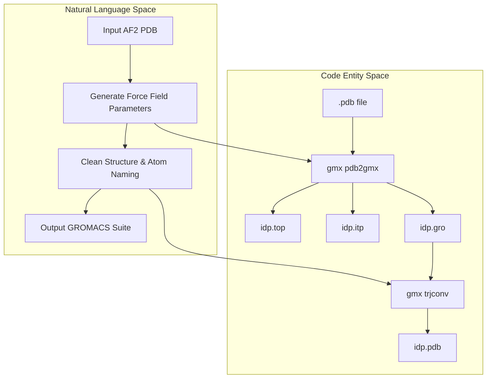
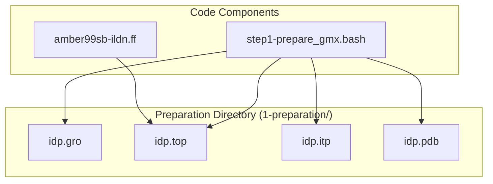

# Stage 1 – GROMACS Topology Preparation

> **Relevant source files**
> * [scripts/step1-prepare_gmx.bash](https://github.com/COSBlab/bAIes-IDP/blob/16faa7f7/scripts/step1-prepare_gmx.bash)
> * [scripts/step2-preprocess.bash](https://github.com/COSBlab/bAIes-IDP/blob/16faa7f7/scripts/step2-preprocess.bash)
> * [scripts/step3-conversion.bash](https://github.com/COSBlab/bAIes-IDP/blob/16faa7f7/scripts/step3-conversion.bash)
> * [tutorial/bAIes/1-preparation/idp.gro](https://github.com/COSBlab/bAIes-IDP/blob/16faa7f7/tutorial/bAIes/1-preparation/idp.gro)
> * [tutorial/bAIes/1-preparation/idp.itp](https://github.com/COSBlab/bAIes-IDP/blob/16faa7f7/tutorial/bAIes/1-preparation/idp.itp)
> * [tutorial/bAIes/1-preparation/idp.pdb](https://github.com/COSBlab/bAIes-IDP/blob/16faa7f7/tutorial/bAIes/1-preparation/idp.pdb)
> * [tutorial/bAIes/1-preparation/idp.top](https://github.com/COSBlab/bAIes-IDP/blob/16faa7f7/tutorial/bAIes/1-preparation/idp.top)
> * [tutorial/coil/1-preparation/idp.gro](https://github.com/COSBlab/bAIes-IDP/blob/16faa7f7/tutorial/coil/1-preparation/idp.gro)
> * [tutorial/coil/1-preparation/idp.itp](https://github.com/COSBlab/bAIes-IDP/blob/16faa7f7/tutorial/coil/1-preparation/idp.itp)
> * [tutorial/coil/1-preparation/idp.pdb](https://github.com/COSBlab/bAIes-IDP/blob/16faa7f7/tutorial/coil/1-preparation/idp.pdb)
> * [tutorial/coil/1-preparation/idp.top](https://github.com/COSBlab/bAIes-IDP/blob/16faa7f7/tutorial/coil/1-preparation/idp.top)

This stage handles the initial conversion of structural data from AlphaFold-2 (AF2) or ColabFold PDB models into standard GROMACS topology and structure files. The pipeline utilizes the **amber99SB-ILDN** force field to define the initial molecular parameters, which are later modified for the Random Coil ensemble in Stage 3.

### 1. The step1-prepare_gmx.bash Orchestrator

The primary entry point for this stage is the `step1-prepare_gmx.bash` script [scripts/step1-prepare_gmx.bash L1-L6](https://github.com/COSBlab/bAIes-IDP/blob/16faa7f7/scripts/step1-prepare_gmx.bash#L1-L6)

 This script automates the GROMACS pre-processing steps required to generate a consistent topology and a cleaned PDB structure suitable for downstream Bayesian biasing.

#### Data Flow and Logic

1. **Atom and Topology Generation**: The script calls `gmx pdb2gmx` to process the input AF2 PDB file. It specifically uses the `amber99SB-ILDN` force field (identified by the selection `6` piped to the command) [scripts/step1-prepare_gmx.bash L5](https://github.com/COSBlab/bAIes-IDP/blob/16faa7f7/scripts/step1-prepare_gmx.bash#L5-L5)
2. **Hydrogen Handling**: The `-ignh` flag is used to ignore existing hydrogens in the AF2 model and let GROMACS regenerate them according to the force field definitions [scripts/step1-prepare_gmx.bash L5](https://github.com/COSBlab/bAIes-IDP/blob/16faa7f7/scripts/step1-prepare_gmx.bash#L5-L5)
3. **Structural Cleaning**: It uses `gmx trjconv` to convert the generated `.gro` file back into a `.pdb` format, ensuring that the atom naming and ordering in the structure file exactly match the generated topology [scripts/step1-prepare_gmx.bash L6](https://github.com/COSBlab/bAIes-IDP/blob/16faa7f7/scripts/step1-prepare_gmx.bash#L6-L6)

**Sources:**

* [scripts/step1-prepare_gmx.bash L1-L6](https://github.com/COSBlab/bAIes-IDP/blob/16faa7f7/scripts/step1-prepare_gmx.bash#L1-L6)

### 2. Implementation Space to Code Entity Mapping

The following diagrams illustrate how the conceptual preparation steps map to specific GROMACS commands and file outputs within the `scripts/` and `tutorial/` directories.

**GROMACS Preparation Logic Flow**

**Sources:**

* [scripts/step1-prepare_gmx.bash L3-L6](https://github.com/COSBlab/bAIes-IDP/blob/16faa7f7/scripts/step1-prepare_gmx.bash#L3-L6)

**Directory Structure Association**

**Sources:**

* [tutorial/bAIes/1-preparation/idp.top L21](https://github.com/COSBlab/bAIes-IDP/blob/16faa7f7/tutorial/bAIes/1-preparation/idp.top#L21-L21)
* [scripts/step1-prepare_gmx.bash L3-L6](https://github.com/COSBlab/bAIes-IDP/blob/16faa7f7/scripts/step1-prepare_gmx.bash#L3-L6)

### 3. Preparation Outputs Reference

The execution of Stage 1 produces four critical files in the `1-preparation/` directory of the workflow.

| File | Purpose | Key Technical Detail |
| --- | --- | --- |
| `idp.gro` | GROMACS Structure file | Contains Cartesian coordinates and velocities (if any) in fixed GROMACS format [tutorial/bAIes/1-preparation/idp.gro L1-L21](https://github.com/COSBlab/bAIes-IDP/blob/16faa7f7/tutorial/bAIes/1-preparation/idp.gro#L1-L21) |
| `idp.top` | System Topology | Defines the molecular composition and includes the `amber99sb-ildn.ff/forcefield.itp` [tutorial/bAIes/1-preparation/idp.top L21-L25](https://github.com/COSBlab/bAIes-IDP/blob/16faa7f7/tutorial/bAIes/1-preparation/idp.top#L21-L25) |
| `idp.itp` | Include Topology | Contains position restraint entries for all heavy atoms, excluding protons added by `pdb2gmx` [tutorial/bAIes/1-preparation/idp.itp L1-L12](https://github.com/COSBlab/bAIes-IDP/blob/16faa7f7/tutorial/bAIes/1-preparation/idp.itp#L1-L12) |
| `idp.pdb` | Cleaned PDB | The structure file used as the reference for `MOLINFO` in PLUMED and box definitions [tutorial/bAIes/1-preparation/idp.pdb L1-L6](https://github.com/COSBlab/bAIes-IDP/blob/16faa7f7/tutorial/bAIes/1-preparation/idp.pdb#L1-L6) |

#### Topology Composition (idp.top)

The generated topology file defines the `Protein_chain_A` molecule type [tutorial/bAIes/1-preparation/idp.top L25](https://github.com/COSBlab/bAIes-IDP/blob/16faa7f7/tutorial/bAIes/1-preparation/idp.top#L25-L25)

 It lists every atom, its type (e.g., `N3`, `CT`, `HC`), residue association, and partial charge [tutorial/bAIes/1-preparation/idp.top L27-L48](https://github.com/COSBlab/bAIes-IDP/blob/16faa7f7/tutorial/bAIes/1-preparation/idp.top#L27-L48)

 This file is essential for `intermol` in Stage 3 to correctly map GROMACS atom types to LAMMPS atom types.

#### Position Restraints (idp.itp)

The `idp.itp` file provides a `[ position_restraints ]` section [tutorial/bAIes/1-preparation/idp.itp L6](https://github.com/COSBlab/bAIes-IDP/blob/16faa7f7/tutorial/bAIes/1-preparation/idp.itp#L6-L6)

 While these are not always used in the final production IDP simulation, they are generated by default for all heavy atoms (e.g., atom indices 1, 5, 7, 10 correspond to N, CA, CB, CG of MET1) with a force constant of 1000 [tutorial/bAIes/1-preparation/idp.itp L8-L12](https://github.com/COSBlab/bAIes-IDP/blob/16faa7f7/tutorial/bAIes/1-preparation/idp.itp#L8-L12)

**Sources:**

* [tutorial/bAIes/1-preparation/idp.top L21-L48](https://github.com/COSBlab/bAIes-IDP/blob/16faa7f7/tutorial/bAIes/1-preparation/idp.top#L21-L48)
* [tutorial/bAIes/1-preparation/idp.itp L1-L12](https://github.com/COSBlab/bAIes-IDP/blob/16faa7f7/tutorial/bAIes/1-preparation/idp.itp#L1-L12)
* [tutorial/bAIes/1-preparation/idp.gro L1-L21](https://github.com/COSBlab/bAIes-IDP/blob/16faa7f7/tutorial/bAIes/1-preparation/idp.gro#L1-L21)
* [tutorial/bAIes/1-preparation/idp.pdb L1-L6](https://github.com/COSBlab/bAIes-IDP/blob/16faa7f7/tutorial/bAIes/1-preparation/idp.pdb#L1-L6)

### 4. Integration with Subsequent Stages

Stage 1 acts as the foundation for the entire pipeline:

* **Stage 2**: Uses the cleaned `idp.pdb` to map AF2 distograms to specific atom indices for the `baies_params.dat` file [scripts/step2-preprocess.bash L19-L20](https://github.com/COSBlab/bAIes-IDP/blob/16faa7f7/scripts/step2-preprocess.bash#L19-L20)
* **Stage 3**: Uses `idp.gro` and `idp.top` as inputs for `intermol.convert` to begin the LAMMPS transformation [scripts/step3-conversion.bash L18](https://github.com/COSBlab/bAIes-IDP/blob/16faa7f7/scripts/step3-conversion.bash#L18-L18)

**Sources:**

* [scripts/step2-preprocess.bash L19-L20](https://github.com/COSBlab/bAIes-IDP/blob/16faa7f7/scripts/step2-preprocess.bash#L19-L20)
* [scripts/step3-conversion.bash L18](https://github.com/COSBlab/bAIes-IDP/blob/16faa7f7/scripts/step3-conversion.bash#L18-L18)