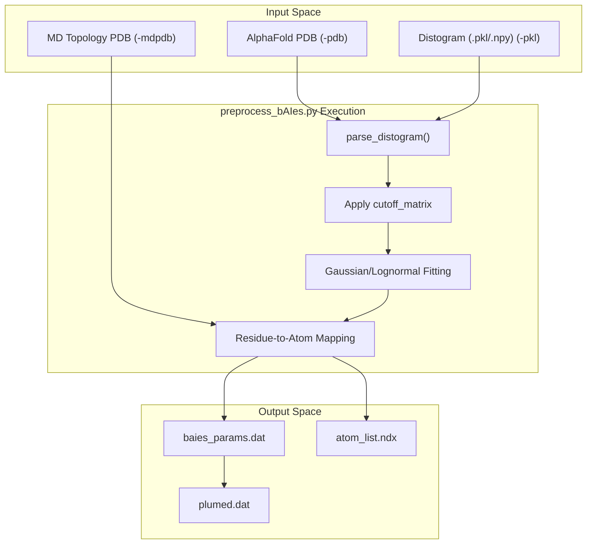
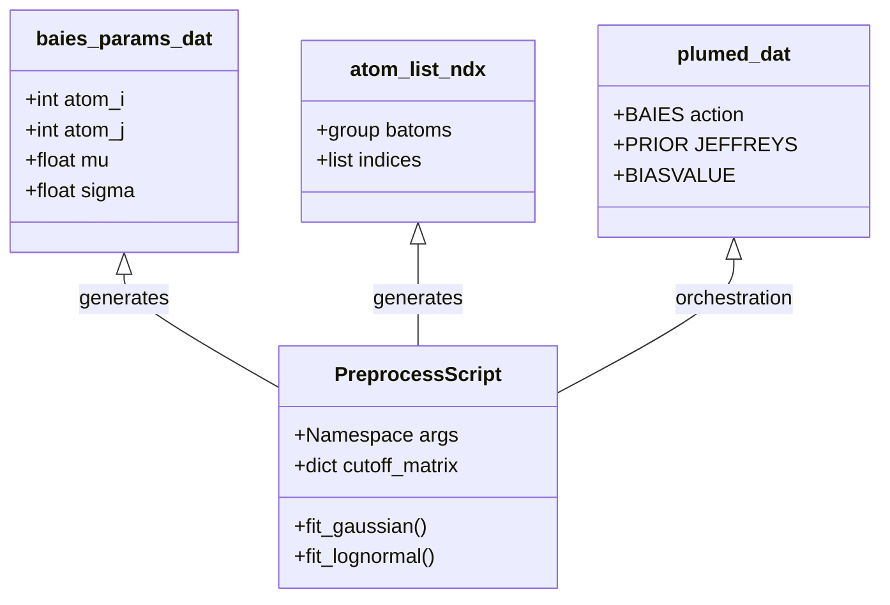

# Stage 2 – Distogram Preprocessing (preprocess_bAIes.py)

> **Relevant source files**
> * [scripts/preprocess_bAIes.py](https://github.com/COSBlab/bAIes-IDP/blob/16faa7f7/scripts/preprocess_bAIes.py)
> * [tutorial/bAIes/1-preparation/relaxed_model_4_ptm_pred_0.pdb](https://github.com/COSBlab/bAIes-IDP/blob/16faa7f7/tutorial/bAIes/1-preparation/relaxed_model_4_ptm_pred_0.pdb)
> * [tutorial/bAIes/1-preparation/step1-prepare_gmx.bash](https://github.com/COSBlab/bAIes-IDP/blob/16faa7f7/tutorial/bAIes/1-preparation/step1-prepare_gmx.bash)
> * [tutorial/bAIes/2-preprocessing/alphafold2_ptm_model_1_seed_000_prob_distributions.npy](https://github.com/COSBlab/bAIes-IDP/blob/16faa7f7/tutorial/bAIes/2-preprocessing/alphafold2_ptm_model_1_seed_000_prob_distributions.npy)
> * [tutorial/bAIes/2-preprocessing/atom_list.ndx](https://github.com/COSBlab/bAIes-IDP/blob/16faa7f7/tutorial/bAIes/2-preprocessing/atom_list.ndx)
> * [tutorial/bAIes/2-preprocessing/baies_params.dat](https://github.com/COSBlab/bAIes-IDP/blob/16faa7f7/tutorial/bAIes/2-preprocessing/baies_params.dat)
> * [tutorial/bAIes/2-preprocessing/idp.pdb](https://github.com/COSBlab/bAIes-IDP/blob/16faa7f7/tutorial/bAIes/2-preprocessing/idp.pdb)
> * [tutorial/bAIes/2-preprocessing/plumed.dat](https://github.com/COSBlab/bAIes-IDP/blob/16faa7f7/tutorial/bAIes/2-preprocessing/plumed.dat)
> * [tutorial/bAIes/2-preprocessing/preprocess_bAIes.py](https://github.com/COSBlab/bAIes-IDP/blob/16faa7f7/tutorial/bAIes/2-preprocessing/preprocess_bAIes.py)
> * [tutorial/bAIes/2-preprocessing/step2-preprocess.bash](https://github.com/COSBlab/bAIes-IDP/blob/16faa7f7/tutorial/bAIes/2-preprocessing/step2-preprocess.bash)

The `preprocess_bAIes.py` script is the bridge between structural bioinformatics and biased molecular dynamics. It processes the probabilistic distance distributions (distograms) generated by AlphaFold-2 or ColabFold and converts them into a format readable by the **BAIES** PLUMED module. This stage is critical for defining which residue pairs will be restrained and how those restraints are mathematically modeled.

## Purpose and Scope

The primary objective of `preprocess_bAIes.py` is to parse high-dimensional distogram data and extract Gaussian or log-normal parameters for residue pairs that are likely to be in contact. It handles:

1. **Distogram Parsing**: Reading `.pkl` (AlphaFold-2) or `.npy` (ColabFold) files.
2. **Fitting**: Converting discrete probability bins into continuous distributions.
3. **Filtering**: Applying sequence separation and distance cutoffs (including residue-specific matrices).
4. **Index Mapping**: Aligning AlphaFold residue indices with the atom indices in the MD simulation topology.

## Technical Implementation and Data Flow

The script operates as a standalone CLI tool that consumes structural data and probability distributions to produce three specific outputs required for Stage 4 simulations.

### Logic Flow Diagram

The following diagram illustrates the transformation of data from raw distograms to PLUMED-ready parameters.

**Data Transformation Pipeline**

**Sources:** `scripts/preprocess_bAIes.py:16-30`(), `tutorial/bAIes/2-preprocessing/step2-preprocess.bash:18-35`()

## Key Components and Functions

### Distogram Fitting Models

The script supports two statistical models for the distance distributions, selected via the `-model` flag:

* **Gaussian**: Fits a standard normal distribution to the distogram bins.
* **Lognormal**: Fits a log-normal distribution, which is often more appropriate for distance constraints as it is bounded by zero.

The fitting is performed using the `lmfit` and `scipy.optimize` libraries [scripts/preprocess_bAIes.py L8-L9](https://github.com/COSBlab/bAIes-IDP/blob/16faa7f7/scripts/preprocess_bAIes.py#L8-L9)

### Residue-Pair Cutoff Matrix

A significant feature of the preprocessing is the `cutoff_matrix` [scripts/preprocess_bAIes.py L34-L183](https://github.com/COSBlab/bAIes-IDP/blob/16faa7f7/scripts/preprocess_bAIes.py#L34-L183)

 Instead of a global distance cutoff (e.g., 8.0 Å), the script can use residue-specific cutoffs derived from the Baker lab. This matrix accounts for the different physical sizes and interaction ranges of amino acid side chains (e.g., GLY-GLY has a much smaller interaction radius than ARG-TRP).

### CLI Arguments

| Argument | Description | Default |
| --- | --- | --- |
| `-pdb` | The original AlphaFold/ColabFold PDB file. | Required |
| `-mdpdb` | The PDB file used for MD (after GROMACS processing). | `same` |
| `-pkl` | The distogram file (`.pkl` or `_prob_distributions.npy`). | Required |
| `-cutoff` | Distance cutoff in Å or `matrix` for residue-specific. | `8.0` |
| `-model` | Statistical model: `gauss` or `lognorm`. | `gauss` |
| `-seqsep` | Minimum residue separation to ignore local contacts. | `3` |

**Sources:** `scripts/preprocess_bAIes.py:16-30`(), `scripts/preprocess_bAIes.py:34-183`()

## Code-to-Entity Mapping

This diagram maps the CLI arguments and script variables to the generated output files.

**Entity Mapping**

**Sources:** `scripts/preprocess_bAIes.py:1-30`(), `tutorial/bAIes/2-preprocessing/baies_params.dat:1-2`(), `tutorial/bAIes/2-preprocessing/atom_list.ndx:1-2`()

## Generated Outputs

### 1. baies_params.dat

This file contains the fitted parameters for every residue pair that passed the cutoff and sequence separation filters.

* **Fields**: `Id`, `atom_i`, `atom_j`, `mu`, `sigma` [tutorial/bAIes/2-preprocessing/baies_params.dat L1](https://github.com/COSBlab/bAIes-IDP/blob/16faa7f7/tutorial/bAIes/2-preprocessing/baies_params.dat#L1-L1)
* **Format**: The `mu` and `sigma` values are typically in nanometers (nm) for PLUMED compatibility [tutorial/bAIes/2-preprocessing/baies_params.dat L3-L100](https://github.com/COSBlab/bAIes-IDP/blob/16faa7f7/tutorial/bAIes/2-preprocessing/baies_params.dat#L3-L100)

### 2. atom_list.ndx

A GROMACS-style index file defining a group named `[ batoms ]` [tutorial/bAIes/2-preprocessing/atom_list.ndx L1](https://github.com/COSBlab/bAIes-IDP/blob/16faa7f7/tutorial/bAIes/2-preprocessing/atom_list.ndx#L1-L1)

 These indices correspond to the CA atoms of the residues selected for biasing. The script ensures these indices match the `mdpdb` provided, which is crucial if the topology generation added or reordered atoms [scripts/preprocess_bAIes.py L19-L27](https://github.com/COSBlab/bAIes-IDP/blob/16faa7f7/scripts/preprocess_bAIes.py#L19-L27)

### 3. plumed.dat

The master control file for the PLUMED plugin. It wires the `BAIES` action to the parameters and indices generated above:

* `batoms`: The group defined in `atom_list.ndx` [tutorial/bAIes/2-preprocessing/plumed.dat L2](https://github.com/COSBlab/bAIes-IDP/blob/16faa7f7/tutorial/bAIes/2-preprocessing/plumed.dat#L2-L2)
* `baies`: The Bayesian bias calculation using `baies_params.dat` and the `JEFFREYS` prior [tutorial/bAIes/2-preprocessing/plumed.dat L3](https://github.com/COSBlab/bAIes-IDP/blob/16faa7f7/tutorial/bAIes/2-preprocessing/plumed.dat#L3-L3)
* `bbias`: The `BIASVALUE` action that applies the energy calculated by BAIES to the MD system [tutorial/bAIes/2-preprocessing/plumed.dat L5](https://github.com/COSBlab/bAIes-IDP/blob/16faa7f7/tutorial/bAIes/2-preprocessing/plumed.dat#L5-L5)

**Sources:** `tutorial/bAIes/2-preprocessing/baies_params.dat:1-100`(), `tutorial/bAIes/2-preprocessing/atom_list.ndx:1-7`(), `tutorial/bAIes/2-preprocessing/plumed.dat:1-6`()