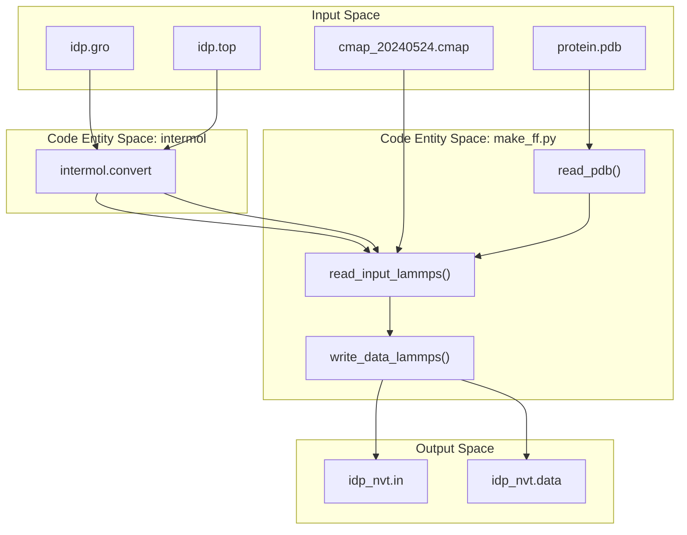
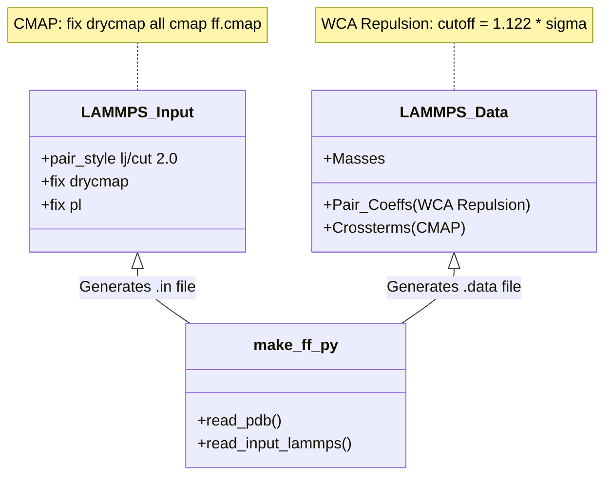

# Stage 3 – GROMACS-to-LAMMPS Conversion (make_ff.py)

> **Relevant source files**
> * [scripts/make_ff.py](https://github.com/COSBlab/bAIes-IDP/blob/16faa7f7/scripts/make_ff.py)
> * [tutorial/bAIes/3-conversion/cmap_20240524.cmap](https://github.com/COSBlab/bAIes-IDP/blob/16faa7f7/tutorial/bAIes/3-conversion/cmap_20240524.cmap)
> * [tutorial/bAIes/3-conversion/idp.gro](https://github.com/COSBlab/bAIes-IDP/blob/16faa7f7/tutorial/bAIes/3-conversion/idp.gro)
> * [tutorial/bAIes/3-conversion/idp.pdb](https://github.com/COSBlab/bAIes-IDP/blob/16faa7f7/tutorial/bAIes/3-conversion/idp.pdb)
> * [tutorial/bAIes/3-conversion/idp.top](https://github.com/COSBlab/bAIes-IDP/blob/16faa7f7/tutorial/bAIes/3-conversion/idp.top)
> * [tutorial/bAIes/3-conversion/idp_nvt.data](https://github.com/COSBlab/bAIes-IDP/blob/16faa7f7/tutorial/bAIes/3-conversion/idp_nvt.data)
> * [tutorial/bAIes/3-conversion/idp_nvt.in](https://github.com/COSBlab/bAIes-IDP/blob/16faa7f7/tutorial/bAIes/3-conversion/idp_nvt.in)
> * [tutorial/bAIes/3-conversion/make_ff.py](https://github.com/COSBlab/bAIes-IDP/blob/16faa7f7/tutorial/bAIes/3-conversion/make_ff.py)
> * [tutorial/bAIes/3-conversion/step3-conversion.bash](https://github.com/COSBlab/bAIes-IDP/blob/16faa7f7/tutorial/bAIes/3-conversion/step3-conversion.bash)
> * [tutorial/coil/1-preparation/relaxed_model_4_ptm_pred_0.pdb](https://github.com/COSBlab/bAIes-IDP/blob/16faa7f7/tutorial/coil/1-preparation/relaxed_model_4_ptm_pred_0.pdb)
> * [tutorial/coil/1-preparation/step1-prepare_gmx.bash](https://github.com/COSBlab/bAIes-IDP/blob/16faa7f7/tutorial/coil/1-preparation/step1-prepare_gmx.bash)
> * [tutorial/coil/2-conversion/cmap_20240524.cmap](https://github.com/COSBlab/bAIes-IDP/blob/16faa7f7/tutorial/coil/2-conversion/cmap_20240524.cmap)
> * [tutorial/coil/2-conversion/idp.gro](https://github.com/COSBlab/bAIes-IDP/blob/16faa7f7/tutorial/coil/2-conversion/idp.gro)
> * [tutorial/coil/2-conversion/idp.pdb](https://github.com/COSBlab/bAIes-IDP/blob/16faa7f7/tutorial/coil/2-conversion/idp.pdb)
> * [tutorial/coil/2-conversion/idp.top](https://github.com/COSBlab/bAIes-IDP/blob/16faa7f7/tutorial/coil/2-conversion/idp.top)
> * [tutorial/coil/2-conversion/idp_nvt.data](https://github.com/COSBlab/bAIes-IDP/blob/16faa7f7/tutorial/coil/2-conversion/idp_nvt.data)
> * [tutorial/coil/2-conversion/make_ff.py](https://github.com/COSBlab/bAIes-IDP/blob/16faa7f7/tutorial/coil/2-conversion/make_ff.py)
> * [tutorial/coil/2-conversion/step2-conversion.bash](https://github.com/COSBlab/bAIes-IDP/blob/16faa7f7/tutorial/coil/2-conversion/step2-conversion.bash)

This stage facilitates the transition from GROMACS topology files to LAMMPS input and data files. It employs `InterMol` for initial format translation and a specialized script, `make_ff.py`, to apply force field modifications necessary for the Random Coil model and integrate CMAP backbone corrections.

### Conversion Pipeline Overview

The conversion process is orchestrated by `step3-conversion.bash` (in bAIes mode) or `step2-conversion.bash` (in Coil mode). The pipeline consists of two primary steps:

1. **InterMol Translation**: Converts GROMACS `.gro` and `.top` files into raw LAMMPS input and data formats [tutorial/bAIes/3-conversion/step3-conversion.bash L18](https://github.com/COSBlab/bAIes-IDP/blob/16faa7f7/tutorial/bAIes/3-conversion/step3-conversion.bash#L18-L18)
2. **Force Field Modification**: Executes `make_ff.py` to rewrite the LAMMPS files, applying the specific physics required for bAIes-IDP simulations [tutorial/bAIes/3-conversion/step3-conversion.bash L22-L29](https://github.com/COSBlab/bAIes-IDP/blob/16faa7f7/tutorial/bAIes/3-conversion/step3-conversion.bash#L22-L29)

### Data Flow Diagram

The following diagram illustrates the transformation of files and the internal logic of the conversion pipeline.

**File Transformation Logic**



**Sources:** [tutorial/bAIes/3-conversion/step3-conversion.bash L1-L32](https://github.com/COSBlab/bAIes-IDP/blob/16faa7f7/tutorial/bAIes/3-conversion/step3-conversion.bash#L1-L32)

 [scripts/make_ff.py L8-L19](https://github.com/COSBlab/bAIes-IDP/blob/16faa7f7/scripts/make_ff.py#L8-L19)

 [scripts/make_ff.py L22-L81](https://github.com/COSBlab/bAIes-IDP/blob/16faa7f7/scripts/make_ff.py#L22-L81)

---

### Implementation Details: make_ff.py

The `make_ff.py` script is the core logic engine for adapting the force field. It performs several critical technical tasks:

#### 1. Simulation Box Definition

The script sets the simulation box dimensions using the `-cube` argument (defaulting to 400.0 Å, though tutorials use 200.0 Å) [scripts/make_ff.py L16](https://github.com/COSBlab/bAIes-IDP/blob/16faa7f7/scripts/make_ff.py#L16-L16)

 It centers the protein by calculating the center of mass from the PDB and setting the box boundaries (e.g., `-100` to `100` for a 200 Å box) [tutorial/bAIes/3-conversion/idp_nvt.data L15-L17](https://github.com/COSBlab/bAIes-IDP/blob/16faa7f7/tutorial/bAIes/3-conversion/idp_nvt.data#L15-L17)

#### 2. CMAP Integration

`make_ff.py` parses the PDB file via `read_pdb()` to identify residue sequences and map atom indices (C, N, CA) required for CMAP crossterms [scripts/make_ff.py L22-L81](https://github.com/COSBlab/bAIes-IDP/blob/16faa7f7/scripts/make_ff.py#L22-L81)

* It generates the `crossterms` section in the LAMMPS data file [tutorial/bAIes/3-conversion/idp_nvt.data L7](https://github.com/COSBlab/bAIes-IDP/blob/16faa7f7/tutorial/bAIes/3-conversion/idp_nvt.data#L7-L7)
* It injects the `fix drycmap` command into the LAMMPS input file, which references the residue-specific dihedral correction maps [scripts/make_ff.py L118-L120](https://github.com/COSBlab/bAIes-IDP/blob/16faa7f7/scripts/make_ff.py#L118-L120)

#### 3. Random Coil Force Field Modification

The script modifies the standard `amber99SB-ILDN` parameters to approximate a Random Coil ensemble:

* **Pair Style**: Changes the pair style to `lj/cut 2.0` [scripts/make_ff.py L115](https://github.com/COSBlab/bAIes-IDP/blob/16faa7f7/scripts/make_ff.py#L115-L115)
* **Non-bonded Interactions**: It rewrites `pair_coeff` entries. For every atom pair, it sets the Lennard-Jones epsilon ($\epsilon$) and sigma ($\sigma$) based on the original Amber parameters, but crucially sets the cutoff to $2^{1/6}\sigma$ [scripts/make_ff.py L102-L152](https://github.com/COSBlab/bAIes-IDP/blob/16faa7f7/scripts/make_ff.py#L102-L152)  This effectively turns the Lennard-Jones potential into a purely repulsive Weeks-Chandler-Andersen (WCA) potential, preventing unphysical attractions and facilitating the "expanded" nature of IDPs.
* **Mixing Rules**: It implements arithmetic mixing for cross-interactions [scripts/make_ff.py L139-L142](https://github.com/COSBlab/bAIes-IDP/blob/16faa7f7/scripts/make_ff.py#L139-L142)

#### 4. PLUMED Integration

If the `-plumed` flag is provided, the script appends the `fix pl` command to the output LAMMPS input file, enabling the Bayesian biasing module during the simulation [scripts/make_ff.py L18](https://github.com/COSBlab/bAIes-IDP/blob/16faa7f7/scripts/make_ff.py#L18-L18)

**Sources:** [scripts/make_ff.py L102-L152](https://github.com/COSBlab/bAIes-IDP/blob/16faa7f7/scripts/make_ff.py#L102-L152)

 [tutorial/bAIes/3-conversion/step3-conversion.bash L22-L29](https://github.com/COSBlab/bAIes-IDP/blob/16faa7f7/tutorial/bAIes/3-conversion/step3-conversion.bash#L22-L29)

 [tutorial/bAIes/3-conversion/idp_nvt.in L12-L16](https://github.com/COSBlab/bAIes-IDP/blob/16faa7f7/tutorial/bAIes/3-conversion/idp_nvt.in#L12-L16)

---

### Key Functions and Arguments

| Function / Entity | Role | Source |
| --- | --- | --- |
| `build_parser()` | Defines CLI arguments: `-i` (input), `-top` (topology), `-pdb`, `-cmap`, `-cube`. | [scripts/make_ff.py L8-L19](https://github.com/COSBlab/bAIes-IDP/blob/16faa7f7/scripts/make_ff.py#L8-L19) |
| `read_pdb()` | Extracts atom types and residue indices to build the CMAP atom mapping. | [scripts/make_ff.py L22-L81](https://github.com/COSBlab/bAIes-IDP/blob/16faa7f7/scripts/make_ff.py#L22-L81) |
| `read_input_lammps()` | The main loop that parses InterMol output and applies WCA repulsive cutoffs. | [scripts/make_ff.py L102-L152](https://github.com/COSBlab/bAIes-IDP/blob/16faa7f7/scripts/make_ff.py#L102-L152) |
| `write_data_lammps()` | Writes the final `.data` file including `Masses`, `Pair Coeffs`, and `Crossterms`. | [scripts/make_ff.py L155-L200](https://github.com/COSBlab/bAIes-IDP/blob/16faa7f7/scripts/make_ff.py#L155-L200) |

### Execution Workflow

The conversion is typically executed as follows:

```markdown
# 1. Convert formatspython -m intermol.convert --gro_in idp.gro idp.top --lammps # 2. Apply IDP-specific modifications./make_ff.py -i idp_converted.input \             -top idp_converted.lmp \             -pdb protein.pdb \             -cmap cmap_20240524.cmap \             -oin idp_nvt.in \             -otop idp_nvt.data \             -cube 200.0 \             -plumed plumed.dat
```

**Sources:** [tutorial/bAIes/3-conversion/step3-conversion.bash L18-L29](https://github.com/COSBlab/bAIes-IDP/blob/16faa7f7/tutorial/bAIes/3-conversion/step3-conversion.bash#L18-L29)

 [tutorial/coil/2-conversion/step2-conversion.bash L18-L28](https://github.com/COSBlab/bAIes-IDP/blob/16faa7f7/tutorial/coil/2-conversion/step2-conversion.bash#L18-L28)

---

### Code-to-System Mapping

The following diagram maps internal Python function logic to the resulting LAMMPS simulation components.

**Logic to LAMMPS Mapping**



**Sources:** [scripts/make_ff.py L102-L152](https://github.com/COSBlab/bAIes-IDP/blob/16faa7f7/scripts/make_ff.py#L102-L152)

 [tutorial/bAIes/3-conversion/idp_nvt.in L12-L16](https://github.com/COSBlab/bAIes-IDP/blob/16faa7f7/tutorial/bAIes/3-conversion/idp_nvt.in#L12-L16)

 [tutorial/bAIes/3-conversion/idp_nvt.data L20-L80](https://github.com/COSBlab/bAIes-IDP/blob/16faa7f7/tutorial/bAIes/3-conversion/idp_nvt.data#L20-L80)