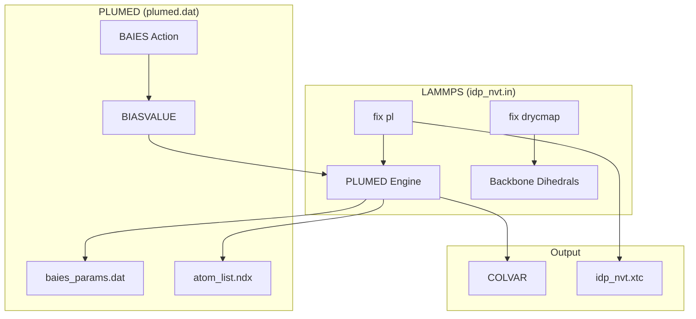
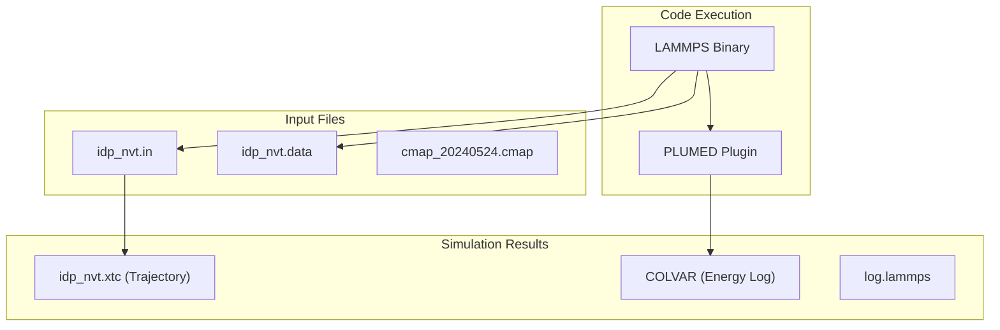

# Stage 4 – LAMMPS/PLUMED Simulation

> **Relevant source files**
> * [tutorial/bAIes/4-simulation/atom_list.ndx](https://github.com/COSBlab/bAIes-IDP/blob/16faa7f7/tutorial/bAIes/4-simulation/atom_list.ndx)
> * [tutorial/bAIes/4-simulation/baies_params.dat](https://github.com/COSBlab/bAIes-IDP/blob/16faa7f7/tutorial/bAIes/4-simulation/baies_params.dat)
> * [tutorial/bAIes/4-simulation/cmap_20240524.cmap](https://github.com/COSBlab/bAIes-IDP/blob/16faa7f7/tutorial/bAIes/4-simulation/cmap_20240524.cmap)
> * [tutorial/bAIes/4-simulation/idp.pdb](https://github.com/COSBlab/bAIes-IDP/blob/16faa7f7/tutorial/bAIes/4-simulation/idp.pdb)
> * [tutorial/bAIes/4-simulation/idp_nvt.data](https://github.com/COSBlab/bAIes-IDP/blob/16faa7f7/tutorial/bAIes/4-simulation/idp_nvt.data)
> * [tutorial/bAIes/4-simulation/idp_nvt.in](https://github.com/COSBlab/bAIes-IDP/blob/16faa7f7/tutorial/bAIes/4-simulation/idp_nvt.in)
> * [tutorial/bAIes/4-simulation/plumed.dat](https://github.com/COSBlab/bAIes-IDP/blob/16faa7f7/tutorial/bAIes/4-simulation/plumed.dat)
> * [tutorial/coil/3-simulation/cmap_20240524.cmap](https://github.com/COSBlab/bAIes-IDP/blob/16faa7f7/tutorial/coil/3-simulation/cmap_20240524.cmap)
> * [tutorial/coil/3-simulation/idp_nvt.data](https://github.com/COSBlab/bAIes-IDP/blob/16faa7f7/tutorial/coil/3-simulation/idp_nvt.data)
> * [tutorial/coil/3-simulation/idp_nvt.in](https://github.com/COSBlab/bAIes-IDP/blob/16faa7f7/tutorial/coil/3-simulation/idp_nvt.in)

This stage represents the production phase of the bAIes-IDP workflow, where the prepared topology and Bayesian restraints are integrated into a high-performance Molecular Dynamics (MD) simulation. The simulation utilizes **LAMMPS** as the primary engine, augmented by **PLUMED** for applying the Bayesian bias and a custom **CMAP** fix for backbone corrections.

### 4.1 Production Script Structure (idp_nvt.in)

The `idp_nvt.in` file is the master control script for the LAMMPS simulation. It defines the force field styles, ensemble parameters, and external plugin integrations.

#### Force Field and Ensemble Setup

The simulation uses a 1 fs timestep and operates in the NVT ensemble (constant Number of particles, Volume, and Temperature).

* **Units and Styles**: The simulation uses `units real` and `atom_style full` to support complex biomolecular topologies [tutorial/bAIes/4-simulation/idp_nvt.in L1-L2](https://github.com/COSBlab/bAIes-IDP/blob/16faa7f7/tutorial/bAIes/4-simulation/idp_nvt.in#L1-L2)
* **Force Field Components**: Bond, angle, and dihedral styles are defined as `hybrid` to accommodate the specific needs of the Amber99SB-ILDN force field and CMAP corrections [tutorial/bAIes/4-simulation/idp_nvt.in L7-L9](https://github.com/COSBlab/bAIes-IDP/blob/16faa7f7/tutorial/bAIes/4-simulation/idp_nvt.in#L7-L9)
* **Thermostat**: A Canonical Sampling through Velocity Rescaling (**CSVR**) thermostat is employed via `fix temp/csvr` to maintain the target temperature (typically 300K) [tutorial/bAIes/4-simulation/idp_nvt.in L389](https://github.com/COSBlab/bAIes-IDP/blob/16faa7f7/tutorial/bAIes/4-simulation/idp_nvt.in#L389-L389)

#### Data Flow and Initialization

The simulation begins by loading the topology generated in Stage 3 and applying the CMAP correction.

| Action | Code Entity | Purpose |
| --- | --- | --- |
| **Load Map** | `fix drycmap` | Initializes the backbone correction using `cmap_20240524.cmap` [tutorial/bAIes/4-simulation/idp_nvt.in L14](https://github.com/COSBlab/bAIes-IDP/blob/16faa7f7/tutorial/bAIes/4-simulation/idp_nvt.in#L14-L14) |
| **Read Data** | `read_data` | Imports the atomistic coordinates and force field coefficients from `idp_nvt.data` [tutorial/bAIes/4-simulation/idp_nvt.in L15](https://github.com/COSBlab/bAIes-IDP/blob/16faa7f7/tutorial/bAIes/4-simulation/idp_nvt.in#L15-L15) |
| **Integrate** | `fix pl` | Hooks the PLUMED engine into the LAMMPS force loop [tutorial/bAIes/4-simulation/idp_nvt.in L389](https://github.com/COSBlab/bAIes-IDP/blob/16faa7f7/tutorial/bAIes/4-simulation/idp_nvt.in#L389-L389) |

**Sources:**

* [tutorial/bAIes/4-simulation/idp_nvt.in L1-L17](https://github.com/COSBlab/bAIes-IDP/blob/16faa7f7/tutorial/bAIes/4-simulation/idp_nvt.in#L1-L17)
* [tutorial/bAIes/4-simulation/idp_nvt.in L389](https://github.com/COSBlab/bAIes-IDP/blob/16faa7f7/tutorial/bAIes/4-simulation/idp_nvt.in#L389-L389)

---

### 4.2 PLUMED Integration and Bayesian Biasing

The Bayesian bias is applied through the `fix pl` command in LAMMPS, which references a `plumed.dat` configuration file. This file bridges the AlphaFold-derived distograms with the physical MD trajectory.

**Simulation Control Logic**

**Sources:**

* [tutorial/bAIes/4-simulation/plumed.dat L1-L5](https://github.com/COSBlab/bAIes-IDP/blob/16faa7f7/tutorial/bAIes/4-simulation/plumed.dat#L1-L5)
* [tutorial/bAIes/4-simulation/idp_nvt.in L389](https://github.com/COSBlab/bAIes-IDP/blob/16faa7f7/tutorial/bAIes/4-simulation/idp_nvt.in#L389-L389)

#### Key PLUMED Actions

1. **GROUP**: Defines the specific atoms (typically $C_\beta$ or $C_\alpha$) involved in the Bayesian restraints using indices from `atom_list.ndx` [tutorial/bAIes/4-simulation/plumed.dat L2](https://github.com/COSBlab/bAIes-IDP/blob/16faa7f7/tutorial/bAIes/4-simulation/plumed.dat#L2-L2)
2. **BAIES**: The core custom action that calculates the Bayesian energy contribution based on the Gaussian parameters ($\mu, \sigma$) provided in `baies_params.dat` [tutorial/bAIes/4-simulation/plumed.dat L3](https://github.com/COSBlab/bAIes-IDP/blob/16faa7f7/tutorial/bAIes/4-simulation/plumed.dat#L3-L3)
3. **BIASVALUE**: Takes the calculated energy from the `BAIES` action and adds it to the system Hamiltonian, effectively steering the simulation toward the AlphaFold-predicted ensemble [tutorial/bAIes/4-simulation/plumed.dat L5](https://github.com/COSBlab/bAIes-IDP/blob/16faa7f7/tutorial/bAIes/4-simulation/plumed.dat#L5-L5)

**Sources:**

* [tutorial/bAIes/4-simulation/plumed.dat L1-L5](https://github.com/COSBlab/bAIes-IDP/blob/16faa7f7/tutorial/bAIes/4-simulation/plumed.dat#L1-L5)
* [tutorial/bAIes/4-simulation/baies_params.dat L1-L10](https://github.com/COSBlab/bAIes-IDP/blob/16faa7f7/tutorial/bAIes/4-simulation/baies_params.dat#L1-L10)

---

### 4.3 Backbone Correction (fix drycmap)

Because the simulation uses a "Dry" (implicit solvent) representation, a specific backbone correction is required to maintain secondary structure propensities.

* **Implementation**: The `fix drycmap` command in LAMMPS applies a 2D grid-based energy correction to $\phi$ and $\psi$ dihedral angles [tutorial/bAIes/4-simulation/idp_nvt.in L14](https://github.com/COSBlab/bAIes-IDP/blob/16faa7f7/tutorial/bAIes/4-simulation/idp_nvt.in#L14-L14)
* **Map Data**: The correction values are read from `cmap_20240524.cmap`, which contains residue-specific energy grids for all 20 standard amino acids (e.g., `ARG-(XXX)` type 1, `ARG-(PRO)` type 2) [tutorial/bAIes/4-simulation/cmap_20240524.cmap L3-L173](https://github.com/COSBlab/bAIes-IDP/blob/16faa7f7/tutorial/bAIes/4-simulation/cmap_20240524.cmap#L3-L173)
* **CMAPMAX**: The codebase requires a LAMMPS patch that increases the maximum number of CMAP terms per atom (from 6 to 40) to accommodate the dense connectivity of large IDPs.

**Sources:**

* [tutorial/bAIes/4-simulation/idp_nvt.in L14-L16](https://github.com/COSBlab/bAIes-IDP/blob/16faa7f7/tutorial/bAIes/4-simulation/idp_nvt.in#L14-L16)
* [tutorial/bAIes/4-simulation/cmap_20240524.cmap L1-L173](https://github.com/COSBlab/bAIes-IDP/blob/16faa7f7/tutorial/bAIes/4-simulation/cmap_20240524.cmap#L1-L173)

---

### 4.4 Simulation Execution and Outputs

The production run is designed for long-timescale sampling, typically involving 2 billion steps (2 $\mu s$ at a 1 fs timestep) [tutorial/bAIes/4-simulation/idp_nvt.in L389](https://github.com/COSBlab/bAIes-IDP/blob/16faa7f7/tutorial/bAIes/4-simulation/idp_nvt.in#L389-L389)

**Entity Association Diagram**

#### Output Specifications

* **Trajectory**: Saved in GROMACS-compatible `.xtc` format every 50,000 steps via the `dump` command [tutorial/bAIes/4-simulation/idp_nvt.in L389](https://github.com/COSBlab/bAIes-IDP/blob/16faa7f7/tutorial/bAIes/4-simulation/idp_nvt.in#L389-L389)
* **COLVAR**: A text file containing the instantaneous Bayesian energy (`baies.ene`) recorded every 500 steps [tutorial/bAIes/4-simulation/plumed.dat L4](https://github.com/COSBlab/bAIes-IDP/blob/16faa7f7/tutorial/bAIes/4-simulation/plumed.dat#L4-L4)
* **Log File**: Standard LAMMPS output (`log.lammps`) containing thermodynamic information (temperature, pressure, energy) [tutorial/bAIes/4-simulation/idp_nvt.in L389](https://github.com/COSBlab/bAIes-IDP/blob/16faa7f7/tutorial/bAIes/4-simulation/idp_nvt.in#L389-L389)

**Sources:**

* [tutorial/bAIes/4-simulation/idp_nvt.in L389](https://github.com/COSBlab/bAIes-IDP/blob/16faa7f7/tutorial/bAIes/4-simulation/idp_nvt.in#L389-L389)
* [tutorial/bAIes/4-simulation/plumed.dat L4](https://github.com/COSBlab/bAIes-IDP/blob/16faa7f7/tutorial/bAIes/4-simulation/plumed.dat#L4-L4)