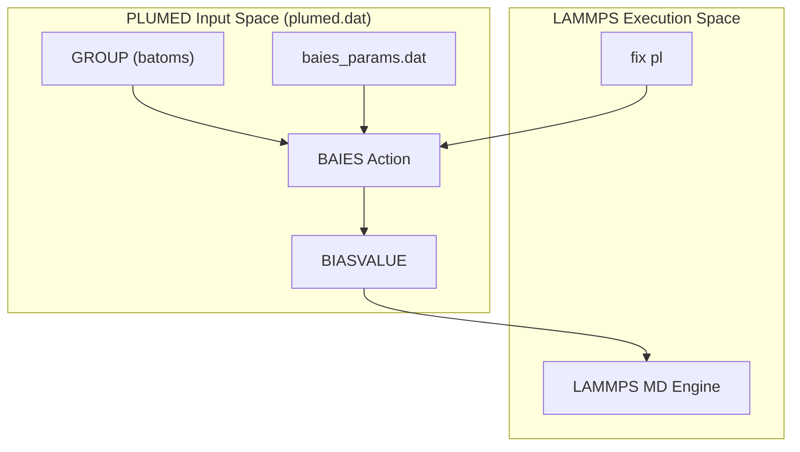
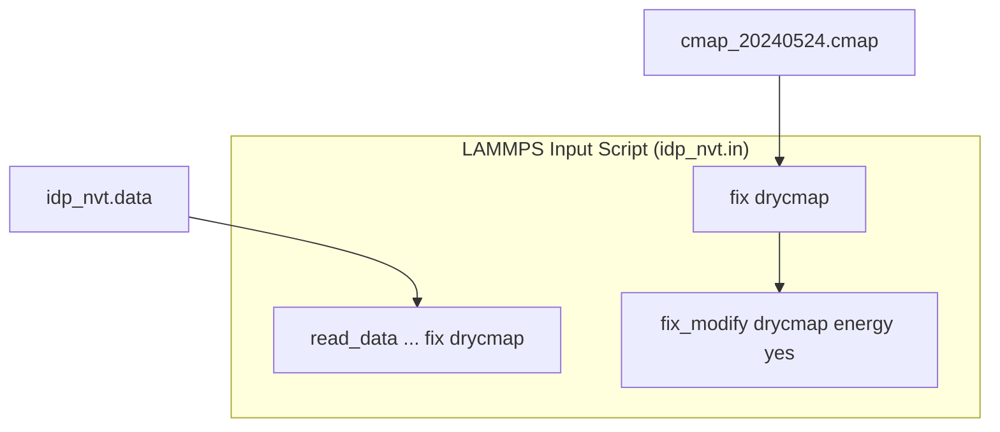

# The BAIES Bayesian Bias Module

> **Relevant source files**
> * [benchmark/bAIes/Ab40/Ab40.pdb](https://github.com/COSBlab/bAIes-IDP/blob/16faa7f7/benchmark/bAIes/Ab40/Ab40.pdb)
> * [benchmark/bAIes/Ab40/Ab40_nvt.data](https://github.com/COSBlab/bAIes-IDP/blob/16faa7f7/benchmark/bAIes/Ab40/Ab40_nvt.data)
> * [benchmark/bAIes/Ab40/Ab40_nvt.in](https://github.com/COSBlab/bAIes-IDP/blob/16faa7f7/benchmark/bAIes/Ab40/Ab40_nvt.in)
> * [benchmark/bAIes/Ab40/atom_list_matrix.ndx](https://github.com/COSBlab/bAIes-IDP/blob/16faa7f7/benchmark/bAIes/Ab40/atom_list_matrix.ndx)
> * [benchmark/bAIes/Ab40/baies_gauss_matrix.dat](https://github.com/COSBlab/bAIes-IDP/blob/16faa7f7/benchmark/bAIes/Ab40/baies_gauss_matrix.dat)
> * [benchmark/bAIes/Ab40/dry_ff_20240524_correct.cmap](https://github.com/COSBlab/bAIes-IDP/blob/16faa7f7/benchmark/bAIes/Ab40/dry_ff_20240524_correct.cmap)
> * [benchmark/bAIes/Ab40/plumed_Ab40.dat](https://github.com/COSBlab/bAIes-IDP/blob/16faa7f7/benchmark/bAIes/Ab40/plumed_Ab40.dat)
> * [tutorial/bAIes/4-simulation/atom_list.ndx](https://github.com/COSBlab/bAIes-IDP/blob/16faa7f7/tutorial/bAIes/4-simulation/atom_list.ndx)
> * [tutorial/bAIes/4-simulation/baies_params.dat](https://github.com/COSBlab/bAIes-IDP/blob/16faa7f7/tutorial/bAIes/4-simulation/baies_params.dat)
> * [tutorial/bAIes/4-simulation/cmap_20240524.cmap](https://github.com/COSBlab/bAIes-IDP/blob/16faa7f7/tutorial/bAIes/4-simulation/cmap_20240524.cmap)
> * [tutorial/bAIes/4-simulation/idp.pdb](https://github.com/COSBlab/bAIes-IDP/blob/16faa7f7/tutorial/bAIes/4-simulation/idp.pdb)
> * [tutorial/bAIes/4-simulation/idp_nvt.data](https://github.com/COSBlab/bAIes-IDP/blob/16faa7f7/tutorial/bAIes/4-simulation/idp_nvt.data)
> * [tutorial/bAIes/4-simulation/idp_nvt.in](https://github.com/COSBlab/bAIes-IDP/blob/16faa7f7/tutorial/bAIes/4-simulation/idp_nvt.in)
> * [tutorial/bAIes/4-simulation/plumed.dat](https://github.com/COSBlab/bAIes-IDP/blob/16faa7f7/tutorial/bAIes/4-simulation/plumed.dat)

The BAIES module is a custom PLUMED action that implements a Bayesian inference framework to bias molecular dynamics simulations toward structural ensembles predicted by AlphaFold-2 (AF2). It functions by calculating a bias energy based on the agreement between simulated inter-atomic distances and the probabilistic distributions derived from AF2 distograms.

## Bayesian Inference Framework

The module operates on the "Predict-Restrain-Sample" philosophy. It uses a Bayesian approach to integrate the prior knowledge from AF2 (in the form of distance distributions) into the physical force field. The bias is typically applied using a **Jeffreys prior** to account for the uncertainty in the AF2 predictions, though a version without this prior (bAIes-N) is also supported for benchmarking.

### Bias Energy Calculation

The `BAIES` action in PLUMED calculates a bias energy, `baies.ene`, which is then fed into the `BIASVALUE` action to modify the system's potential energy surface during the simulation [benchmark/bAIes/Ab40/plumed_Ab40.dat L3-L5](https://github.com/COSBlab/bAIes-IDP/blob/16faa7f7/benchmark/bAIes/Ab40/plumed_Ab40.dat#L3-L5)

The core model assumes a Gaussian distance distribution between specific atom pairs defined in the parameter files.

### Code-to-Entity Mapping: BAIES PLUMED Wiring

**Sources:**

* [benchmark/bAIes/Ab40/plumed_Ab40.dat L2-L5](https://github.com/COSBlab/bAIes-IDP/blob/16faa7f7/benchmark/bAIes/Ab40/plumed_Ab40.dat#L2-L5)
* [tutorial/bAIes/4-simulation/plumed.dat L2-L5](https://github.com/COSBlab/bAIes-IDP/blob/16faa7f7/tutorial/bAIes/4-simulation/plumed.dat#L2-L5)

## Parameter Files and Atom Groups

The BAIES module requires two primary inputs to define which atoms are biased and what the target distributions are:

1. **Atom List (`atom_list.ndx`)**: A GROMACS-style index file defining a group named `batoms`. These indices correspond to the atoms involved in the distance restraints [tutorial/bAIes/4-simulation/atom_list.ndx L1-L6](https://github.com/COSBlab/bAIes-IDP/blob/16faa7f7/tutorial/bAIes/4-simulation/atom_list.ndx#L1-L6)
2. **Parameter Data (`baies_params.dat` / `baies_gauss_matrix.dat`)**: A formatted file containing the Gaussian parameters ($\mu$ and $\sigma$) for each atom pair [benchmark/bAIes/Ab40/baies_gauss_matrix.dat L1-L15](https://github.com/COSBlab/bAIes-IDP/blob/16faa7f7/benchmark/bAIes/Ab40/baies_gauss_matrix.dat#L1-L15)

For a detailed reference on file formats and the difference between Jeffreys and None priors, see **[BAIES Parameter Files](/COSBlab/bAIes-IDP/3.1-baies-parameter-files)**.

**Sources:**

* [tutorial/bAIes/4-simulation/baies_params.dat L1-L15](https://github.com/COSBlab/bAIes-IDP/blob/16faa7f7/tutorial/bAIes/4-simulation/baies_params.dat#L1-L15)
* [benchmark/bAIes/Ab40/baies_gauss_matrix.dat L1-L2](https://github.com/COSBlab/bAIes-IDP/blob/16faa7f7/benchmark/bAIes/Ab40/baies_gauss_matrix.dat#L1-L2)

## CMAP Backbone Correction

To accurately simulate Intrinsically Disordered Proteins (IDPs), the BAIES framework utilizes a specific backbone dihedral correction (CMAP). This is implemented as a custom LAMMPS fix (`fix drycmap`) which reads residue-type-specific $\phi/\psi$ grids to correct the underlying force field biases.

### CMAP Integration in LAMMPS

For details on the grid format and the `CMAPMAX` patch for high-atom-count proteins, see **[CMAP Backbone Correction (fix drycmap)](/COSBlab/bAIes-IDP/3.2-cmap-backbone-correction-(fix-drycmap))**.

**Sources:**

* [tutorial/bAIes/4-simulation/idp_nvt.in L14-L16](https://github.com/COSBlab/bAIes-IDP/blob/16faa7f7/tutorial/bAIes/4-simulation/idp_nvt.in#L14-L16)
* [benchmark/bAIes/Ab40/dry_ff_20240524_correct.cmap L1-L10](https://github.com/COSBlab/bAIes-IDP/blob/16faa7f7/benchmark/bAIes/Ab40/dry_ff_20240524_correct.cmap#L1-L10)

## PLUMED Configuration

The `plumed.dat` file serves as the orchestrator for the BAIES module. It defines the temperature (typically in units consistent with the energy output), the source of the parameters, and the frequency of bias application.

Key parameters in the `BAIES` action include:

* `ARG`: The energy variable (`baies.ene`) communicated to the MD engine.
* `PRIOR`: Set to `JEFFREYS` for standard bAIes or `NONE` for bAIes-N.
* `TEMP`: The simulation temperature in internal PLUMED units [benchmark/bAIes/Ab40/plumed_Ab40.dat L3](https://github.com/COSBlab/bAIes-IDP/blob/16faa7f7/benchmark/bAIes/Ab40/plumed_Ab40.dat#L3-L3)

For syntax examples and wiring instructions, see **[PLUMED Configuration Files](/COSBlab/bAIes-IDP/3.3-plumed-configuration-files)**.

**Sources:**

* [benchmark/bAIes/Ab40/plumed_Ab40.dat L1-L5](https://github.com/COSBlab/bAIes-IDP/blob/16faa7f7/benchmark/bAIes/Ab40/plumed_Ab40.dat#L1-L5)
* [tutorial/bAIes/4-simulation/plumed.dat L1-L5](https://github.com/COSBlab/bAIes-IDP/blob/16faa7f7/tutorial/bAIes/4-simulation/plumed.dat#L1-L5)