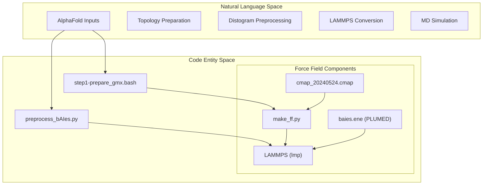
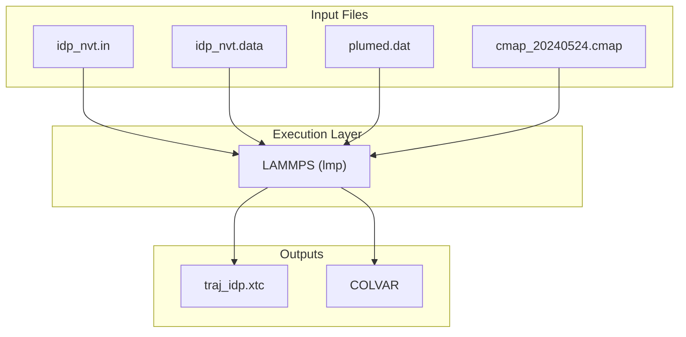

# Tutorials

> **Relevant source files**
> * [tutorial/bAIes/README.md](https://github.com/COSBlab/bAIes-IDP/blob/16faa7f7/tutorial/bAIes/README.md?plain=1)
> * [tutorial/bAIes/baies_ill.png](https://github.com/COSBlab/bAIes-IDP/blob/16faa7f7/tutorial/bAIes/baies_ill.png)
> * [tutorial/coil/README.md](https://github.com/COSBlab/bAIes-IDP/blob/16faa7f7/tutorial/coil/README.md?plain=1)
> * [tutorial/coil/coil.png](https://github.com/COSBlab/bAIes-IDP/blob/16faa7f7/tutorial/coil/coil.png)

This section provides a high-level overview of the hands-on workflows for simulating Intrinsically Disordered Proteins (IDPs) using the bAIes-IDP framework. The repository includes two primary tutorial paths designed to guide users through the process of generating protein ensembles: one biased by AlphaFold-2 (AF2) data and one representing a random coil reference.

Both tutorials share a common modular structure where each stage of the pipeline is executed in a dedicated subdirectory, ensuring a clean separation of data preparation, force field conversion, and production simulation.

### Workflow Comparison

| Feature | bAIes Tutorial | Coil Tutorial |
| --- | --- | --- |
| **Primary Goal** | AF2-Biased Ensemble Generation | Random Coil Reference Ensemble |
| **Input Data** | AF2/ColabFold PDB + Distograms | AF2/ColabFold PDB only |
| **Key Script** | `preprocess_bAIes.py` | N/A (Skips preprocessing) |
| **Bias Type** | Bayesian (JEFFREYS prior) | Unbiased (Standard IDP FF) |
| **Example Protein** | PaaA2 | PaaA2 |

---

### Shared Pipeline Architecture

The tutorials utilize a standardized sequence of bash scripts located in the `scripts/` directory to orchestrate the transition from structural predictions to MD simulations.

#### System Orchestration Diagram

The following diagram illustrates how the tutorial steps map to the underlying code entities and data flow.

**bAIes System Data Flow**

**Sources:** [tutorial/bAIes/README.md L7-L121](https://github.com/COSBlab/bAIes-IDP/blob/16faa7f7/tutorial/bAIes/README.md?plain=1#L7-L121)

 [tutorial/coil/README.md L7-L55](https://github.com/COSBlab/bAIes-IDP/blob/16faa7f7/tutorial/coil/README.md?plain=1#L7-L55)

---

### 4.1 bAIes Tutorial (AF2-Biased Ensemble)

The bAIes tutorial demonstrates the full "Predict-Restrain-Sample" philosophy. It uses distance distributions (distograms) from AlphaFold-2 or ColabFold to generate a Bayesian bias that restrains the MD simulation toward the predicted structural ensemble.

**Key Stages:**

1. **Inputs**: Obtaining `.pkl` (AF2) or `.npy` (ColabFold) distograms and the relaxed PDB model [tutorial/bAIes/README.md L10-L35](https://github.com/COSBlab/bAIes-IDP/blob/16faa7f7/tutorial/bAIes/README.md?plain=1#L10-L35)
2. **Preparation**: Using `step1-prepare_gmx.bash` to generate Amber99SB-ILDN topologies in GROMACS format [tutorial/bAIes/README.md L36-L51](https://github.com/COSBlab/bAIes-IDP/blob/16faa7f7/tutorial/bAIes/README.md?plain=1#L36-L51)
3. **Preprocessing**: Running `preprocess_bAIes.py` (via `step2-preprocess.bash`) to fit Gaussian models to the distograms and create `plumed.dat` and `baies_params.dat` [tutorial/bAIes/README.md L52-L91](https://github.com/COSBlab/bAIes-IDP/blob/16faa7f7/tutorial/bAIes/README.md?plain=1#L52-L91)
4. **Conversion**: Using `make_ff.py` (via `step3-conversion.bash`) to translate GROMACS files to LAMMPS and apply the IDP-specific force field modifications [tutorial/bAIes/README.md L92-L120](https://github.com/COSBlab/bAIes-IDP/blob/16faa7f7/tutorial/bAIes/README.md?plain=1#L92-L120)
5. **Simulation**: Executing the production run in LAMMPS with the `fix pl` (PLUMED) and `fix drycmap` (CMAP) modules [tutorial/bAIes/README.md L121-L146](https://github.com/COSBlab/bAIes-IDP/blob/16faa7f7/tutorial/bAIes/README.md?plain=1#L121-L146)

For a detailed step-by-step walkthrough, see the **[bAIes Tutorial (AF2-Biased Ensemble)](/COSBlab/bAIes-IDP/4.1-baies-tutorial-(af2-biased-ensemble))**.

---

### 4.2 Coil Tutorial (Random Coil Ensemble)

The Coil tutorial provides a workflow for generating an unbiased reference ensemble. This is essential for benchmarking and understanding the effect of the AlphaFold-derived restraints. It utilizes the same IDP-optimized force field and CMAP corrections but omits the Bayesian biasing step.

**Key Differences:**

* **No Preprocessing**: Because there is no external bias, the `step2-preprocess.bash` stage is omitted [tutorial/coil/README.md L27-L28](https://github.com/COSBlab/bAIes-IDP/blob/16faa7f7/tutorial/coil/README.md?plain=1#L27-L28)
* **Simplified PLUMED**: The simulation does not require `baies_params.dat` or the `BAIES` PLUMED action [tutorial/coil/README.md L61-L65](https://github.com/COSBlab/bAIes-IDP/blob/16faa7f7/tutorial/coil/README.md?plain=1#L61-L65)
* **Force Field**: It relies solely on the modified pair coefficients and CMAP corrections injected by `make_ff.py` [tutorial/coil/README.md L44-L48](https://github.com/COSBlab/bAIes-IDP/blob/16faa7f7/tutorial/coil/README.md?plain=1#L44-L48)

For a detailed step-by-step walkthrough, see the **[Coil Tutorial (Random Coil Ensemble)](/COSBlab/bAIes-IDP/4.2-coil-tutorial-(random-coil-ensemble))**.

---

### Execution Environment

Both tutorials require the `baies` conda environment to be active for the conversion and simulation steps.

**Simulation Entity Relationship**

**Sources:** [tutorial/bAIes/README.md L126-L142](https://github.com/COSBlab/bAIes-IDP/blob/16faa7f7/tutorial/bAIes/README.md?plain=1#L126-L142)

 [tutorial/coil/README.md L61-L75](https://github.com/COSBlab/bAIes-IDP/blob/16faa7f7/tutorial/coil/README.md?plain=1#L61-L75)