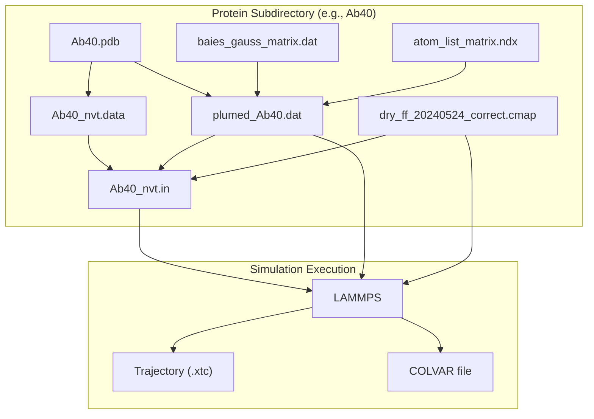

# bAIes Benchmark Simulations

> **Relevant source files**
> * [benchmark/bAIes/ACTR/ACTR.pdb](https://github.com/COSBlab/bAIes-IDP/blob/16faa7f7/benchmark/bAIes/ACTR/ACTR.pdb)
> * [benchmark/bAIes/ACTR/ACTR_nvt.data](https://github.com/COSBlab/bAIes-IDP/blob/16faa7f7/benchmark/bAIes/ACTR/ACTR_nvt.data)
> * [benchmark/bAIes/ACTR/ACTR_nvt.in](https://github.com/COSBlab/bAIes-IDP/blob/16faa7f7/benchmark/bAIes/ACTR/ACTR_nvt.in)
> * [benchmark/bAIes/ACTR/atom_list_matrix.ndx](https://github.com/COSBlab/bAIes-IDP/blob/16faa7f7/benchmark/bAIes/ACTR/atom_list_matrix.ndx)
> * [benchmark/bAIes/ACTR/baies_gauss_matrix.dat](https://github.com/COSBlab/bAIes-IDP/blob/16faa7f7/benchmark/bAIes/ACTR/baies_gauss_matrix.dat)
> * [benchmark/bAIes/ACTR/dry_ff_20240524_correct.cmap](https://github.com/COSBlab/bAIes-IDP/blob/16faa7f7/benchmark/bAIes/ACTR/dry_ff_20240524_correct.cmap)
> * [benchmark/bAIes/ACTR/plumed_ACTR.dat](https://github.com/COSBlab/bAIes-IDP/blob/16faa7f7/benchmark/bAIes/ACTR/plumed_ACTR.dat)
> * [benchmark/bAIes/Ab40/Ab40.pdb](https://github.com/COSBlab/bAIes-IDP/blob/16faa7f7/benchmark/bAIes/Ab40/Ab40.pdb)
> * [benchmark/bAIes/Ab40/Ab40_nvt.data](https://github.com/COSBlab/bAIes-IDP/blob/16faa7f7/benchmark/bAIes/Ab40/Ab40_nvt.data)
> * [benchmark/bAIes/Ab40/Ab40_nvt.in](https://github.com/COSBlab/bAIes-IDP/blob/16faa7f7/benchmark/bAIes/Ab40/Ab40_nvt.in)
> * [benchmark/bAIes/Ab40/atom_list_matrix.ndx](https://github.com/COSBlab/bAIes-IDP/blob/16faa7f7/benchmark/bAIes/Ab40/atom_list_matrix.ndx)
> * [benchmark/bAIes/Ab40/baies_gauss_matrix.dat](https://github.com/COSBlab/bAIes-IDP/blob/16faa7f7/benchmark/bAIes/Ab40/baies_gauss_matrix.dat)
> * [benchmark/bAIes/Ab40/dry_ff_20240524_correct.cmap](https://github.com/COSBlab/bAIes-IDP/blob/16faa7f7/benchmark/bAIes/Ab40/dry_ff_20240524_correct.cmap)
> * [benchmark/bAIes/Ab40/plumed_Ab40.dat](https://github.com/COSBlab/bAIes-IDP/blob/16faa7f7/benchmark/bAIes/Ab40/plumed_Ab40.dat)
> * [benchmark/bAIes/Alb3-A3CT/Alb3-A3CT.pdb](https://github.com/COSBlab/bAIes-IDP/blob/16faa7f7/benchmark/bAIes/Alb3-A3CT/Alb3-A3CT.pdb)
> * [benchmark/bAIes/Alb3-A3CT/Alb3-A3CT_nvt.data](https://github.com/COSBlab/bAIes-IDP/blob/16faa7f7/benchmark/bAIes/Alb3-A3CT/Alb3-A3CT_nvt.data)
> * [benchmark/bAIes/Alb3-A3CT/Alb3-A3CT_nvt.in](https://github.com/COSBlab/bAIes-IDP/blob/16faa7f7/benchmark/bAIes/Alb3-A3CT/Alb3-A3CT_nvt.in)
> * [benchmark/bAIes/Alb3-A3CT/atom_list_matrix.ndx](https://github.com/COSBlab/bAIes-IDP/blob/16faa7f7/benchmark/bAIes/Alb3-A3CT/atom_list_matrix.ndx)
> * [benchmark/bAIes/Alb3-A3CT/baies_gauss_matrix.dat](https://github.com/COSBlab/bAIes-IDP/blob/16faa7f7/benchmark/bAIes/Alb3-A3CT/baies_gauss_matrix.dat)
> * [benchmark/bAIes/Alb3-A3CT/dry_ff_20240524_correct.cmap](https://github.com/COSBlab/bAIes-IDP/blob/16faa7f7/benchmark/bAIes/Alb3-A3CT/dry_ff_20240524_correct.cmap)
> * [benchmark/bAIes/Alb3-A3CT/plumed_Alb3-A3CT.dat](https://github.com/COSBlab/bAIes-IDP/blob/16faa7f7/benchmark/bAIes/Alb3-A3CT/plumed_Alb3-A3CT.dat)
> * [benchmark/bAIes/Colicin_N_T_domain/Colicin_N_T_domain.pdb](https://github.com/COSBlab/bAIes-IDP/blob/16faa7f7/benchmark/bAIes/Colicin_N_T_domain/Colicin_N_T_domain.pdb)
> * [benchmark/bAIes/Colicin_N_T_domain/Colicin_N_T_domain_nvt.data](https://github.com/COSBlab/bAIes-IDP/blob/16faa7f7/benchmark/bAIes/Colicin_N_T_domain/Colicin_N_T_domain_nvt.data)
> * [benchmark/bAIes/Colicin_N_T_domain/Colicin_N_T_domain_nvt.in](https://github.com/COSBlab/bAIes-IDP/blob/16faa7f7/benchmark/bAIes/Colicin_N_T_domain/Colicin_N_T_domain_nvt.in)
> * [benchmark/bAIes/Colicin_N_T_domain/atom_list_matrix.ndx](https://github.com/COSBlab/bAIes-IDP/blob/16faa7f7/benchmark/bAIes/Colicin_N_T_domain/atom_list_matrix.ndx)
> * [benchmark/bAIes/NHE1/NHE1.pdb](https://github.com/COSBlab/bAIes-IDP/blob/16faa7f7/benchmark/bAIes/NHE1/NHE1.pdb)
> * [benchmark/bAIes/NHE1/NHE1_nvt.data](https://github.com/COSBlab/bAIes-IDP/blob/16faa7f7/benchmark/bAIes/NHE1/NHE1_nvt.data)
> * [benchmark/bAIes/NHE1/NHE1_nvt.in](https://github.com/COSBlab/bAIes-IDP/blob/16faa7f7/benchmark/bAIes/NHE1/NHE1_nvt.in)
> * [benchmark/bAIes/NHE1/atom_list_matrix.ndx](https://github.com/COSBlab/bAIes-IDP/blob/16faa7f7/benchmark/bAIes/NHE1/atom_list_matrix.ndx)

This page details the `benchmark/bAIes/` directory, which contains the input files and configurations for running bAIes-biased molecular dynamics simulations for a set of 21 benchmark proteins. The purpose is to describe the per-protein file structure, list the proteins included in this benchmark, and provide instructions on how to reproduce the published simulation results. These simulations utilize the AlphaFold2 distogram-derived restraints with a Jeffreys prior, as implemented in the bAIes PLUMED module.

## Per-Protein File Set

Each protein within the `benchmark/bAIes/` directory has its own subdirectory (e.g., `benchmark/bAIes/Ab40/`, `benchmark/bAIes/ACTR/`). Inside each protein's subdirectory, a consistent set of files is present, essential for running the bAIes-biased LAMMPS simulation.

The core files for each protein are:

* `PDB` file (e.g., `Ab40.pdb`): The initial protein structure in Protein Data Bank format. This file defines the atomic coordinates and connectivity. [benchmark/bAIes/Ab40/Ab40.pdb L1-L5](https://github.com/COSBlab/bAIes-IDP/blob/16faa7f7/benchmark/bAIes/Ab40/Ab40.pdb#L1-L5)
* `_nvt.in` file (e.g., `Ab40_nvt.in`): The LAMMPS input script that configures and runs the NVT (constant number of atoms, volume, and temperature) simulation. It specifies force field parameters, simulation settings, and integrates PLUMED and CMAP corrections. [benchmark/bAIes/Ab40/Ab40_nvt.in L1-L153](https://github.com/COSBlab/bAIes-IDP/blob/16faa7f7/benchmark/bAIes/Ab40/Ab40_nvt.in#L1-L153)
* `_nvt.data` file (e.g., `Ab40_nvt.data`): The LAMMPS data file containing the molecular topology, including atom types, masses, bond, angle, dihedral, and crossterm coefficients. This file is generated by `make_ff.py` from GROMACS topology files. [benchmark/bAIes/Ab40/Ab40_nvt.data L1-L18](https://github.com/COSBlab/bAIes-IDP/blob/16faa7f7/benchmark/bAIes/Ab40/Ab40_nvt.data#L1-L18)
* `plumed_<name>.dat` file (e.g., `plumed_Ab40.dat`): The PLUMED input file that defines the collective variables and the bAIes bias. It specifies the `batoms` group using an index file and configures the `BAIES` action with `PRIOR=JEFFREYS`. [benchmark/bAIes/Ab40/plumed_Ab40.dat L1-L5](https://github.com/COSBlab/bAIes-IDP/blob/16faa7f7/benchmark/bAIes/Ab40/plumed_Ab40.dat#L1-L5)
* `baies_gauss_matrix.dat` file (e.g., `baies_gauss_matrix.dat`): This file contains the parameters (mean `mu` and standard deviation `sigma`) for the Gaussian distance models used by the `BAIES` PLUMED action. Each line specifies an `Id`, the indices of the two atoms (`atom_i`, `atom_j`), and their respective `mu` and `sigma` values. [benchmark/bAIes/Ab40/baies_gauss_matrix.dat L1-L15](https://github.com/COSBlab/bAIes-IDP/blob/16faa7f7/benchmark/bAIes/Ab40/baies_gauss_matrix.dat#L1-L15)
* `atom_list_matrix.ndx` file (e.g., `atom_list_matrix.ndx`): A GROMACS index file format used by PLUMED to define the `batoms` group, which consists of the atom pairs involved in the bAIes bias. [benchmark/bAIes/Ab40/atom_list_matrix.ndx L1-L3](https://github.com/COSBlab/bAIes-IDP/blob/16faa7f7/benchmark/bAIes/Ab40/atom_list_matrix.ndx#L1-L3)
* `dry_ff_20240524_correct.cmap` file: The CMAP correction map file, which provides residue-type-specific phi/psi dihedral corrections to the force field. This file is read by the `fix drycmap` command in the LAMMPS input script. [benchmark/bAIes/Ab40/dry_ff_20240524_correct.cmap L1-L172](https://github.com/COSBlab/bAIes-IDP/blob/16faa7f7/benchmark/bAIes/Ab40/dry_ff_20240524_correct.cmap#L1-L172)

### File Relationships Diagram

The following diagram illustrates the relationships between these files and their roles in a bAIes benchmark simulation.

**Diagram 1: bAIes Benchmark File Dependencies**

Sources:
[benchmark/bAIes/Ab40/Ab40.pdb L1-L5](https://github.com/COSBlab/bAIes-IDP/blob/16faa7f7/benchmark/bAIes/Ab40/Ab40.pdb#L1-L5)

[benchmark/bAIes/Ab40/Ab40_nvt.in L1-L153](https://github.com/COSBlab/bAIes-IDP/blob/16faa7f7/benchmark/bAIes/Ab40/Ab40_nvt.in#L1-L153)

[benchmark/bAIes/Ab40/Ab40_nvt.data L1-L18](https://github.com/COSBlab/bAIes-IDP/blob/16faa7f7/benchmark/bAIes/Ab40/Ab40_nvt.data#L1-L18)

[benchmark/bAIes/Ab40/plumed_Ab40.dat L1-L5](https://github.com/COSBlab/bAIes-IDP/blob/16faa7f7/benchmark/bAIes/Ab40/plumed_Ab40.dat#L1-L5)

[benchmark/bAIes/Ab40/baies_gauss_matrix.dat L1-L15](https://github.com/COSBlab/bAIes-IDP/blob/16faa7f7/benchmark/bAIes/Ab40/baies_gauss_matrix.dat#L1-L15)

[benchmark/bAIes/Ab40/atom_list_matrix.ndx L1-L3](https://github.com/COSBlab/bAIes-IDP/blob/16faa7f7/benchmark/bAIes/Ab40/atom_list_matrix.ndx#L1-L3)

[benchmark/bAIes/Ab40/dry_ff_20240524_correct.cmap L1-L172](https://github.com/COSBlab/bAIes-IDP/blob/16faa7f7/benchmark/bAIes/Ab40/dry_ff_20240524_correct.cmap#L1-L172)

## Covered Proteins

The `benchmark/bAIes/` directory includes simulation setups for 21 different proteins. These proteins represent a diverse set of intrinsically disordered proteins (IDPs) and regions (IDRs), categorized by their structural characteristics.

The 21 proteins are:

* Ab40
* ACTR
* Alb3-A3CT
* Colicin_N_T_domain
* CspB
* FUS_LC
* GCN4
* Histatin5
* HT40
* K18
* K20
* K25
* K30
* K40
* NHE1
* PaaA2
* p53
* Sic1
* Tau
* alpha-Synuclein
* beta-Synuclein

## Reproducing Published Results

To reproduce the published bAIes simulation results for any of these proteins, you will need to execute the LAMMPS simulation using the provided input files.

### Prerequisites

1. **LAMMPS with PLUMED patch**: Ensure you have a LAMMPS executable compiled with PLUMED support. Refer to [1.1. Getting Started](https://github.com/COSBlab/bAIes-IDP/blob/16faa7f7/1.1. Getting Started)  for detailed installation instructions.
2. **CMAP patch**: Ensure your LAMMPS installation includes the CMAPMAX patch to handle the large number of CMAP entries. Refer to [3.2. CMAP Backbone Correction (fix drycmap)](https://github.com/COSBlab/bAIes-IDP/blob/16faa7f7/3.2. CMAP Backbone Correction (fix drycmap))  for details.

### Simulation Steps

For each protein (e.g., `Ab40`), navigate to its specific subdirectory:
`cd benchmark/bAIes/Ab40/`

Then, execute the LAMMPS simulation using the provided input script:
`lmp -in Ab40_nvt.in`

This command will:

1. Initialize the system using the `Ab40_nvt.data` file [benchmark/bAIes/Ab40/Ab40_nvt.in L15](https://github.com/COSBlab/bAIes-IDP/blob/16faa7f7/benchmark/bAIes/Ab40/Ab40_nvt.in#L15-L15)
2. Apply the CMAP corrections defined in `dry_ff_20240524_correct.cmap` via `fix drycmap` [benchmark/bAIes/Ab40/Ab40_nvt.in L14](https://github.com/COSBlab/bAIes-IDP/blob/16faa7f7/benchmark/bAIes/Ab40/Ab40_nvt.in#L14-L14)
3. Integrate the PLUMED bias defined in `plumed_Ab40.dat` via `fix pl` (not explicitly shown in the provided `_nvt.in` snippet, but standard for bAIes simulations). The `plumed_Ab40.dat` file specifies the `BAIES` action with `PRIOR=JEFFREYS` and uses `baies_gauss_matrix.dat` and `atom_list_matrix.ndx` as inputs [benchmark/bAIes/Ab40/plumed_Ab40.dat L1-L5](https://github.com/COSBlab/bAIes-IDP/blob/16faa7f7/benchmark/bAIes/Ab40/plumed_Ab40.dat#L1-L5)
4. Run an NVT simulation for a specified number of steps (typically 2 billion steps with a 1 fs timestep, as seen in the tutorial).
5. Output trajectory data to an `.xtc` file and collective variable data to a `COLVAR` file [benchmark/bAIes/Ab40/plumed_Ab40.dat L4](https://github.com/COSBlab/bAIes-IDP/blob/16faa7f7/benchmark/bAIes/Ab40/plumed_Ab40.dat#L4-L4)

### Example: Ab40_nvt.in Breakdown

The `Ab40_nvt.in` file demonstrates the typical structure of a bAIes benchmark simulation input script:

* **Units and Atom Style**: `units real` and `atom_style full` are set [benchmark/bAIes/Ab40/Ab40_nvt.in L1-L2](https://github.com/COSBlab/bAIes-IDP/blob/16faa7f7/benchmark/bAIes/Ab40/Ab40_nvt.in#L1-L2)
* **Boundary Conditions**: Periodic boundary conditions are applied in all dimensions (`boundary p p p`) [benchmark/bAIes/Ab40/Ab40_nvt.in L5](https://github.com/COSBlab/bAIes-IDP/blob/16faa7f7/benchmark/bAIes/Ab40/Ab40_nvt.in#L5-L5)
* **Force Field Styles**: Hybrid styles are used for bonds, angles, and dihedrals to accommodate the Random Coil force field and CMAP corrections [benchmark/bAIes/Ab40/Ab40_nvt.in L7-L9](https://github.com/COSBlab/bAIes-IDP/blob/16faa7f7/benchmark/bAIes/Ab40/Ab40_nvt.in#L7-L9)
* **Pair Style**: `lj/cut` is used for non-bonded interactions [benchmark/bAIes/Ab40/Ab40_nvt.in L12](https://github.com/COSBlab/bAIes-IDP/blob/16faa7f7/benchmark/bAIes/Ab40/Ab40_nvt.in#L12-L12)
* **CMAP Correction**: The `fix drycmap` command reads the `dry_ff_20240524_correct.cmap` file and applies the backbone dihedral corrections. The `read_data` command then integrates these crossterms into the system [benchmark/bAIes/Ab40/Ab40_nvt.in L14-L15](https://github.com/COSBlab/bAIes-IDP/blob/16faa7f7/benchmark/bAIes/Ab40/Ab40_nvt.in#L14-L15)
* **Pair Coefficients**: Extensive `pair_coeff` entries define the Lennard-Jones parameters for all atom type combinations, reflecting the Random Coil force field modifications [benchmark/bAIes/Ab40/Ab40_nvt.in L20-L153](https://github.com/COSBlab/bAIes-IDP/blob/16faa7f7/benchmark/bAIes/Ab40/Ab40_nvt.in#L20-L153)

### Simulation Workflow

**Diagram 2: bAIes Benchmark Simulation Workflow**

Sources:
[benchmark/bAIes/Ab40/Ab40_nvt.in L1-L153](https://github.com/COSBlab/bAIes-IDP/blob/16faa7f7/benchmark/bAIes/Ab40/Ab40_nvt.in#L1-L153)

[benchmark/bAIes/Ab40/Ab40_nvt.data L1-L18](https://github.com/COSBlab/bAIes-IDP/blob/16faa7f7/benchmark/bAIes/Ab40/Ab40_nvt.data#L1-L18)

[benchmark/bAIes/Ab40/plumed_Ab40.dat L1-L5](https://github.com/COSBlab/bAIes-IDP/blob/16faa7f7/benchmark/bAIes/Ab40/plumed_Ab40.dat#L1-L5)

[benchmark/bAIes/Ab40/baies_gauss_matrix.dat L1-L15](https://github.com/COSBlab/bAIes-IDP/blob/16faa7f7/benchmark/bAIes/Ab40/baies_gauss_matrix.dat#L1-L15)

[benchmark/bAIes/Ab40/atom_list_matrix.ndx L1-L3](https://github.com/COSBlab/bAIes-IDP/blob/16faa7f7/benchmark/bAIes/Ab40/atom_list_matrix.ndx#L1-L3)

[benchmark/bAIes/Ab40/dry_ff_20240524_correct.cmap L1-L172](https://github.com/COSBlab/bAIes-IDP/blob/16faa7f7/benchmark/bAIes/Ab40/dry_ff_20240524_correct.cmap#L1-L172)