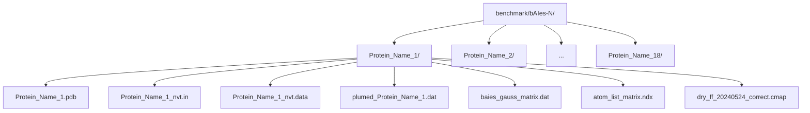
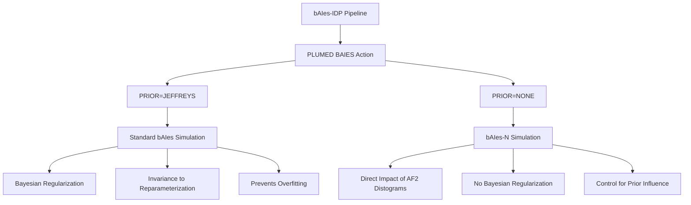

# bAIes-N Benchmark Simulations

> **Relevant source files**
> * [benchmark/bAIes-N/ACTR/ACTR.pdb](https://github.com/COSBlab/bAIes-IDP/blob/16faa7f7/benchmark/bAIes-N/ACTR/ACTR.pdb)
> * [benchmark/bAIes-N/ACTR/ACTR_nvt.data](https://github.com/COSBlab/bAIes-IDP/blob/16faa7f7/benchmark/bAIes-N/ACTR/ACTR_nvt.data)
> * [benchmark/bAIes-N/ACTR/ACTR_nvt.in](https://github.com/COSBlab/bAIes-IDP/blob/16faa7f7/benchmark/bAIes-N/ACTR/ACTR_nvt.in)
> * [benchmark/bAIes-N/ACTR/atom_list_matrix.ndx](https://github.com/COSBlab/bAIes-IDP/blob/16faa7f7/benchmark/bAIes-N/ACTR/atom_list_matrix.ndx)
> * [benchmark/bAIes-N/ACTR/baies_gauss_matrix.dat](https://github.com/COSBlab/bAIes-IDP/blob/16faa7f7/benchmark/bAIes-N/ACTR/baies_gauss_matrix.dat)
> * [benchmark/bAIes-N/ACTR/dry_ff_20240524_correct.cmap](https://github.com/COSBlab/bAIes-IDP/blob/16faa7f7/benchmark/bAIes-N/ACTR/dry_ff_20240524_correct.cmap)
> * [benchmark/bAIes-N/ACTR/plumed_ACTR.dat](https://github.com/COSBlab/bAIes-IDP/blob/16faa7f7/benchmark/bAIes-N/ACTR/plumed_ACTR.dat)
> * [benchmark/bAIes-N/Ab40/Ab40.pdb](https://github.com/COSBlab/bAIes-IDP/blob/16faa7f7/benchmark/bAIes-N/Ab40/Ab40.pdb)
> * [benchmark/bAIes-N/Ab40/Ab40_nvt.data](https://github.com/COSBlab/bAIes-IDP/blob/16faa7f7/benchmark/bAIes-N/Ab40/Ab40_nvt.data)
> * [benchmark/bAIes-N/Ab40/Ab40_nvt.in](https://github.com/COSBlab/bAIes-IDP/blob/16faa7f7/benchmark/bAIes-N/Ab40/Ab40_nvt.in)
> * [benchmark/bAIes-N/Ab40/atom_list_matrix.ndx](https://github.com/COSBlab/bAIes-IDP/blob/16faa7f7/benchmark/bAIes-N/Ab40/atom_list_matrix.ndx)
> * [benchmark/bAIes-N/Ab40/baies_gauss_matrix.dat](https://github.com/COSBlab/bAIes-IDP/blob/16faa7f7/benchmark/bAIes-N/Ab40/baies_gauss_matrix.dat)
> * [benchmark/bAIes-N/Alb3-A3CT/baies_gauss_matrix.dat](https://github.com/COSBlab/bAIes-IDP/blob/16faa7f7/benchmark/bAIes-N/Alb3-A3CT/baies_gauss_matrix.dat)
> * [benchmark/bAIes-N/Alb3-A3CT/dry_ff_20240524_correct.cmap](https://github.com/COSBlab/bAIes-IDP/blob/16faa7f7/benchmark/bAIes-N/Alb3-A3CT/dry_ff_20240524_correct.cmap)
> * [benchmark/bAIes-N/Alb3-A3CT/plumed_Alb3-A3CT.dat](https://github.com/COSBlab/bAIes-IDP/blob/16faa7f7/benchmark/bAIes-N/Alb3-A3CT/plumed_Alb3-A3CT.dat)
> * [benchmark/bAIes-N/Colicin_N_T_domain/Colicin_N_T_domain.pdb](https://github.com/COSBlab/bAIes-IDP/blob/16faa7f7/benchmark/bAIes-N/Colicin_N_T_domain/Colicin_N_T_domain.pdb)
> * [benchmark/bAIes-N/Colicin_N_T_domain/Colicin_N_T_domain_nvt.data](https://github.com/COSBlab/bAIes-IDP/blob/16faa7f7/benchmark/bAIes-N/Colicin_N_T_domain/Colicin_N_T_domain_nvt.data)
> * [benchmark/bAIes-N/Colicin_N_T_domain/Colicin_N_T_domain_nvt.in](https://github.com/COSBlab/bAIes-IDP/blob/16faa7f7/benchmark/bAIes-N/Colicin_N_T_domain/Colicin_N_T_domain_nvt.in)
> * [benchmark/bAIes-N/Colicin_N_T_domain/atom_list_matrix.ndx](https://github.com/COSBlab/bAIes-IDP/blob/16faa7f7/benchmark/bAIes-N/Colicin_N_T_domain/atom_list_matrix.ndx)
> * [benchmark/bAIes-N/Nsp2_CtlIDR/baies_gauss_matrix.dat](https://github.com/COSBlab/bAIes-IDP/blob/16faa7f7/benchmark/bAIes-N/Nsp2_CtlIDR/baies_gauss_matrix.dat)
> * [benchmark/bAIes-N/Nsp2_CtlIDR/dry_ff_20240524_correct.cmap](https://github.com/COSBlab/bAIes-IDP/blob/16faa7f7/benchmark/bAIes-N/Nsp2_CtlIDR/dry_ff_20240524_correct.cmap)
> * [benchmark/bAIes-N/Nsp2_CtlIDR/plumed_Nsp2_CtlIDR.dat](https://github.com/COSBlab/bAIes-IDP/blob/16faa7f7/benchmark/bAIes-N/Nsp2_CtlIDR/plumed_Nsp2_CtlIDR.dat)
> * [benchmark/bAIes-N/Nt-SOCS5/Nt-SOCS5.pdb](https://github.com/COSBlab/bAIes-IDP/blob/16faa7f7/benchmark/bAIes-N/Nt-SOCS5/Nt-SOCS5.pdb)
> * [benchmark/bAIes-N/Nt-SOCS5/Nt-SOCS5_nvt.data](https://github.com/COSBlab/bAIes-IDP/blob/16faa7f7/benchmark/bAIes-N/Nt-SOCS5/Nt-SOCS5_nvt.data)
> * [benchmark/bAIes-N/Nt-SOCS5/Nt-SOCS5_nvt.in](https://github.com/COSBlab/bAIes-IDP/blob/16faa7f7/benchmark/bAIes-N/Nt-SOCS5/Nt-SOCS5_nvt.in)
> * [benchmark/bAIes-N/Nt-SOCS5/atom_list_matrix.ndx](https://github.com/COSBlab/bAIes-IDP/blob/16faa7f7/benchmark/bAIes-N/Nt-SOCS5/atom_list_matrix.ndx)

This page describes the `benchmark/bAIes-N/` directory, which contains the input files for running benchmark simulations using the bAIes-N variant of the bAIes-IDP pipeline. The bAIes-N variant is characterized by the absence of a Jeffreys prior in the PLUMED `BAIES` action, using `PRIOR=NONE` instead. This section details the file structure, the 18 proteins included in this benchmark set, and the scientific rationale behind this specific variant.

## Directory Structure and Contents

The `benchmark/bAIes-N/` directory follows a per-protein subdirectory structure, similar to the `bAIes` benchmark. Each protein's subdirectory contains all the necessary input files to run a LAMMPS/PLUMED simulation.

Title: "bAIes-N Benchmark Directory Structure"
Sources: [benchmark/bAIes-N/Ab40/Ab40.pdb](https://github.com/COSBlab/bAIes-IDP/blob/16faa7f7/benchmark/bAIes-N/Ab40/Ab40.pdb)

 [benchmark/bAIes-N/Ab40/Ab40_nvt.in](https://github.com/COSBlab/bAIes-IDP/blob/16faa7f7/benchmark/bAIes-N/Ab40/Ab40_nvt.in)

 [benchmark/bAIes-N/Ab40/Ab40_nvt.data](https://github.com/COSBlab/bAIes-IDP/blob/16faa7f7/benchmark/bAIes-N/Ab40/Ab40_nvt.data)

 [benchmark/bAIes-N/Ab40/plumed_Ab40.dat](https://github.com/COSBlab/bAIes-IDP/blob/16faa7f7/benchmark/bAIes-N/Ab40/plumed_Ab40.dat)

 [benchmark/bAIes-N/Ab40/baies_gauss_matrix.dat](https://github.com/COSBlab/bAIes-IDP/blob/16faa7f7/benchmark/bAIes-N/Ab40/baies_gauss_matrix.dat)

 [benchmark/bAIes-N/Ab40/atom_list_matrix.ndx](https://github.com/COSBlab/bAIes-IDP/blob/16faa7f7/benchmark/bAIes-N/Ab40/atom_list_matrix.ndx)

 [benchmark/bAIes-N/Ab40/dry_ff_20240524_correct.cmap](https://github.com/COSBlab/bAIes-IDP/blob/16faa7f7/benchmark/bAIes-N/Ab40/dry_ff_20240524_correct.cmap)

For each protein, the following files are provided:

* `Protein_Name.pdb`: The initial PDB structure for the simulation. [benchmark/bAIes-N/Ab40/Ab40.pdb](https://github.com/COSBlab/bAIes-IDP/blob/16faa7f7/benchmark/bAIes-N/Ab40/Ab40.pdb)  [benchmark/bAIes-N/ACTR/ACTR.pdb](https://github.com/COSBlab/bAIes-IDP/blob/16faa7f7/benchmark/bAIes-N/ACTR/ACTR.pdb)
* `Protein_Name_nvt.in`: The LAMMPS input script for the NVT simulation. This script defines the force field parameters, simulation settings, and integrates PLUMED. [benchmark/bAIes-N/Ab40/Ab40_nvt.in](https://github.com/COSBlab/bAIes-IDP/blob/16faa7f7/benchmark/bAIes-N/Ab40/Ab40_nvt.in)  [benchmark/bAIes-N/ACTR/ACTR_nvt.in](https://github.com/COSBlab/bAIes-IDP/blob/16faa7f7/benchmark/bAIes-N/ACTR/ACTR_nvt.in)
* `Protein_Name_nvt.data`: The LAMMPS data file containing the molecular topology (atoms, bonds, angles, dihedrals, impropers, and their types/coefficients). [benchmark/bAIes-N/Ab40/Ab40_nvt.data](https://github.com/COSBlab/bAIes-IDP/blob/16faa7f7/benchmark/bAIes-N/Ab40/Ab40_nvt.data)  [benchmark/bAIes-N/ACTR/ACTR_nvt.data](https://github.com/COSBlab/bAIes-IDP/blob/16faa7f7/benchmark/bAIes-N/ACTR/ACTR_nvt.data)
* `plumed_Protein_Name.dat`: The PLUMED input file. Crucially, for bAIes-N, this file contains `PRIOR=NONE` in the `BAIES` action definition. [benchmark/bAIes-N/ACTR/plumed_ACTR.dat L3](https://github.com/COSBlab/bAIes-IDP/blob/16faa7f7/benchmark/bAIes-N/ACTR/plumed_ACTR.dat#L3-L3)
* `baies_gauss_matrix.dat`: This file specifies the Gaussian parameters (mean `mu` and standard deviation `sigma`) for each residue-pair distance restraint. These parameters are derived from AlphaFold2 distograms. [benchmark/bAIes-N/ACTR/baies_gauss_matrix.dat L1-L2](https://github.com/COSBlab/bAIes-IDP/blob/16faa7f7/benchmark/bAIes-N/ACTR/baies_gauss_matrix.dat#L1-L2)
* `atom_list_matrix.ndx`: An index file defining the `batoms` group, which lists the atom indices involved in the distance restraints. [benchmark/bAIes-N/Ab40/atom_list_matrix.ndx L1-L3](https://github.com/COSBlab/bAIes-IDP/blob/16faa7f7/benchmark/bAIes-N/Ab40/atom_list_matrix.ndx#L1-L3)  [benchmark/bAIes-N/ACTR/atom_list_matrix.ndx L1-L5](https://github.com/COSBlab/bAIes-IDP/blob/16faa7f7/benchmark/bAIes-N/ACTR/atom_list_matrix.ndx#L1-L5)
* `dry_ff_20240524_correct.cmap`: The CMAP correction map file used by the `fix drycmap` command in LAMMPS to correct backbone dihedral potentials. [benchmark/bAIes-N/ACTR/dry_ff_20240524_correct.cmap L1-L2](https://github.com/COSBlab/bAIes-IDP/blob/16faa7f7/benchmark/bAIes-N/ACTR/dry_ff_20240524_correct.cmap#L1-L2)

Sources: [benchmark/bAIes-N/Ab40/Ab40.pdb](https://github.com/COSBlab/bAIes-IDP/blob/16faa7f7/benchmark/bAIes-N/Ab40/Ab40.pdb)

 [benchmark/bAIes-N/Ab40/Ab40_nvt.in](https://github.com/COSBlab/bAIes-IDP/blob/16faa7f7/benchmark/bAIes-N/Ab40/Ab40_nvt.in)

 [benchmark/bAIes-N/Ab40/Ab40_nvt.data](https://github.com/COSBlab/bAIes-IDP/blob/16faa7f7/benchmark/bAIes-N/Ab40/Ab40_nvt.data)

 [benchmark/bAIes-N/Ab40/plumed_Ab40.dat](https://github.com/COSBlab/bAIes-IDP/blob/16faa7f7/benchmark/bAIes-N/Ab40/plumed_Ab40.dat)

 [benchmark/bAIes-N/Ab40/baies_gauss_matrix.dat](https://github.com/COSBlab/bAIes-IDP/blob/16faa7f7/benchmark/bAIes-N/Ab40/baies_gauss_matrix.dat)

 [benchmark/bAIes-N/Ab40/atom_list_matrix.ndx](https://github.com/COSBlab/bAIes-IDP/blob/16faa7f7/benchmark/bAIes-N/Ab40/atom_list_matrix.ndx)

 [benchmark/bAIes-N/Ab40/dry_ff_20240524_correct.cmap](https://github.com/COSBlab/bAIes-IDP/blob/16faa7f7/benchmark/bAIes-N/Ab40/dry_ff_20240524_correct.cmap)

 [benchmark/bAIes-N/ACTR/ACTR.pdb](https://github.com/COSBlab/bAIes-IDP/blob/16faa7f7/benchmark/bAIes-N/ACTR/ACTR.pdb)

 [benchmark/bAIes-N/ACTR/ACTR_nvt.in](https://github.com/COSBlab/bAIes-IDP/blob/16faa7f7/benchmark/bAIes-N/ACTR/ACTR_nvt.in)

 [benchmark/bAIes-N/ACTR/ACTR_nvt.data](https://github.com/COSBlab/bAIes-IDP/blob/16faa7f7/benchmark/bAIes-N/ACTR/ACTR_nvt.data)

 [benchmark/bAIes-N/ACTR/plumed_ACTR.dat](https://github.com/COSBlab/bAIes-IDP/blob/16faa7f7/benchmark/bAIes-N/ACTR/plumed_ACTR.dat)

 [benchmark/bAIes-N/ACTR/baies_gauss_matrix.dat](https://github.com/COSBlab/bAIes-IDP/blob/16faa7f7/benchmark/bAIes-N/ACTR/baies_gauss_matrix.dat)

 [benchmark/bAIes-N/ACTR/atom_list_matrix.ndx](https://github.com/COSBlab/bAIes-IDP/blob/16faa7f7/benchmark/bAIes-N/ACTR/atom_list_matrix.ndx)

 [benchmark/bAIes-N/ACTR/dry_ff_20240524_correct.cmap](https://github.com/COSBlab/bAIes-IDP/blob/16faa7f7/benchmark/bAIes-N/ACTR/dry_ff_20240524_correct.cmap)

## Included Proteins

The `bAIes-N` benchmark set includes 18 proteins. These proteins are a subset of the larger 21-protein benchmark used for bAIes-IDP validation. The specific proteins included are:

* Ab40
* ACTR
* Alb3-A3CT
* Colicin_N_T_domain
* FUS_LC
* HT40
* Nsp2_CtlIDR
* PaaA2
* p53_TAD
* Sic1
* Sic1_WT
* Sic1_pT5A
* Sic1_pT33A
* Sic1_pT39A
* Sic1_pT48A
* Sic1_pT54A
* Sic1_pT62A
* Nt-SOCS5

Sources: [benchmark/bAIes-N/Ab40/](https://github.com/COSBlab/bAIes-IDP/blob/16faa7f7/benchmark/bAIes-N/Ab40/)

 (directory name), [benchmark/bAIes-N/ACTR/](https://github.com/COSBlab/bAIes-IDP/blob/16faa7f7/benchmark/bAIes-N/ACTR/)

 (directory name), [benchmark/bAIes-N/Alb3-A3CT/](https://github.com/COSBlab/bAIes-IDP/blob/16faa7f7/benchmark/bAIes-N/Alb3-A3CT/)

 (directory name), [benchmark/bAIes-N/Colicin_N_T_domain/](https://github.com/COSBlab/bAIes-IDP/blob/16faa7f7/benchmark/bAIes-N/Colicin_N_T_domain/)

 (directory name), [benchmark/bAIes-N/FUS_LC/](https://github.com/COSBlab/bAIes-IDP/blob/16faa7f7/benchmark/bAIes-N/FUS_LC/)

 (directory name), [benchmark/bAIes-N/HT40/](https://github.com/COSBlab/bAIes-IDP/blob/16faa7f7/benchmark/bAIes-N/HT40/)

 (directory name), [benchmark/bAIes-N/Nsp2_CtlIDR/](https://github.com/COSBlab/bAIes-IDP/blob/16faa7f7/benchmark/bAIes-N/Nsp2_CtlIDR/)

 (directory name), [benchmark/bAIes-N/PaaA2/](https://github.com/COSBlab/bAIes-IDP/blob/16faa7f7/benchmark/bAIes-N/PaaA2/)

 (directory name), [benchmark/bAIes-N/p53_TAD/](https://github.com/COSBlab/bAIes-IDP/blob/16faa7f7/benchmark/bAIes-N/p53_TAD/)

 (directory name), [benchmark/bAIes-N/Sic1/](https://github.com/COSBlab/bAIes-IDP/blob/16faa7f7/benchmark/bAIes-N/Sic1/)

 (directory name), [benchmark/bAIes-N/Sic1_WT/](https://github.com/COSBlab/bAIes-IDP/blob/16faa7f7/benchmark/bAIes-N/Sic1_WT/)

 (directory name), [benchmark/bAIes-N/Sic1_pT5A/](https://github.com/COSBlab/bAIes-IDP/blob/16faa7f7/benchmark/bAIes-N/Sic1_pT5A/)

 (directory name), [benchmark/bAIes-N/Sic1_pT33A/](https://github.com/COSBlab/bAIes-IDP/blob/16faa7f7/benchmark/bAIes-N/Sic1_pT33A/)

 (directory name), [benchmark/bAIes-N/Sic1_pT39A/](https://github.com/COSBlab/bAIes-IDP/blob/16faa7f7/benchmark/bAIes-N/Sic1_pT39A/)

 (directory name), [benchmark/bAIes-N/Sic1_pT48A/](https://github.com/COSBlab/bAIes-IDP/blob/16faa7f7/benchmark/bAIes-N/Sic1_pT48A/)

 (directory name), [benchmark/bAIes-N/Sic1_pT54A/](https://github.com/COSBlab/bAIes-IDP/blob/16faa7f7/benchmark/bAIes-N/Sic1_pT54A/)

 (directory name), [benchmark/bAIes-N/Sic1_pT62A/](https://github.com/COSBlab/bAIes-IDP/blob/16faa7f7/benchmark/bAIes-N/Sic1_pT62A/)

 (directory name), [benchmark/bAIes-N/Nt-SOCS5/](https://github.com/COSBlab/bAIes-IDP/blob/16faa7f7/benchmark/bAIes-N/Nt-SOCS5/)

 (directory name)

## Scientific Rationale for bAIes-N (PRIOR=NONE)

The primary distinction of the bAIes-N variant from the standard bAIes simulation lies in the `PRIOR` setting within the PLUMED `BAIES` action. In bAIes-N, `PRIOR=NONE` is used [benchmark/bAIes-N/ACTR/plumed_ACTR.dat L3](https://github.com/COSBlab/bAIes-IDP/blob/16faa7f7/benchmark/bAIes-N/ACTR/plumed_ACTR.dat#L3-L3)

 meaning that no Jeffreys prior is applied to the Gaussian distance restraints.

The Jeffreys prior, used in the standard bAIes approach, is a non-informative prior distribution that is proportional to the inverse of the standard deviation of the Gaussian distributions. Its purpose is to ensure that the Bayesian inference is invariant to reparameterization of the model, and it can help to prevent overfitting by penalizing overly narrow distributions.

By setting `PRIOR=NONE`, the bAIes-N simulations effectively remove this Bayesian regularization. This variant is used to investigate the impact of the Jeffreys prior on the resulting conformational ensembles. Comparing bAIes-N results with standard bAIes results allows researchers to:

* **Assess the influence of the prior:** Determine how much the Jeffreys prior shapes the sampling of conformational space and the resulting structural properties.
* **Evaluate robustness:** Test the robustness of the bAIes method to changes in the prior distribution.
* **Understand bias:** Isolate the effect of the AlphaFold2-derived distance restraints themselves, without the additional influence of the Jeffreys prior. This can help in understanding whether observed structural features are primarily driven by the AlphaFold2 predictions or by the Bayesian framework's regularization.

In essence, bAIes-N serves as a control or an alternative perspective to understand the contributions of different components of the bAIes-IDP methodology.

Title: "bAIes vs. bAIes-N: Prior Impact"
Sources: [benchmark/bAIes-N/ACTR/plumed_ACTR.dat L3](https://github.com/COSBlab/bAIes-IDP/blob/16faa7f7/benchmark/bAIes-N/ACTR/plumed_ACTR.dat#L3-L3)