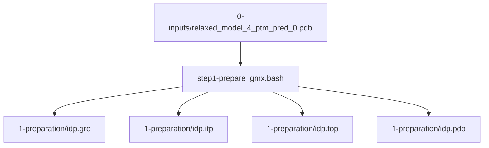
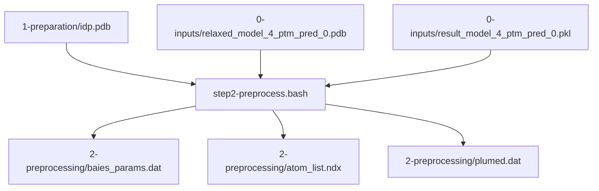
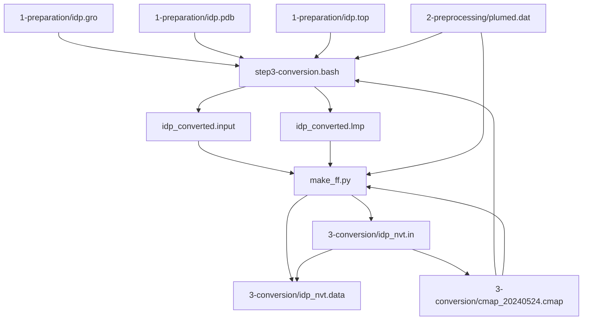
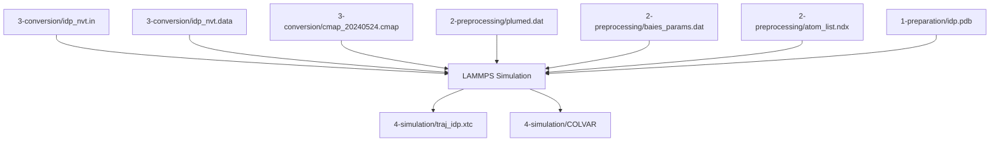

# bAIes Tutorial (AF2-Biased Ensemble)

> **Relevant source files**
> * [tutorial/bAIes/0-inputs/PaaA2_Colabfold/PaaA2_1c259.done.txt](https://github.com/COSBlab/bAIes-IDP/blob/16faa7f7/tutorial/bAIes/0-inputs/PaaA2_Colabfold/PaaA2_1c259.done.txt)
> * [tutorial/bAIes/0-inputs/PaaA2_Colabfold/PaaA2_1c259_distmat/alphafold2_ptm_model_1_seed_000_12A_prob.csv](https://github.com/COSBlab/bAIes-IDP/blob/16faa7f7/tutorial/bAIes/0-inputs/PaaA2_Colabfold/PaaA2_1c259_distmat/alphafold2_ptm_model_1_seed_000_12A_prob.csv)
> * [tutorial/bAIes/0-inputs/PaaA2_Colabfold/PaaA2_1c259_distmat/alphafold2_ptm_model_1_seed_000_mean.csv](https://github.com/COSBlab/bAIes-IDP/blob/16faa7f7/tutorial/bAIes/0-inputs/PaaA2_Colabfold/PaaA2_1c259_distmat/alphafold2_ptm_model_1_seed_000_mean.csv)
> * [tutorial/bAIes/0-inputs/PaaA2_Colabfold/PaaA2_1c259_distmat/alphafold2_ptm_model_1_seed_000_prob_distributions.npy](https://github.com/COSBlab/bAIes-IDP/blob/16faa7f7/tutorial/bAIes/0-inputs/PaaA2_Colabfold/PaaA2_1c259_distmat/alphafold2_ptm_model_1_seed_000_prob_distributions.npy)
> * [tutorial/bAIes/0-inputs/PaaA2_Colabfold/PaaA2_1c259_distmat/alphafold2_ptm_model_1_seed_000_std.csv](https://github.com/COSBlab/bAIes-IDP/blob/16faa7f7/tutorial/bAIes/0-inputs/PaaA2_Colabfold/PaaA2_1c259_distmat/alphafold2_ptm_model_1_seed_000_std.csv)
> * [tutorial/bAIes/0-inputs/PaaA2_Colabfold/PaaA2_1c259_distmat/alphafold2_ptm_model_2_seed_000_12A_prob.csv](https://github.com/COSBlab/bAIes-IDP/blob/16faa7f7/tutorial/bAIes/0-inputs/PaaA2_Colabfold/PaaA2_1c259_distmat/alphafold2_ptm_model_2_seed_000_12A_prob.csv)
> * [tutorial/bAIes/0-inputs/PaaA2_Colabfold/PaaA2_1c259_distmat/alphafold2_ptm_model_2_seed_000_mean.csv](https://github.com/COSBlab/bAIes-IDP/blob/16faa7f7/tutorial/bAIes/0-inputs/PaaA2_Colabfold/PaaA2_1c259_distmat/alphafold2_ptm_model_2_seed_000_mean.csv)
> * [tutorial/bAIes/1-preparation/idp.gro](https://github.com/COSBlab/bAIes-IDP/blob/16faa7f7/tutorial/bAIes/1-preparation/idp.gro)
> * [tutorial/bAIes/1-preparation/idp.itp](https://github.com/COSBlab/bAIes-IDP/blob/16faa7f7/tutorial/bAIes/1-preparation/idp.itp)
> * [tutorial/bAIes/1-preparation/idp.pdb](https://github.com/COSBlab/bAIes-IDP/blob/16faa7f7/tutorial/bAIes/1-preparation/idp.pdb)
> * [tutorial/bAIes/1-preparation/idp.top](https://github.com/COSBlab/bAIes-IDP/blob/16faa7f7/tutorial/bAIes/1-preparation/idp.top)
> * [tutorial/bAIes/1-preparation/relaxed_model_4_ptm_pred_0.pdb](https://github.com/COSBlab/bAIes-IDP/blob/16faa7f7/tutorial/bAIes/1-preparation/relaxed_model_4_ptm_pred_0.pdb)
> * [tutorial/bAIes/1-preparation/step1-prepare_gmx.bash](https://github.com/COSBlab/bAIes-IDP/blob/16faa7f7/tutorial/bAIes/1-preparation/step1-prepare_gmx.bash)
> * [tutorial/bAIes/2-preprocessing/alphafold2_ptm_model_1_seed_000_prob_distributions.npy](https://github.com/COSBlab/bAIes-IDP/blob/16faa7f7/tutorial/bAIes/2-preprocessing/alphafold2_ptm_model_1_seed_000_prob_distributions.npy)
> * [tutorial/bAIes/2-preprocessing/atom_list.ndx](https://github.com/COSBlab/bAIes-IDP/blob/16faa7f7/tutorial/bAIes/2-preprocessing/atom_list.ndx)
> * [tutorial/bAIes/2-preprocessing/baies_params.dat](https://github.com/COSBlab/bAIes-IDP/blob/16faa7f7/tutorial/bAIes/2-preprocessing/baies_params.dat)
> * [tutorial/bAIes/2-preprocessing/idp.pdb](https://github.com/COSBlab/bAIes-IDP/blob/16faa7f7/tutorial/bAIes/2-preprocessing/idp.pdb)
> * [tutorial/bAIes/2-preprocessing/plumed.dat](https://github.com/COSBlab/bAIes-IDP/blob/16faa7f7/tutorial/bAIes/2-preprocessing/plumed.dat)
> * [tutorial/bAIes/3-conversion/cmap_20240524.cmap](https://github.com/COSBlab/bAIes-IDP/blob/16faa7f7/tutorial/bAIes/3-conversion/cmap_20240524.cmap)
> * [tutorial/bAIes/3-conversion/idp.gro](https://github.com/COSBlab/bAIes-IDP/blob/16faa7f7/tutorial/bAIes/3-conversion/idp.gro)
> * [tutorial/bAIes/3-conversion/idp.pdb](https://github.com/COSBlab/bAIes-IDP/blob/16faa7f7/tutorial/bAIes/3-conversion/idp.pdb)
> * [tutorial/bAIes/3-conversion/idp.top](https://github.com/COSBlab/bAIes-IDP/blob/16faa7f7/tutorial/bAIes/3-conversion/idp.top)
> * [tutorial/bAIes/3-conversion/idp_nvt.data](https://github.com/COSBlab/bAIes-IDP/blob/16faa7f7/tutorial/bAIes/3-conversion/idp_nvt.data)
> * [tutorial/bAIes/3-conversion/idp_nvt.in](https://github.com/COSBlab/bAIes-IDP/blob/16faa7f7/tutorial/bAIes/3-conversion/idp_nvt.in)
> * [tutorial/bAIes/3-conversion/step3-conversion.bash](https://github.com/COSBlab/bAIes-IDP/blob/16faa7f7/tutorial/bAIes/3-conversion/step3-conversion.bash)
> * [tutorial/bAIes/4-simulation/atom_list.ndx](https://github.com/COSBlab/bAIes-IDP/blob/16faa7f7/tutorial/bAIes/4-simulation/atom_list.ndx)
> * [tutorial/bAIes/4-simulation/baies_params.dat](https://github.com/COSBlab/bAIes-IDP/blob/16faa7f7/tutorial/bAIes/4-simulation/baies_params.dat)
> * [tutorial/bAIes/4-simulation/cmap_20240524.cmap](https://github.com/COSBlab/bAIes-IDP/blob/16faa7f7/tutorial/bAIes/4-simulation/cmap_20240524.cmap)
> * [tutorial/bAIes/4-simulation/idp.pdb](https://github.com/COSBlab/bAIes-IDP/blob/16faa7f7/tutorial/bAIes/4-simulation/idp.pdb)
> * [tutorial/bAIes/4-simulation/idp_nvt.data](https://github.com/COSBlab/bAIes-IDP/blob/16faa7f7/tutorial/bAIes/4-simulation/idp_nvt.data)
> * [tutorial/bAIes/4-simulation/idp_nvt.in](https://github.com/COSBlab/bAIes-IDP/blob/16faa7f7/tutorial/bAIes/4-simulation/idp_nvt.in)
> * [tutorial/bAIes/4-simulation/plumed.dat](https://github.com/COSBlab/bAIes-IDP/blob/16faa7f7/tutorial/bAIes/4-simulation/plumed.dat)
> * [tutorial/bAIes/README.md](https://github.com/COSBlab/bAIes-IDP/blob/16faa7f7/tutorial/bAIes/README.md?plain=1)

This page provides a step-by-step walkthrough of the `tutorial/bAIes/` workflow, using the protein PaaA2 as an example. It covers obtaining AlphaFold2 (AF2) or ColabFold inputs, and then executing the `step1-prepare_gmx.bash`, `step2-preprocess.bash`, `step3-conversion.bash`, and the final LAMMPS simulation. The tutorial is structured across five subdirectories, each representing a distinct stage of the bAIes-IDP pipeline.

## 0. Inputs

The initial step involves acquiring structural prediction data from AlphaFold2 or ColabFold. This data serves as the foundation for the bAIes ensemble modeling. The `0-inputs` directory contains example data for PaaA2. [tutorial/bAIes/README.md L10-L17](https://github.com/COSBlab/bAIes-IDP/blob/16faa7f7/tutorial/bAIes/README.md?plain=1#L10-L17)

### AlphaFold2 Inputs

For local AlphaFold2 predictions, the essential inputs are:

* **Distograms**: These are stored in pickle files, typically named `result_model_x_ptm_pred_x.pkl`. [tutorial/bAIes/README.md L23-L24](https://github.com/COSBlab/bAIes-IDP/blob/16faa7f7/tutorial/bAIes/README.md?plain=1#L23-L24)
* **Relaxed PDB model**: This PDB file serves as the starting structure for subsequent simulations. [tutorial/bAIes/README.md L26](https://github.com/COSBlab/bAIes-IDP/blob/16faa7f7/tutorial/bAIes/README.md?plain=1#L26-L26)

### ColabFold Inputs

If using ColabFold, the required information is similar:

* **Distograms**: These are found in `.npy` files within a `_distmat` subdirectory, e.g., `alphafold2_ptm_model_x_seed_xxx_prob_distributions.npy`. [tutorial/bAIes/README.md L31-L32](https://github.com/COSBlab/bAIes-IDP/blob/16faa7f7/tutorial/bAIes/README.md?plain=1#L31-L32)
* **Relaxed PDB model**: This PDB file is used as the starting point for simulations. [tutorial/bAIes/README.md L34](https://github.com/COSBlab/bAIes-IDP/blob/16faa7f7/tutorial/bAIes/README.md?plain=1#L34-L34)

Sources:

* [tutorial/bAIes/README.md L10-L34](https://github.com/COSBlab/bAIes-IDP/blob/16faa7f7/tutorial/bAIes/README.md?plain=1#L10-L34)
* [tutorial/bAIes/0-inputs/PaaA2_Colabfold/PaaA2_1c259_distmat/alphafold2_ptm_model_1_seed_000_prob_distributions.npy](https://github.com/COSBlab/bAIes-IDP/blob/16faa7f7/tutorial/bAIes/0-inputs/PaaA2_Colabfold/PaaA2_1c259_distmat/alphafold2_ptm_model_1_seed_000_prob_distributions.npy)

## 1. Preparation

The `1-preparation` directory is where GROMACS topology files are generated from the initial PDB model. This is a crucial step as the bAIes framework relies on converting GROMACS files to LAMMPS format. [tutorial/bAIes/README.md L36-L41](https://github.com/COSBlab/bAIes-IDP/blob/16faa7f7/tutorial/bAIes/README.md?plain=1#L36-L41)

### Workflow

The `step1-prepare_gmx.bash` script automates this process. It takes the relaxed PDB model as input and uses GROMACS commands to create the necessary topology files. [tutorial/bAIes/README.md L45-L49](https://github.com/COSBlab/bAIes-IDP/blob/16faa7f7/tutorial/bAIes/README.md?plain=1#L45-L49)

```
./step1-prepare_gmx.bash relaxed_model_4_ptm_pred_0.pdb
```

**Inputs**:

* `relaxed_model_4_ptm_pred_0.pdb`: The relaxed PDB model obtained from AlphaFold2 or ColabFold. [tutorial/bAIes/README.md L45](https://github.com/COSBlab/bAIes-IDP/blob/16faa7f7/tutorial/bAIes/README.md?plain=1#L45-L45)

**Outputs**:
The script generates the following GROMACS files using the `amber99SB-ILDN` force field:

* `.gro` file (e.g., `idp.gro`) [tutorial/bAIes/1-preparation/idp.gro](https://github.com/COSBlab/bAIes-IDP/blob/16faa7f7/tutorial/bAIes/1-preparation/idp.gro)
* `.itp` file (e.g., `idp.itp`) [tutorial/bAIes/1-preparation/idp.itp](https://github.com/COSBlab/bAIes-IDP/blob/16faa7f7/tutorial/bAIes/1-preparation/idp.itp)
* `.top` file (e.g., `idp.top`) [tutorial/bAIes/1-preparation/idp.top](https://github.com/COSBlab/bAIes-IDP/blob/16faa7f7/tutorial/bAIes/1-preparation/idp.top)
* `.pdb` file (e.g., `idp.pdb`) [tutorial/bAIes/1-preparation/idp.pdb](https://github.com/COSBlab/bAIes-IDP/blob/16faa7f7/tutorial/bAIes/1-preparation/idp.pdb)

### Data Flow for Preparation



**Figure 1: Data Flow for GROMACS Preparation**

Sources:

* [tutorial/bAIes/README.md L36-L50](https://github.com/COSBlab/bAIes-IDP/blob/16faa7f7/tutorial/bAIes/README.md?plain=1#L36-L50)
* [tutorial/bAIes/1-preparation/step1-prepare_gmx.bash](https://github.com/COSBlab/bAIes-IDP/blob/16faa7f7/tutorial/bAIes/1-preparation/step1-prepare_gmx.bash)
* [tutorial/bAIes/1-preparation/idp.gro](https://github.com/COSBlab/bAIes-IDP/blob/16faa7f7/tutorial/bAIes/1-preparation/idp.gro)
* [tutorial/bAIes/1-preparation/idp.itp](https://github.com/COSBlab/bAIes-IDP/blob/16faa7f7/tutorial/bAIes/1-preparation/idp.itp)
* [tutorial/bAIes/1-preparation/idp.top](https://github.com/COSBlab/bAIes-IDP/blob/16faa7f7/tutorial/bAIes/1-preparation/idp.top)
* [tutorial/bAIes/1-preparation/idp.pdb](https://github.com/COSBlab/bAIes-IDP/blob/16faa7f7/tutorial/bAIes/1-preparation/idp.pdb)

## 2. Preprocessing

The `2-preprocessing` directory is dedicated to generating PLUMED files required for bAIes simulations. This involves analyzing the prediction outputs from AlphaFold2/ColabFold. [tutorial/bAIes/README.md L52-L55](https://github.com/COSBlab/bAIes-IDP/blob/16faa7f7/tutorial/bAIes/README.md?plain=1#L52-L55)

### Workflow

The `step2-preprocess.bash` script orchestrates the execution of `preprocess_bAIes.py`. This Python script takes the GROMACS PDB model, the AlphaFold PDB model, and the distograms as input. [tutorial/bAIes/README.md L57-L64](https://github.com/COSBlab/bAIes-IDP/blob/16faa7f7/tutorial/bAIes/README.md?plain=1#L57-L64)

```
./step2-preprocess.bash idp.pdb relaxed_model_4_ptm_pred_0.pdb result_model_4_ptm_pred_0.pkl
```

or for ColabFold inputs:

```
./step2-preprocess.bash idp.pdb relaxed_model_4_ptm_pred_0.pdb alphafold2_ptm_model_1_seed_000_prob_distributions.npy
```

[tutorial/bAIes/README.md L67-L73](https://github.com/COSBlab/bAIes-IDP/blob/16faa7f7/tutorial/bAIes/README.md?plain=1#L67-L73)

**Inputs**:

* `idp.pdb`: The GROMACS PDB model generated in the previous step. This is used to map atom numbers for PLUMED restraints. [tutorial/bAIes/README.md L59-L60](https://github.com/COSBlab/bAIes-IDP/blob/16faa7f7/tutorial/bAIes/README.md?plain=1#L59-L60)
* `relaxed_model_4_ptm_pred_0.pdb`: The original AlphaFold PDB model. [tutorial/bAIes/README.md L62](https://github.com/COSBlab/bAIes-IDP/blob/16faa7f7/tutorial/bAIes/README.md?plain=1#L62-L62)
* `result_model_4_ptm_pred_0.pkl` (AF2) or `alphafold2_ptm_model_1_seed_000_prob_distributions.npy` (ColabFold): The distograms containing distance distribution information. [tutorial/bAIes/README.md L63-L73](https://github.com/COSBlab/bAIes-IDP/blob/16faa7f7/tutorial/bAIes/README.md?plain=1#L63-L73)

**Outputs**:
The `step2-preprocess.bash` script generates three key files: [tutorial/bAIes/README.md L75-L76](https://github.com/COSBlab/bAIes-IDP/blob/16faa7f7/tutorial/bAIes/README.md?plain=1#L75-L76)

* `baies_params.dat`: Contains atom numbers and parameters for each atom pair that will have a bAIes force applied during simulation. [tutorial/bAIes/README.md L77-L78](https://github.com/COSBlab/bAIes-IDP/blob/16faa7f7/tutorial/bAIes/README.md?plain=1#L77-L78)
* `atom_list.ndx`: A list of all atoms involved in bAIes restraints. [tutorial/bAIes/README.md L80](https://github.com/COSBlab/bAIes-IDP/blob/16faa7f7/tutorial/bAIes/README.md?plain=1#L80-L80)
* `plumed.dat`: The PLUMED input file for the simulation. [tutorial/bAIes/README.md L82](https://github.com/COSBlab/bAIes-IDP/blob/16faa7f7/tutorial/bAIes/README.md?plain=1#L82-L82)

The `plumed.dat` file typically includes:

```
#MOLINFO STRUCTURE=idp.pdbbatoms: GROUP NDX_FILE=atom_list.ndx NDX_GROUP=batomsbaies: BAIES ATOMS=batoms DATA_FILE=baies_params.dat PRIOR=JEFFREYS TEMP=2.478541306PRINT ARG=baies.ene FILE=COLVAR STRIDE=500bbias: BIASVALUE ARG=baies.ene STRIDE=2
```

[tutorial/bAIes/README.md L85-L90](https://github.com/COSBlab/bAIes-IDP/blob/16faa7f7/tutorial/bAIes/README.md?plain=1#L85-L90)

### Data Flow for Preprocessing



**Figure 2: Data Flow for Distogram Preprocessing**

Sources:

* [tutorial/bAIes/README.md L52-L90](https://github.com/COSBlab/bAIes-IDP/blob/16faa7f7/tutorial/bAIes/README.md?plain=1#L52-L90)
* [tutorial/bAIes/2-preprocessing/atom_list.ndx](https://github.com/COSBlab/bAIes-IDP/blob/16faa7f7/tutorial/bAIes/2-preprocessing/atom_list.ndx)
* [tutorial/bAIes/2-preprocessing/plumed.dat](https://github.com/COSBlab/bAIes-IDP/blob/16faa7f7/tutorial/bAIes/2-preprocessing/plumed.dat)
* [tutorial/bAIes/2-preprocessing/baies_params.dat](https://github.com/COSBlab/bAIes-IDP/blob/16faa7f7/tutorial/bAIes/2-preprocessing/baies_params.dat)
* [tutorial/bAIes/2-preprocessing/idp.pdb](https://github.com/COSBlab/bAIes-IDP/blob/16faa7f7/tutorial/bAIes/2-preprocessing/idp.pdb)
* [tutorial/bAIes/2-preprocessing/alphafold2_ptm_model_1_seed_000_prob_distributions.npy](https://github.com/COSBlab/bAIes-IDP/blob/16faa7f7/tutorial/bAIes/2-preprocessing/alphafold2_ptm_model_1_seed_000_prob_distributions.npy)

## 3. Conversion to LAMMPS

The `3-conversion` directory handles the transformation of GROMACS and PLUMED files into the final LAMMPS input files. This step requires the `baies` conda environment to be active due to its dependency on the `intermol` library. [tutorial/bAIes/README.md L93-L96](https://github.com/COSBlab/bAIes-IDP/blob/16faa7f7/tutorial/bAIes/README.md?plain=1#L93-L96)

### Workflow

The `step3-conversion.bash` script performs two main tasks: [tutorial/bAIes/README.md L109-L110](https://github.com/COSBlab/bAIes-IDP/blob/16faa7f7/tutorial/bAIes/README.md?plain=1#L109-L110)

1. **GROMACS to LAMMPS conversion**: It uses the `intermol` Python library to convert the GROMACS `.gro`, `.pdb`, and `.top` files into LAMMPS format. [tutorial/bAIes/README.md L111-L112](https://github.com/COSBlab/bAIes-IDP/blob/16faa7f7/tutorial/bAIes/README.md?plain=1#L111-L112)
2. **Force field modification**: The `make_ff.py` script then reads the intermediate LAMMPS files and a CMAP file (`cmap_20240524.cmap`) to generate the final LAMMPS input files with a simplified force field. [tutorial/bAIes/README.md L113-L114](https://github.com/COSBlab/bAIes-IDP/blob/16faa7f7/tutorial/bAIes/README.md?plain=1#L113-L114)

```
conda activate baies./step3-conversion.bash idp.gro idp.pdb idp.top
```

[tutorial/bAIes/README.md L96-L107](https://github.com/COSBlab/bAIes-IDP/blob/16faa7f7/tutorial/bAIes/README.md?plain=1#L96-L107)

**Inputs**:

* `idp.gro`, `idp.pdb`, `idp.top`: GROMACS files generated in Step 1. [tutorial/bAIes/README.md L101](https://github.com/COSBlab/bAIes-IDP/blob/16faa7f7/tutorial/bAIes/README.md?plain=1#L101-L101)
* `cmap_20240524.cmap`: A file containing residue-specific dihedral correction maps. [tutorial/bAIes/README.md L103-L104](https://github.com/COSBlab/bAIes-IDP/blob/16faa7f7/tutorial/bAIes/README.md?plain=1#L103-L104)
* `plumed.dat`: The PLUMED input file generated in Step 2. [tutorial/bAIes/3-conversion/step3-conversion.bash L12](https://github.com/COSBlab/bAIes-IDP/blob/16faa7f7/tutorial/bAIes/3-conversion/step3-conversion.bash#L12-L12)

**Outputs**:

* `idp_nvt.in`: The LAMMPS input file, containing simulation settings and basic information. [tutorial/bAIes/README.md L117](https://github.com/COSBlab/bAIes-IDP/blob/16faa7f7/tutorial/bAIes/README.md?plain=1#L117-L117)
* `idp_nvt.data`: Contains force and topology information for the system, read by `idp_nvt.in`. [tutorial/bAIes/README.md L119](https://github.com/COSBlab/bAIes-IDP/blob/16faa7f7/tutorial/bAIes/README.md?plain=1#L119-L119)

The `step3-conversion.bash` script also removes intermediate files like `idp_converted.input`, `idp_converted.lmp`, and `idp_conversion.log`. [tutorial/bAIes/3-conversion/step3-conversion.bash L31-L32](https://github.com/COSBlab/bAIes-IDP/blob/16faa7f7/tutorial/bAIes/3-conversion/step3-conversion.bash#L31-L32)

### Data Flow for Conversion



**Figure 3: Data Flow for GROMACS to LAMMPS Conversion**

Sources:

* [tutorial/bAIes/README.md L93-L119](https://github.com/COSBlab/bAIes-IDP/blob/16faa7f7/tutorial/bAIes/README.md?plain=1#L93-L119)
* [tutorial/bAIes/3-conversion/step3-conversion.bash](https://github.com/COSBlab/bAIes-IDP/blob/16faa7f7/tutorial/bAIes/3-conversion/step3-conversion.bash)
* [tutorial/bAIes/3-conversion/cmap_20240524.cmap](https://github.com/COSBlab/bAIes-IDP/blob/16faa7f7/tutorial/bAIes/3-conversion/cmap_20240524.cmap)
* [tutorial/bAIes/3-conversion/idp_nvt.in](https://github.com/COSBlab/bAIes-IDP/blob/16faa7f7/tutorial/bAIes/3-conversion/idp_nvt.in)
* [tutorial/bAIes/3-conversion/idp_nvt.data](https://github.com/COSBlab/bAIes-IDP/blob/16faa7f7/tutorial/bAIes/3-conversion/idp_nvt.data)
* [tutorial/bAIes/3-conversion/idp.top](https://github.com/COSBlab/bAIes-IDP/blob/16faa7f7/tutorial/bAIes/3-conversion/idp.top)
* [tutorial/bAIes/3-conversion/idp.pdb](https://github.com/COSBlab/bAIes-IDP/blob/16faa7f7/tutorial/bAIes/3-conversion/idp.pdb)
* [tutorial/bAIes/3-conversion/idp.gro](https://github.com/COSBlab/bAIes-IDP/blob/16faa7f7/tutorial/bAIes/3-conversion/idp.gro)

## 4. Simulation

The `4-simulation` directory is where the actual bAIes molecular dynamics simulation is executed using LAMMPS and PLUMED.

### Required Files

Before running the simulation, ensure the following files are present in the working directory: [tutorial/bAIes/README.md L126-L130](https://github.com/COSBlab/bAIes-IDP/blob/16faa7f7/tutorial/bAIes/README.md?plain=1#L126-L130)

* LAMMPS input files: `idp_nvt.in`, `idp_nvt.data`, and `cmap_20240524.cmap`. [tutorial/bAIes/README.md L128](https://github.com/COSBlab/bAIes-IDP/blob/16faa7f7/tutorial/bAIes/README.md?plain=1#L128-L128)
* PLUMED input files: `plumed.dat`, `baies_params.dat`, and `atom_list.ndx`. [tutorial/bAIes/README.md L129-L130](https://github.com/COSBlab/bAIes-IDP/blob/16faa7f7/tutorial/bAIes/README.md?plain=1#L129-L130)
* GROMACS PDB file: `idp.pdb`. [tutorial/bAIes/README.md L131](https://github.com/COSBlab/bAIes-IDP/blob/16faa7f7/tutorial/bAIes/README.md?plain=1#L131-L131)

### Running the Simulation

The simulation is initiated using the LAMMPS executable with the generated input file: [tutorial/bAIes/README.md L133-L134](https://github.com/COSBlab/bAIes-IDP/blob/16faa7f7/tutorial/bAIes/README.md?plain=1#L133-L134)

```
lmp -in idp_nvt.in
```

### LAMMPS Input File (idp_nvt.in) Structure

The `idp_nvt.in` file [tutorial/bAIes/4-simulation/idp_nvt.in](https://github.com/COSBlab/bAIes-IDP/blob/16faa7f7/tutorial/bAIes/4-simulation/idp_nvt.in)

 defines the simulation parameters. Key sections include:

* **Units and Atom Style**: `units real` and `atom_style full` are specified. [tutorial/bAIes/4-simulation/idp_nvt.in L1-L2](https://github.com/COSBlab/bAIes-IDP/blob/16faa7f7/tutorial/bAIes/4-simulation/idp_nvt.in#L1-L2)
* **Boundary Conditions**: Periodic boundary conditions (`boundary p p p`) are set. [tutorial/bAIes/4-simulation/idp_nvt.in L5](https://github.com/COSBlab/bAIes-IDP/blob/16faa7f7/tutorial/bAIes/4-simulation/idp_nvt.in#L5-L5)
* **Force Field Styles**: Hybrid styles are used for bonds (`harmonic`), angles (`harmonic`), and dihedrals (`multi/harmonic charmm`). [tutorial/bAIes/4-simulation/idp_nvt.in L7-L9](https://github.com/COSBlab/bAIes-IDP/blob/16faa7f7/tutorial/bAIes/4-simulation/idp_nvt.in#L7-L9)
* **Pair Style**: Lennard-Jones potential with a cutoff (`lj/cut 2.0`). [tutorial/bAIes/4-simulation/idp_nvt.in L12](https://github.com/COSBlab/bAIes-IDP/blob/16faa7f7/tutorial/bAIes/4-simulation/idp_nvt.in#L12-L12)
* **CMAP Correction**: The `fix drycmap` command integrates the `cmap_20240524.cmap` file for backbone dihedral corrections. [tutorial/bAIes/4-simulation/idp_nvt.in L14-L16](https://github.com/COSBlab/bAIes-IDP/blob/16faa7f7/tutorial/bAIes/4-simulation/idp_nvt.in#L14-L16)
* **Pair Coefficients**: Extensive `pair_coeff` entries define the Lennard-Jones parameters for various atom types. [tutorial/bAIes/4-simulation/idp_nvt.in L20-L140](https://github.com/COSBlab/bAIes-IDP/blob/16faa7f7/tutorial/bAIes/4-simulation/idp_nvt.in#L20-L140)
* **PLUMED Integration**: The `fix plumed` command links LAMMPS to PLUMED, enabling the bAIes bias. [tutorial/bAIes/4-simulation/idp_nvt.in L389](https://github.com/COSBlab/bAIes-IDP/blob/16faa7f7/tutorial/bAIes/4-simulation/idp_nvt.in#L389-L389)
* **Thermostat**: A CSVR thermostat (`fix NVT all nvt temp 298.15 298.15 100.0`) is used to maintain constant temperature. [tutorial/bAIes/4-simulation/idp_nvt.in L389](https://github.com/COSBlab/bAIes-IDP/blob/16faa7f7/tutorial/bAIes/4-simulation/idp_nvt.in#L389-L389)
* **Timestep**: The simulation uses a 1 fs timestep (`timestep 1.0`). [tutorial/bAIes/4-simulation/idp_nvt.in L389](https://github.com/COSBlab/bAIes-IDP/blob/16faa7f7/tutorial/bAIes/4-simulation/idp_nvt.in#L389-L389)
* **Output**: Trajectory data is dumped to `traj_idp.xtc` every 10000 steps. [tutorial/bAIes/README.md L140-L141](https://github.com/COSBlab/bAIes-IDP/blob/16faa7f7/tutorial/bAIes/README.md?plain=1#L140-L141)
* **Run Steps**: The simulation is set to run for 2 billion steps, corresponding to 2 microseconds. [tutorial/bAIes/README.md L142-L143](https://github.com/COSBlab/bAIes-IDP/blob/16faa7f7/tutorial/bAIes/README.md?plain=1#L142-L143)

### PLUMED Configuration (plumed.dat)

The `plumed.dat` file [tutorial/bAIes/4-simulation/plumed.dat](https://github.com/COSBlab/bAIes-IDP/blob/16faa7f7/tutorial/bAIes/4-simulation/plumed.dat)

 defines the collective variables and the bAIes bias.

* `MOLINFO`: Specifies the structure file. [tutorial/bAIes/4-simulation/plumed.dat L1](https://github.com/COSBlab/bAIes-IDP/blob/16faa7f7/tutorial/bAIes/4-simulation/plumed.dat#L1-L1)
* `GROUP batoms`: Defines a group of atoms based on `atom_list.ndx` for applying restraints. [tutorial/bAIes/4-simulation/plumed.dat L2](https://github.com/COSBlab/bAIes-IDP/blob/16faa7f7/tutorial/bAIes/4-simulation/plumed.dat#L2-L2)
* `BAIES`: The core bAIes action, taking `batoms` and `baies_params.dat` as input, using a `JEFFREYS` prior. [tutorial/bAIes/4-simulation/plumed.dat L3](https://github.com/COSBlab/bAIes-IDP/blob/16faa7f7/tutorial/bAIes/4-simulation/plumed.dat#L3-L3)
* `PRINT`: Outputs the bAIes energy to `COLVAR`. [tutorial/bAIes/4-simulation/plumed.dat L4](https://github.com/COSBlab/bAIes-IDP/blob/16faa7f7/tutorial/bAIes/4-simulation/plumed.dat#L4-L4)
* `BIASVALUE`: Applies the calculated bAIes energy as a bias. [tutorial/bAIes/4-simulation/plumed.dat L5](https://github.com/COSBlab/bAIes-IDP/blob/16faa7f7/tutorial/bAIes/4-simulation/plumed.dat#L5-L5)

### Post-Simulation Analysis

Basic analysis of the generated `.xtc` trajectory can be performed using GROMACS tools: [tutorial/bAIes/README.md L146-L147](https://github.com/COSBlab/bAIes-IDP/blob/16faa7f7/tutorial/bAIes/README.md?plain=1#L146-L147)

* `gmx check -f traj_idp.xtc`: To obtain basic trajectory information. [tutorial/bAIes/README.md L147](https://github.com/COSBlab/bAIes-IDP/blob/16faa7f7/tutorial/bAIes/README.md?plain=1#L147-L147)
* `gmx trjconv -f traj_idp.xtc -s idp.pdb -o traj_idp_dt100ps.xtc -dt 100`: To extract structures every 100 ps. [tutorial/bAIes/README.md L148](https://github.com/COSBlab/bAIes-IDP/blob/16faa7f7/tutorial/bAIes/README.md?plain=1#L148-L148)

### Simulation Data Flow



**Figure 4: Data Flow for LAMMPS Simulation**

Sources:

* [tutorial/bAIes/README.md L122-L148](https://github.com/COSBlab/bAIes-IDP/blob/16faa7f7/tutorial/bAIes/README.md?plain=1#L122-L148)
* [tutorial/bAIes/4-simulation/idp_nvt.in](https://github.com/COSBlab/bAIes-IDP/blob/16faa7f7/tutorial/bAIes/4-simulation/idp_nvt.in)
* [tutorial/bAIes/4-simulation/plumed.dat](https://github.com/COSBlab/bAIes-IDP/blob/16faa7f7/tutorial/bAIes/4-simulation/plumed.dat)
* [tutorial/bAIes/4-simulation/baies_params.dat](https://github.com/COSBlab/bAIes-IDP/blob/16faa7f7/tutorial/bAIes/4-simulation/baies_params.dat)
* [tutorial/bAIes/4-simulation/atom_list.ndx](https://github.com/COSBlab/bAIes-IDP/blob/16faa7f7/tutorial/bAIes/4-simulation/atom_list.ndx)
* [tutorial/bAIes/4-simulation/cmap_20240524.cmap](https://github.com/COSBlab/bAIes-IDP/blob/16faa7f7/tutorial/bAIes/4-simulation/cmap_20240524.cmap)
* [tutorial/bAIes/4-simulation/idp_nvt.data](https://github.com/COSBlab/bAIes-IDP/blob/16faa7f7/tutorial/bAIes/4-simulation/idp_nvt.data)
* [tutorial/bAIes/4-simulation/idp.pdb](https://github.com/COSBlab/bAIes-IDP/blob/16faa7f7/tutorial/bAIes/4-simulation/idp.pdb)