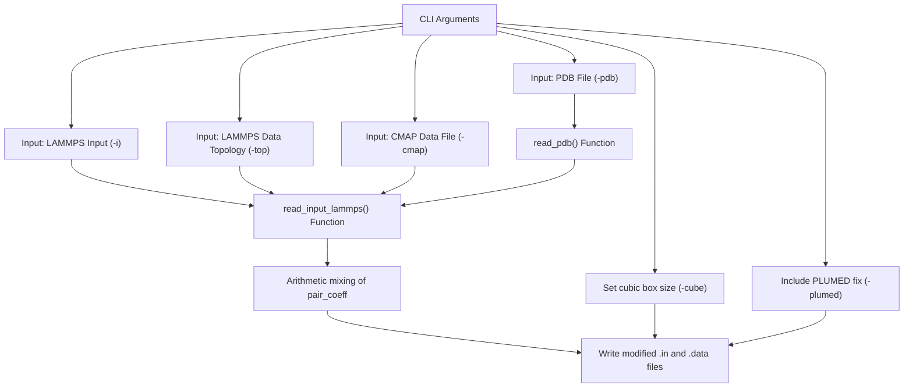
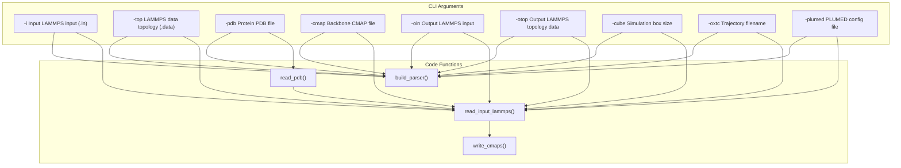

# 6.2 make_ff.py – CLI Reference

> **Relevant source files**
> * [scripts/make_ff.py](https://github.com/COSBlab/bAIes-IDP/blob/16faa7f7/scripts/make_ff.py)
> * [tutorial/bAIes/3-conversion/make_ff.py](https://github.com/COSBlab/bAIes-IDP/blob/16faa7f7/tutorial/bAIes/3-conversion/make_ff.py)
> * [tutorial/coil/2-conversion/make_ff.py](https://github.com/COSBlab/bAIes-IDP/blob/16faa7f7/tutorial/coil/2-conversion/make_ff.py)

## Purpose and Scope

This page provides a comprehensive technical reference for the **make_ff.py** script, a key component of the bAIes-IDP pipeline in stage 3 (GROMACS-to-LAMMPS conversion). The script ingests LAMMPS-format topology and data files generated by the **intermol** tool (which translates GROMACS topologies), and further prepares them for bAIes simulations by:

* Injecting backbone CMAP (correction map) cross-terms to include torsional corrections.
* Rewriting pair coefficients for the Random Coil force field when applicable.
* Configuring the simulation box size consistently for LAMMPS simulations.
* Writing the final LAMMPS input script and topology data file.
* Optionally setting output trajectory files and integrating PLUMED configuration files.

This page details the full CLI argument reference, the script’s internal data processing flow, and key functions with relevant code citations. Given the close similarity with coil tutorial counterparts, the focus here is on describing the extended features supporting the bAIes force field variant.

---

## CLI Arguments

`make_ff.py` exposes the following command-line options, parseable via `ArgumentParser` (defined in `build_parser()`):

| Argument | Type | Default | Description |
| --- | --- | --- | --- |
| `-i` | string | *None* | Input LAMMPS input script file (post-intermol `.in`) |
| `-top` | string | *None* | Input LAMMPS data topology file (post-intermol `.data` ) |
| `-pdb` | string | `"protein.pdb"` | PDB file corresponding to the protein structure |
| `-cmap` | string | `"ff.cmap"` | CMAP correction map file containing backbone crossterms |
| `-oin` | string | *None* | Output LAMMPS input script filename |
| `-otop` | string | `"conff.data"` | Output LAMMPS topology (data) filename |
| `-cube` | float | `400.0` | Simulation cubic box side length in Angstroms |
| `-oxtc` | string | `"traj.xtc"` | Output XTC trajectory file path |
| `-plumed` | string | `"plumed.dat"` | PLUMED input file to include in the LAMMPS input script |

These arguments define the input/output filesystem locations, specify the CMAP backbone correction data, and configure simulation parameters such as the cubic box size.

#### Code Location:

Argument definitions occur within `build_parser()` in `scripts/make_ff.py` at lines 8-19 [scripts/make_ff.py L8-L19](https://github.com/COSBlab/bAIes-IDP/blob/16faa7f7/scripts/make_ff.py#L8-L19)

---

## Data Flow and Processing Overview

The `make_ff.py` script processes data through several stages:

1. **Read PDB file (`read_pdb`)**:   Parses the PDB to identify backbone atom indices critical for CMAP corrections. It extracts residue types, atom numbers for backbone groups (C-1, N, CA, C, N+1), and creates ordered mappings of CMAP segments.
2. **Read input LAMMPS input script (`read_input_lammps`)**:   Parses the LAMMPS input script generated by **intermol** to: * Collect existing pair coefficients (Lennard-Jones parameters) per atom-type pairs. * Insert the `fix drycmap` CMAP cross-term integration into the input. * Rewrites or appends crucial LAMMPS commands to set up the CMAP and modify energy calculations. * Rewrite simulation box dimensions according to the `-cube` CLI parameter. * Add PLUMED fix invocation for enhanced sampling and biasing when specified.
3. **Rewrite pair coefficients (optional)**:   The script applies arithmetic mixing rules to generate missing pair coefficients for the pairwise LJ potentials. This is crucial to ensure seamless force field continuity and correct non-bonded interactions across the entire protein.
4. **Write out new input files**:   Upon processing, script writes the modified LAMMPS input script (`-oin`) and updated topology data file (`-otop`) accordingly.

### High-Level Mermaid Diagram: Data Flow in make_ff.py



Sources: `scripts/make_ff.py:8-167`()

---

## Key Functions and Their Roles

### 1. read_pdb(input_pdb: str) -> dict

* Parses PDB ATOM records line-by-line.
* Extracts atom numbers, atom types, residue numbers, and residue types.
* Creates consistent chain labels in cases where the chain ID field is missing.
* Identifies backbone atoms relevant for CMAP correction: specifically for each residue `i`, extracts atom indices for `(C of i-1, N of i, CA of i, C of i, N of i+1)`.
* Constructs a dictionary keyed by a cmap index with tuples containing residue information and atom indices.

Returns a dictionary mapping cmap indices to tuples needed for CMAP cross-term application in LAMMPS.

Refer to lines 22-81 for the complete implementation.

### 2. read_input_lammps(filename: str, data_out_file: str, cmap_file: str, outxtc: str, plumedfile: str) -> list

* Reads the LAMMPS input script (produced by **intermol**).
* Skips line containing `special_bonds`.
* Ignores original `read_data` command, replaces with a new one that includes fix `drycmap` for CMAP crossterms.
* Forces `pair_style lj/cut 2.0` to use cutoff 2.0 nm, conforming to CMAP requirements.
* Parses `pair_coeff` lines to build a dictionary of pair parameters and calculate missing pairs via arithmetic mixing rules.
* Appends `fix drycmap` clauses to activate CMAP cross-terms.
* Sets simulation box boundaries based on `-cube` argument, rewriting the corresponding box dimension lines.
* Writes remapped pair coefficients lines.
* Adds dump output commands for trajectories and finalizes with the inclusion of PLUMED integration fix referencing the provided `-plumed` file.

Returns the modified LAMMPS script lines as a list for output.

Implemented in lines 102-167.

### 3. write_cmaps(cmaps: dict, output_file: str)

* Writes CMAP backbone correction maps to a file (generally `ff.cmap`).
* The cmap input is a dictionary pairing numeric IDs with tuples describing residue pairs and associated atom indices.
* This function structures the map file commented with residue identities and the 2D matrix representing phi/psi dihedral corrections.
* Output is required by LAMMPS CMAP fix.

Lines 84-99 cover this function.

---

## Detailed CLI Argument Behavior

### Input Files:

* **`-i` Input LAMMPS script:** The manual override of LAMMPS input file created by intermol. This file is read and modified.
* **`-top` Input topology data:** The LAMMPS `.data` file specifying atom types, bonds, angles, pairs, etc. Used to extract and rewrite pair coefficients.
* **`-pdb` Protein structure file:** Used to parse atom indices and residue types for CMAP cross-term injection.
* **`-cmap` CMAP data file:** Contains backbone phi/psi correction maps applied as crossterms in the simulation.

### Output Files:

* **`-oin` Output LAMMPS input:** The modified LAMMPS input that explicitly loads the CMAP fix and PLUMED fix, respecifies pair coefficients, and sets box size.
* **`-otop` Output topology data:** The rewritten LAMMPS topology data necessary for the modified force field.
* **`-oxtc` XTC output trajectory:** Specified filename embedded in dump commands inside the LAMMPS input.
* **`-plumed` PLUMED input file:** Incorporated via a `fix pl` command in the LAMMPS input script for metadynamics or biasing.

### Simulation Box:

The cubic box is set by directly rewriting LAMMPS input lines related to the simulation box size to a symmetric cube with edges `-0.5*cube` to `0.5*cube` in each Cartesian direction. The default cube size is 400 Å, which ensures proteins can diffuse freely.

---

## Example Input-Output Workflow

```
make_ff.py \  -i input.lammps \  -top input.data \  -pdb protein.pdb \  -cmap dry_ff_20240524_correct.cmap \  -oin idp_nvt.in \  -otop idp_nvt.data \  -cube 400.0 \  -oxtc traj.xtc \  -plumed plumed.dat
```

This command will:

* Read the input `.in` and `.data` files generated by **intermol**.
* Parse the PDB file for CMAP backbone topology.
* Insert CMAP cross-term fix commands.
* Rewrite all pair potential coefficients with arithmetic mixing rules.
* Set the simulation box to 400 Å cube.
* Include PLUMED fix for enhanced sampling.
* Output final LAMMPS input (`idp_nvt.in`) and data (`idp_nvt.data`) suitable for bAIes biased simulations.

---

## Relationship to Other Scripts and Workflow Stages

* **Stage 1:** GROMACS topologies prepared by `step1-prepare_gmx.bash`.
* **Stage 2:** Distogram preprocessing generating parameters feeding into force field biases.
* **Stage 3:** `intermol` translates `.top`/`.gro` files to LAMMPS plain format.
* **Stage 3 continued:** This `make_ff.py` script modifies that LAMMPS raw output for bAIes IDP simulation compatibility.
* **Stage 4:** The final LAMMPS input drives the MD simulation with CMAP corrections and PLUMED biasing.

---

## Mapping from Natural Language Components to Code Entities



Sources: `scripts/make_ff.py:8-167`()

---

## Implementation Details and Notes

* **CMAP Injection:**   The `fix drycmap` command in LAMMPS is added referencing the CMAP file, enabling backbone torsion angle corrections crucial for IDP simulations. CMAP crossterms are attached during the modified `read_data` invocation.
* **Pair Coefficient Mixing:**   Missing LJ parameters between atom types are filled by arithmetic mixing (geometric mixing not supported out-of-the-box). This ensures no missing nonbonded interactions and compatibility with the modified force field parameters.
* **PLUMED Integration:**   The script adds `fix pl` referencing the provided PLUMED input for biasing during simulation, tightly coupling bAIes Bayesian restraints with MD.
* **Simulation Box:**   The cube size argument influences LAMMPS box dimensions. The script parses and replaces the box boundary lines accordingly, ensuring that all periodic coordinates confine the protein properly.
* **Output Files:**   The script writes new `.in` and `.data` files, fully compatible with LAMMPS for the subsequent simulation stage, maintaining force field corrections and output trajectories.

---

## Summary Table: Core Arguments Vs. Script Effect

| CLI Arg | Effect in Script | Code Section |
| --- | --- | --- |
| `-i` | Reads input LAMMPS script, modifies pair style and fixes | `read_input_lammps()` 102-167 |
| `-top` | Reads initial atomic topology data | `read_input_lammps()` |
| `-pdb` | Parses backbone atom indices / residue info for CMAP | `read_pdb()` 22-81 |
| `-cmap` | Specifies CMAP file for fix drycmap | Insertion in modified LAMMPS input |
| `-oin` | Filename for output LAMMPS input | Output writing logic (lines 166-167) |
| `-otop` | Filename for output LAMMPS topology data | Output writing |
| `-cube` | Defines simulation box size (overwrites box edges) | In `read_input_lammps()`, box rewrite logic |
| `-oxtc` | Sets trajectory dump filename within the LAMMPS input | Added in dump commands |
| `-plumed` | Includes PLUMED via fix pl command into input | Added near end of new input script |

---

# References

* `scripts/make_ff.py:8-167`
* `tutorial/bAIes/3-conversion/make_ff.py` (reference implementation variant)
* `tutorial/coil/2-conversion/make_ff.py` (random coil variant)

This reference should be used by developers and advanced users to understand, extend, or debug the force field conversion and final input preparation step in the bAIes-IDP pipeline.