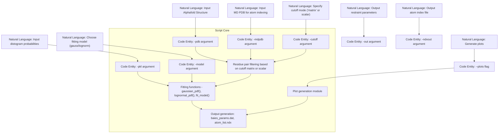

# preprocess_bAIes.py – CLI Reference

> **Relevant source files**
> * [scripts/preprocess_bAIes.py](https://github.com/COSBlab/bAIes-IDP/blob/16faa7f7/scripts/preprocess_bAIes.py)
> * [tutorial/bAIes/2-preprocessing/preprocess_bAIes.py](https://github.com/COSBlab/bAIes-IDP/blob/16faa7f7/tutorial/bAIes/2-preprocessing/preprocess_bAIes.py)
> * [tutorial/bAIes/2-preprocessing/step2-preprocess.bash](https://github.com/COSBlab/bAIes-IDP/blob/16faa7f7/tutorial/bAIes/2-preprocessing/step2-preprocess.bash)

This page provides a comprehensive technical reference for the command-line interface (CLI) of `preprocess_bAIes.py`, the key preprocessing script used in the bAIes-IDP pipeline. It covers all input arguments, explains the Baker-lab residue-pair cutoff matrix, and the Gaussian/lognormal distogram fitting models implemented in the script. This page targets developers and advanced users seeking an in-depth understanding of the preprocessing step that translates AlphaFold/ColabFold distogram data into parameter files for PLUMED and LAMMPS simulations.

---

## Purpose and Scope

The `preprocess_bAIes.py` script is a critical preprocessing utility that takes as input AlphaFold or ColabFold structural and distogram data and outputs formatted distance restraint parameters for the bAIes Bayesian inference simulations. Within the bAIes-IDP workflow, it processes distograms by fitting Gaussian or lognormal statistical noise models, filters residue pairs by sequence separation and chain interactions, and applies either a global cutoff or the Baker-lab residue-specific cutoff matrix for selecting restrained pairs. The resulting output data files contain distance restraint parameters with optimized means and standard deviations suited for downstream PLUMED MD biasing.

---

## CLI Arguments

`preprocess_bAIes.py` accepts multiple arguments for flexible input and output specification and parameter tuning:

| Argument | Type | Description | Default |
| --- | --- | --- | --- |
| `-pdb` | `str` | Input AlphaFold or ColabFold structure file (PDB or CIF format). | *Required* |
| `-mdpdb` | `str` | MD simulation PDB or CIF file, if atom indices differ from original AlphaFold file (e.g., after processing). | `same` |
| `-pkl` | `str` | Pickle file containing the distograms. If using ColabFold, the `.npy` file ending with `_prob_distributions.npy`. | *Required* |
| `-out` | `str` | Output file name to write the bAIes PLUMED parameter file (`baies_params.dat` format). | `"baies_params.dat"` |
| `-cutoff` | string/float | Cutoff for distance restraints in Angstroms. Can be a scalar (e.g. `8.0`) or `"matrix"` to use the residue pair-specific Baker-lab matrix. | `8.0` |
| `-model` | `str` | Distogram fitting noise model, either `"gauss"` (Gaussian) or `"lognorm"` (lognormal). | `"gauss"` |
| `-seqsep` | `int` | Minimum sequence separation between residue pairs. Removes neighboring residue pairs below this number. | `3` |
| `-chains` | `str` | For multichain systems, specify which interactions to consider: `"all"` (default), `"intra"` (intra-chain), or `"inter"` (inter-chain). | `"all"` |
| `-ndxout` | `str` | Output index file containing the list of atoms used in PLUMED restraints. | `"atom_list.ndx"` |
| `--plots` | flag | Flag to generate plots of distogram fitting results for quality control (saved as PDF). | *False* |
| `-plotout` | `str` | Filename for the generated distogram fitting plots, if `--plots` is specified. | `"distograms.pdf"` |
| `--verbose` | flag | Flag to increase verbosity of console output during preprocessing. | *False* |

The argument parser and help text for these options are defined in the script's `build_parser()` function, lines 16-30 [scripts/preprocess_bAIes.py L16-L30](https://github.com/COSBlab/bAIes-IDP/blob/16faa7f7/scripts/preprocess_bAIes.py#L16-L30)

---

## Baker-lab Residue-Pair Cutoff Matrix

### Motivation

Rather than using a single global distance cutoff for selecting residue-residue distance restraints, `preprocess_bAIes.py` offers the option to use a residue pair-specific cutoff matrix, developed by the Baker lab. Differences in typical contact distances among different residue types can influence the applicability of restraints, so this matrix provides refined cutoff distances tailored by amino acid pair type.

### Data Structure

The cutoff matrix is a Python dictionary keyed by tuples of residue 3-letter codes (e.g., `("GLY", "ALA")`), with values giving a tuple of a mean cutoff distance and its standard deviation, both in Angstroms:

```
cutoff_matrix = {    ("GLY", "GLY"): (4.467,0.017),    ("GLY", "ALA"): (5.201,0.269),    ...    ("TRP", "TRP"): (10.123,0.327),}
```

The matrix is symmetric, so the order of residues in the key does not affect lookup—the script automatically handles this. Only pairs present in the matrix are restrained when the `-cutoff matrix` option is specified. This matrix is extensive, covering all pairs among standard amino acids. [scripts/preprocess_bAIes.py L33-L154](https://github.com/COSBlab/bAIes-IDP/blob/16faa7f7/scripts/preprocess_bAIes.py#L33-L154)

### Usage in Code

When the `-cutoff` argument is set to `"matrix"`, the script applies this residue-pair specific cutoff to filter residue pairs during distogram processing. This means that for each residue pair, the distance restraint must fall within the matrix-specified distance window to be considered. If any residue pair is not found in the matrix, default fallback behavior applies or the pair is ignored.

---

## Distogram Fitting Models

### Background

The core of preprocessing is the statistical modeling of distogram probability distributions to extract distance constraint parameters for Bayesian biasing. The script supports two noise models for fitting the inter-residue distance distributions derived from AlphaFold or ColabFold distograms:

* **Gaussian ("gauss")**: Fits a normal distribution characterized by mean `mu` and standard deviation `sigma`.
* **Lognormal ("lognorm")**: Fits a lognormal distribution to model skewed distance distributions, also parameterized by location and scale.

### Implementation Details

* The fitting utilizes `curve_fit` from `scipy.optimize` and `lmfit.Minimizer` for parameter optimization.
* The procedure fits the probability distribution of distances for each residue pair by minimizing residuals between the predicted model PDF and the observed probability bins.
* For fitting quality checks, the `--plots` flag optionally generates visualizations (PDF) showing the empirical distogram against fitted models.
* The argument `-model` switches between `"gauss"` and `"lognorm"` fitting approaches.

### Key Functions

While the script is long and has various helper functions for residual computation, PDF calculation, and plotting, the high-level flow is:

1. **Load distogram data** from pickle (`-pkl`) or `.npy` files.
2. **Parse PDB files** (`-pdb`, `-mdpdb`) to map residue numbers and atoms.
3. **Select residue pairs** by sequence separation (`-seqsep`), chain interaction (`-chains`), and cutoff (`-cutoff`).
4. For each pair, **fit the selected model** to the distogram probability data.
5. Generate output files: * `baies_params.dat` capturing optimized parameters (mean, sigma). * `atom_list.ndx` with atom lists for PLUMED.
6. Optionally **produce fitting plots** to verify quality.

Detailed fitting function definitions reside mostly in the middle of the script (`scripts/preprocess_bAIes.py:60-200`) which includes model PDFs and residual errors.

---

## Data Flow and Key Processing Steps

The following flowchart summarizes the key data flow and processing steps implemented in `preprocess_bAIes.py`:


Sources: `scripts/preprocess_bAIes.py:16-290`()

---

## Example Usage

The typical usage pattern for `preprocess_bAIes.py` in the bAIes-IDP pipeline, as scripted in `step2-preprocess.bash` tutorial and benchmark scripts, is:

```
./preprocess_bAIes.py -pdb input_structure.pdb \                     -mdpdb md_processed.pdb \                     -pkl input_distogram.pkl \                     -out baies_params.dat \                     -model gauss \                     -cutoff matrix \                     -ndxout atom_list.ndx \                     --verbose
```

The result includes two key output files:

* `baies_params.dat`: Parameter file defining the Bayesian distance restraints for use with the PLUMED BAIES action.
* `atom_list.ndx`: Atom list index file defining the restrained atom groups.

These are then utilized to generate `plumed.dat` files integrating the BAIES bias into MD simulations [tutorial/bAIes/2-preprocessing/step2-preprocess.bash L18-L26](https://github.com/COSBlab/bAIes-IDP/blob/16faa7f7/tutorial/bAIes/2-preprocessing/step2-preprocess.bash#L18-L26)

---

## Detailed Argument Description and Processing Behavior

### -pdb and -mdpdb

* The primary PDB/CIF input (`-pdb`) should be the raw AlphaFold or ColabFold output structure.
* The optional `-mdpdb` lets users specify a modified PDB reference corresponding to atom indexing used in MD simulations due to added/removal of waters, ions, or alternative formats. Default `"same"` assumes no changes.
* These files are parsed with structural data extracted including chain identifiers and residue names.

### -pkl

* This is the main source of distogram data, containing probabilistic distance distributions.
* The distograms can be pickled Python objects or `.npy` arrays conforming to ColabFold output naming.
* The script loads and reshapes these matrices to extract probability bins for fitting.

### -cutoff

* When set to a scalar (e.g., `8.0`), all pairs closer than this global distance are selected.
* `"matrix"` enables using the residue-specific cutoff matrix, which adapts cutoff per residue pair identity.
* This helps omission of unlikely or overly flexible pairs and improves restraint specificity.

### -seqsep

* Defines a minimum sequence separation between residue pairs to exclude trivial neighbors.
* Default 3 means immediate neighbors and nearby residues, typical for helices, are kept restrained, while very local contacts are excluded.

### -chains

* Allows selection of residue pairs based on chain relationship: * `"all"`: all pairs, including intra- and inter-chain contacts * `"intra"`: restrict to pairs within the same chain only * `"inter"`: restrict to pairs between different chains (useful for complexes)

### -model

* `"gauss"` fits a Gaussian distribution for the distance probabilities.
* `"lognorm"` applies a lognormal fit, useful for asymmetrical distributions.

### --plots and -plotout

* Enable diagnostic plotting of the fitting results to assess fit quality.
* Plots include empirical and fitted distributions for selected residue pairs.

### --verbose

* Prints detailed runtime information and fitting statistics.

---

## Code Architecture and Key Functions

### Argument Parsing

* `build_parser()` (lines 16-30) defines all CLI options and parsing logic.

### Cutoff Matrix

* Defined as `cutoff_matrix` dict (lines 33-154), used in function(s) that filter residue pairs.

### Distogram Processing

* Loading distograms from pickle or `.npy` files.
* Parsing PDB files to identify residue and atom mappings.
* Filtering residue pairs according to provided arguments.

### Fitting Models

* Separate implementations of Gaussian and lognormal probability density functions.
* `lmfit`-based minimization procedure for parameter estimation.
* Residual calculation functions for numerical fitting.

### Output Generation

* Saving parameters in `baies_params.dat` format with fields: atom indices, means, sigmas.
* Writing atom list (`atom_list.ndx`) for PLUMED indexing.

---

## Diagram: From Natural Language Inputs to Code Entities in preprocess_bAIes.py



Sources: `scripts/preprocess_bAIes.py:16-300`()

---

## Diagram: High-Level Data Flow in bAIes-IDP Using preprocess_bAIes.py


Sources: `scripts/preprocess_bAIes.py:1-350`, `tutorial/bAIes/2-preprocessing/step2-preprocess.bash:18-26`()

---

## Summary Table of CLI Arguments

| Flag | Description | Default |
| --- | --- | --- |
| `-pdb` | Input AlphaFold/ColabFold structure PDB/CIF file. | *Required* |
| `-mdpdb` | MD simulation PDB/CIF file with potentially altered atom indices. | `"same"` |
| `-pkl` | Distogram pickle or ColabFold `.npy` probability distributions file. | *Required* |
| `-out` | Output file for bAIes PLUMED distance restraint parameters. | `"baies_params.dat"` |
| `-cutoff` | Distance cutoff either as scalar (e.g., `8.0` Å) or `"matrix"` to use Baker lab residue-pair cutoffs. | `8.0` |
| `-model` | Distogram fitting model: `"gauss"` or `"lognorm"`. | `"gauss"` |
| `-seqsep` | Minimum residue sequence separation threshold. | `3` |
| `-chains` | Consider only `"intra"`-chain, `"inter"`-chain, or `"all"` residue pairs. | `"all"` |
| `-ndxout` | Output PLUMED atom list index file for restrained atoms. | `"atom_list.ndx"` |
| `--plots` | Enable generation of distogram fitting plots for quality check. | *False* |
| `-plotout` | Filename for plots if `--plots` is set. | `"distograms.pdf"` |
| `--verbose` | Enable verbose output during preprocessing. | *False* |

---

## Extended Explanation: Fitting Procedure in preprocess_bAIes.py

The distogram fitting is performed as follows:

* The distogram probability density for each residue pair is extracted from the input data.
* Initial guesses for fitting parameters (`mu`, `sigma`) come from empirical mean and standard deviation estimates of the histogram.
* Using nonlinear least squares minimization (`lmfit.Minimizer`), the script fits the selected model (`gauss` or `lognorm`) to the observed probabilities.
* Residue pairs filtered out by cutoff or sequence/chain constraints are skipped.
* For each fitted pair, fitted parameters are stored with residue and atom indices, and written out.
* Verbose logging prints fitting status and warnings if convergence is poor.

The reason for two noise models is to accommodate variation in distogram shape depending on residue flexibility and contact geometry.

Sources: `scripts/preprocess_bAIes.py:70-160`()

---

# Sources

* `scripts/preprocess_bAIes.py:1-300`
* `tutorial/bAIes/2-preprocessing/step2-preprocess.bash:18-26`