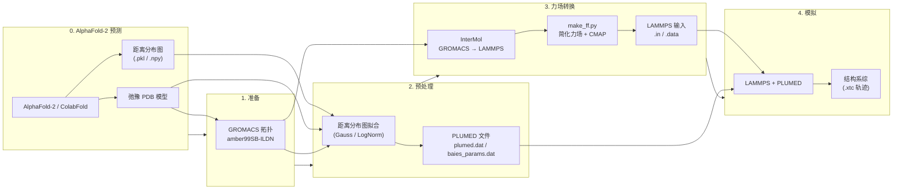

---
slug:1-overview
blog_type:normal
---


**bAIes-IDP** 是一个计算流程，通过利用嵌入在 AlphaFold-2 预测中的距离信息，生成本质无序蛋白质 (IDPs) 和多结构域蛋白质的原子级结构系综。bAIes-IDP 并未将 AlphaFold-2 视为单结构预言机，而是提取完整的**距离分布图**（即残基间距离的预测概率分布），并将其转换为驱动分子动力学采样的贝叶斯约束，从而生成能够如实反映无序序列内在不确定性的构象多样化系综。


该方法的介绍详见：V. Schnapka, T. Morozova, S. Sen, M. Bonomi. *Atomic resolution ensembles of intrinsically disordered proteins with Alphafold.* BioRxiv (2025). doi: [10.1101/2025.06.18.660298](https://doi.org/10.1101/2025.06.18.660298)

来源: [README.md](/README.md#L1-L54)

## bAIes-IDP 的功能

传统的结构预测工具（如 AlphaFold-2）通常输出单一的、往往过于紧凑的模型——这对于本质无序或结构域之间具有柔性连接段的蛋白质而言，是一种很差的表征。bAIes-IDP 通过重新利用 AlphaFold-2 内部已计算出的**原始距离分布图数据**来解决此问题。对于每一个残基对，这些距离分布图编码了距离的完整概率分布。bAIes-IDP 读取这些分布，使用解析模型（高斯或对数正态模型）对其进行拟合，并将得到的参数作为**贝叶斯偏置势**（通过 PLUMED 的 `BAIES` 模块）注入到 LAMMPS 分子动力学模拟中。最终生成的系综对与 AlphaFold-2 自身距离预测相一致的构象空间进行采样——而不会坍缩成单一静态结构。

<CgxTip>该流程提供了两种不同的采样模式：**bAIes**（使用 Jeffreys 先验，保留最大不确定性）和 **bAIes-N**（无先验，赋予距离分布图峰值更大权重），此外还提供了一个用于对比的**无规卷曲**基线。先验通过 `step2-preprocess.bash` 中的一行代码控制——将 `PRIOR=JEFFREYS` 更改为 `PRIOR=NONE` 即可在 bAIes 和 bAIes-N 之间切换。</CgxTip>

来源: [README.md](/README.md#L7-L11), [scripts/step2-preprocess.bash](/scripts/step2-preprocess.bash#L14-L15)

## 流程架构

bAIes-IDP 流程通过四个连续阶段将 AlphaFold-2 预测转化为可用于模拟的系综。每个阶段在其独立的工作目录中自包含，并生成供下一阶段使用的明确输出产物。



来源: [tutorial/bAIes/README.md](/tutorial/bAIes/README.md#L7-L149), [scripts/README.md](/scripts/README.md#L10-L15)

## 流程阶段概览

| 阶段 | 目的 | 核心脚本 | 输入 | 输出 |
|:-----:|---------|------------|--------|---------|
| **0 — 输入** | 运行 AlphaFold-2 或 ColabFold | *(外部)* | 蛋白质序列 | PDB 模型 + 距离分布图 (`.pkl` / `.npy`) |
| **1 — 准备** | 从 PDB 构建 GROMACS 拓扑 | `step1-prepare_gmx.bash` | 弛豫 PDB | `.gro`, `.top`, `.itp`, `.pdb` |
| **2 — 预处理** | 拟合距离分布图并生成 PLUMED 约束 | 通过 `step2-preprocess.bash` 执行 `preprocess_bAIes.py` | GROMACS PDB, AF2 PDB, 距离分布图 | `plumed.dat`, `baies_params.dat`, `atom_list.ndx` |
| **3 — 转换** | 使用简化力场转换为 LAMMPS | 通过 `step3-conversion.bash` 执行 `make_ff.py` | `.gro`, `.top`, `.pdb`, CMAP 文件 | `idp_nvt.in`, `idp_nvt.data` |
| **4 — 模拟** | 使用 bAIes 偏置运行系综 MD | `lmp -in idp_nvt.in` | 所有 LAMMPS + PLUMED 文件 | 轨迹 `.xtc` |

来源: [scripts/README.md](/scripts/README.md#L10-L15), [tutorial/bAIes/README.md](/tutorial/bAIes/README.md#L36-L147)

## 三种采样模式

bAIes-IDP 提供三种不同的采样策略，每种策略基于不同的物理假设生成系综：

| 模式 | 先验 | 行为 | 适用场景 |
|------|-------|----------|----------|
| **bAIes** | Jeffreys | 最大熵采样；不利于短距离 | IDP 的主要模式；保持构象多样性 |
| **bAIes-N** | 无 | 对距离分布图峰值的偏置更强 | 当距离分布图置信度较高时；较不保守 |
| **Coil** | *(无)* | 使用简化力场的无偏无规卷曲 | 基线对比；不应用 AlphaFold-2 约束 |

**bAIes** 和 **bAIes-N** 模式均通过 PLUMED 的 `BAIES` 插件使用源自 AlphaFold-2 距离分布图的约束，两者的区别仅在于贝叶斯先验。**Coil** 模式完全跳过预处理步骤，并使用简化的 amber99SB-ILDN 力场运行无偏模拟，作为零模型用于验证 bAIes 约束能否显著提升系综质量。

来源: [scripts/step2-preprocess.bash](/scripts/step2-preprocess.bash#L14-L16), [benchmark/README.md](/benchmark/README.md#L1-L4)

## 软件栈

bAIes-IDP 将多个专用科学软件包编排为一个内聚的流程：

| 组件 | 角色 | 版本 / 备注 |
|-----------|------|-----------------|
| **AlphaFold-2** 或 **ColabFold** | 结构与距离分布图预测 | 需要带有 distmat 输出的 ColabFold 变体 |
| **GROMACS** | 拓扑生成 (amber99SB-ILDN) | 仅在步骤 1 中用于 `pdb2gmx` |
| **InterMol** | GROMACS → LAMMPS 格式转换 | Python 库；通过 `baies.yml` conda 环境安装 |
| **LAMMPS** (2 Aug 2023) | MD 模拟引擎 | 必须使用 `patch_cmap.txt` 打补丁以修正 CMAP |
| **PLUMED** (v2.10) | 偏置势框架 | 必须包含 `BAIES` 模块 |
| **Python 3.8** | 预处理与转换脚本 | NumPy, SciPy, lmfit 用于距离分布图拟合 |

<CgxTip>LAMMPS 需要一个特定的 CMAP 补丁 (`patch_cmap.txt`)，该补丁在 `installation/` 目录中提供。若无此补丁，骨架二面角校正图将无法正常工作。请在编译前应用该补丁：`patch ./src/MOLECULE/fix_cmap.cpp < patch_cmap.txt`</CgxTip>

来源: [README.md](/README.md#L19-L53), [installation/README.md](/installation/README.md#L1-L99)

## 仓库结构

```
bAIes-IDP/
├── scripts/                  # 核心流程脚本
│   ├── step1-prepare_gmx.bash       # GROMACS 拓扑生成
│   ├── step2-preprocess.bash        # 距离分布图读取与 PLUMED 文件生成
│   ├── preprocess_bAIes.py          # 距离分布图拟合与约束参数化
│   ├── step3-conversion.bash        # GROMACS → LAMMPS 转换编排
│   └── make_ff.py                   # 力场简化与 CMAP 积分
├── tutorial/                 # 分步完整示例
│   ├── bAIes/                # 完整 bAIes 流程 (4 步)
│   └── coil/                 # 无规卷曲流程 (3 步，无预处理)
├── benchmark/                # 用于复现已发表模拟的输入文件
│   ├── bAIes/                # bAIes 模式输入 (19 个蛋白质)
│   ├── bAIes-N/              # bAIes-N 模式输入 (17 个蛋白质)
│   └── coil/                 # Coil 模式输入 (17 个蛋白质)
└── installation/             # Conda 环境与 LAMMPS CMAP 补丁
    ├── baies.yml             # Conda 环境配置
    └── patch_cmap.txt        # LAMMPS CMAP 源码补丁
```

来源: [README.md](/README.md#L13-L18)

## 基准系统

该仓库包含 19 个基准蛋白质系统，涵盖三种结构行为类别，能够根据已知实验数据验证 bAIes 预测：

| 类别 | 蛋白质 | 残基范围 | 描述 |
|----------|----------|:-------------:|-------------|
| **完全无序** | Ab40, p61_Hck, emerin_67-170, His-PknG_1-75, Colicin_N_T_domain, Hug1 | 40 – 105 | 无稳定结构；系综至关重要 |
| **结构基序** | PaaA2, Nt-SOCS5, Alb3-A3CT, idr_SSRP1, UBact, FCP1 | 64 – 101 | 部分有序且带有无序侧翼 |
| **AF2 预测误差** | asyn, ACTR, NHE1, Nsp2_CtlIDR, spm_FrpC, drkN | 45 – 179 | AF2 错误地预测为紧凑结构 |
| **多结构域** | GS8, Ubq2, Ubq3 | 162 – 486 | 结构域之间具有柔性连接段 |

来源: [benchmark/README.md](/benchmark/README.md#L9-L33)

## 接下来的去向

既然你已经了解了 bAIes-IDP 是什么及其流程的组织方式，请按照以下阅读路径开始运行：

1. **[快速开始](2-quick-start)** — 在几分钟内端到端运行 PaaA2 教程
2. **[软硬件要求](3-software-and-hardware-requirements)** — 在首次运行前安装所有依赖项
3. **[流程架构](4-pipeline-architecture)** — 深入了解各阶段间的数据流和文件依赖关系
4. **[基准蛋白质系统](13-benchmark-protein-systems)** — 探索 19 个验证系统及其特征