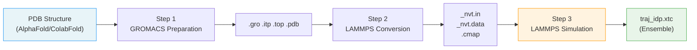

---
slug:10-random-coil-simulations
blog_type:normal
---


无规卷曲模拟在 bAIes-IDP 框架中作为**基线零模型**——这是一个纯粹由物理力场生成的系综，不包含任何源自 AlphaFold 的约束。bAIes 模拟通过 PLUMED 利用贝叶斯距离偏置来增强力场，而无规卷曲模拟则完全依赖于由残基对 CMAP 二面角映射图校正的 amber99SB-ILDN 力场。这种精简的流程生成了参考系综，用于衡量 bAIes 的增强效果，使其在基准测试和验证中不可或缺。

## 流程概述

无规卷曲流程是一个**三步工作流**——明显短于四步的 bAIes 流程，因为它完全跳过了 AlphaFold 距离直方图的预处理和 PLUMED 的生成。这种结构上的简化反映了核心区别：无规卷曲模拟不需要外部结构预测。



| 步骤 | 目录 | 输入 | 输出 | 关键工具 |
|------|-----------|-------|--------|----------|
| 1. 准备 | `1-preparation/` | PDB 文件 | `.gro`, `.itp`, `.top`, `.pdb` | GROMACS `pdb2gmx` + `trjconv` |
| 2. 转换 | `2-conversion/` | GROMACS 文件 + CMAP | `_nvt.in`, `_nvt.data` | `intermol` + `make_ff.py` |
| 3. 模拟 | `3-simulation/` | LAMMPS 输入 | `traj_idp.xtc` | LAMMPS (`lmp`) |

来源: [README.md](/tutorial/coil/README.md#L1-L81)

## 步骤 1：GROMACS 准备

该流程首先使用 **amber99SB-ILDN** 力场将 PDB 结构转换为 GROMACS 拓扑文件。输入的 PDB 文件可以来源于任何途径——AlphaFold 弛豫模型、ColabFold 预测，甚至实验结构——因为无规卷曲模拟完全忽略了预测的距离信息。

以 PDB 文件作为参数执行准备脚本：

```bash
./step1-prepare_gmx.bash relaxed_model_4_ptm_pred_0.pdb
```

该脚本内部运行两个 GROMACS 命令。首先，`gmx pdb2gmx` 将 PDB 转换为 GROMACS 坐标（`.gro`）、拓扑（`.top`）和包含拓扑（`.itp`）文件，选择力场选项 6（amber99SB-ILDN）并禁用水分子。其次，`gmx trjconv` 对结构重新居中，并输出一致的 `.pdb` 文件供下游原子索引使用：

```bash
name=idp
echo 6 | gmx pdb2gmx -f ${1} -water none -o ${name}.gro -p ${name}.top -i ${name}.itp -ignh
echo 0 | gmx trjconv -f ${name}.gro -s ${name}.gro -o ${name}.pdb
```

`-ignh` 标志会忽略输入 PDB 中的氢原子，让 GROMACS 根据力场模板重新构建它们。生成的 `.top` 文件引用了 `amber99sb-ildn.ff/forcefield.itp`，并包含完整的原子规格，如电荷、质量、键参数、角度参数、二面角参数以及隐式溶剂设置。

来源: [step1-prepare_gmx.bash](/tutorial/coil/1-preparation/step1-prepare_gmx.bash#L1-L7), [idp.top](/tutorial/coil/1-preparation/idp.top#L1-L30)

## 步骤 2：LAMMPS 转换

此步骤执行**两阶段转换**：首先通过 `intermol` 库将 GROMACS 文件转换为中间 LAMMPS 格式，然后应用 `make_ff.py` 脚本生成最终可用于模拟的 LAMMPS 输入文件及简化力场。

**环境要求**：运行前需激活 `baies` conda 环境，因其包含 `intermol` 包：

```bash
conda activate baies
./step2-conversion.bash idp.gro idp.pdb idp.top
```

### 阶段 1：GROMACS → LAMMPS (intermol)

`intermol` 库处理力场参数（键、键角、二面角和配对系数）从 GROMACS 格式到 LAMMPS 格式的机械转换。这会生成中间文件（`idp_converted.input` 和 `idp_converted.lmp`），其中包含直接转换结果，但缺少 CMAP 校正和模拟协议。

### 阶段 2：力场修改 (make_ff.py)

`make_ff.py` 脚本是核心转换引擎。它读取中间 LAMMPS 文件和 CMAP 校正映射图，然后生成最终的 `_nvt.in` 和 `_nvt.data` 文件。该脚本执行以下关键操作：

- **LJ 截断简化**：将原始配对样式替换为 `lj/cut 2.0`（2.0 Å 截断），并显式写出所有配对系数（包括通过算术混合的交叉项：ε_ij = √(ε_i·ε_j), σ_ij = 0.5·(σ_i + σ_j)），截断距离设为 2^(1/6)·σ（LJ 势能最小值处）。
- **CMAP 集成**：插入 `fix drycmap all cmap` 指令，并将 CMAP 交叉项数据追加到拓扑文件中，通过从 PDB 读取残基对类型来分配正确的校正映射图。
- **模拟盒子**：设置立方体模拟盒子（教程中默认为 200 Å；可通过 `-cube` 参数配置，脚本中默认为 400 Å）。
- **恒温器协议**：追加在 298.1 K 下的 NVE 积分与 CSVR 恒温器。
- **能量最小化**：在生产动力学之前插入最小化步骤。
- **轨迹输出**：配置每 10,000 步导出一次 XTC（在 1 fs 步长下为 10 ps）。

包含所有参数的转换脚本调用如下：

```bash
./make_ff.py -i ${name}_converted.input \
             -top ${name}_converted.lmp \
             -pdb ${pdb} -cmap ${cmap} \
             -oin ${name}_nvt.in \
             -otop ${name}_nvt.data \
             -cube 200.0 \
             -oxtc traj_${name}.xtc
```

| `make_ff.py` 参数 | 描述 | 默认值 |
|------------------------|-------------|---------|
| `-i` | 输入 LAMMPS 文件 (来自 intermol) | 必需 |
| `-top` | 输入拓扑 LAMMPS 文件 | 必需 |
| `-pdb` | 用于 CMAP 原子索引的 PDB 文件 | `protein.pdb` |
| `-cmap` | CMAP 校正映射图文件 | `ff.cmap` |
| `-oin` | 输出 LAMMPS 输入文件 | 必需 |
| `-otop` | 输出拓扑数据文件 | `conff.data` |
| `-cube` | 立方体盒子边长 (Å) | `400.0` |
| `-oxtc` | 轨迹输出文件名 | `traj.xtc` |

转换完成后，中间文件（`*_converted.input`、`*_converted.lmp`、`*_conversion.log`）将被自动删除。

来源: [step2-conversion.bash](/tutorial/coil/2-conversion/step2-conversion.bash#L1-L32), [make_ff.py](/tutorial/coil/2-conversion/make_ff.py#L1-L235)

## 步骤 3：运行模拟

在 LAMMPS 输入文件就位后，只需一条命令即可启动无规卷曲模拟：

```bash
lmp -in idp_nvt.in
```

### 所需文件

模拟目录必须包含：

| 文件 | 用途 |
|------|---------|
| `idp_nvt.in` | 包含力场、积分和输出设置的 LAMMPS 输入脚本 |
| `idp_nvt.data` | 拓扑数据：原子、键、键角、二面角、CMAP 交叉项 |
| `cmap_20240524.cmap` | 残基对二面角校正映射图 (φ/ψ 网格) |
| `idp.pdb` | PDB 参考文件 (用于 GROMACS 轨迹分析工具) |

### 力场组成

LAMMPS 中的无规卷曲力场由四种相互作用类型组成，均源自带有 CMAP 校正的 amber99SB-ILDN：

```
bond_style hybrid harmonic
angle_style hybrid harmonic
dihedral_style hybrid multi/harmonic charmm
pair_style lj/cut 2.0
fix drycmap all cmap cmap_20240524.cmap
```

**CMAP 校正**是区别于通用 amber99SB-ILDN 模拟的关键要素。每个残基对（如 `ARG-XXX`、`PRO-XXX`）都有一个 24×24 的 φ/ψ 二面角能量校正网格，以逐残基的方式调节主链偏好。这些校正编码了残基特定的构象倾向，能够消除二级结构偏置，推动系综趋向无规卷曲行为。

来源: [idp_nvt.in](/tutorial/coil/3-simulation/idp_nvt.in#L1-L25)

### 积分与恒温器

模拟协议遵循两阶段方法：

1. **能量最小化**：`minimize 1.0e-4 1.0e-6 10000 100000` —— 使用 10⁻⁴（能量）和 10⁻⁶（力）的容差阈值消除初始结构中的空间位阻，最多进行 10,000 次迭代和 100,000 次力评估。

2. **生产动力学**：NVE 积分（`fix 1 all nve`）耦合 CSVR 恒温器（`fix 2 all temp/csvr 298.1 298.1 $(100.0*dt) <seed>`），在 **298.1 K** 下运行，耦合时间为 100 fs。CSVR（通过速度重缩放进行正则采样）恒温器在维持近 NVE 动力学>的同时提供严格的正则采样。

```
timestep 1.0          # 1 femtosecond
fix 1 all nve
fix 2 all temp/csvr 298.1 298.1 $(100.0*dt) 1679636
```

<CgxTip>CSVR 种子在转换时随机生成。若需可复现的模拟，请在 `idp_nvt.in` 中手动将种子整数设为固定值。</CgxTip>

来源: [idp_nvt.in](/tutorial/coil/3-simulation/idp_nvt.in#L383-L388)

### 可配置的模拟参数

`idp_nvt.in` 末尾的两行控制着模拟输出和持续时间：

| 行 | 默认值 | 含义 |
|------|---------|---------|
| `dump 1 all xtc 10000 traj_idp.xtc` | 每 10,000 步 | 轨迹保存间隔 (在 1 fs 步长下为 10 ps) |
| `run 2000000000` | 2 × 10⁹ 步 | 总模拟时长 (在 1 fs 步长下为 2 μs) |

如需更长的生产运行或不同的采样频率，可直接编辑这些值。例如，要运行 5 μs 并以 100 ps 间隔保存帧：

```
dump 1 all xtc 100000 traj_idp.xtc
run    5000000000
```

来源: [README.md](/tutorial/coil/README.md#L60-L81), [idp_nvt.in](/tutorial/coil/3-simulation/idp_nvt.in#L387-L388)

## 轨迹分析

XTC 轨迹格式与 GROMACS 分析工具兼容。两个常用的后处理命令如下：

**检查轨迹元数据：**
```bash
gmx check -f traj_idp.xtc
```

**降采样至 100 ps 帧**（减小文件大小以便存储和下游分析）：
```bash
gmx trjconv -f traj_idp.xtc -s idp.pdb -o traj_idp_dt100ps.xtc -dt 100
```

`-s idp.pdb` 标志为 `trjconv` 提供了单晶胞和拓扑信息所需的结构参考。`-dt 100` 标志以 100 ps 间隔提取帧。

来源: [README.md](/tutorial/coil/README.md#L75-L81)

## 无规卷曲 vs. bAIes：核心差异

理解两个流程之间的结构差异，有助于明确为何无规卷曲可作为零模型：

| 方面 | 无规卷曲 | bAIes |
|--------|-------------|-------|
| 流程步骤 | 3 (准备 → 转换 → 模拟) | 4 (准备 → 预处理 → 转换 → 模拟) |
| AlphaFold 距离直方图 | 未使用 | 必需输入 |
| PLUMED 约束 | 无 | 通过 `plumed.dat` 施加贝叶斯距离偏置 |
| `make_ff.py` | 无 `-plumed` 参数 | 在 LAMMPS 输入中包含 `fix pl all plumed` |
| `baies_params.dat` | 模拟中未使用 | 包含每个约束对的 μ, σ |
| 物理力场 | 相同 | 相同 |
| CMAP 校正 | 相同 | 相同 |
| 系综特征 | 不受预测偏置影响 | 偏向 AF2 距离分布 |

两个流程共享**相同的基础物理力场**——带有相同 CMAP 二面角校正和 LJ 参数的 amber99SB-ILDN。唯一的区别在于是否激活基于 PLUMED 的贝叶斯约束。这种受控差异使得卷曲系综成为理想的基线：bAIes 系综中的任何结构偏差都可以归因于源自 AlphaFold 的约束，而非力场伪影。

<CgxTip>在进行基准测试时，务必使用与相应 bAIes 模拟相同的模拟参数（步长、恒温器、盒子大小、运行时长）来运行无规卷曲模拟，以确保比较的公平性。</CgxTip>

来源: [README.md](/tutorial/coil/README.md#L1-L81), [README.md](/tutorial/bAIes/README.md#L1-L151), [make_ff.py (coil)](/tutorial/coil/2-conversion/make_ff.py#L14-L23), [make_ff.py (bAIes)](/scripts/make_ff.py#L14-L24)

## 基准系统

所有 18 种基准蛋白质的预构建无规卷曲输入文件可在 `benchmark/coil/` 下获取。每个目录包含三个可直接运行的文件：

| 文件 | 描述 |
|------|-------------|
| `<protein>_nvt.in` | LAMMPS 输入脚本 |
| `<protein>_nvt.data` | 拓扑和力场数据 |
| `dry_ff_20240524_correct.cmap` | CMAP 校正映射图 |

基准系统包括：ACTR, Ab40, Alb3-A3CT, Colicin_N_T_domain, FCP1, His-PknG_1-75, Hug1_, NHE1, Nsp2_CtlIDR, Nt-SOCS5, PaaA2, UBact, asyn, drkN, emerin_67-170, idr_SSRP1, p61_Hck, 和 spm_FrpC。这些系统与 bAIes 及 bAIes-N 基准集直接对应，从而能够进行系统的 [bAIes vs bAIes-N vs Coil](14-baies-vs-baies-n-vs-coil) 比较。

来源: [benchmark/coil/](/benchmark/coil/)

## 后续步骤

- 按照[快速入门](2-quick-start)指南设置你自己的无规卷曲模拟
- 在 [CMAP 校正映射图](8-cmap-correction-maps)中了解 CMAP 校正映射图如何塑造能量景观
- 在 [bAIes vs bAIes-N vs Coil](14-baies-vs-baies-n-vs-coil)中比较无规卷曲与 bAIes 及 bAIes-N 系综
- 在[模拟参数调优](16-simulation-parameter-tuning)中为生产运行调整模拟参数