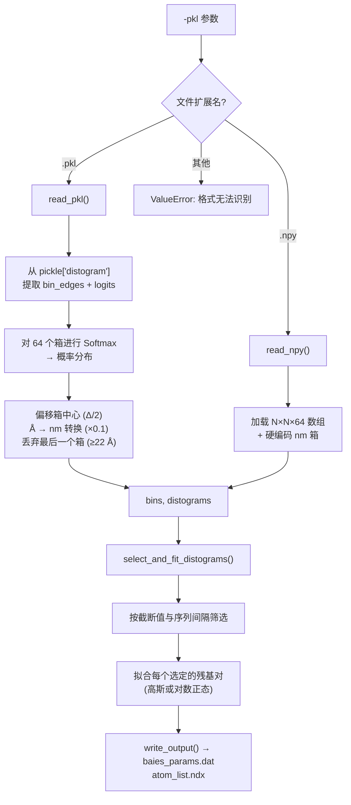

---
slug:11-alphafold-2-and-colabfold-inputs
blog_type:normal
---


bAIes-IDP 流水线的结构先验源自结构预测引擎生成的**距离图**（distograms）——即残基对距离的概率分布。这些距离图编码了 AlphaFold-2 或 ColabFold 对残基间距离的统计置信度，是区分 bAIes 系综与普通随机线团模拟的核心输入。本页详细介绍了两种受支持的预测后端、其输出格式，以及 bAIes-IDP 如何使用它们。

## 受支持的预测后端

bAIes-IDP 接受来自两种来源的距离图，每种都有特定的文件格式和分箱方案。流水线根据文件扩展名自动检测格式，并路由至相应的读取函数。

| 属性 | AlphaFold-2 (本地) | ColabFold (距离矩阵) |
|:---|:---|:---|
| **距离图文件** | `result_model_X_ptm_pred_X.pkl` | `alphafold2_ptm_model_X_seed_XXX_prob_distributions.npy` |
| **格式** | Python pickle (`.pkl`) | NumPy 数组 (`.npy`) |
| **分箱** | 64 个箱，2–22 Å，Δ = 0.3125 Å | 63 个箱，自定义非均匀 (nm) |
| **存储键** | `data['distogram']['logits']` + `data['distogram']['bin_edges']` | 直接 N×N×64 概率数组 |
| **转换** | 对 logits 进行 Softmax → 概率 | 预计算的概率 |
| **PDB 模型** | `relaxed_model_X_ptm_pred_X.pdb` | `ranked_0.pdb` (或等效文件) |
| **参考实现** | [google-deepmind/alphafold](https://github.com/google-deepmind/alphafold) | [zshengyu14/ColabFold_distmats](https://github.com/zshengyu14/ColabFold_distmats/blob/main/AlphaFold2.ipynb) |

来源：[preprocess_bAIes.py](scripts/preprocess_bAIes.py#L39-L49), [preprocess_bAIes.py](scripts/preprocess_bAIes.py#L415-L450), [README.md](README.md#L25-L28)

## AlphaFold-2 Pickle 格式

在本地运行 AlphaFold-2 时，五个模型循环中的每一个都会生成一个结果 pickle 文件。bAIes 流水线读取**其中一个**此类文件（通常是排名最高的模型）作为其距离图来源。该 pickle 包含一个嵌套字典，键为 `'distogram'`，其本身包含两个数组：

- **`bin_edges`**：一个 64 元素的数组，范围跨度为 2.0–22.0 Å，均匀间距为 Δ = 0.3125 Å。最后一个箱是距离 ≥ 22 Å 的兜底箱，在处理过程中会被丢弃。
- **`logits`**：一个 N×N×64 的原始对数几率分数张量，其中 N 为查询序列中的残基数。

`read_pkl` 函数对 64 个箱应用 **softmax** 归一化，将 logits 转换为合适的概率分布，然后将箱中心偏移 Δ/2，并将单位从埃（Å）转换为纳米（×0.1）。最后一个箱（≥ 22 Å）会被排除在下游拟合之外。代码中也实现了备用的 `sigmoid` 转换路径，但 softmax 是默认选项。

来源：[preprocess_bAIes.py](scripts/preprocess_bAIes.py#L415-L438)

## ColabFold NumPy 格式

ColabFold 距离矩阵实现将以 `_distmat` 结尾的子目录中的距离图输出为 `.npy` 文件。每个文件遵循命名规范 `alphafold2_ptm_model_X_seed_XXX_prob_distributions.npy`，并存储一个预计算的 N×N×64 概率数组——无需 softmax 转换。

与均匀的 AF2 分箱不同，ColabFold 的分箱在纳米空间中是**非均匀的**（硬编码范围从 0.2156 nm 到 2.153 nm）。这反映了修改版 ColabFold notebook 的内部表示。`read_npy` 函数直接加载数组，并与其固定的箱中心一同返回。

来源：[preprocess_bAIes.py](scripts/preprocess_bAIes.py#L440-L450)

## 各后端的必需输入文件

除距离图外，两个后端还必须生成一个**弛豫 PDB 模型**，用作 MD 模拟的起始结构。`0-inputs` 目录中期望的完整输入集结构如下：

### AlphaFold-2 输入目录

```
0-inputs/
└── <Protein>_AF2/
    └── result_model_4_ptm_pred_0.pkl   # 距离图 pickle (选定的一个模型)
```

同样需要弛豫 PDB (`relaxed_model_4_ptm_pred_0.pdb`)，但它由 GROMACS 准备步骤 (`step1-prepare_gmx.bash`) 直接使用，而不是预处理脚本。

### ColabFold 输入目录

```
0-inputs/
└── <Protein>_Colabfold/
    ├── <Protein>_XXXX.a3m                                    # MSA 比对 (参考信息)
    ├── <Protein>_XXXX_scores_rank_001_*.json                 # 各模型得分
    ├── <Protein>_XXXX_predicted_aligned_error_v1.json        # PAE 矩阵
    ├── <Protein>_XXXX_pae.png                                # PAE 图 (可视化检查)
    ├── <Protein>_XXXX_plddt.png                              # pLDDT 图 (可视化检查)
    ├── config.json                                           # 运行配置
    └── <Protein>_XXXX_distmat/                               # 距离图子目录
        ├── alphafold2_ptm_model_1_seed_000_prob_distributions.npy
        ├── alphafold2_ptm_model_1_seed_000_mean.csv
        ├── alphafold2_ptm_model_1_seed_000_std.csv
        ├── alphafold2_ptm_model_1_seed_000_12A_prob.csv
        └── ... (模型 2–5 重复)
```

`.csv` 文件（mean、std、12A_prob）**不会被** bAIes-IDP 预处理使用——它们是供人工检查的补充输出。仅读取 `_prob_distributions.npy` 文件。

来源：[tutorial/bAIes/README.md](tutorial/bAIes/README.md#L12-L38)

## 格式自动检测与处理流程

预处理流水线根据传递给 `-pkl` 参数的文件扩展名自动检测距离图来源。下图说明了输入解析如何流向距离图读取与拟合：



关键的调度逻辑位于 `main` 函数中，它会检查 `pkl_file.endswith('.pkl')` 还是 `.npy`，并对其他任何格式抛出 `ValueError`。这意味着预处理脚本在其下游逻辑中是**格式无关的**——一旦加载了箱和距离图，无论来源如何，拟合与输出流水线都是完全相同的。

来源：[preprocess_bAIes.py](scripts/preprocess_bAIes.py#L886-L900), [preprocess_bAIes.py](scripts/preprocess_bAIes.py#L39-L49)

## 各后端的命令行调用

`step2-preprocess.bash` 脚本封装了 `preprocess_bAIes.py`，并接受三个位置参数。**第三个参数**决定了使用哪个后端：

| 参数 | 位置 | AF2 示例 | ColabFold 示例 |
|:---|:---:|:---|:---|
| `mdpdb` | 1 | `idp.pdb` | `idp.pdb` |
| `pdb` | 2 | `relaxed_model_4_ptm_pred_0.pdb` | `relaxed_model_4_ptm_pred_0.pdb` |
| `dist` | 3 | `result_model_4_ptm_pred_0.pkl` | `alphafold2_ptm_model_1_seed_000_prob_distributions.npy` |

**AlphaFold-2 调用：**
```bash
./step2-preprocess.bash idp.pdb relaxed_model_4_ptm_pred_0.pdb result_model_4_ptm_pred_0.pkl
```

**ColabFold 调用：**
```bash
./step2-preprocess.bash idp.pdb relaxed_model_4_ptm_pred_0.pdb alphafold2_ptm_model_1_seed_000_prob_distributions.npy
```

`-pdb` 标志（第二个参数）指向 **AlphaFold/ColabFold PDB** 用于残基索引，而 `-mdpdb`（第一个参数）指向 **GROMACS 预处理的 PDB**，该 PDB 在经过 `pdb2gmx` 处理后可能具有不同的原子编号。当两个 PDB 之间的原子索引不一致时，必须同时提供两者，以便脚本能将距离图残基索引映射到正确的 MD 模拟原子编号。

来源：[step2-preprocess.bash](scripts/step2-preprocess.bash#L1-L39), [tutorial/bAIes/README.md](tutorial/bAIes/README.md#L58-L72)

## PDB/CIF 模型文件

两个后端都会生成一个弛豫 PDB 结构，bAIes-IDP 将其用于两个目的：

1. **拓扑生成**：将 PDB 输入至 `gmx pdb2gmx`（使用 amber99SB-ILDN 力场），生成用于 GROMACS→LAMMPS 转换的 `.gro`、`.top` 和 `.itp` 文件。
2. **残基-原子映射**：`read_pdb` 函数提取每个 CB 原子（甘氨酸残基则为 CA）及其残基类型、链标签和序列索引。此映射将距离图残基对索引连接到 PLUMED 在模拟期间将施加限制的具体原子编号。

脚本还通过 `read_cif` 支持 **mmCIF** 格式，该格式遵循相同的 CB/CA 提取逻辑，但解析的是 CIF 字典结构而非固定宽度的 PDB 列。

<CgxTip>当 AlphaFold-2 对残基重新编号或分配的链标签与你的 GROMACS 预处理 PDB 不同时，请务必通过 `-pdb`（AF2 结构）和 `-mdpdb`（GROMACS 结构）参数分别提供这两个文件。当原子索引不同时，仅提供一个文件将导致生成不正确的 PLUMED 限制。</CgxTip>

来源：[preprocess_bAIes.py](scripts/preprocess_bAIes.py#L277-L365), [step1-prepare_gmx.bash](scripts/step1-prepare_gmx.bash#L1-L7)

## ColabFold 补充输出

虽然 bAIes-IDP 仅使用 `.npy` 距离图和弛豫 PDB，但 ColabFold 会生成几个额外的文件，这些文件在正式提交 bAIes 运行前对**质量评估**极具价值：

| 文件 | 用途 | bAIes 是否使用？ |
|:---|:---|:---:|
| `*_scores_rank_*.json` | 各模型的 pLDDT、pTM、iptm 得分 | 否 |
| `*_predicted_aligned_error_v1.json` | 预测对齐误差 (PAE) 矩阵 | 否 |
| `*_pae.png` / `*_plddt.png` | 可视化质量图 | 否 |
| `*_mean.csv` | 各残基对的平均成对距离 | 否 |
| `*_std.csv` | 成对距离的标准差 | 否 |
| `*_12A_prob.csv` | 距离 < 12 Å 的概率 | 否 |
| `*.a3m` | 输入 MSA 比对 | 否 |

对于 IDP，低 pLDDT 分数和高 PAE 值是符合预期的，这并**不**表示预测失败——事实上，它们证实了 bAIes 旨在建模的无序特性。

来源：[tutorial/bAIes/0-inputs](tutorial/bAIes/0-inputs)

## 选择最佳模型

AlphaFold-2 和 ColabFold 每次预测都会生成五个模型（模型 1–5，具有不同的循环迭代和随机种子）。选择将哪个模型输入 bAIes 非常关键，因为距离图的质量直接影响限制的准确性。标准做法是基于 pTM 或 iptm 得分选择**排名最高的模型**。在教程示例中，选择了模型 4（如 `result_model_4_ptm_pred_0.pkl` 所示），该模型在 ColabFold 的评分中排名第一。

<CgxTip>对于内在无序蛋白，所有五个模型通常会产生相似的距离图，因为根据设计，其预测置信度本就较低。对于同时包含有序和无序区域的多结构域蛋白，模型选择则更为重要——请使用排名最高的模型，以确保锚定系综的有序结构域具有准确的距离图。</CgxTip>

来源：[tutorial/bAIes/README.md](tutorial/bAIes/README.md#L12-L20)

## 输入准备清单

在继续执行预处理步骤之前，请验证你的 `0-inputs` 目录是否满足以下要求：

- [ ] **距离图文件**已存在：`.pkl` (AF2) 或 `_prob_distributions.npy` (ColabFold)
- [ ] **弛豫 PDB 模型**已存在，且包含所有具有标准原子名称的残基
- [ ] PDB 使用与 amber99SB-ILDN 兼容的**标准残基名称**（`pdb2gmx` 所需）
- [ ] 对于多链系统，距离图与 PDB 之间的链标签保持一致
- [ ] 选定的模型是**排名最高**的预测（检查 ColabFold 的得分 JSON 文件）

输入验证通过后，请继续阅读[距离图读取与拟合](5-distogram-reading-and-fitting)，了解预处理脚本如何将这些原始预测转换为 PLUMED 兼容的限制参数；或跳转至[残基对截断矩阵](12-residue-pair-cutoff-matrix)，了解依赖残基类型的距离截断值如何筛选包含的距离图残基对。