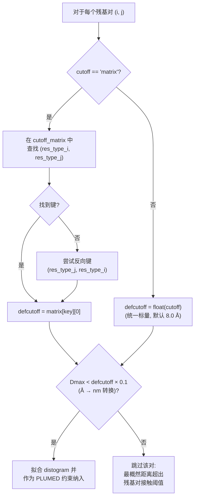

---
slug:12-residue-pair-cutoff-matrix
blog_type:normal
---


**残基对截断矩阵**是一个 20×20 的特定氨基酸距离查找表，在 bAIes-IDP 预处理流程的 distogram 选择与拟合阶段，它替代了单一的全局截断值。在决定将哪些 AlphaFold-2 distogram 作为约束纳入时，该矩阵不再为每个残基对应用统一的距离阈值（例如 8 Å），而是为 210 种独特的氨基酸组合中的每一种分配基于物理意义的、依赖残基对的截断值——从而实现了更精确的约束选择，能够兼顾不同残基类型在尺寸和接触化学性质上的异质性。

来源：[preprocess_bAIes.py](scripts/preprocess_bAIes.py#L33-L244), [step2-preprocess.bash](scripts/step2-preprocess.bash#L19-L26)

## 起源与物理基础

截断值源自对高分辨率蛋白质结构中残基-残基接触距离的统计分析，最初由 **Baker 实验室**（华盛顿大学）提出。矩阵中的每个条目是一个包含两个值的元组：**(d_cutoff, σ)**，其中 `d_cutoff` 是将残基对视为有意义接触时的最大 Cβ–Cβ 距离（单位：埃），`σ` 是该截断值的相关展宽或不确定度。该矩阵以对称字典的形式存储，以有序残基类型对为键，其值跨越了宽广的动态范围——从最小残基对 (GLY–GLY) 的 **4.467 Å** 到最大残基对 (TRP–TRP) 的 **12.806 Å**。这一约 3 倍的范围反映了小脂肪族残基与大芳香族残基在范德华半径和侧链伸展范围上的巨大差异；如果对所有残基对应用统一的标量截断值，要么会对小残基相互作用造成过度约束，要么会对大残基相互作用造成约束不足。

来源：[preprocess_bAIes.py](scripts/preprocess_bAIes.py#L33-L244)

## 矩阵结构与覆盖范围

该矩阵被定义为一个包含 210 个条目的 Python 字典，覆盖了**所有 20 种标准氨基酸**。键为遵循以下约定的有序元组 `(residue_i, residue_j)`：基于固定的字母顺序 **(较小的残基, 较大的残基)** (ALA < ARG < ASN < ASP < CYS < GLN < GLU < GLY < HIS < ILE < LEU < LYS < MET < PHE < PRO < SER < THR < TRP < TYR < VAL)。对角线条目（例如 `("GLY","GLY")`）代表同类型残基对，非对角线条目代表跨类型残基对。由于字典仅存储上三角部分，当未找到直接键时，会尝试查找反向键 `(res_j, res_i)` 作为回退机制。

| 残基对类别 | 示例对 | 截断值 (Å) | σ | 物理依据 |
|---|---|---|---|---|
| 小–小 | GLY–GLY | 4.467 | 0.017 | 最小侧链体积 |
| 小–中 | GLY–LEU | 6.554 | 0.125 | 不对称伸展范围 |
| 小–大 | GLY–ARG | 9.166 | 0.334 | 一侧为延伸侧链 |
| 中–中 | VAL–VAL | 6.759 | 0.145 | 中等分支侧链 |
| 中–大 | PRO–ARG | 10.266 | 0.506 | 环状 + 胍基伸展范围 |
| 大–大 | TRP–TRP | 12.806 | 0.473 | 最大芳香族体积 |

来源：[preprocess_bAIes.py](scripts/preprocess_bAIes.py#L33-L244)

## 矩阵在流程中的使用方式

截断矩阵在 `select_and_fit_distograms()` 函数的 **distogram 选择与拟合** 阶段进入处理流程。对于从 N×N distogram 数组中提取的每个残基对 (i, j)，应用以下决策逻辑：



关键的比较是 **Dmax < defcutoff × 0.1**，其中 `Dmax` 是 AlphaFold-2 distogram 中最高概率对应的距离（单位：nm），而 `defcutoff × 0.1` 将矩阵截断值从埃转换为纳米。只有最概然 Cβ–Cβ 距离**低于**特定残基对截断值的残基对，才会被选中进行拟合并作为 bAIes 约束纳入。这确保了约束集仅由那些预测接触距离与特定氨基酸组合的有意义相互作用在物理上一致的残基对组成。

来源：[preprocess_bAIes.py](scripts/preprocess_bAIes.py#L775-L844)

## 激活与命令行界面

通过向 `preprocess_bAIes.py` 的 `-cutoff` 参数传递字符串 `'matrix'` 来激活残基对截断矩阵。这是标准预处理流程中的**推荐默认项**，`step2-preprocess.bash` 脚本显式设置了 `-cutoff matrix` 即印证了这一点。另一种方式是提供以埃为单位的数值（默认：`8.0`），这将对所有残基对应用统一的阈值，而不区分残基类型。

| 参数 | 值 | 行为 |
|---|---|---|
| `-cutoff matrix` | 字符串字面量 | 采用 Baker 实验室矩阵中特定残基对的截断值 |
| `-cutoff 8.0` | 数值 (Å) | 对所有残基对应用统一的 8.0 Å 截断值 |
| `-cutoff 10.0` | 数值 (Å) | 对所有残基对应用统一的 10.0 Å 截断值（更宽松） |

step2 脚本的调用展示了典型的用法：

```bash
./preprocess_bAIes.py -pdb ${pdb} -mdpdb ${mdpdb} -pkl ${dist} \
    -out ${dat} -model gauss -cutoff matrix -ndxout ${ndx} --verbose
```

来源：[preprocess_bAIes.py](scripts/preprocess_bAIes.py#L16-L30), [step2-preprocess.bash](scripts/step2-preprocess.bash#L19-L26)

## 对约束选择的影响

相比于统一截断值，矩阵的实际效果是**重新分配**了残基对空间中**纳入的约束**。使用统一的 8 Å 截断值时，GLY–GLY 残基对（矩阵截断值：4.47 Å）会纳入许多最概然距离在 4.47–8.0 Å 之间的 distogram——这些距离太大，无法代表有意义的甘氨酸-甘氨酸接触。相反，TRP–TRP 残基对（矩阵截断值：12.81 Å）会排除所有最概然距离在 8.0–12.81 Å 之间的 distogram，丢弃了处于物理合理距离上的真实色氨酸-色氨酸接触。矩阵同时纠正了这两种失效模式。

σ 值（元组的第二个元素）编码了每个截断值的**不确定度或展宽**，反映了在结构数据库中观察到的接触距离的变异性。像 GLY 这样的小残基呈现紧致的分布（σ ≈ 0.02–0.27 Å），而像 ARG 和 TRP 这样的大柔性残基则表现出较宽的分布（σ ≈ 0.7–0.9 Å）。这些 σ 值存储在矩阵数据结构中，但在当前的选择逻辑中**并未被使用**——截断决策仅使用第一个元素（`cutoff_matrix[key][0]`）。它们仍可用于未来的扩展，例如软截断阈值或基于不确定度加权的约束方案。

来源：[preprocess_bAIes.py](scripts/preprocess_bAIes.py#L33-L244), [preprocess_bAIes.py](scripts/preprocess_bAIes.py#L804-L819)

<CgxTip>该截断矩阵在构造上是对称的，但仅以上三角形式存储（按字母顺序排列的键）。第 807–810 行的查找代码通过在正向键缺失时尝试反向键来处理此问题——务必确保残基类型字符串与矩阵中使用的精确三字母代码（GLY、ALA 等）完全匹配，因为查找过程是区分大小写的精确匹配。</CgxTip>

<CgxTip>在调试 `-cutoff matrix` 与 `-cutoff 8.0` 之间约束数量差异时，请检查大–大残基对（例如 TRP–TRP、ARG–ARG、TYR–TYR）的 Dmax 值——这些残基对的矩阵截断值远高于 8.0 Å，受截断模式选择的影响尤为显著。</CgxTip>

## 与流程阶段的关系

残基对截断矩阵仅在 [Distogram 读取与拟合](5-distogram-reading-and-fitting) 预处理阶段中运行，它决定了哪些 AlphaFold-2 distogram 被提升为拟合后的约束。其输出——即被选中并拟合的残基对集合——直接流入 [PLUMED 文件生成](6-plumed-file-generation) 阶段，并最终进入 [bAIes 系综模拟](9-baies-ensemble-simulations)。该矩阵在 [GROMACS 到 LAMMPS 转换](7-gromacs-to-lammps-conversion) 或 [CMAP 校正图](8-cmap-correction-maps) 阶段不起作用，这些阶段处理所有非键相互作用，独立于源自 distogram 的约束。