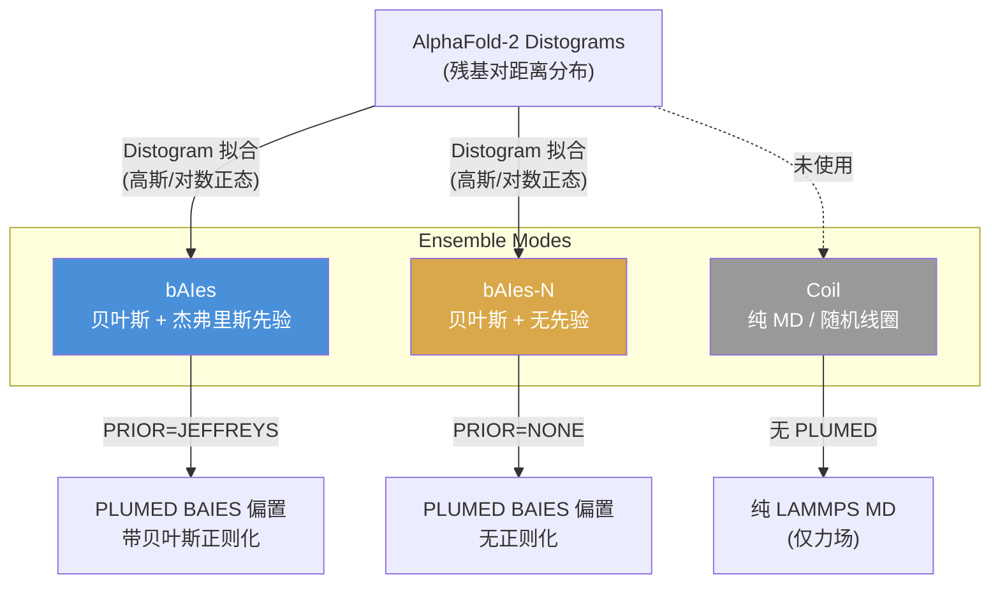
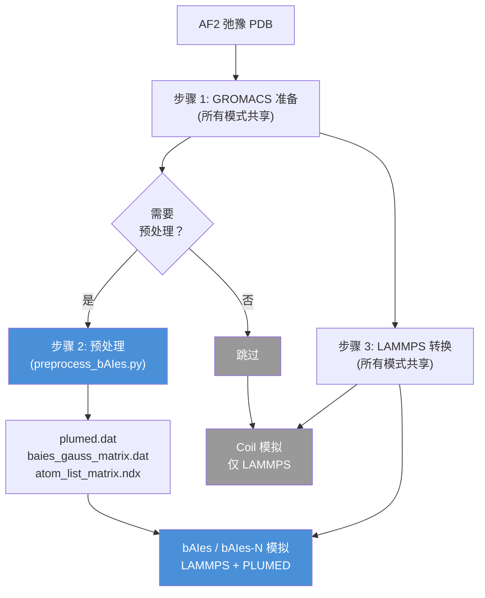

---
slug:14-baies-vs-baies-n-vs-coil
blog_type:normal
---


bAIes-IDP 框架提供了三种不同的模拟模式，用于生成内禀无序和多结构域蛋白质的构象系综：**bAIes**、**bAIes-N** 和 **Coil**。这些模式共享一个通用的简化分子动力学引擎（LAMMPS + amber99SB-ILDN 力场 + CMAP 校正），但在 **AlphaFold-2 预测信息是否以及如何偏置模拟** 方面存在关键差异。理解这些差异对于选择合适的系综生成策略和解释最终的构象分布至关重要。

来源: [README.md](/README.md#L1-L54), [benchmark/README.md](/benchmark/README.md#L1-L38)

## 概念基础

这三种模式构成了一个关于从 AlphaFold-2 distogram 中提取的残基对距离信息的物理建模保真度层次结构：



**bAIes** 应用贝叶斯最大熵偏置，将 AlphaFold-2 distogram 信息编码为距离约束，并通过 **杰弗里斯先验** 进行正则化——这是一种在重参数化下保持不变的无信息先验，可防止对潜在不可靠的 distogram 预测产生过拟合。**bAIes-N** 使用相同的 distogram 派生约束，但 **禁用该先验**（`PRIOR=NONE`），这实际上应用了一个平坦（均匀）的先验，在没有贝叶斯正则化的情况下信任 AlphaFold-2 的预测。**Coil** 完全不使用 AlphaFold-2 信息，在简化的力场下运行纯分子动力学——这充当了对应于随机线圈模型的纯物理基线。

来源: [benchmark/bAIes/ACTR/plumed_ACTR.dat](/benchmark/bAIes/ACTR/plumed_ACTR.dat#L1-L6), [benchmark/bAIes-N/ACTR/plumed_ACTR.dat](/benchmark/bAIes-N/ACTR/plumed_ACTR.dat#L1-L6)

## 架构对比

下表总结了三种模拟模式在结构和算法上的差异：

| 方面 | bAIes | bAIes-N | Coil |
|:---|:---|:---|:---|
| **AlphaFold-2 distogram** | 必需 | 必需 | 未使用 |
| **PLUMED 集成** | 是 (`fix pl all plumed`) | 是 (`fix pl all plumed`) | 否 |
| **先验类型** | `JEFFREYS`（无信息，重参数化不变） | `NONE`（平坦/均匀） | 不适用 |
| **贝叶斯正则化** | 是——惩罚过度自信的 distogram 拟合 | 否——原始最大熵偏置 | 不适用 |
| **预处理步骤** | 必需（distogram 拟合 → PLUMED 文件） | 必需（与 bAIes 相同） | 不需要 |
| **流水线步骤** | 4（输入 → 准备 → 预处理 → 转换 → 模拟） | 4（与 bAIes 相同） | 3（准备 → 转换 → 模拟） |
| **偏置数据文件** | `baies_gauss_matrix.dat`、`atom_list_matrix.ndx`、`plumed_*.dat` | 与 bAIes 相同 | 无 |
| **力场** | 简化 amber99SB-ILDN + CMAP | 相同 | 相同 |
| **恒温器** | NVT + CSVR (298.1 K) | NVT + CSVR (298.1 K) | NVT + CSVR (298.1 K) |
| **用例** | 带有 AF2 信息偏置的生产级 IDP 系综 | 消融实验：无正则化的偏置 | 基线：纯物理随机线圈 |

来源: [tutorial/bAIes/README.md](/tutorial/bAIes/README.md#L1-L151), [tutorial/coil/README.md](/tutorial/coil/README.md#L1-L81), [benchmark/bAIes/ACTR/ACTR_nvt.in](/benchmark/bAIes/ACTR/ACTR_nvt.in#L255-L270), [benchmark/coil/ACTR/ACTR_nvt.in](/benchmark/coil/ACTR/ACTR_nvt.in#L255-L268)

## 先验：杰弗里斯 vs 无

区分 bAIes 和 bAIes-N 的唯一参数是 PLUMED 配置中的 `PRIOR` 关键字。这对 AlphaFold-2 distogram 信息如何转化为模拟偏置有着深远的影响。

**bAIes 配置**（`PRIOR=JEFFREYS`）：
```
baies: BAIES ATOMS=batoms DATA_FILE=baies_gauss_matrix.dat PRIOR=JEFFREYS TEMP=2.478541306
```

**bAIes-N 配置**（`PRIOR=NONE`）：
```
baies: BAIES ATOMS=batoms DATA_FILE=baies_gauss_matrix.dat PRIOR=NONE TEMP=2.478541306
```

**杰弗里斯先验** 是从统计模型的费舍尔信息度量推导出的参考先验。对于建模为高斯分布的距离约束（如 `baies_gauss_matrix.dat` 中），杰弗里斯先验充当了一个天然的正则化器：当潜在的统计证据不充分时，它 **降权那些窄峰值的约束**（AlphaFold-2 中的高置信度），并 **升权那些携带较少信息的宽分布**。这可以防止模拟陷入对虚假 AlphaFold-2 预测过拟合的构象中——这对于 AlphaFold-2 置信度（pLDDT）系统性偏低的内禀无序区尤为重要。

当 `PRIOR=NONE` 时，偏置应用从 distogram 高斯分布导出的原始最大熵分布，而没有任何贝叶斯校正。这相当于假设所有约束参数上的先验是均匀的，意味着每个 distogram 预测都同等地加权，而不考虑其信息内容。对于预测良好的结构区，bAIes 和 bAIes-N 会产生相似的结果；对于无序或预测较差的区域，bAIes 中的杰弗里斯先验提供了 bAIes-N 所缺乏的关键正则化。

<CgxTip>在进行基准测试时，bAIes-N 充当了对杰弗里斯先验进行受控消融的角色——直接比较 bAIes 与 bAIes-N 可以孤立出贝叶斯正则化对系综质量的影响。这是验证先验是否改善了与实验可观测量一致性的主要诊断手段。</CgxTip>

来源: [benchmark/bAIes/ACTR/plumed_ACTR.dat](/benchmark/bAIes/ACTR/plumed_ACTR.dat#L1-L6), [benchmark/bAIes-N/ACTR/plumed_ACTR.dat](/benchmark/bAIes-N/ACTR/plumed_ACTR.dat#L1-L6), [benchmark/bAIes/ACTR/baies_gauss_matrix.dat](/benchmark/bAIes/ACTR/baies_gauss_matrix.dat#L1-L6)

## Distogram 数据：在 bAIes 和 bAIes-N 之间共享

bAIes 和 bAIes-N 都使用相同的 `baies_gauss_matrix.dat` 文件，该文件由预处理流水线（`preprocess_bAIes.py`）生成。此文件包含每个选定残基对的拟合高斯参数：

```
#! FIELDS Id atom_i atom_j mu sigma
#! SET model gaussian
1 59 135 1.053628 0.286834
2 59 159 1.211149 0.299356
...
```

每行指定：定义约束对的原子索引（`atom_i`、`atom_j`）、高斯平均距离 `μ`（单位 nm）和高斯宽度 `σ`（单位 nm）。残基对基于距离截断标准（默认 8 Å，或来自 Baker 实验室矩阵的残基对特定截断值）进行选择，且最小序列间隔为 3 个残基，以保留局部螺旋信息。Coil 模式不生成也不使用此文件——它完全在力场下运行。

来源: [benchmark/bAIes/ACTR/baies_gauss_matrix.dat](/benchmark/bAIes/ACTR/baies_gauss_matrix.dat#L1-L28), [scripts/preprocess_bAIes.py](/scripts/preprocess_bAIes.py#L28-L42)

## 基准测试文件清单

基准测试目录映射了这三种模拟模式，在 `benchmark/bAIes/`、`benchmark/bAIes-N/` 和 `benchmark/coil/` 中包含相同的蛋白质系统。文件组成揭示了架构差异：

| 文件 | bAIes | bAIes-N | Coil |
|:---|:---:|:---:|:---:|
| `*_nvt.in` (LAMMPS 输入) | ✓ | ✓ | ✓ |
| `*_nvt.data` (拓扑/力) | ✓ | ✓ | ✓ |
| `dry_ff_20240524_correct.cmap` (CMAP) | ✓ | ✓ | ✓ |
| `plumed_*.dat` (PLUMED 配置) | ✓ | ✓ | ✗ |
| `baies_gauss_matrix.dat` (约束参数) | ✓ | ✓ | ✗ |
| `atom_list_matrix.ndx` (原子选择) | ✓ | ✓ | ✗ |

20 个基准测试蛋白质系统涵盖了四种无序类别：**完全无序**（Ab40、p61_Hck、emerin67-170、His-PknG1-75、Colicin_NT_domain、Hug1）、**结构基序**（PaaA2、Nt-SOCS5、Alb3-A3CT、idr_SSRP1、UBact、FCP1）、**AlphaFold-2 预测误差**（asyn、ACTR、NHE1、Nsp2_ctlIDR、spm_FrpC、drkN）和 **多结构域**（GS8、Ubq2、Ubq3）。这种分类对于 bAIes 与 bAIes-N 的比较尤其具有启发性：存在 AlphaFold-2 预测误差的地方，正是杰弗里斯先验的正则化效应最关键之处。

来源: [benchmark/README.md](/benchmark/README.md#L9-L38)

## 流水线分叉点

这三条流水线共享相同的 GROMACS 准备步骤（使用 amber99SB-ILDN 的 PDB → `.gro`/`.itp`/`.top`）和相同的 LAMMPS 转换步骤（通过 InterMol + `make_ff.py` 力场简化的 GROMACS → LAMMPS）。关键的分叉发生在预处理阶段：



对于 **Coil**，预处理步骤被完全省略——流水线直接从准备进行到转换再到模拟。对于 **bAIes** 和 **bAIes-N**，预处理步骤将 AlphaFold-2 distogram 拟合为高斯（或对数正态）模型，并生成三个 PLUMED 辅助文件。随后的唯一差异是生成的 `plumed.dat` 文件中的 `PRIOR` 关键字。

<CgxTip>要将 bAIes 模拟转换为 bAIes-N（或反之），只需更改 `plumed_*.dat` 文件中的 `PRIOR=` 关键字——无需修改其他文件。这使得消融研究极易重现。</CgxTip>

来源: [tutorial/bAIes/README.md](/tutorial/bAIes/README.md#L55-L93), [tutorial/coil/README.md](/tutorial/coil/README.md#L13-L38)

## LAMMPS 输入差异

这三种模式的 LAMMPS 输入文件（`*_nvt.in`）几乎完全相同，但有两个显著差异：

**1. PLUMED 修复（仅存在于 bAIes 和 bAIes-N）：**
```
fix pl all plumed plumedfile plumed_ACTR.dat outfile p.log
```
此行在 LAMMPS 中激活 PLUMED 接口，加载 bAIes 偏置势。在 Coil 输入文件中不存在此行。

**2. 二面角样式顺序：**
- bAIes/bAIes-N：`dihedral_style hybrid charmm multi/harmonic`
- Coil：`dihedral_style hybrid multi/harmonic charmm`

这种重新排序反映了力场简化后数据文件中二面角参数的索引方式。Coil 流水线使用不带 PLUMED 相关修改的 `make_ff.py`，导致二面角分配顺序不同。这两种顺序在物理上是等价的——它们只是将相同的二面角类型映射到不同的样式索引。

所有三种模式共享相同的设置：单位系统（`real`）、原子样式（`full`）、对势样式（`lj/cut 2.0`）、CMAP 校正、恒温器（298.1 K 下的 CSVR）、积分器（使用速度 Verlet 的 NVE）、时间步长（1.0 fs）和默认模拟长度（2 × 10⁹ 步 = 2 μs）。

来源: [benchmark/bAIes/ACTR/ACTR_nvt.in](/benchmark/bAIes/ACTR/ACTR_nvt.in#L1-L15), [benchmark/coil/ACTR/ACTR_nvt.in](/benchmark/coil/ACTR/ACTR_nvt.in#L1-L15), [benchmark/bAIes/ACTR/ACTR_nvt.in](/benchmark/bAIes/ACTR/ACTR_nvt.in#L255-L270)

## 何时使用每种模式

| 场景 | 推荐模式 | 理由 |
|:---|:---|:---|
| 生产级 IDP 系综预测 | **bAIes** | 杰弗里斯先验正则化不可靠的 distogram 预测，对无序区至关重要 |
| 评估先验对系综质量的影响 | **bAIes-N**（作为消融） | 通过与 bAIes 比较孤立出贝叶斯正则化的效应 |
| 力场基线 / 参考系综 | **Coil** | 提供纯物理的零模型；与 bAIes 的偏差揭示了 AF2 信息驱动的结构偏好 |
| 具有高 pLDDT 的结构良好蛋白质 | **bAIes** 或 **bAIes-N** | 当 distogram 可靠时两者收敛；杰弗里斯先验影响极小 |
| 具有柔性连接子的多结构域蛋白质 | **bAIes** | 连接子区域能最大程度地从先验正则化中获益 |

典型的验证工作流按以下顺序进行：**Coil** → **bAIes-N** → **bAIes**，其中每一步都增加了一层建模复杂性。将 Coil 与 bAIes-N 比较揭示了由 AlphaFold-2 distogram 贡献的结构信息；将 bAIes-N 与 bAIes 比较揭示了杰弗里斯先验的正则化效应。与实验观测量（SAXS、NMR、FRET）的一致性应单调提升：对于选择得当的系统，Coil ≤ bAIes-N ≤ bAIes。

来源: [benchmark/README.md](/benchmark/README.md#L1-L38), [tutorial/bAIes/README.md](/tutorial/bAIes/README.md#L1-L11)

## 后续步骤

- 有关基准测试蛋白质系统的完整列表及其分类，请参阅 [基准测试蛋白质系统](13-benchmark-protein-systems)。
- 有关区分 bAIes/bAIes-N 与 Coil 的 distogram 拟合和 PLUMED 文件生成的详细信息，请参阅 [Distogram 读取与拟合](5-distogram-reading-and-fitting) 和 [PLUMED 文件生成](6-plumed-file-generation)。
- 有关所有三种模式共享的 CMAP 校正图，请参阅 [CMAP 校正图](8-cmap-correction-maps)。
- 有关适用于所有模式的模拟参数调优，请参阅 [模拟参数调优](16-simulation-parameter-tuning)。