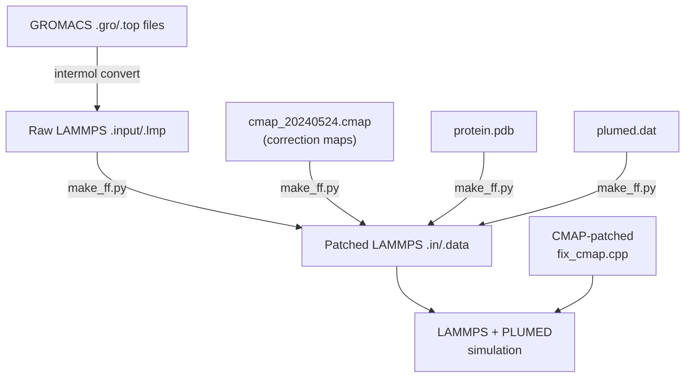

---
slug:15-lammps-cmap-patch
blog_type:normal
---


LAMMPS CMAP 补丁是一处精简但至关重要的源码修改，它提升了 LAMMPS `fix_cmap.cpp` 中 CMAP（校正图）扭转交叉项的内部容量限制。标准 LAMMPS 发行版（2023年8月2日）将最大 CMAP 类型数硬编码为 **6**——这对于原始 CHARMM 力场已足够——但 bAIes-IDP 流水线使用了**残基特异性校正图**，最多可能需要 40 种不同类型，每种对应一个氨基酸对类别。若无此补丁，对于校正图类型索引超过 5 的系统，LAMMPS 在运行时将抛出 `"Invalid CMAP crossterm_type"` 错误。

来源：[patch_cmap.txt](/installation/patch_cmap.txt#L1-L30), [README.md](/installation/README.md#L49-L55)

## 为何需要此补丁

CHARMM CMAP 势通过对每个残基对类型的 24×24 校正值网格进行插值，来校正主链 φ/ψ 二面体能面。LAMMPS 的 `fix_cmap.cpp` 最初通过常量 `CMAPMAX` 仅为 **6** 种类型分配存储空间和循环边界，这反映了标准 CHARMM36 力场中定义的六种唯一 CMAP 图（按第二个残基位置是脯氨酸还是非脯氨酸分类）。

然而，bAIes-IDP 流水线执行了从 AMBER ff99SB-ILDN 到 LAMMPS 的**力场转换**。在此转换期间，`make_ff.py` 脚本将 AMBER 二面角项分解为 LAMMPS 兼容的形式，并辅以残基特异性的 CMAP 校正网格。由于 20 种标准氨基酸均可为其主链 φ/ψ 能面定义不同的校正图（且 PRO 对引入了额外的变体），所需 CMAP 类型的数量远超最初 6 的限制。例如，教程中的校正图文件 `cmap_20240524.cmap` 定义的类型索引远超 5——每个类型均关联一个特定的残基对，如 `ARG-(XXX)`、`PRO-(XXX)` 等，其中 `XXX` 表示任意非脯氨酸残基。

| 参数 | 原始 LAMMPS | 打补丁后的 LAMMPS | 依据 |
|---|---|---|---|
| `CMAPMAX` | 6 | 40 | 支持所有 20 种氨基酸的残基特异性校正图 |
| 映射导数循环 | `for (i=0; i<6; i++)` | `for (i=0; i<CMAPMAX; i++)` | 确保所有已加载的映射类型均已预计算导数 |
| 类型边界检查 | `t1 > 5` | `t1 > CMAPMAX-1` | 针对新容量进行正确验证 |

这三项修改紧密耦合：仅提升 `CMAPMAX` 而不更新循环和边界检查，将导致高索引映射缺失导数预计算，并在运行时拒绝有效类型。反之，该补丁彻底消除了硬编码的 `6` 和 `5` 字面量，将其替换为对 `CMAPMAX` 的引用，以便未来调整只需更改单个常量。

来源：[patch_cmap.txt](/installation/patch_cmap.txt#L1-L30), [make_ff.py](/scripts/make_ff.py#L30-L37)

## 补丁内容——逐行分析

此统一差异补丁针对 `lammps-2Aug2023/src/MOLECULE/fix_cmap.cpp`，并精确应用了三项更改：

**更改 1——存储容量（第 56 行）：** 常量 `CMAPMAX` 从 6 提升至 40。这控制了 `cmapgrid`、`d1cmapgrid`、`d2cmapgrid` 和 `d12cmapgrid` 数组的大小，这些数组存储校正图及其一阶、二阶和交叉导数。增加此值将为每次模拟分配最多 40 种不同 CMAP 类型的内存。

**更改 2——导数预计算循环（第 182 行）：** 循环 `for (i = 0; i < 6; i++)` 被替换为 `for (i = 0; i < CMAPMAX; i++)`。这确保了对每个已加载的映射类型都调用 `set_map_derivatives()`，而不仅是前六个。若无此修复，CMAP 类型 7–40 虽会从校正图文件中读取，但其导数网格将保持未初始化状态，从而产生不正确的力和能量。

**更改 3——运行时类型验证（第 453 行）：** 边界检查 `if (t1 > 5)` 变为 `if (t1 > CMAPMAX-1)`。这防止了当模拟遇到类型索引超过已分配容量的 CMAP 交叉项时，出现数组越界访问。当 `CMAPMAX=40` 时，有效类型范围变为 0–39（在 LAMMPS 数据文件中为类型索引 1–40，内部偏移量为 1）。

<CgxTip>内存影响微乎其微：每个 24×24 的 CMAP 网格仅需 576 个双精度浮点数（约 4.5 KB）。从 6 种类型扩展至 40 种类型为四个网格数组增加约 150 KB 内存——相对于典型的 MD 模拟内存预算而言微不足道。</CgxTip>

来源：[patch_cmap.txt](/installation/patch_cmap.txt#L1-L30)

## 应用补丁

该补丁必须在**编译 LAMMPS 之前**应用，且目标为特定的 LAMMPS 版本 **2023年8月2日**。操作步骤如下：

1. 从[官方归档](https://download.lammps.org/tars/index.html)**下载** LAMMPS 源码包并解压。
2. **导航**至源码根目录（包含 `src/`）。
3. 使用标准 Unix `patch` 工具**应用**补丁：

```bash
patch ./src/MOLECULE/fix_cmap.cpp < /path/to/bAIes-IDP/installation/patch_cmap.txt
```

4. 在启用 MOLECULE 包（包含在 `cmake/presets/basic.cmake` 中）并支持 PLUMED 的情况下**编译** LAMMPS。典型的 CMake 构建命令如下：

```bash
mkdir build && cd build
cmake -C ../cmake/presets/basic.cmake -D PKG_PLUMED=yes -D PLUMED_MODE=runtime ../cmake
make
sudo make install
```

`basic.cmake` 预设文件必须包含 `MOLECULE` 包（该包提供 `fix_cmap.cpp`）。典型的预设文件如下：

```cmake
set(ALL_PACKAGES KSPACE MANYBODY MOLECULE RIGID GPU EXTRA-DUMP EXTRA-FIX KOKKOS)
foreach(PKG ${ALL_PACKAGES})
  set(PKG_${PKG} ON CACHE BOOL "" FORCE)
endforeach()
```

<CgxTip>如果补丁顺利逆转（退出码为 0）但出现偏移警告，请验证你正在为精确的 LAMMPS 2023年8月2日源码打补丁——不同发行版间 `fix_cmap.cpp` 的行号可能发生偏移，导致差异块误用。</CgxTip>

来源：[README.md](/installation/README.md#L49-L88), [README.md](/README.md#L38-L54)

## CMAP 如何集成至 bAIes-IDP 模拟流水线

该补丁存在于更广泛的转换流水线中。通过 `intermol` 进行 GROMACS 到 LAMMPS 的转换后，`make_ff.py` 脚本会重写 LAMMPS 的输入和数据文件，以纳入 CMAP 校正项。集成流程如下：



在生成的 LAMMPS 输入文件（`.in`）中，CMAP 通过三条指令激活：

```lammps
fix drycmap all cmap cmap_20240524.cmap
read_data idp_nvt.data fix drycmap crossterm CMAP
fix_modify drycmap energy yes
```

- **`fix drycmap all cmap`** —— 实例化 CMAP fix 并加载校正图文件，该文件定义了每种残基对类型的 24×24 能量网格。
- **`read_data ... fix drycmap crossterm CMAP`** —— 读取拓扑数据文件，并将 CMAP 交叉项部分（原子五元组：C(i-1), N(i), CA(i), C(i), N(i+1)）分配给 `drycmap` fix。
- **`fix_modify drycmap energy yes`** —— 确保 CMAP 能量贡献显示在热力学输出列 `f_drycmap` 中。

拓扑数据文件（`idp_nvt.data`）包含一个 `CMAP` 部分，将每个交叉项列为：`index type atom_Ci-1 atom_Ni atom_CAi atom_Ci atom_Ni+1`。`make_ff.py` 脚本通过读取 PDB 文件识别主链原子，并读取 CMAP 文件将每个残基对解析为其对应的类型索引，从而生成此部分。

来源：[make_ff.py](/scripts/make_ff.py#L120-L175), [idp_nvt.in](/tutorial/bAIes/4-simulation/idp_nvt.in#L1-L12), [idp_nvt.data](/tutorial/bAIes/4-simulation/idp_nvt.data#L1-L15), [step3-conversion.bash](/scripts/step3-conversion.bash#L1-L33)

## 验证与故障排除

应用补丁并编译后，通过运行一个定义了超过 6 种类型的 CMAP 文件的简短 LAMMPS 模拟，来验证修复是否生效。诊断指标如下：

| 症状 | 原因 | 解决方案 |
|---|---|---|
| 运行时出现 `"Invalid CMAP crossterm_type"` 错误 | 未应用补丁，或 LAMMPS 从未打补丁的源码编译 | 重新应用补丁并重新构建 |
| 所有 CMAP 能量报告为零 | 输入中缺少 `fix_modify drycmap energy yes` | 将该指令添加至输入文件 |
| 力为 NaN 或能量漂移 | 类型 > 6 的映射导数未预计算（缺少补丁更改 2） | 验证循环行读取的是 `i < CMAPMAX`，而非 `i < 6` |
| CMAP 类型 > 39 时出现段错误 | 校正图文件中存在超过 40 种不同的 CMAP 类型 | 在 `fix_cmap.cpp` 中增加 `CMAPMAX` 并重新编译 |

生成输入文件中的热力学输出行包含 `f_drycmap` 作为专用列，允许在整个模拟过程中直接监控 CMAP 能量贡献。

来源：[patch_cmap.txt](/installation/patch_cmap.txt#L1-L30), [make_ff.py](/scripts/make_ff.py#L147-L149)

## 与其他流水线组件的关系

CMAP 补丁是一个**构建时先决条件**，必须在任何 bAIes-IDP LAMMPS 模拟运行之前得到满足。它依赖并支持以下流水线阶段：

- **[GROMACS 到 LAMMPS 转换](7-gromacs-to-lammps-conversion)** —— 转换步骤产生原始 LAMMPS 文件，随后 `make_ff.py` 用 CMAP 项对其进行扩充。
- **[CMAP 校正图](8-cmap-correction-maps)** —— 残基特异性校正图文件（如 `cmap_20240524.cmap`）在模拟启动时由打过补丁的 `fix_cmap` 读取。
- **[bAIes 系综模拟](9-baies-ensemble-simulations)** —— 所有 bAIes 生产运行均需打过补丁的 LAMMPS 二进制文件。
- **[随机线圈模拟](10-random-coil-simulations)** —— 随机线圈参考模拟也使用经 CMAP 校正的力场，因此需要此补丁。

有关包括 LAMMPS 编译在内的完整软件设置流程，请参见[软件与硬件要求](3-software-and-hardware-requirements)。有关校正图如何生成及其物理意义的详细信息，请参见[CMAP 校正图](8-cmap-correction-maps)。