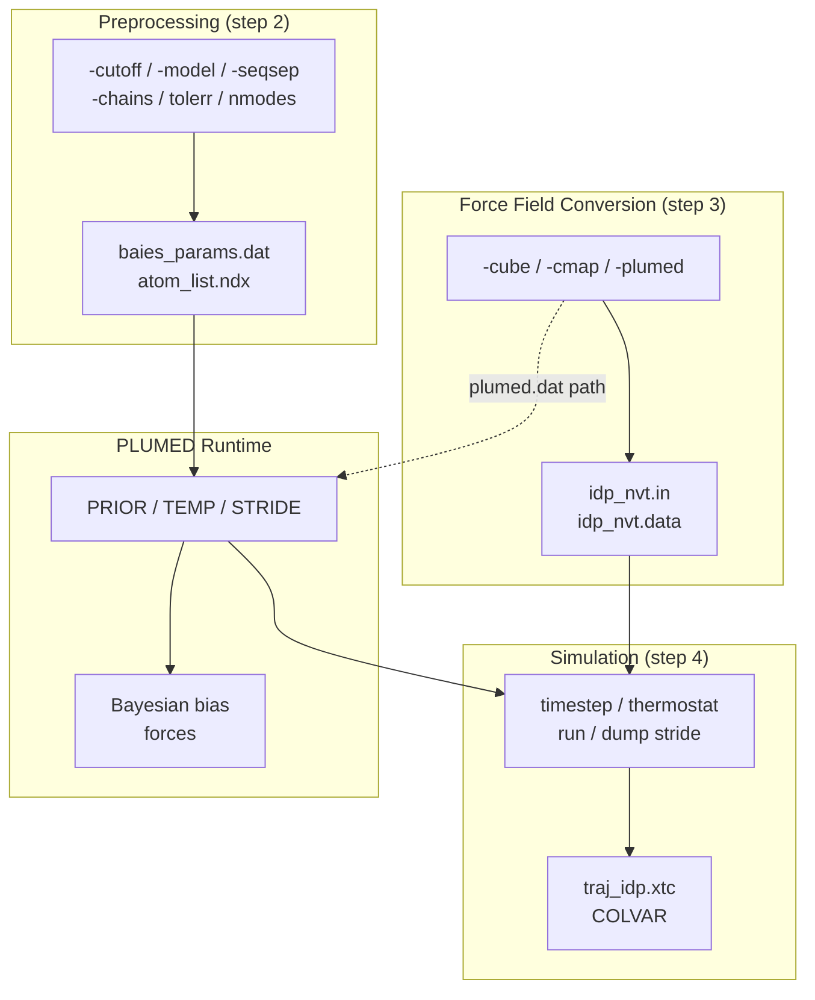
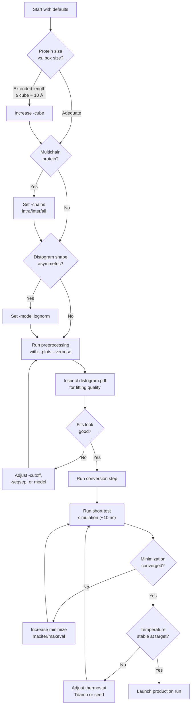

---
slug:16-simulation-parameter-tuning
blog_type:normal
---


在 bAIes-IDP 流程中调整模拟参数需要理解三个不同的参数层：**预处理控制**（影响距离分布拟合和约束选择）、**力场转换设置**（定义模拟盒子和校正势）以及 **LAMMPS/PLUMED 运行时参数**（控制积分、恒温器和系综采样）。本页为每个可调参数提供了系统性参考，包括其默认值、物理意义以及修改后的影响。

## 参数架构概述

bAIes-IDP 中的可调参数分布在三个流程阶段中，每个阶段都会产生限制后续选择的下游产物。理解这种依赖链至关重要：预处理阶段的修改会通过 PLUMED 文件传播到模拟本身，而 LAMMPS 运行时参数则可以独立调整，无需重新运行先前的步骤。



上图说明了三个参数域及其数据流依赖关系。预处理参数决定*哪些*原子对接受贝叶斯约束，以及这些约束的定义*有多尖锐*。转换参数定义*物理环境*（盒子大小、CMAP 校正）。LAMMPS 和 PLUMED 运行时参数控制*积分精度*和*采样效率*。

来源: [preprocess_bAIes.py](/scripts/preprocess_bAIes.py#L18-L31), [make_ff.py](/scripts/make_ff.py#L11-L20), [idp_nvt.in](/tutorial/bAIes/4-simulation/idp_nvt.in#L1-L390)

## 预处理参数

预处理通过 `preprocess_bAIes.py` 调用，并通过命令行参数控制。这些参数决定如何将 AlphaFold/ColabFold 的距离分布拟合为参数分布，以及哪些残基对被保留为贝叶斯约束。更改其中任何参数都需要重新运行步骤 2，并随后重新生成模拟中使用的 PLUMED 文件。

### 命令行参考

| 参数 | 标志 | 默认值 | 描述 |
|:----------|:-----|:--------|:------------|
| **Cutoff** | `-cutoff` | `8.0` | 距离截断值（单位 Å）。预测距离 ≥ 截断值的原子对将被排除。使用 `matrix` 可指定基于残基对的截断值。 |
| **Model** | `-model` | `gauss` | 拟合模型：`gauss`（高斯分布）或 `lognorm`（对数正态分布）。决定 PLUMED 中的似然函数。 |
| **Sequence separation** | `-seqsep` | `3` | 最小残基索引间隔。在同一链中满足 \|i−j\| ≤ seqsep 的原子对将被排除。 |
| **Chain scope** | `-chains` | `all` | 对于多链蛋白质：`intra`（仅分子内）、`inter`（仅分子间）或 `all`（两者皆有）。 |
| **MD PDB** | `-mdpdb` | `same` | 如果 GROMACS 相对 AlphaFold PDB 重新编号了原子，则需提供用于原子索引的单独 PDB。 |
| **Output file** | `-out` | `baies_params.dat` | 输出参数文件路径。 |
| **Index file** | `-ndxout` | `atom_list.ndx` | 为 PLUMED 输出的原子索引文件。 |
| **Plot output** | `-plotout` | `distograms.pdf` | 拟合质量图的 PDF 路径（仅在设置 `--plots` 时生效）。 |
| **Plots** | `--plots` | off | 启用逐对距离分布拟合图以进行质量检查。 |
| **Verbose** | `--verbose` | off | 在预处理期间启用详细的终端输出。 |

来源: [preprocess_bAIes.py](/scripts/preprocess_bAIes.py#L18-L31)

### 截断距离

截断参数是影响最大的单一预处理控制项。它决定将 AlphaFold 距离分布中的哪些残基对转换为贝叶斯约束。只有当残基对 (i, j) 的最可几距离 D_max 低于截断值时，该残基对才会被保留。存在两种策略：

- **固定截断值**（例如 `-cutoff 8.0`）：所有 D_max < 8 Å 的原子对均接受约束。此方法简单，但对所有残基类型一视同仁，可能会包含偶然接近而非真实物理接触的原子对。
- **残基对矩阵**（`-cutoff matrix`）：使用基于 Baker 实验室接触势推导出的 210 个元素的残基对特异性截断距离查找表。小残基对（如 GLY–GLY: 4.47 Å）具有严格的截断值，而大芳香残基对（如 TRP–TRP: 12.81 Å）具有宽松的截断值。这产生了一种更具物理依据的约束选择。

推荐在生产模拟中使用矩阵方法，因为它平衡了覆盖率与虚假约束：甘氨酸和丙氨酸等紧凑残基受到更少的约束（反映了它们较小的范德华半径），而色氨酸和精氨酸等大体积残基则保留了具有物理意义的长程接触。

来源: [preprocess_bAIes.py](/scripts/preprocess_bAIes.py#L34-L197), [preprocess_bAIes.py](/scripts/preprocess_bAIes.py#L800-L850)

### 拟合模型：高斯分布 vs. 对数正态分布

`-model` 标志选择拟合每个距离分布的参数分布。此选择直接影响 PLUMED 的 BAIES 模块在模拟期间评估的似然函数形状：

- **`gauss`**（默认）：将高斯分布 N(μ, σ²) 拟合到距离分布。拟合参数 (μ, σ) 被写入 `baies_params.dat`。高斯似然关于 μ 对称，当 AlphaFold 距离预测为单峰且近似对称时（通常对于良好定位的接触是这种情况），这是合适的。
- **`lognorm`**：拟合对数正态分布。这产生右偏似然，对于不能取负值且通常在较大距离处表现出较长尾部的距离分布，这在物理上更为合适。当距离分布图（通过 `--plots` 启用）显示出明显不对称时，请使用此选项。

<CgxTip>在生产运行确定模型选择之前，请始终先在单个 AlphaFold 模型上使用 `--plots --verbose` 运行预处理。检查生成的 PDF 以验证拟合曲线是否捕捉到了距离分布的形状——系统性的拟合不良（尤其是在峰值处）表明模型错误或需要多峰拟合。</CgxTip>

### 序列间隔

`-seqsep` 参数过滤掉序列中相近的残基对。默认值 `3` 移除满足 |i − j| ≤ 3 的原子对（即自身、±1、±2、±3）。这有两个目的：（1）非常局部的原子对已经由键合力场项（键、键角、二面角、CMAP）很好地描述，（2）包含它们会增加冗余约束，在不提高结构精度的情况下减慢收敛。将 seqsep 增加到 `5` 或更高会产生更稀疏的约束网络，这对于高度灵活的区域可能有益，在这些区域中，即使是中程接触也应从力场而非贝叶斯约束中产生。一般不建议将其降至 `3` 以下，因为螺旋信息已编码在 CMAP 校正图中。

来源: [preprocess_bAIes.py](/scripts/preprocess_bAIes.py#L800-L840)

### 内部拟合参数

除命令行界面外，预处理引擎还公开了几个内部常量，高级用户可以通过直接编辑 `preprocess_bAIes.py` 来修改它们：

| 参数 | 位置 | 默认值 | 作用 |
|:----------|:---------|:--------|:-----|
| `tolerr` | `fit_model()` / `minfnc()` | `0.005` | lmfit 最小化中的残差加权。值越小，拟合越严格。 |
| `nmodes` | `main()` 调用 | `1` | 多峰拟合的模态数。目前在 CLI 入口点中硬编码为 1。 |
| `convf` | `main()` 调用 | `softmax` | Logit 到概率的转换：`softmax` 或 `sigmoid`。 |
| `maxfev` | `fit_model()` | `5000` | 每次 lmfit 迭代的最大函数评估次数。 |
| `Niterations` | `fit_model()` | `5` | 每次拟合的随机初始条件试验次数。 |

`convf` 参数控制如何将 AlphaFold 的原始 logit 转换为概率分布。`softmax` 函数（默认）是 AlphaFold 自身概率计算中使用的标准选择。替代方案 `sigmoid` 应用逐元素逻辑转换后进行重归一化，这可能为相同的 logit 产生略微不同的概率分布。为了与 AlphaFold 的内部校准保持一致，应首选 `softmax`。

来源: [preprocess_bAIes.py](/scripts/preprocess_bAIes.py#L540-L580), [preprocess_bAIes.py](/scripts/preprocess_bAIes.py#L900-L945)

## 力场转换参数

`make_ff.py` 脚本将 GROMACS 拓扑转换为 LAMMPS 格式，并将模拟参数直接嵌入到输出文件 `idp_nvt.in` 中。这些参数定义了物理模拟环境。

| 参数 | 标志 | 默认值 | 物理意义 |
|:----------|:-----|:--------|:-----------------|
| **Cube size** | `-cube` | `400.0` | 立方模拟盒子的边长（单位 Å）。盒子在每个维度上跨越 [−cube/2, +cube/2]。 |
| **CMAP file** | `-cmap` | `ff.cmap` | CMAP 校正图文件，包含残基特异性的 Φ/Ψ 二面角校正。 |
| **PLUMED file** | `-plumed` | `plumed.dat` | PLUMED 输入文件的路径（在步骤 2 中生成）。 |
| **XTC output** | `-oxtc` | `traj.xtc` | 嵌入在 LAMMPS 输入中的轨迹输出文件名。 |

### 模拟盒子大小

`-cube` 参数设置周期性边界条件盒子尺寸。对于内在无序蛋白质，盒子必须足够大，以使蛋白质永远不会与其周期镜像发生相互作用。一个常用的经验法则是，盒子在每个维度上应至少超出蛋白质最大伸长长度 10 Å。对于 100 个残基的 IDP，完全伸长长度约为 360 Å（每个残基 3.6 Å），这使得默认的 400 Å 勉强足够。对于较大的蛋白质或多链系统，请增加此值。尺寸过小的盒子会导致非物理的自我相互作用并破坏系综；尺寸过大的盒子会在空体积上浪费计算资源（尽管对于真空中使用截断对类型的单蛋白质模拟，由于仅评估 LJ 截断内的非键合对，成本影响并不显著）。

来源: [make_ff.py](/scripts/make_ff.py#L11-L20), [make_ff.py](/scripts/make_ff.py#L155-L195)

## LAMMPS 模拟参数

LAMMPS 输入文件 (`idp_nvt.in`) 包含运行时模拟参数。这些参数由 `make_ff.py` 写入，但之后可以自由编辑，无需重新运行任何先前的流程步骤。相关部分出现在文件末尾。

### 积分与系综参数

| 参数 | LAMMPS 指令 | 默认值 | 调优指南 |
|:----------|:-----------------|:--------|:----------------|
| **Timestep** | `timestep` | `1.0` fs | 全原子 MD 的标准设置。对于高能初始结构，减至 0.5 fs 可提高稳定性；如果在 SHAKE/LINCS 约束下限制氢键（bAIes 中非默认），增至 2 fs 是可行的。 |
| **Ensemble** | `fix 1 all nve` + `fix 2 all temp/csvr` | NVE + CSVR 恒温器 | NVE 积分与 CSVR（通过速度重调整的典型采样）恒温器的组合采样 NVT 系综。 |
| **Target temperature** | `temp/csvr T_start T_end` | `298.1 298.1` K | 平衡采样时两个值应匹配。设置 T_start ≠ T_end 可启用模拟退火。 |
| **Thermostat time constant** | `temp/csvr ... Tdamp` | `$(100.0*dt)` = 100 fs | 控制耦合强度。较短的 Tdamp（如 10 fs）强制更严格的温度控制但可能破坏动力学。较长的 Tdamp（如 1000 fs）允许自然波动。100 fs 是 IDP 采样的合理折衷。 |
| **Thermostat seed** | `temp/csvr ... seed` | 随机整数 | 随机速度重调整的随机种子。使用不同种子用于独立副本；保持固定用于可复现性。 |
| **Simulation length** | `run` | `2000000000` 步 | 2 × 10⁹ 步 × 1 fs = 2 μs。根据观测量（Rg、端到端距离、二级结构含量）的收敛情况进行调整。 |

### 能量最小化

在动力学之前，LAMMPS 执行能量最小化以消除 AlphaFold 起始结构中的空间位阻冲突：

```
minimize 1.0e-4 1.0e-6 10000 100000
```

| 参数 | 值 | 含义 |
|:----------|:------|:--------|
| 能量容差 | `1.0e-4` | 当迭代间能量变化 < 10⁻⁴ kcal/mol 时停止 |
| 力容差 | `1.0e-6` | 当最大力分量 < 10⁻⁶ kcal/mol/Å 时停止 |
| 最大迭代次数 | `10000` | 最大力/扭矩评估次数 |
| 最大评估次数 | `100000` | 最大能量/力评估次数 |

如果最小化未能收敛（检查 LAMMPS 输出中的 "Energy tolerance not met"），将 `maxiter` 和 `maxeval` 增加一个数量级可能对较大蛋白质或存在严重初始冲突的结构有所帮助。

### 非键相互作用

bAIes 力场使用截断 Lennard-Jones 势，截断值为 2.0 Å（`pair_style lj/cut 2.0`）。这种极短的截断是有意为之：bAIes 方法刻意去除了长程非键相互作用（静电和长程范德华力），以产生一个**简化的类无规线团参考力场**，其中结构偏好主要来自 CMAP 二面角校正和 PLUMED 贝叶斯约束，而非显式的非键相互作用。**不要增加 LJ 截断值**，除非你理解这会从根本上改变贝叶斯框架的参考状态。

### 近邻列表

```
neighbor 4.0 bin
neigh_modify every 1 delay 1 check yes
```

`4.0` Å 的缓冲距离在对手截断之外增加缓冲，以实现高效的近邻列表重建。`neigh_modify` 设置确保每步都检查列表以保证准确性。对于大系统，将缓冲距离增加到 6.0–8.0 Å 会以存储更多原子对为代价降低列表重建频率，从而提高性能。

来源: [idp_nvt.in](/tutorial/bAIes/4-simulation/idp_nvt.in#L345-L390), [make_ff.py](/scripts/make_ff.py#L155-L195)

### 输出控制

| 参数 | LAMMPS 指令 | 默认值 | 描述 |
|:----------|:-----------------|:--------|:------------|
| **Thermo frequency** | `thermo` | `50` 步 | 每 50 步打印一次热力学量（步数、能量）。 |
| **Trajectory dump** | `dump 1 all xtc` | `10000` 步 | 每 10,000 步保存一次坐标 = 10 ps（在 1 fs 时间步长下）。 |
| **Trajectory file** | `dump ... traj_idp.xtc` | `traj_idp.xtc` | XTC 格式轨迹（压缩，兼容 GROMACS）。 |

轨迹输出步长控制磁盘空间与时间分辨率之间的权衡。在 10 ps 步长和 2 μs 总时长下，轨迹包含 200,000 帧。使用 GROMACS 工具（`gmx trjconv`、`gmx check`）进行事后分析时，这是可管理的。对于大型系统上的长时间生产运行，增加步长（例如增至 100,000 = 100 ps）以减少磁盘占用。

来源: [idp_nvt.in](/tutorial/bAIes/4-simulation/idp_nvt.in#L386-L390)

## PLUMED / BAIES 参数

PLUMED 输入文件 (`plumed.dat`) 控制在模拟期间应用 AlphaFold 衍生约束的贝叶斯推断引擎。这是将 bAIes 与普通无规线团模拟区分开来的核心机制。

```
#MOLINFO STRUCTURE=idp.pdb
batoms: GROUP NDX_FILE=atom_list.ndx NDX_GROUP=batoms
baies: BAIES ATOMS=batoms DATA_FILE=baies_params.dat PRIOR=JEFFREYS TEMP=2.478541306
PRINT ARG=baies.ene FILE=COLVAR STRIDE=500
bbias: BIASVALUE ARG=baies.ene STRIDE=2
```

### BAIES 指令参数

| 参数 | 默认值 | 描述 |
|:----------|:--------|:------------|
| `ATOMS` | `batoms` | 来自 `atom_list.ndx` 的原子组，包含所有参与贝叶斯约束的原子。 |
| `DATA_FILE` | `baies_params.dat` | 拟合的距离分布参数（每对原子的 μ, σ）。由预处理生成。 |
| `PRIOR` | `JEFFREYS` | 贝叶斯先验。`JEFFREYS` 应用 Jeffreys 先验，它是无信息且尺度不变的。 |
| `TEMP` | `2.478541306` | 简化 PLUMED 单位下的温度（内部能量单位下的 k_B T）。在 298.1 K 时：k_B × 298.1 ≈ 2.4785 kJ/mol，在 PLUMED 基于 kcal/mol 的内部单位中为 0.592 kcal/mol × (298.1/298.0) ≈ 2.4785。 |

<CgxTip>BAIES 指令中的 `TEMP` 参数必须与 LAMMPS 输入文件中的恒温器温度保持一致。如果更改了 `fix temp/csvr` 中的目标温度，则必须重新计算并相应更新 `plumed.dat` 中的 `TEMP`：TEMP = k_B × T_in_kelvin，以 PLUMED 内部使用的相同能量单位表示。不匹配会导致贝叶斯约束以错误的实际强度施加，从而产生有偏系综。</CgxTip>

### STRIDE 参数

| 指令 | STRIDE | 含义 |
|:----------|:-------|:--------|
| `PRINT` | `500` | 每 500 步（0.5 ps）将 BAIES 能量写入 `COLVAR`。用于监控偏置收敛。 |
| `BIASVALUE` | `2` | 每 2 步施加一次贝叶斯偏置力。步长为 2 是一种性能优化：每隔一步计算一次力并重用，将 PLUMED 开销减半。 |

`BIASVALUE` 的步长设为 2 是刻意的性能考量。由于 BAIES 力计算涉及评估所有约束对的似然，对于具有许多约束的蛋白质，这可能会变得昂贵。对于 1 fs 的时间步长，步长为 2 引入的误差可忽略不计，同时将 PLUMED 成本减半。增加至 4 或更高应通过与步长为 1 的参考进行系综特性对比来验证。

来源: [plumed.dat](/tutorial/bAIes/4-simulation/plumed.dat#L1-L6)

## 参数调优工作流

以下流程图总结了参数调优的决策过程，从默认值开始，并根据观察到的模拟行为进行调整：



## 按场景调优策略

### 短 IDP（< 50 个残基）

使用默认参数并做最少调整。8 Å 的预处理截断值或残基对矩阵将选择可管理数量的约束。200 Å 的盒子大小通常足够（在转换中通过 `-cube 200.0` 设置）。500 ns 到 1 μs 的生产运行通常可实现 Rg 等全局属性的收敛。

### 中等 IDP（50–150 个残基）

默认的 400 Å 盒子适用于大多数情况。使用 `-cutoff matrix` 以利用残基对特异性截断值，这将产生更精心挑选的约束集，避免对无序尾端过度约束。监控 COLVAR 输出中的 BAIES 能量：稳定或缓慢漂移的能量表明系综仍在平衡；围绕稳定均值波动的能量表明正在采样。

### 大/多结构域蛋白质（> 150 个残基）

将盒子大小增加到远超默认值（例如 150+ 个残基使用 `-cube 600.0`）。考虑增加转储步长以减小轨迹文件大小。恒温器时间常数可能需要更长（200–500 fs），以避免人为抑制大规模结构域运动。使用不同的恒温器种子运行多个独立副本以评估收敛性。

### 多链系统

如果仅应约束分子内接触（当 AlphaFold 无法可靠预测分子间界面时适用），则设置 `-chains intra`。设置 `-chains inter` 仅约束分子间接触。默认的 `all` 两者皆应用。盒子大小必须能容纳所有链处于最伸展构型时的状态。

来源: [benchmark/README.md](/benchmark/README.md#L1-L38), [tutorial/bAIes/README.md](/tutorial/bAIes/README.md#L106-L151)

## 快速参考：默认参数汇总

| 阶段 | 参数 | 默认值 | 文件 |
|:------|:----------|:--------|:-----|
| 预处理 | Cutoff | 8.0 Å | CLI: `-cutoff` |
| 预处理 | Model | `gauss` | CLI: `-model` |
| 预处理 | Sequence separation | 3 | CLI: `-seqsep` |
| 预处理 | Chain scope | `all` | CLI: `-chains` |
| 预处理 | Conversion function | `softmax` | 内部: `convf` |
| 转换 | Box size | 400.0 Å | CLI: `-cube` |
| 模拟 | Timestep | 1.0 fs | `idp_nvt.in` |
| 模拟 | Temperature | 298.1 K | `idp_nvt.in` |
| 模拟 | Thermostat Tdamp | 100 fs | `idp_nvt.in` |
| 模拟 | LJ cutoff | 2.0 Å | `idp_nvt.in` |
| 模拟 | Neighbor skin | 4.0 Å | `idp_nvt.in` |
| 模拟 | Minimization Etol/Ftol | 1e-4 / 1e-6 | `idp_nvt.in` |
| 模拟 | Run length | 2 × 10⁹ 步 (2 μs) | `idp_nvt.in` |
| 模拟 | Dump stride | 10,000 步 (10 ps) | `idp_nvt.in` |
| PLUMED | Prior | `JEFFREYS` | `plumed.dat` |
| PLUMED | Temperature | 2.4785 | `plumed.dat` |
| PLUMED | PRINT stride | 500 步 | `plumed.dat` |
| PLUMED | BIASVALUE stride | 2 步 | `plumed.dat` |

有关这些参数如何与更广泛的流程交互的更多详细信息，请参见[流程架构](4-pipeline-architecture)。有关 BAIES 模块及其先验/温度设置背后的贝叶斯理论，请参见[bAIes 系综模拟](9-baies-ensemble-simulations)。有关端到端运行模拟的实用指南，请参见[快速开始](2-quick-start)。