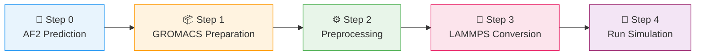

---
slug:2-quick-start
blog_type:normal
---


通过四个具体步骤，让 bAIes-IDP 集成模拟运行起来——从 AlphaFold-2 预测到生成内禀无序蛋白的完整 LAMMPS 分子动力学轨迹。本页将引导你完成**最简路径**，以提供的教程系统（PaaA2，71 个残基）为参考，并在每个阶段提供精确的命令和预期输出。


来源：[README.md](/README.md#L1-L54), [tutorial/bAIes/README.md](/tutorial/bAIes/README.md#L1-L151)

---

## 先决条件一览

在运行流水线之前，请确保你的 Linux 工作站已安装以下软件。完整的安装细节详见[软件与硬件要求](3-software-and-hardware-requirements)。

| 依赖项 | 版本 / 备注 | 用途 |
|:---|:---|:---|
| **AlphaFold-2** 或 **ColabFold** | 本地 AF2 或带 distogram 输出的 ColabFold | 生成结构预测 + distograms |
| **Conda** | 任何最新版本 | 管理 `baies` Python 环境 |
| **GROMACS** | 任何最新发行版 | 准备拓扑文件 (amber99SB-ILDN) |
| **LAMMPS** | 2023年8月2日版 + CMAP 补丁 | 运行集成模拟 |
| **PLUMED** | v2.10 分支（包含 bAIes） | bAIes 约束的偏置引擎 |

<CgxTip>`baies` conda 环境（Python 3.8 + intermol）仅在**步骤 3**（GROMACS→LAMMPS 转换）中需要。你可以在所有其他步骤中保持其未激活状态，以避免依赖冲突。</CgxTip>

来源：[installation/README.md](/installation/README.md#L1-L15), [installation/baies.yml](/installation/baies.yml#L1-L33)

---

## 流水线概览

bAIes-IDP 工作流通过四个连续阶段，将 AlphaFold-2 预测转换为可用于 LAMMPS 的集成模拟：



每个步骤对应教程中的一个工作目录（从 `tutorial/bAIes/0-inputs/` 到 `4-simulation/`），并且每个步骤都会生成明确的输出文件，作为下一步的输入。

来源：[tutorial/bAIes/README.md](/tutorial/bAIes/README.md#L1-L20)

---

## 步骤 0 — 获取 AlphaFold-2 预测

使用**本地 AlphaFold-2** 或 **ColabFold distogram 变体**，对你的目标 IDP 运行结构预测。你恰好需要以下两个输出：

| 输出 | AF2 来源 | ColabFold 来源 |
|:---|:---|:---|
| **Distograms** | `result_model_X_ptm_pred_X.pkl` | `alphafold2_ptm_model_X_seed_XXX_prob_distributions.npy` |
| **弛豫 PDB 模型** | 标准 AF2 弛豫模型 | ColabFold 排名 PDB |

教程在 `tutorial/bAIes/0-inputs/` 目录中提供了两种格式的 **PaaA2** 蛋白质的现成输入。

来源：[tutorial/bAIes/README.md](/tutorial/bAIes/README.md#L22-L49)

---

## 步骤 1 — 准备 GROMACS 文件

**工作目录**：`1-preparation`

使用 amber99SB-ILDN 力场，将 AlphaFold-2 PDB 模型转换为 GROMACS 拓扑文件：

```bash
./step1-prepare_gmx.bash relaxed_model_4_ptm_pred_0.pdb
```

该脚本内部运行 `gmx pdb2gmx` 和 `gmx trjconv`，生成四个文件：

| 输出文件 | 描述 |
|:---|:---|
| `idp.gro` | GROMACS 坐标文件 |
| `idp.top` | GROMACS 拓扑文件 |
| `idp.itp` | GROMACS 包含拓扑 |
| `idp.pdb` | 重新索引的 PDB（在步骤 2 中供 PLUMED 使用） |

来源：[scripts/step1-prepare_gmx.bash](/scripts/step1-prepare_gmx.bash#L1-L7), [tutorial/bAIes/README.md](/tutorial/bAIes/README.md#L51-L64)

---

## 步骤 2 — 预处理 AlphaFold-2 输出

**工作目录**：`2-preprocessing`

分析 distograms 并生成 bAIes 偏置的 PLUMED 输入文件。这是核心预处理步骤，从 AlphaFold-2 预测中提取残基对距离约束：

```bash
# 使用 AlphaFold-2 distograms：
./step2-preprocess.bash idp.pdb relaxed_model_4_ptm_pred_0.pdb result_model_4_ptm_pred_0.pkl

# 或者使用 ColabFold distograms：
./step2-preprocess.bash idp.pdb relaxed_model_4_ptm_pred_0.pdb alphafold2_ptm_model_1_seed_000_prob_distributions.npy
```

该脚本调用 `preprocess_bAIes.py` 进行高斯拟合和残基对特异性截断，然后组装 PLUMED 文件。将生成**三个文件**：

| 输出文件 | 描述 |
|:---|:---|
| `baies_params.dat` | 原子对参数与 bAIes 约束数据 |
| `atom_list.ndx` | 参与bAIes 约束的所有原子的索引 |
| `plumed.dat` | 用于模拟的 PLUMED 输入文件 |

生成的 `plumed.dat` 具有以下结构：

```plumed
#MOLINFO STRUCTURE=idp.pdb
batoms: GROUP NDX_FILE=atom_list.ndx NDX_GROUP=batoms
baies: BAIES ATOMS=batoms DATA_FILE=baies_params.dat PRIOR=JEFFREYS TEMP=2.478541306
PRINT ARG=baies.ene FILE=COLVAR STRIDE=500
bbias: BIASVALUE ARG=baies.ene STRIDE=2
```

`PRIOR=JEFFREYS` 设置选择标准的 bAIes 噪声模型。切换至 `PRIOR=NONE` 可使用 **bAIes-N** 变体（详见 [bAIes vs bAIes-N vs Coil](14-baies-vs-baies-n-vs-coil)）。

来源：[scripts/step2-preprocess.bash](/scripts/step2-preprocess.bash#L1-L39), [scripts/preprocess_bAIes.py](/scripts/preprocess_bAIes.py#L18-L37), [tutorial/bAIes/README.md](/tutorial/bAIes/README.md#L66-L102)

---

## 步骤 3 — 转换为 LAMMPS

**工作目录**：`3-conversion`  
**环境**：`conda activate baies`

将 GROMACS 拓扑和预处理输出转换为 LAMMPS 模拟输入：

```bash
conda activate baies
./step3-conversion.bash idp.gro idp.pdb idp.top
```

在内部，该脚本按顺序执行两项操作：(1) **intermol 转换**——将 GROMACS `.gro`/`.top` 文件转换为 LAMMPS 格式；(2) **力场修改**——通过 `make_ff.py` 应用 CMAP 修正并简化力场。输出为：

| 输出文件 | 描述 |
|:---|:---|
| `idp_nvt.in` | LAMMPS 输入脚本（模拟设置） |
| `idp_nvt.data` | LAMMPS 数据文件（拓扑 + 力场） |

intermol 转换产生的中间文件将被自动清理。

<CgxTip>`step3-conversion.bash` 中的 `-cube 200.0` 参数将模拟盒子大小设置为 200 Å 的立方体。如果你的蛋白需要更大或更小的盒子，请在脚本中调整此值。</CgxTip>

来源：[scripts/step3-conversion.bash](/scripts/step3-conversion.bash#L1-L33), [scripts/make_ff.py](/scripts/make_ff.py#L1-L16), [tutorial/bAIes/README.md](/tutorial/bAIes/README.md#L104-L128)

---

## 步骤 4 — 运行模拟

**工作目录**：`4-simulation`

将所有生成的文件组装到模拟目录中并启动 LAMMPS：

| 所需文件 | 来源步骤 |
|:---|:---|
| `idp_nvt.in`, `idp_nvt.data`, `cmap_20240524.cmap` | 步骤 3 |
| `plumed.dat`, `baies_params.dat`, `atom_list.ndx` | 步骤 2 |
| `idp.pdb` | 步骤 1 |

运行模拟：

```bash
lmp -in idp_nvt.in
```

你可能需要在 `idp_nvt.in` 中调整的**关键参数**：

| 参数行 | 默认值 | 含义 |
|:---|:---|:---|
| `dump 1 all xtc 10000 traj_idp.xtc` | 每 10 ps | 轨迹保存间隔 |
| `run 2000000000` | 2 μs | 总模拟时长 |

运行完成后，使用 GROMACS 工具分析轨迹：

```bash
gmx check -f traj_idp.xtc                     # 基本轨迹信息
gmx trjconv -f traj_idp.xtc -s idp.pdb -o traj_idp_dt100ps.xtc -dt 100   # 降采样至 100 ps
```

来源：[tutorial/bAIes/README.md](/tutorial/bAIes/README.md#L130-L151)

---

## 快速参考：完整命令序列

对于单个蛋白，从准备好的 AF2 预测到运行模拟的整个流水线可浓缩为：

```bash
# 步骤 1：GROMACS 准备
cd 1-preparation/
./step1-prepare_gmx.bash relaxed_model_4_ptm_pred_0.pdb

# 步骤 2：预处理
cd ../2-preprocessing/
./step2-preprocess.bash idp.pdb relaxed_model_4_ptm_pred_0.pdb result_model_4_ptm_pred_0.pkl

# 步骤 3：LAMMPS 转换（需要 baies conda 环境）
cd ../3-conversion/
conda activate baies
./step3-conversion.bash idp.gro idp.pdb idp.top

# 步骤 4：运行模拟
cd ../4-simulation/
lmp -in idp_nvt.in
```

来源：[scripts/README.md](/scripts/README.md#L1-L30), [tutorial/bAIes/README.md](/tutorial/bAIes/README.md#L1-L151)

---

## 接下来去哪

现在你已经能够端到端地运行该流水线，可以探索以下主题以加深理解并自定义模拟：

- **[软件与硬件要求](3-software-and-hardware-requirements)** — LAMMPS+CMAP 补丁、PLUMED v2.10 和 conda 环境的完整安装指南
- **[流水线架构](4-pipeline-architecture)** — 跨所有四个步骤的数据流和文件依赖关系
- **[bAIes 集成模拟](9-baies-ensemble-simulations)** — 高级模拟配置与参数调优
- **[基准蛋白系统](13-benchmark-protein-systems)** — 可从 `benchmark/` 目录直接复现的 20 个基准蛋白