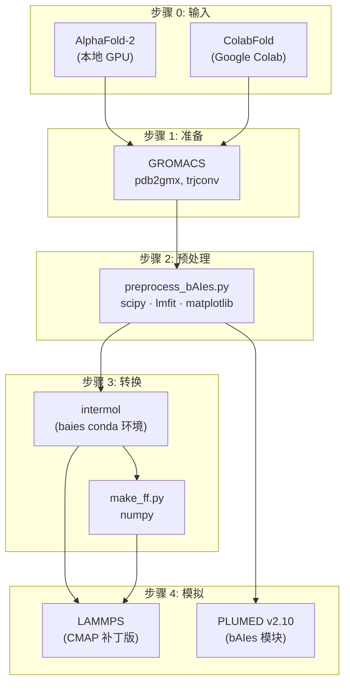

---
slug:3-software-and-hardware-requirements
blog_type:normal
---


bAIes-IDP 流水线编排了四个不同的计算阶段——结构预测、GROMACS 准备、预处理/转换和 LAMMPS 模拟——每个阶段都需要特定的软件工具。本页提供了所有依赖项的完整清单、经过验证可正常工作的确切版本，以及分步安装说明，以便你在运行首次集成预测之前，能够组装出一个功能完备的环境。

来源: [README.md](/README.md#L19-L53), [installation/README.md](/installation/README.md#L1-L102)

## 硬件要求

bAIes-IDP 专为 **Linux 工作站**设计。模拟引擎 (LAMMPS) 受益于通过 OpenMP 实现的多核并行化，这是推荐的线程模型。对于典型的 IDP 系统（40–230 个残基），拥有 **8 个 CPU 核心**的机器已足够。较大的多结构域蛋白质（如包含 486 个残基的 GS8）将受益于更多的核心和内存，但 LAMMPS+PLUMED 模拟阶段本身不需要 GPU。

请注意，初始的 AlphaFold-2 结构预测步骤有其自身的硬件需求（显存 ≥16 GB 的 GPU），但这不属于 bAIes-IDP 流水线的范畴——你可以转而在 Google Colab 上使用 ColabFold 来完全规避此要求。

| 组件 | 最低配置 | 推荐配置 | 备注 |
|---|---|---|---|
| **操作系统** | Linux | Linux (x86_64) | 所有工具均为 Linux 原生 |
| **CPU 核心数** | 4 | 8+ | LAMMPS 中的 OpenMP 并行化 |
| **内存** | 8 GB | 16 GB+ | 较大的蛋白质需要更多内存 |
| **GPU** | 无 | — | LAMMPS+PLUMED 阶段不需要 |

来源: [installation/README.md](/installation/README.md#L1-L7)

## 软件概览与流水线映射

流水线的每个阶段会使用软件栈中特定的子集。了解哪个步骤需要哪些工具，可以防止配置错误，并有助于尽早排查出缺失的依赖项。



下表汇总了每个软件依赖项，并将其映射到需要该依赖的流水线步骤。

| 软件 | 流水线步骤 | 作用 | 安装章节 |
|---|---|---|---|
| **AlphaFold-2** 或 **ColabFold** | 步骤 0 | 结构预测 + 距离分布图 | [AlphaFold-2 / ColabFold](#alphafold-2--colabfold) |
| **GROMACS** | 步骤 1, 步骤 4 | 拓扑生成；轨迹分析 | [GROMACS](#gromacs) |
| **Conda** | 步骤 2, 步骤 3 | Python 环境管理 | [Conda 环境](#conda-environment-setup) |
| **Python 3.8 + 软件包** | 步骤 2, 步骤 3 | 预处理和力场转换 | [Conda 环境](#conda-environment-environment-setup) |
| **LAMMPS (2 Aug 2023)** | 步骤 4 | 分子动力学模拟引擎 | [包含 PLUMED 的 LAMMPS](#lammps-with-plumed) |
| **PLUMED (v2.10)** | 步骤 4 | 偏置框架 (bAIes 模块) | [包含 PLUMED 的 LAMMPS](#lammps-with-plumed) |

来源: [README.md](/README.md#L19-L53), [scripts/README.md](/scripts/README.md#L1-L30), [tutorial/bAIes/README.md](/tutorial/bAIes/README.md#L1-L151)

## AlphaFold-2 / ColabFold

你**至少需要**以下选项之一，以生成输入到 bAIes 预处理步骤的初始结构预测和距离分布图。

**AlphaFold-2 (本地安装)** — 完整的 DeepMind AlphaFold-2 仓库，可从 [github.com/google-deepmind/alphafold](https://github.com/google-deepmind/alphafold) 获取。这需要本地 GPU，并生成包含距离分布图和弛豫后 PDB 模型的 pickle 文件（`result_model_x_ptm_pred_x.pkl`）。

**ColabFold (云端替代方案)** — 如果你缺乏本地 GPU，请使用可输出距离分布的 ColabFold 变体，可从 [github.com/zshengyu14/ColabFold_distmats](https://github.com/zshengyu14/ColabFold_distmats/blob/main/AlphaFold2.ipynb) 获取。此方案在 Google Colab 上运行，并在 PDB 模型旁的 `_distmat` 子目录中生成 numpy 文件（`*_prob_distributions.npy`）。

| 选项 | 所需硬件 | 距离分布图格式 | 输出文件模式 |
|---|---|---|---|
| AlphaFold-2 (本地) | GPU ≥16 GB VRAM | Pickle (`.pkl`) | `result_model_x_ptm_pred_x.pkl` |
| ColabFold (云端) | 无 (浏览器) | NumPy (`.npy`) | `*_prob_distributions.npy` |

来源: [README.md](/README.md#L23-L27), [installation/README.md](/installation/README.md#L10-L12), [tutorial/bAIes/README.md](/tutorial/bAIes/README.md#L10-L33)

## GROMACS

GROMACS 在**步骤 1** 中用于使用 **amber99SB-ILDN** 力场将 PDB 模型转换为 GROMACS 拓扑文件（`.gro`、`.top`、`.itp`），并在**步骤 4** 中用于模拟后的轨迹分析（例如 `gmx check`、`gmx trjconv`）。

从官方网站下载并安装：[manual.gromacs.org/current/download.html](https://manual.gromacs.org/current/download.html)

流水线调用的特定 GROMACS 命令为 `gmx pdb2gmx`（拓扑生成）和 `gmx trjconv`（坐标转换），如准备脚本所示。

来源: [README.md](/README.md#L38-L39), [scripts/step1-prepare_gmx.bash](/scripts/step1-prepare_gmx.bash#L1-L7), [installation/README.md](/installation/README.md#L62-L64)

## Conda 环境设置

名为 `baies` 的专用 conda 环境为预处理和转换步骤提供了所有 Python 依赖项。环境规范由 [`baies.yml`](/installation/baies.yml) 提供。

### 创建环境

```bash
conda env create -f baies.yml
```

### 激活环境

```bash
conda activate baies
```

**在步骤 3 之前必须激活**该环境（即 GROMACS 到 LAMMPS 的转换），因为该步骤依赖于 `intermol` 库。

### 软件包清单

`baies.yml` 文件锁定了以下版本，这些版本已验证可相互兼容正常工作：

| 软件包 | 版本 | 用途 | 流水线步骤 |
|---|---|---|---|
| **Python** | 3.8.19 | 运行时 | 步骤 2, 3 |
| **intermol** | 0.1.0.dev0 | GROMACS → LAMMPS 转换 | 步骤 3 |
| **numpy** | 1.24.4 | 数值计算 | 步骤 2, 3 |
| **parmed** | 3.4.4 | 参数编辑 | 步骤 3 |
| **par** | 1.3.4 | InterMol 依赖项 | 步骤 3 |
| **parm** | 1.11 | InterMol 依赖项 | 步骤 3 |
| **six** | 1.16.0 | Python 2/3 兼容性 | 步骤 3 |

### 步骤 2 的额外依赖项

预处理脚本 `preprocess_bAIes.py` 导入了 `baies.yml` 中**未**列出但通常在标准科学 Python 安装中可用的库。请确保你的环境中安装了以下内容：

| 软件包 | 使用位置 | 用途 |
|---|---|---|
| **scipy** | `scipy.special.softmax`, `scipy.special.expit`, `scipy.optimize.curve_fit` | 距离分布图拟合 |
| **lmfit** | `lmfit.Minimizer`, `lmfit.Parameters` | 非线性最小二乘优化 |
| **matplotlib** | `matplotlib.pyplot` | 质量检查图（可选，通过 `--plots` 标志启用） |

你可以使用以下命令将它们安装到 `baies` 环境中：

```bash
conda activate baies
pip install scipy lmfit matplotlib
```

来源: [installation/baies.yml](/installation/baies.yml#L1-L33), [installation/README.md](/installation/README.md#L19-L60), [scripts/preprocess_bAIes.py](/scripts/preprocess_bAIes.py#L1-L13), [scripts/README.md](/scripts/README.md#L17-L29)

## 包含 PLUMED 的 LAMMPS

这是最复杂的安装步骤。LAMMPS 必须从源码构建，并应用两项关键修改：一个 **CMAP 补丁**（本仓库提供）和 **PLUMED 插件**（提供 bAIes 偏置模块）。

### 版本要求

| 软件 | 所需版本 | 原因 |
|---|---|---|
| **LAMMPS** | 2 Aug 2023 (稳定版) | CMAP 补丁针对此源码树 |
| **PLUMED** | v2.10 | 包含 bAIes 模块 |

### 步骤 1 — 下载 LAMMPS 源码

从 [download.lammps.org/tars/index.html](https://download.lammps.org/tars/index.html) 下载 2 Aug 2023 稳定版。

### 步骤 2 — 应用 CMAP 补丁

该补丁修改了 `fix_cmap.cpp`，将 `CMAPMAX` 从 6 增加到 40，从而允许比 LAMMPS 默认值更多的 CMAP 修正类型。这对 bAIes 模拟是**必需的**——标准的 LAMMPS 构建将在运行时出现“Invalid CMAP crossterm_type”错误而失败。

在 LAMMPS 源码根目录下运行：

```bash
patch ./src/MOLECULE/fix_cmap.cpp < /path/to/bAIes-IDP/installation/patch_cmap.txt
```

<CgxTip>CMAP 补丁修改了 fix_cmap.cpp 中的三行代码：将 CMAPMAX 从 6 提升至 40，将硬编码的循环边界 `6` 替换为 `CMAPMAX`，并将验证检查从 `t1 > 5` 更新为 `t1 > CMAPMAX-1`。如果你升级了 LAMMPS，则必须重新应用此补丁。</CgxTip>

### 步骤 3 — 配置 CMake 构建

创建构建目录并配置 PLUMED 支持：

```bash
mkdir build
cd build
cmake -C ../cmake/presets/basic.cmake -D PKG_PLUMED=yes -D PLUMED_MODE=runtime ../cmake
```

`-D PLUMED_MODE=runtime` 标志允许在执行时解析 PLUMED，从而提供了无需重新编译 LAMMPS 即可切换 PLUMED 安装的灵活性。

`cmake/presets/basic.cmake` 文件应包含以下 LAMMPS 软件包：

```cmake
set(ALL_PACKAGES KSPACE MANYBODY MOLECULE RIGID GPU EXTRA-DUMP EXTRA-FIX KOKKOS)

foreach(PKG ${ALL_PACKAGES})
  set(PKG_${PKG} ON CACHE BOOL "" FORCE)
endforeach()
```

### 步骤 4 — 编译与安装

```bash
make
sudo make install
```

### 步骤 5 — 验证 PLUMED bAIes 模块

确保你的 PLUMED 安装中包含 **bAIes** 模块。如果没有，请从包含 bAIes 的分支安装 PLUMED v2.10：[github.com/plumed/plumed2/tree/v2.10](https://github.com/plumed/plumed2/tree/v2.10)。

### 并行化

**OpenMP** 是推荐的并行化策略。运行模拟时，LAMMPS 将自动使用可用的 OpenMP 线程。对于典型的 8 核工作站，40–100 个残基的 IDP 模拟将以适合微秒级采样的实用速度运行。

来源: [installation/README.md](/installation/README.md#L66-L99), [installation/patch_cmap.txt](/installation/patch_cmap.txt#L1-L30), [README.md](/README.md#L41-L53)

## 安装验证清单

在运行完整流水线之前，请在终端中运行以下命令以验证各组件是否已正确安装：

| 检查项 | 命令 | 预期结果 |
|---|---|---|
| Conda 环境 | `conda activate baies && python -c "import intermol"` | 无错误 |
| GROMACS | `gmx --version` | 打印 GROMACS 版本信息 |
| LAMMPS | `lmp -help \| head -1` | 打印 LAMMPS 版本 (2 Aug 2023) |
| PLUMED | `plumed info --long` | 列出模块；验证 `BAIES` 存在 |
| CMAP 补丁 | 使用 >6 种 CMAP 类型运行测试 | 无 "Invalid CMAP crossterm_type" 错误 |
| Python 预处理 | `python preprocess_bAIes.py -h` | 打印参数帮助 |
| Python 转换 | `python make_ff.py -h` | 打印参数帮助 |

<CgxTip>如果 PLUMED 的 `BAIES` 模块缺失，模拟将在启动时因 PLUMED 错误而失败。这是最常见的安装问题——在运行步骤 4 之前，务必始终通过 `plumed info --long` 进行验证。</CgxTip>

## 下一步

环境完全配置好之后，请前往 [快速入门](2-quick-start) 页面查看精简的操作演练，或深入阅读 [流水线架构](4-pipeline-architecture) 页面，以了解这些软件组件在各阶段是如何交互的。