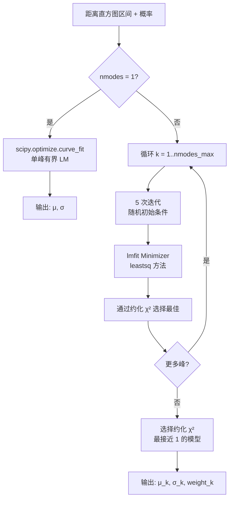
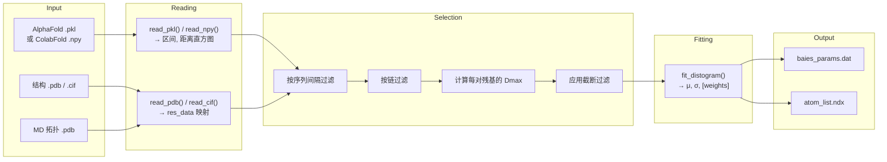

---
slug:5-distogram-reading-and-fitting
blog_type:normal
---


**距离直方图读取与拟合**阶段是 bAIes 预处理流程的智能核心——在此步骤中，原始的 AlphaFold-2（或 ColabFold）距离预测值将被解析、过滤，并转换为适用于贝叶斯系综重加权的参数化概率分布。该阶段将离散的预测距离直方图（成对 Cβ–Cβ 距离上的 64 区间概率数组）转换为连续的解析模型（高斯分布或对数正态分布），生成在模拟过程中驱动所有 bAIes 约束的 `baies_params.dat` 文件。

## 距离直方图来源与格式

AlphaFold-2 和 ColabFold 将成对残基距离预测编码为**距离直方图 (distograms)**：在 2–22 Å 跨距的 64 个距离区间上，形状为 N×N×64 的 logits 张量。该流程接受两种文件格式，并通过文件扩展名自动选择：

| 来源 | 文件扩展名 | 格式 | 读取函数 |
|--------|---------------|--------|-----------------|
| AlphaFold-2 (本地) | `.pkl` | 包含 `distogram` 键的 Pickle 字典 | `read_pkl()` |
| ColabFold (距离矩阵) | `.npy` | 原始 NumPy 数组 (N×N×64) | `read_npy()` |

对于 **`.pkl` 文件**，读取器从 Pickle 字典中提取 `bin_edges` 和 `logits`，将每个区间平移至其中心值，从埃 (Å) 转换为纳米 (×0.1)，并将 logits 转换为适当的概率分布。提供了两种转换函数：**softmax**（默认，逐元素应用于每个 64 元素的 logit 向量）和 **sigmoid**（逐元素应用后重新归一化）。最后一个区间（覆盖 >22 Å 的范围）会被丢弃，因为它代表缺乏有效信息的尾部。

对于 **`.npy` 文件**，读取器直接加载预计算的概率数组以及硬编码的 64 个区间中心值列表（单位已为纳米）——这些值与 ColabFold 特定的区间离散化方式相对应，并内嵌于代码中。

来源: [preprocess_bAIes.py](/scripts/preprocess_bAIes.py#L434-L473)

## 结构文件解析与原子映射

在对距离直方图进行有效解释之前，流程必须在**距离直方图残基索引**（从 1 开始，顺序编号）与**分子动力学模拟原子编号**（取决于力场拓扑）之间建立映射。此映射至关重要，因为 AlphaFold 的内部残基编号与经过 `pdb2gmx` 处理后的 GROMACS 原子编号有所不同。

该流程同时支持 **PDB** 和 **mmCIF** 结构文件。对于每个残基，解析器提取 **Cβ 原子**（对于缺乏 Cβ 的甘氨酸则提取 **Cα**），记录其原子索引、残基类型、链标签和 PDB 残基编号。输出字典的格式为：

```
{距离直方图索引: (原子编号, 残基类型, 链标签, PDB残基编号)}
```

单独的 `-mdpdb` 参数允许提供不同的 PDB 用于原子编号——这处理了 AlphaFold PDB 与 GROMACS 预处理的 PDB 具有不同原子索引的常见情况。当省略 `-mdpdb` 时，两种映射默认使用 AlphaFold PDB。

来源: [preprocess_bAIes.py](/scripts/preprocess_bAIes.py#L229-L399), [preprocess_bAIes.py](/scripts/preprocess_bAIes.py#L401-L418)

## 残基对选择与截断过滤

并非所有的 N×N 残基对都具有物理上的有效信息。流程在拟合前应用了一系列过滤器，这些过滤器在 `select_and_fit_distograms()` 中实现：

**序列间隔过滤器** (`-seqsep`，默认值=3)：在同一链内，满足 `|res_j − res_i| ≤ seqsep` 的残基对将被排除。这移除了距离主要由局部骨架几何结构（键、键角、二面角）而非长程结构信息决定的、显然过近的邻居残基对。默认值 3 在消除无信息量的最近邻残基对的同时，保留了螺旋接触信息。

**链过滤器** (`-chains`)：对于多链系统，用户可以将约束限制为 `"intra"`（仅限链内残基对）、`"inter"`（仅限链间残基对）或 `"all"`（默认）。

**距离截断过滤器** (`-cutoff`)：这是主要的物理过滤器。对于每个残基对，流程计算 **Dmax**——即距离直方图中概率最高的区间中心值。残基对**仅在 Dmax < cutoff**（单位为 nm）时被保留。存在两种截断模式：

| 截断模式 | 参数 | 行为 |
|-------------|----------|----------|
| 固定值 | `-cutoff 8.0` | 保留所有 Dmax < 8 Å 的残基对 |
| 残基对矩阵 | `-cutoff matrix` | 使用源自 Baker 实验室的残基对特异截断表 |

**残基对截断矩阵**是一个包含 210 个条目的字典，将氨基酸对映射到 `(截断值_Å, 容差)`。它编码了这样的物理推理：小残基（例如 GLY–GLY：4.47 Å）无法形成长程接触，而大的芳香族/带电残基对（例如 ARG–TRP：11.36 Å）则可以。在教程流程中，建议使用 `-cutoff matrix` 作为默认选项。

来源: [preprocess_bAIes.py](/scripts/preprocess_bAIes.py#L769-L838), [step2-preprocess.bash](/scripts/step2-preprocess.bash#L17-L27)

## 拟合模型：高斯分布与对数正态分布

一旦残基对通过所有过滤器，其 63 区间的离散概率分布将被拟合为连续的参数化模型。通过 `-model` 标志支持两种模型族：

### 高斯分布（默认）

$$P(d) = \frac{s}{\sqrt{2\pi\sigma^2}} \exp\!\left(-\frac{(d - \mu)^2}{2\sigma^2}\right)$$

当距离分布近似对称时，高斯分布是自然选择——这常见于结构区域中定位良好的接触。拟合参数为 **μ**（平均距离，nm）和 **σ**（标准差，nm），在输出中报告为 `mu` 和 `sigma`。

### 对数正态分布

$$P(d) = \frac{s}{d\sqrt{2\pi\sigma^2}} \exp\!\left(-\frac{(\ln d - \mu)^2}{2\sigma^2}\right)$$

对数正态模型自然地保证了 d > 0，并能捕捉柔性或弱约束残基对常见的右偏分布。这里的 **μ** 是对数空间的均值，**σ²** 是对数空间的方差。

<CgxTip>对于单峰拟合（默认及最常见用法），`scipy.optimize.curve_fit` 执行有界 Levenberg-Marquardt 优化。μ 的初始猜测值以距离直方图峰值的 Dmax 值作为种子，这显著提升了收敛的可靠性。</CgxTip>

来源: [preprocess_bAIes.py](/scripts/preprocess_bAIes.py#L491-L520), [preprocess_bAIes.py](/scripts/preprocess_bAIes.py#L676-L735)

## 多峰拟合与模型选择

除单峰拟合外，流程还支持**多峰分布**——即残基对的距离直方图显示出两个或多个不同峰的情况（例如，一个接触既可以是短程的也可以是长程的）。当 `nmodes > 1` 时，拟合策略会发生显著改变：

流程使用 **lmfit** 的 `Minimizer` 框架替代 `scipy.optimize.curve_fit`。对于从 1 到 `nmodes_max` 的每个峰数 k，它执行 **N 次迭代**（默认 5 次），并采用**随机初始条件**以避免陷入局部极小值。每次迭代将第一个峰的 μ 设定为 Dmax 作为种子，并在物理合理的边界内随机化其余参数。各迭代中的最佳拟合通过**约化卡方** (χ²/ν) 选出。

拟合完所有峰数后，模型选择会挑选约化 χ² **最接近 1.0** 的结果——这在欠拟合 (χ² ≫ 1) 和过拟合 (χ² ≪ 1) 之间取得了平衡。随后，输出将包含每个峰的 `(μ_k, σ_k, weight_k)`，其中权重为总和为 1 的归一化缩放系数。



<CgxTip>当 `curve_fit` 抛出 `RuntimeError`（收敛失败）时，`iterate_fits()` 回退机制将使用新的随机初始条件最多重试 100 次。类似地，lmfit 路径在遇到 `ValueError` 时也有一个 10 次重试的内部循环。这些回退机制使拟合过程能够应对病态的距离直方图形状，保持鲁棒性。</CgxTip>

来源: [preprocess_bAIes.py](/scripts/preprocess_bAIes.py#L536-L668), [preprocess_bAIes.py](/scripts/preprocess_bAIes.py#L737-L767)

## 端到端数据流

从原始 AlphaFold 输出到 PLUMED 就绪参数文件的完整距离直方图读取与拟合工作流程如下：



输出文件 `baies_params.dat` 为每个选定的残基对包含一行。对于单峰高斯拟合（默认），每行指定：

```
#! FIELDS Id atom_i atom_j mu sigma
#! SET model gaussian
1 57 127 1.056467 0.266714
```

其中 `atom_i` 和 `atom_j` 为 GROMACS 原子编号（来自 MD PDB），`mu` 为拟合的平均距离（单位 nm），`sigma` 为 √(σ²)（单位 nm）。伴随的 `atom_list.ndx` 文件列出了至少参与一个约束的所有唯一原子，格式化为名为 `[ batoms ]` 的 GROMACS 风格索引组。

来源: [preprocess_bAIes.py](/scripts/preprocess_bAIes.py#L840-L882), [baies_params.dat](/tutorial/bAIes/2-preprocessing/baies_params.dat#L1-L101)

## 命令行界面与关键参数

预处理脚本作为 `step2-preprocess.bash` 中的核心步骤被调用。完整的参数集及默认值如下：

| 参数 | 默认值 | 描述 |
|----------|---------|-------------|
| `-pdb` | *(必选)* | 用于残基映射的 AlphaFold PDB 或 CIF 文件 |
| `-mdpdb` | `same` | 若原子索引与 AlphaFold 不同，则指定 MD 模拟 PDB |
| `-pkl` | *(必选)* | 距离直方图文件（AF2 的 `.pkl` 或 ColabFold 的 `.npy`） |
| `-out` | `baies_params.dat` | PLUMED bAIes 的输出参数文件 |
| `-cutoff` | `8.0` | 截断值（单位 Å），或使用 `matrix` 表示残基对特异截断 |
| `-model` | `gauss` | 拟合模型：`gauss` 或 `lognorm` |
| `-seqsep` | `3` | 残基对的最小序列间隔 |
| `-chains` | `all` | 链过滤器：`all`、`intra` 或 `inter` |
| `-ndxout` | `atom_list.ndx` | 输出原子索引文件 |
| `--plots` | off | 生成包含拟合质量图的 PDF |
| `--verbose` | off | 打印详细进度信息 |

典型的调用方式（如教程中所示）：

```bash
./preprocess_bAIes.py -pdb result_model_4_ptm_pred_0.pkl \
    -mdpdb idp.pdb \
    -pkl result_model_4_ptm_pred_0.pkl \
    -out baies_params.dat \
    -model gauss \
    -cutoff matrix \
    -ndxout atom_list.ndx \
    --verbose
```

在初始设置期间强烈推荐使用 `--plots` 标志：它会生成一个多页 PDF，每页展示原始距离直方图区间及拟合曲线，从而能够直观验证解析模型是否忠实捕捉了预测分布。

来源: [preprocess_bAIes.py](/scripts/preprocess_bAIes.py#L14-L34), [step2-preprocess.bash](/scripts/step2-preprocess.bash#L17-L27)

## 与下游流程的集成

此阶段的输出直接馈入两个下游消费者。**PLUMED 插件**通过 `BAIES` 操作读取 `baies_params.dat` 和 `atom_list.ndx`，在 LAMMPS 模拟期间应用贝叶斯约束（参见 [PLUMED 文件生成](6-plumed-file-generation)）。**GROMACS 原子索引文件**确保了在 AlphaFold→GROMACS→LAMMPS 转换链中原子身份映射的正确性（参见 [GROMACS 到 LAMMPS 转换](7-gromacs-to-lammps-conversion)）。在此阶段对拟合模型（`gauss` 对比 `lognorm`）和截断策略（`matrix` 对比固定值）的选择会对约束质量产生级联效应——[残基对截断矩阵](12-residue-pair-cutoff-matrix)页面提供了基于矩阵截断的完整参考表，而[模拟参数调优](16-simulation-parameter-tuning)则讨论了这些选择如何影响系综收敛。