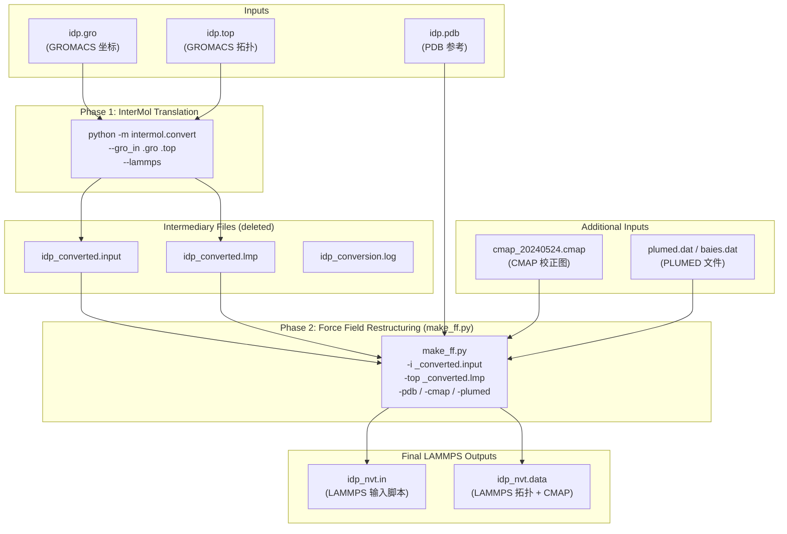

---
slug:7-gromacs-to-lammps-conversion
blog_type:normal
---


GROMACS 到 LAMMPS 的转换是 bAIes-IDP 流水线中的关键转换步骤，它将基于 GROMACS 的力场准备工作（amber99SB-ILDN）与 LAMMPS 原生模拟输入衔接起来。这一两阶段过程首先调用 **InterMol** 进行机械的文件格式转换，然后应用 `make_ff.py` 将力场重塑为 IDP 系综采样所需的简化形式——剥离长程静电相互作用，注入 CMAP 校正图，展开对系数，并追加 PLUMED/bAIes 模拟指令。

来源：[step3-conversion.bash](/scripts/step3-conversion.bash#L1-L33), [make_ff.py](/scripts/make_ff.py#L1-L237)

## 两阶段转换架构

转换过程由 `step3-conversion.bash` 统一调度，它将两个不同的操作串联成一个完整的流水线。第一阶段利用 InterMol 库进行直接的格式转换；第二阶段进行特定于 bAIes 框架的力场重构。第一阶段生成的中间文件会被第二阶段消耗，随后被删除，仅保留最终的 LAMMPS 就绪输出。



来源：[step3-conversion.bash](/scripts/step3-conversion.bash#L17-L32), [make_ff.py](/scripts/make_ff.py#L225-L236)

## 第一阶段：InterMol 格式转换

第一阶段使用 **InterMol** 库（v0.1.0.dev0）执行直接的 GROMACS 到 LAMMPS 文件格式转换。InterMol 读取 GROMACS 坐标文件（`.gro`）和拓扑文件（`.top`）——这两者均由 `gmx pdb2gmx` 使用 amber99SB-ILDN 力场生成——并将它们转换为等效的 LAMMPS 文件：

```bash
python -m intermol.convert --gro_in ${gro} ${top} --lammps >> ${name}_conversion.log
```

此操作生成三个中间文件：`idp_converted.input`（LAMMPS 输入脚本）、`idp_converted.lmp`（LAMMPS 数据/拓扑文件）和 `idp_conversion.log`（转换日志）。这些文件包含对 amber99SB-ILDN 力场**忠实但未修改的**转换结果，包括长程静电相互作用（`kspace_style`）、`special_bonds` 设置以及混合对系数规则——所有这些将在第二阶段中被重构或移除。

<CgxTip>在运行转换之前必须激活 `baies` conda 环境（Python 3.8），因为该环境包含 `intermol` 包。使用 `conda env create -f baies.yml` 创建该环境。</CgxTip>

来源：[step3-conversion.bash](/scripts/step3-conversion.bash#L17-L18), [baies.yml](/installation/baies.yml#L1-L33), [installation/README.md](/installation/README.md#L19-L26)

## 第二阶段：力场重构

`make_ff.py` 脚本是转换流水线的核心。它读取由 InterMol 生成的 LAMMPS 文件，并系统地**简化和扩充**力场，以适应 IDP 系综模拟。这并非简单的格式转换——它从根本上重塑了能量函数。

来源：[make_ff.py](/scripts/make_ff.py#L1-L237)

### 输入脚本转换（`read_input_lammps`）

`read_input_lammps` 函数逐行处理 `idp_converted.input`，执行针对性的替换和删除操作：

| 原始 LAMMPS 指令 | 转换操作 | 原理 |
|---|---|---|
| `pair_style`（包含 PME/LJ） | 替换为 `pair_style lj/cut 2.0` | 移除长程静电相互作用；仅使用短程 LJ |
| `pair_coeff i j ε σ` | 解析并存储，截断距离为 2^(1/6)·σ | 在 LJ 最小值处计算 WCA 风格的截断 |
| `pair_modify mix arithmetic` | 展开为所有显式对系数 | 将混合规则解析为具体值；添加 `pair_modify shift yes` |
| `kspace_style` | **移除** | 简化力场中无长程静电相互作用 |
| `special_bonds` | **移除** | 简化力场中不需要 |
| `read_data` | 替换为支持 CMAP 的 `read_data ... fix drycmap crossterm CMAP` | 将 CMAP 校正项注入拓扑 |
| `thermo_style` | 替换为支持 CMAP 的输出：`step ecoul evdwl ebond eangle edihed f_drycmap eimp` | 追踪 CMAP 能量贡献（`f_drycmap`） |
| `run` | **移除** | 替换为特定于模拟的运行代码块 |

在处理完现有指令后，该函数追加一段完整的模拟设置代码块：CMAP fix 声明、邻列表设置、时间步长（1.0 fs）、能量最小化、NVE + CSVR 恒温器系综、PLUMED fix、XTC 轨迹输出，以及 2 µs 的运行命令。

来源：[make_ff.py](/scripts/make_ff.py#L102-L179)

### 对系数展开

一项关键的转换是**显式展开所有成对 LJ 参数**。InterMol 的输出仅指定了对角线（`i-i`）对系数以及混合规则（通常为算术平均）。`make_ff.py` 脚本执行以下操作：

1. 读取所有对角线 `pair_coeff i i ε σ` 条目，并使用计算出的截断距离 2^(1/6)·σ（即 LJ 能量最小距离）存储它们。
2. 对于 `pair_modify mix arithmetic` 规则，使用 Lorentz-Berthelot 组合规则计算所有非对角线对：**ε_ij = √(ε_i · ε_j)** 和 **σ_ij = (σ_i + σ_j) / 2**。
3. 显式写入所有 N² 个对系数及其各自的截断距离。
4. 添加 `pair_modify shift yes` 以确保 LJ 势在截断距离处为零。

对于包含 26 种原子类型的教程系统，这将生成 351 行显式对系数（26×26 对角线 + 非对角线，考虑对称性）。

来源：[make_ff.py](/scripts/make_ff.py#L123-L154)

### 数据文件与 CMAP 注入（`read_data_lammps`）

`read_data_lammps` 函数处理 `idp_converted.lmp`，并进行两项关键修改：

**盒子尺寸覆盖**：模拟盒子的尺寸被替换为用户指定边长的立方盒子（默认通过 `-cube 200.0` 设为 200 Å），以原点为中心。这确保了为 IDP 提供充足的无溶剂化自由空间。

**CMAP 交叉项注入**：该函数读取 PDB 文件以识别所有适合 CMAP 校正的主链二面角位置。对于每个残基 *i*（不包括末端），它提取五原子序列 **C(i-1)–N(i)–CA(i)–C(i)–N(i+1)**，然后：

1. 根据残基对（残基 *i*，残基 *i+1*）确定 CMAP 类型，对位置 *i+1* 的脯氨酸进行特殊处理（映射为 `"PRO"`），而其他所有残基则映射为 `"XXX"`。
2. 从 `.cmap` 文件头中查找 CMAP 类型索引。
3. 将 `CMAP` 部分追加到数据文件中，包含每个交叉项条目：`index cmap_type C-1 N CA C N+1`。

来源：[make_ff.py](/scripts/make_ff.py#L182-L222), [make_ff.py](/scripts/make_ff.py#L22-L81)

## 命令行接口

`make_ff.py` 脚本接受以下参数：

| 标志 | 描述 | 默认值 |
|---|---|---|
| `-i` | 输入 LAMMPS 输入文件（来自 InterMol） | *必填* |
| `-top` | 输入 LAMMPS 数据/拓扑文件（来自 InterMol） | *必填* |
| `-pdb` | 用于 CMAP 主链映射的 PDB 文件 | `protein.pdb` |
| `-cmap` | CMAP 校正图数据文件 | `ff.cmap` |
| `-oin` | 输出 LAMMPS 输入文件路径 | *必填* |
| `-otop` | 输出 LAMMPS 拓扑文件路径 | `conff.data` |
| `-cube` | 立方盒子边长（Å） | `400.0` |
| `-oxtc` | XTC 轨迹输出文件名 | `traj.xtc` |
| `-plumed` | 用于 bAIes 约束的 PLUMED 输入文件 | `plumed.dat` |

来源：[make_ff.py](/scripts/make_ff.py#L8-L19)

## 转换脚本用法

`step3-conversion.bash` 脚本将两个阶段封装为单次调用。它接受三个位置参数——GROMACS 坐标文件、PDB 参考文件和 GROMACS 拓扑文件：

```bash
# 首先激活所需环境
conda activate baies

# 运行转换
./step3-conversion.bash idp.gro idp.pdb idp.top
```

该脚本硬编码了两个辅助文件名：`cmap_20240524.cmap`（CMAP 校正图）和 `baies.dat`（来自 [PLUMED 文件生成](6-plumed-file-generation) 的 PLUMED/bAIes 参数文件）。通用的输出前缀 `idp` 也是硬编码的。转换完成后，中间文件（`idp_converted.input`、`idp_converted.lmp`、`idp_conversion.log`）将被自动删除。

来源：[step3-conversion.bash](/scripts/step3-conversion.bash#L1-L33), [tutorial/bAIes/3-conversion/step3-conversion.bash](/tutorial/bAIes/3-conversion/step3-conversion.bash#L1-L33)

## 输出文件结构

转换过程生成两个 LAMMPS 输入文件，它们共同定义了完整的模拟系统：

### `idp_nvt.in` — LAMMPS 输入脚本

此文件包含模拟流程和力场配置。其结构如 PaaA2 的教程示例所示（1165 个原子，26 种原子类型）：

```
units real
atom_style full
dimension 3
boundary p p p

bond_style hybrid harmonic
angle_style hybrid harmonic
dihedral_style hybrid multi/harmonic charmm

pair_style lj/cut 2.0

fix drycmap all cmap cmap_20240524.cmap          # CMAP 校正
read_data idp_nvt.data fix drycmap crossterm CMAP  # 拓扑 + CMAP
fix_modify drycmap energy yes                      # CMAP 能量追踪

pair_coeff 1 1   0.1700000   3.2500000   3.6480017  # 显式 LJ 参数
pair_coeff 2 2   0.0157000   1.0690800   1.2000017  # 截断距离 = 2^(1/6)·σ
...
pair_modify shift yes

thermo_style custom step ecoul evdwl ebond eangle edihed f_drycmap eimp

neighbor 4.0 bin
neigh_modify every 1 delay 1 check yes
timestep 1.0
thermo 50
minimize 1.0e-4 1.0e-6 10000 100000

fix 1 all nve
fix 2 all temp/csvr 298.1 298.1 $(100.0*dt) <seed>

fix pl all plumed plumedfile baies.dat outfile p.log
dump 1 all xtc 10000 traj_idp.xtc
run    2000000000
```

主要模拟默认设置：**1 fs 时间步长**，动力学运行前进行**能量最小化**，**NVE + CSVR 恒温器**设置为 298.1 K，**10 ps 轨迹输出**，以及 **2 µs 的总运行时长**。所有这些参数均可在转换后进行修改。

来源：[tutorial/bAIes/3-conversion/idp_nvt.in](/tutorial/bAIes/3-conversion/idp_nvt.in#L1-L18), [tutorial/bAIes/3-conversion/idp_nvt.in](/tutorial/bAIes/3-conversion/idp_nvt.in#L371-L389)

### `idp_nvt.data` — LAMMPS 拓扑文件

此文件包含所有力场参数和原子坐标。其头部声明了系统维度：

```
1165 atoms
1175 bonds
2120 angles
4208 dihedrals
69 crossterms         ← CMAP 项（每个非末端残基一个）
0 impropers

26 atom types
...
-100.0000000  100.0000000 xlo xhi   ← 立方盒子（200 Å 边长）
```

该文件包含 Masses、Bond Coeffs、Angle Coeffs、Dihedral Coeffs、Atoms、Bonds、Angles、Dihedrals，以及末尾的 **CMAP** 部分。每个 CMAP 交叉项行指定：`index cmap_type C-1 N CA C N+1`，将五个主链原子映射到其残基特定的校正图类型（在 [CMAP 校正图](8-cmap-correction-maps) 中定义）。

来源：[tutorial/bAIes/3-conversion/idp_nvt.data](/tutorial/bAIes/3-conversion/idp_nvt.data#L1-L18), [tutorial/bAIes/3-conversion/idp_nvt.data](/tutorial/bAIes/3-conversion/idp_nvt.data#L17409-L17480)

## bAIes 与随机卷曲转换的对比

**bAIes** 和 **随机卷曲** 流水线之间的转换步骤略有不同。两者都使用相同的 InterMol + `make_ff.py` 两阶段过程，但随机卷曲变体省略了 PLUMED 集成：

| 方面 | bAIes 流水线 | 随机卷曲流水线 |
|---|---|---|
| 脚本 | `step3-conversion.bash` | `step2-conversion.bash` |
| PLUMED 参数 | `-plumed baies.dat`（或 `plumed.dat`） | **不传递** |
| 流水线步骤编号 | 步骤 3（预处理之后） | 步骤 2（无需预处理） |
| LAMMPS 输入包含 | `fix pl all plumed plumedfile baies.dat outfile p.log` | 无 PLUMED fix |
| 目的 | 带有 AF2 约束的贝叶斯系综 | 无约束随机卷曲参考 |

来源：[tutorial/bAIes/3-conversion/step3-conversion.bash](/tutorial/bAIes/3-conversion/step3-conversion.bash#L22-L29), [tutorial/coil/2-conversion/step2-conversion.bash](/tutorial/coil/2-conversion/step2-conversion.bash#L21-L28)

## 力场转换总结

转换从根本上改变了能量函数，从完整的 amber99SB-ILDN 转换为适合 IDP 采样的简化形式：

| 组件 | 原始（GROMACS/amber99SB-ILDN） | 转换后（LAMMPS/bAIes） |
|---|---|---|
| 键合项（键、键角、二面角） | ✅ 保留 | ✅ 保留（harmonic + multi/harmonic + charmm） |
| Lennard-Jones | 使用 PME，混合规则 | `lj/cut 2.0`，显式全对，移位 |
| 静电相互作用 | PME 长程 | **移除**（无 `kspace_style`） |
| CMAP 校正 | GROMACS CMAP 部分 | LAMMPS `fix drycmap` + 交叉项数据 |
| 特殊键 | GROMACS 1-4 相互作用 | **移除** |
| PLUMED/bAIes 偏置 | — | 通过 `fix pl all plumed` 注入 |
| 盒子 | 紧凑（来自 .gro） | 立方体，用户指定（`-cube`） |

<CgxTip>移除长程静电相互作用和特殊键是刻意为之：bAIes 框架使用简化的隐式溶剂力场，其中 CMAP 校正和 bAIes 约束补偿了被省略的项。这不是一个通用目的的转换——它特定于 bAIes/coil IDP 采样方法。</CgxTip>

来源：[make_ff.py](/scripts/make_ff.py#L102-L179), [tutorial/bAIes/README.md](/tutorial/bAIes/README.md#L92-L120)

## 环境与前置条件

在运行转换之前，请确保：

1. **Conda 环境**：`conda activate baies`（由 [baies.yml](/installation/baies.yml) 创建，需要 Python 3.8、InterMol 0.1.0.dev0、NumPy 1.24.4、ParmEd 3.4.4）。
2. **GROMACS 输入文件**：来自[步骤 1 准备](/scripts/step1-prepare_gmx.bash)的 `.gro`、`.pdb`、`.top`。
3. **CMAP 文件**：工作目录中必须存在 `cmap_20240524.cmap`（参见 [CMAP 校正图](8-cmap-correction-maps)）。
4. **PLUMED 文件**（仅 bAIes）：来自 [PLUMED 文件生成](6-plumed-file-generation) 的 `baies.dat` 或 `plumed.dat`。
5. **PDB 文件**：`make_ff.py` 需要 GROMACS 生成的 `.pdb` 文件来映射主链原子以生成 CMAP 交叉项。

来源：[installation/README.md](/installation/README.md#L19-L26), [scripts/step1-prepare_gmx.bash](/scripts/step1-prepare_gmx.bash#L1-L7)

## 后续步骤

转换完成后，生成的 `idp_nvt.in` 和 `idp_nvt.data` 文件——连同 CMAP 文件和 PLUMED 输入——即可用于 LAMMPS 模拟。在转换期间注入的 CMAP 校正机制详见 [CMAP 校正图](8-cmap-correction-maps)，模拟协议本身包含在 [bAIes 系综模拟](9-baies-ensemble-simulations) 和 [随机卷曲模拟](10-random-coil-simulations) 中。