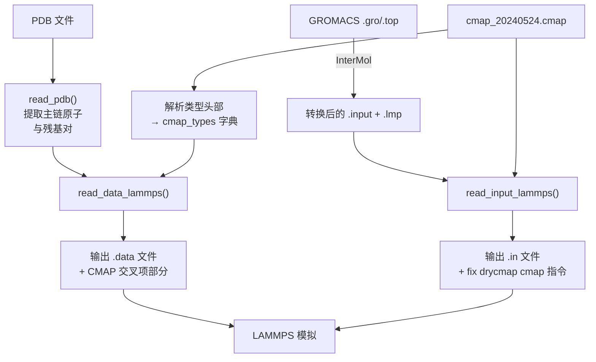

---
slug:8-cmap-correction-maps
blog_type:normal
---


CMAP校正图是主链φ/ψ二面体能栅，在GROMACS到LAMMPS的力场转换过程中，它用**残基对特异性的**能量面替代了标准的AMBER99SB-ILDN扭转校正。这是bAIes-IDP将折叠蛋白力场转化为适用于内在无序蛋白（IDP）系综采样的力场的关键机制，它在跨越整个φ/ψ扭转空间的24×24网格上编码了每个残基对的校正势。

## 理论基础

在CHARMM力场谱系中，CMAP（校正图）项作为主链二面角能量学的二维样条插值能量校正被引入。最初的CMAP方法对所有残基类型使用单一的校正图——这对于主链偏好主要由二级结构上下文主导的折叠蛋白而言，是一个合理的近似。然而，对于IDP，**残基特异性的构象倾向**是系综行为的主要决定因素：脯氨酸强烈偏好聚脯氨酸-II区，甘氨酸采样广阔的φ/ψ空间，而带电残基则表现出明显的偏好。因此，bAIes-IDP CMAP系统为每种残基对类型（例如，`ARG-XXX`、`ARG-PRO`）提供了一个独特的24×24能量栅，其中`XXX`表示任何非脯氨酸的后续残基，`PRO`则触发专门的脯氨酸图。每个网格单元以kcal/mol为单位存储特定(φ, ψ)组合下的能量值，LAMMPS在运行时通过双三次样条插值计算校正能量。

来源: [cmap_20240524.cmap](/tutorial/bAIes/3-conversion/cmap_20240524.cmap#L1-L5), [make_ff.py](/scripts/make_ff.py#L1-L30)

## CMAP文件格式

CMAP数据文件（例如，`cmap_20240524.cmap`）是一个纯文本文件，包含一个或多个残基对特异性的能量栅。其结构遵循以下层级：

| 结构元素 | 描述 | 示例 |
|---|---|---|
| 头部 | 文件标识符 | `# Backbone Phi/Psi Dihedrals correction map` |
| 类型声明 | 残基对和类型索引 | `# ARG-(XXX), type 1` |
| φ-bin标签 | φ角的行标识符 | `# -180.0` |
| 能量行 | 每行5个以空格分隔的kcal/mol值 | `-0.927602 -1.027478 -2.606330 -3.651128 -1.426216` |

每个类型块包含**24行**（每个φ bin一行，从−180°到+165°，以15°为增量）和**24列**（每个ψ bin一列，范围相同）。为了可读性，能量值每行写入5个，这导致每个φ行大约产生5行数据。一个残基对类型的完整网格大约包含144个能量值，跨越约29行。教程中的参考CMAP文件包含6803行，覆盖所有20×2 = 40种可能的残基对类型（每种氨基酸 × {XXX, PRO}）。

来源: [cmap_20240524.cmap](/tutorial/bAIes/3-conversion/cmap_20240524.cmap#L1-L30)

## 残基对类型解析

分配给每个主链二面角对的CMAP类型取决于**当前残基及其C端相邻残基的标识**。`make_ff.py`中的解析逻辑实现了一个二类方案：

```python
res_pair = (pdb_cmaps_dict[k][0][1], pdb_cmaps_dict[k][0][2]) \
    if pdb_cmaps_dict[k][0][2] == "PRO" \
    else (pdb_cmaps_dict[k][0][1], "XXX")
```

如果后续残基（i+1）是脯氨酸，则使用特定的`{residue}-PRO`图；对于所有其他后续残基，则应用通用的`{residue}-XXX`图。这种分叉处理捕捉了公认的构象限制：由于脯氨酸的环状侧链锁定了φ ≈ −75°，从而对其前一个残基的ψ角施加了限制。然后从CMAP文件头中查找类型索引（例如，`ARG-(XXX)` → 类型 1，`ARG-(Pro)` → 类型 2），并将其写入LAMMPS数据文件的交叉项部分。

来源: [make_ff.py](/scripts/make_ff.py#L211-L220)

## 交叉项的原子拓扑

每个CMAP交叉项引用**五个主链原子**，这五个原子定义了两个连续的二面角φ和ψ：

```
C_{i-1} — N_i — CA_i — C_i — N_{i+1}
```

| 位置 | 原子 | 作用 |
|---|---|---|
| 1 | C_{i-1} | 前一残基的羰基碳 |
| 2 | N_i | 当前残基的酰胺氮 |
| 3 | CA_i | 当前残基的α-碳 |
| 4 | C_i | 当前残基的羰基碳 |
| 5 | N_{i+1} | 后一残基的酰胺氮 |

`make_ff.py`中的`read_pdb()`函数解析PDB文件，为每个有效的残基位置（排除缺少C_{i-1}或N_{i+1}的末端）提取这些原子索引。LAMMPS数据文件中的每个交叉项条目写入格式为：`index  type  C_{i-1}  N_i  CA_i  C_i  N_{i+1}`。对于教程系统（69个交叉项），这意味着69个主链位置在模拟期间都会接受其残基对特异性的CMAP校正。

来源: [make_ff.py](/scripts/make_ff.py#L39-L72), [idp_nvt.data](/tutorial/bAIes/3-conversion/idp_nvt.data#L17410-L17430)

## 集成到LAMMPS模拟中

转换脚本（`step3-conversion.bash`）通过对LAMMPS输入文件和数据文件进行两项协调修改来编排CMAP的集成：

**输入文件**（`idp_nvt.in`）— 三条LAMMPS指令激活CMAP fix：

```
fix drycmap all cmap cmap_20240524.cmap
read_data idp_nvt.data fix drycmap crossterm CMAP
fix_modify drycmap energy yes
```

`fix cmap`命令加载CMAP网格文件并注册`drycmap` fix。`read_data`命令读取数据文件，同时将其`CMAP`交叉项部分映射到`drycmap` fix。`fix_modify energy yes`指令确保CMAP能量显示在`f_drycmap`下的热力学输出中。

**数据文件**（`idp_nvt.data`）— 两项结构性添加：

1. 头部在二面角计数行之后立即声明`N crossterms`
2. 末尾的`CMAP`部分列出所有交叉项条目及其类型索引和五个原子ID

`make_ff.py`中的`read_input_lammps()`函数将`pair_style`行重写为`lj/cut 2.0`，注入CMAP fix指令，并替换`thermo_style`以包含`f_drycmap`用于能量追踪。

来源: [make_ff.py](/scripts/make_ff.py#L97-L125), [step3-conversion.bash](/scripts/step3-conversion.bash#L18-L28), [idp_nvt.in](/tutorial/bAIes/3-conversion/idp_nvt.in#L10-L14)

## LAMMPS CMAPMAX补丁

标准的LAMMPS 2023年8月2日发行版硬编码了`CMAPMAX = 6`，最多只允许6种不同的CMAP网格类型。这对于最初的CHARMM CMAP（仅定义了6个图：2个用于甘氨酸，4个用于通用/脯氨酸组合）已经足够，但**对bAIes-IDP不足**，后者最多需要40种类型（20种氨基酸 × 2种后续分类）。补丁文件`patch_cmap.txt`对`fix_cmap.cpp`进行了三处针对性修改：

| 位置 | 原始代码 | 补丁代码 | 目的 |
|---|---|---|---|
| 常量定义 | `CMAPMAX = 6` | `CMAPMAX = 40` | 允许40种不同的网格类型 |
| 导数预计算循环 | `for (i = 0; i < 6; i++)` | `for (i = 0; i < CMAPMAX; i++)` | 为所有加载的图计算导数 |
| 类型边界检查 | `t1 > 5` | `t1 > CMAPMAX-1` | 根据新限制验证类型索引 |

第三项修改尤为重要：它用`CMAPMAX`常量替换了硬编码的魔术数字，确保了未来的一致性。如果没有此补丁，对于任何≥ 6的类型索引，LAMMPS都将抛出`Invalid CMAP crossterm_type`。

<CgxTip>必须在编译LAMMPS**之前**应用此补丁。从LAMMPS源码根目录执行：`patch ./src/MOLECULE/fix_cmap.cpp < patch_cmap.txt`。如果未打补丁，当CMAP文件定义超过6种类型时，将导致运行时崩溃。</CgxTip>

来源: [patch_cmap.txt](/installation/patch_cmap.txt#L1-L30), [README.md](/installation/README.md#L44-L50)

## 转换流水线中的CMAP

CMAP校正图在**步骤3 — 力场转换**期间注入，该步骤将InterMol转换的LAMMPS文件转换为最终的bAIes模拟输入。CMAP集成的流水线流程如下：



转换脚本接受CMAP文件作为参数（`cmap=cmap_20240524.cmap`），并通过`-cmap`标志将其传递给`make_ff.py`。同一个CMAP文件具有双重目的：(1)其类型头部被解析以构建用于数据文件的残基对→类型索引查找表，(2)其完整内容被LAMMPS的`fix cmap`命令引用以进行运行时网格计算。

<CgxTip>可以替换CMAP文件以实现不同的主链校正策略（例如，无规卷积与bAIes优化）。只需向`make_ff.py`提供不同的`-cmap`文件——类型索引和网格维度必须与打过补丁的LAMMPS的`CMAPMAX`和`CMAPDIM`常量保持一致。</CgxTip>

来源: [step3-conversion.bash](/scripts/step3-conversion.bash#L14-L28), [make_ff.py](/scripts/make_ff.py#L196-L237)

## 网格参数与约定

bAIes-IDP中的CMAP网格遵循标准的CHARMM CMAP约定，由LAMMPS的`fix_cmap.cpp`常量强制执行：

| 参数 | 值 | 描述 |
|---|---|---|
| `CMAPDIM` | 24 | 网格分辨率：每个图24×24个点 |
| `CMAPXMIN` | −360.0 | 全周期最小值（度） |
| `CMAPXMIN2` | −180.0 | 半周期最小值（度） |
| 网格间距 | 15° | φ和ψ均为(360° / 24 bins) |
| 能量单位 | kcal/mol | 与LAMMPS的`units real`一致 |
| 插值方式 | 双三次样条 | 通过LAMMPS中的`set_map_derivatives()`实现 |

24×24的分辨率在角度精度（15°的分箱）和计算成本之间提供了平衡。在LAMMPS初始化期间，通过`set_map_derivatives()`在所有网格点预计算导数（∂E/∂φ, ∂E/∂ψ, ∂²E/∂φ∂ψ），从而在模拟步进期间实现高效的受力计算。

来源: [patch_cmap.txt](/installation/patch_cmap.txt#L7-L12), [cmap_20240524.cmap](/tutorial/bAIes/3-conversion/cmap_20240524.cmap#L1-L25)

## 延伸阅读

CMAP校正图是力场转换过程的一个组成部分。有关完整的转换工作流上下文，请参阅[GROMACS到LAMMPS的转换](7-gromacs-to-lammps-conversion)。有关LAMMPS补丁安装的详细信息，请参阅[LAMMPS CMAP补丁](15-lammps-cmap-patch)。有关经CMAP校正的模拟如何融入更广泛的bAIes系综策略，请参阅[bAIes系综模拟](9-baies-ensemble-simulations)。