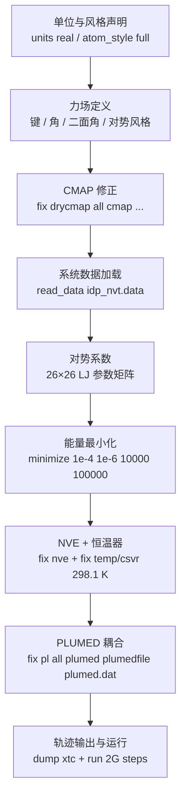

---
slug:9-baies-ensemble-simulations
blog_type:normal
---


bAIes 集合模拟是 bAIes-IDP 流水线的最终环节：这是一次由 **LAMMPS + PLUMED** 驱动的分子动力学运行，它将 AlphaFold-2（或 ColabFold）的距离信息作为贝叶斯限制整合到原子力场中。其结果是获得一个热力学一致的、具有原子级分辨率的集合，包含本质无序或多结构域蛋白的构象。本页涵盖了模拟输入文件、它们的作用与结构、启动命令，以及关键的可调参数。

## 模拟文件清单

bAIes 模拟在工作目录中需要 **六个文件**。这些文件是流水线早期阶段——[GROMACS 到 LAMMPS 的转换](7-gromacs-to-lammps-conversion)和 [PLUMED 文件生成](6-plumed-file-generation)——的输出，被延续至模拟阶段：

| 文件 | 来源阶段 | 用途 |
| :--- | :---: | :--- |
| `idp_nvt.in` | 步骤 3 – 转换 | LAMMPS 输入脚本：力场、积分器、PLUMED 耦合、输出及运行设置 |
| `idp_nvt.data` | 步骤 3 – 转换 | LAMMPS 数据文件：原子坐标、拓扑、键/角/二面角列表 |
| `cmap_20240524.cmap` | 步骤 3 – 转换 | 骨架构象交叉项的 CMAP 修正映射（参见 [CMAP 修正映射](8-cmap-correction-maps)） |
| `plumed.dat` | 步骤 2 – 预处理 | PLUMED 驱动文件：定义 bAIes 偏置、原子组及输出 |
| `baies_params.dat` | 步骤 2 – 预处理 | 从 AlphaFold 距离图推导出的逐对限制参数 (µ, σ) |
| `atom_list.ndx` | 步骤 2 – 预处理 | 参与所有 bAIes 限制的原子 ID 索引 |

此外，步骤 1 中由 GROMACS 生成的 `idp.pdb` 文件也必须存在——`plumed.dat` 内部的 `#MOLINFO` 指令会引用该文件以获取残基/链元数据。

来源: [README.md](/tutorial/bAIes/README.md#L89-L151), [idp_nvt.in](/tutorial/bAIes/4-simulation/idp_nvt.in#L1-L390), [plumed.dat](/tutorial/bAIes/4-simulation/plumed.dat#L1-L6)

## LAMMPS 输入文件剖析

`idp_nvt.in` 脚本编排了整个模拟过程。其各节按出现顺序排列，遵循精确的架构：



### 单位制与力场风格

模拟在 **LAMMPS `real` 单位制**（Å, kcal/mol, fs）下运行，并采用 `atom_style full` 以携带每个原子的电荷和分子标识。力场为混合组合：

| 风格 | 类型 | 作用 |
| :--- | :--- | :--- |
| `bond_style hybrid harmonic` | 谐振 | 键伸缩 |
| `angle_style hybrid harmonic` | 谐振 | 角弯曲 |
| `dihedral_style hybrid multi/harmonic charmm` | 多重谐振 + CHARMM | 正常二面角旋转 |
| `pair_style lj/cut 2.0` | Lennard-Jones（截断 2.0 Å） | 仅限短程排除体积排斥 |

<CgxTip>极短的 2.0 Å LJ 截断使其成为一个**干性、隐式溶剂力场**——远程静电和吸引色散被省略。CMAP 修正和 bAIes 限制补偿了因这一简化而丢失的物理效应。</CgxTip>

### CMAP 修正集成

CMAP 修正会在 `read_data` **之前**应用，使 LAMMPS 能够直接从数据文件中解析 CMAP 交叉项：

```
fix drycmap all cmap cmap_20240524.cmap
read_data idp_nvt.data fix drycmap crossterm CMAP
fix_modify drycmap energy yes
```

`fix_modify drycmap energy yes` 指令确保 CMAP 能量出现在热力学输出中——这是 bAIes 偏置运行期间能量核算的关键要求。

来源: [idp_nvt.in](/tutorial/bAIes/4-simulation/idp_nvt.in#L1-L12), [idp_nvt.in](/tutorial/bAIes/4-simulation/idp_nvt.in#L8-L12)

### 能量最小化

在动力学开始之前，LAMMPS 执行最速下降最小化，以消除来自 AlphaFold 起始结构的任何空间位阻冲突：

```
minimize 1.0e-4 1.0e-6 10000 100000
```

| 参数 | 值 | 含义 |
| :--- | :--- | :--- |
| 能量容差 | `1.0e-4` kcal/mol | 当迭代间的能量变化低于此值时停止 |
| 力容差 | `1.0e-6` kcal/mol·Å | 当最大力分量低于此值时停止 |
| 最大迭代次数 | `10000` | 最大力评估次数 |
| 最大步数 | `100000` | 最大最小化步数 |

来源: [idp_nvt.in](/tutorial/bAIes/4-simulation/idp_nvt.in#L384-L384)

### 集合与恒温器

最小化之后，系统在 **NVE** 系综下结合 **CSVR（正则随机速度缩放）** 恒温器在 298.1 K 下进行传播：

```
fix 1 all nve
fix 2 all temp/csvr 298.1 298.1 $(100.0*dt) 1679636
```

| 参数 | 值 | 含义 |
| :--- | :--- | :--- |
| 目标温度 | 298.1 K | 生理温度 |
| 耦合时间 | `100.0 × dt` = 100 fs | 恒温器弛豫时间尺度 |
| 随机种子 | `1679636` | 可复现性控制（为独立副本更改此值） |

CSVR 恒温器（Bussi 等人）生成正确的正则分布，这对于 bAIes 的贝叶斯推理框架产生具有统计意义的集合至关重要。

来源: [idp_nvt.in](/tutorial/bAIes/4-simulation/idp_nvt.in#L386-L387)

### PLUMED 耦合

bAIes 偏置通过 PLUMED 注入模拟中，作为 LAMMPS 的 fix 加载：

```
fix pl all plumed plumedfile plumed.dat outfile p.log
```

PLUMED 在每个时间步计算 bAIes 偏置能量和力（由 `plumed.dat` 中的 `STRIDE=2` 控制），并将其作为附加势反馈给 LAMMPS。PLUMED 的内部日志写入 `p.log`。

来源: [idp_nvt.in](/tutorial/bAIes/4-simulation/idp_nvt.in#L389-L389)

### 轨迹输出与运行时长

最后两行控制输出和持续时间：

```
dump 1 all xtc 10000 traj_idp.xtc
run    2000000000
```

| 参数 | 值 | 物理意义 |
| :--- | :--- | :--- |
| 输出步长 | `10000` 步 | 每帧 10 ps（在 1 fs 时间步长下） |
| 轨迹格式 | XTC | 压缩的、GROMACS 兼容的格式 |
| 总步数 | `2,000,000,000` | **2 µs** 的模拟时间 |

XTC 格式允许直接使用 GROMACS 工具进行后处理，无需格式转换。

来源: [idp_nvt.in](/tutorial/bAIes/4-simulation/idp_nvt.in#L389-L390)

## PLUMED 配置深入解析

`plumed.dat` 文件是 bAIes 模拟的核心枢纽——每一行都在贝叶斯限制框架中发挥特定作用：

```
#MOLINFO STRUCTURE=idp.pdb
batoms: GROUP NDX_FILE=atom_list.ndx NDX_GROUP=batoms
baies: BAIES ATOMS=batoms DATA_FILE=baies_params.dat PRIOR=JEFFREYS TEMP=2.478541306
PRINT ARG=baies.ene FILE=COLVAR STRIDE=500
bbias: BIASVALUE ARG=baies.ene STRIDE=2
```

| 行 | 指令 | 功能 |
| :--- | :--- | :--- |
| 1 | `#MOLINFO STRUCTURE=idp.pdb` | 从 GROMACS PDB 加载残基/链元数据用于原子名解析 |
| 2 | `batoms: GROUP ...` | 通过读取 `atom_list.ndx` 中 `[ batoms ]` 标题下的 ID 来定义原子组 |
| 3 | `baies: BAIES ...` | **核心 bAIes 动作**——从逐对高斯限制中计算贝叶斯对数似然偏置 |
| 4 | `PRINT ...` | 每 500 步将 bAIes 偏置能量记录到 `COLVAR` 中，用于收敛监测 |
| 5 | `bbias: BIASVALUE ...` | 每 2 步将 bAIes 能量作为偏置势应用于 MD 积分器 |

### BAIES 动作参数

`BAIES` 关键字接受三个关键参数：

| 参数 | 教程值 | 描述 |
| :--- | :--- | :--- |
| `ATOMS` | `batoms` | 受限 Cα 原子的 GROUP |
| `DATA_FILE` | `baies_params.dat` | 来自距离图拟合的逐对 (µ, σ) 高斯参数 |
| `PRIOR` | `JEFFREYS` | Jeffreys 先验——无信息贝叶斯先验，避免对任何特定距离产生偏倚 |
| `TEMP` | `2.478541306` | 以 kcal/mol 为单位的约化温度（298.1 K 时的 k<sub>B</sub>T） |

<CgxTip>`TEMP=2.478541306` 值是 298.1 K 时以 kcal/mol 为单位的 **k<sub>B</sub>T**（k<sub>B</sub> = 0.0019872041 kcal·mol<sup>−1</sup>·K<sup>−1</sup>）。这使 PLUMED 偏置与 LAMMPS 恒温器处于同一热力学系综。</CgxTip>

Jeffreys 先验是 bAIes 方法学的基础：它对距离参数施加尺度不变的、无信息的先验，确保后验集合仅反映 AlphaFold 的证据，而不会产生人工收缩。

来源: [plumed.dat](/tutorial/bAIes/4-simulation/plumed.dat#L1-L6)

## bAIes 限制参数文件

`baies_params.dat` 文件为每个受限原子对编码了**拟合的高斯模型**。每一行代表在[距离图读取与拟合](5-distogram-reading-and-fitting)期间从 AlphaFold 距离图提取的一个距离限制：

```
#! FIELDS Id atom_i atom_j mu sigma
#! SET model gaussian
1 57 127 1.056467 0.266714
2 79 127 0.851589 0.199167
...
98 1080 1152 0.735730 0.106444
```

| 列 | 单位 | 含义 |
| :--- | :--- | :--- |
| `Id` | — | 顺序限制索引 |
| `atom_i` | LAMMPS 原子 ID | 对中的第一个原子 (Cα) |
| `atom_j` | LAMMPS 原子 ID | 对中的第二个原子 (Cα) |
| `mu` | nm | 拟合的高斯距离分布均值 |
| `sigma` | nm | 标准差——编码了 AlphaFold 对此距离的**不确定性** |

教程中的 PaaA2 系统在 56 个独特的 Cα 原子上包含 **98 个受限对**。具有较小 σ 值的对（例如 0.018–0.030 nm）对应于结构基序内的高置信度局部接触；具有较大 σ 的对（例如 0.20–0.27 nm）捕获了无序或长程相互作用，在这些区域 AlphaFold 提供了较弱距离信息。

来源: [baies_params.dat](/tutorial/bAIes/4-simulation/baies_params.dat#L1-L101)

## 原子索引文件

`atom_list.ndx` 文件列出了参与至少一个 bAIes 限制的所有唯一原子 ID：

```
[ batoms ]
57 79 91 103 115 127 149 163 187 197 230 258 274 285 300 
320 335 349 368 383 400 415 429 440 461 475 490 514 533 557 
567 589 605 615 629 640 669 743 765 776 793 805 820 836 851 
875 899 916 926 941 965 985 995 1017 1034 1058 1080 1095 1119 1130 
1152 
```

这些是 LAMMPS 从 1 开始的原子 ID，对应于 Cα 原子。该 GROUP 被 `plumed.dat` 中的 `batoms: GROUP NDX_FILE=atom_list.ndx NDX_GROUP=batoms` 所引用。对于 PaaA2（71 个残基），列出的 56 个原子表明并非每个残基的 Cα 都受限——只有那些具有信息性距离图信号的原子才被包括。

来源: [atom_list.ndx](/tutorial/bAIes/4-simulation/atom_list.ndx#L1-L7)

## 运行模拟

### 启动命令

当所有六个文件（加上 `idp.pdb`）都在工作目录中时，执行：

```bash
lmp -in idp_nvt.in
```

此单条命令将触发：CMAP 加载 → 数据读取 → 最小化 → NVE+CSVR 动力学与 PLUMED/bAIes 偏置 → XTC 轨迹输出。默认配置在 298.1 K 下产生一条 **2 µs** 的轨迹。

### 并行执行

推荐使用 OpenMP 并行化（如主 README 中所述）。对于典型的多核节点：

```bash
export OMP_NUM_THREADS=<N>
lmp -in idp_nvt.in
```

带有 PLUMED 插件的 LAMMPS 支持用于力计算的 OpenMP 线程，使其成为单蛋白 bAIes 运行最直接的并行化策略。

### 运行多个副本

要启动统计上独立的副本，请在 `idp_nvt.in` 中**更改 CSVR 随机种子**（`fix 2 all temp/csvr` 行的最后一个整数）。每个种子产生不同的随机恒温器轨迹，从而从同一正则分布中产生独立样本：

```
# 副本 1
fix 2 all temp/csvr 298.1 298.1 $(100.0*dt) 1679636

# 副本 2
fix 2 all temp/csvr 298.1 298.1 $(100.0*dt) 5432109
```

来源: [README.md](/README.md#L36-L36), [idp_nvt.in](/tutorial/bAIes/4-simulation/idp_nvt.in#L386-L387)

## 关键可调参数

LAMMPS 输入文件公开了几个参数，你可以根据你的系统和计算预算进行调整。所有修改均直接在 `idp_nvt.in` 中进行：

| 参数 | 默认值 | 在 `idp_nvt.in` 中的位置 | 指导 |
| :--- | :--- | :--- | :--- |
| 时间步长 | `1.0` fs | `timestep 1.0` | 1 fs 是原子级 MD 的标准；仅在粗粒化变体中增加 |
| 温度 | `298.1` K | `fix 2 all temp/csvr 298.1 298.1 ...` | 匹配 IDP 的实验条件 |
| 恒温器耦合 | `100` fs | `$(100.0*dt)` | 过小 → 过度耦合；过大 → 温度控制不佳 |
| 输出步长 | `10000` 步 (10 ps) | `dump 1 all xtc 10000 ...` | 减小以进行更细粒度分析；增大以节省磁盘 |
| 运行时长 | `2,000,000,000` 步 (2 µs) | `run 2000000000` | IDP 收敛通常需要 ≥1 µs；根据实际运行时间约束调整 |
| 最小化容差 | `1e-4 / 1e-6` | `minimize 1.0e-4 1.0e-6 ...` | 若最小化失败则收紧；对于已松弛的结构则放宽 |
| LJ 截断 | `2.0` Å | `pair_style lj/cut 2.0` | **切勿修改**——此值与干性力场参数化相耦合 |

`plumed.dat` 中的 `TEMP` 值（`2.478541306`）必须与 LAMMPS 恒温器温度保持一致；如果你更改了目标温度，请相应地重新计算以 kcal/mol 为单位的 k<sub>B</sub>T。

来源: [idp_nvt.in](/tutorial/bAIes/4-simulation/idp_nvt.in#L382-L390), [plumed.dat](/tutorial/bAIes/4-simulation/plumed.dat#L3-L3)

## 模拟后轨迹分析

XTC 轨迹可以直接使用 GROMACS 工具进行分析，无需格式转换：

| 任务 | 命令 |
| :--- | :--- |
| 轨迹完整性检查 | `gmx check -f traj_idp.xtc` |
| 降采样至 100 ps 帧 | `gmx trjconv -f traj_idp.xtc -s idp.pdb -o traj_idp_dt100ps.xtc -dt 100` |
| 计算回转半径 | `gmx gyrate -f traj_idp.xtc -s idp.pdb -o rg.xvg` |
| 端到端距离 | `gmx distance -f traj_idp.xtc -s idp.pdb -select 'com of group 1 plus com of group 2' -o e2e.xvg` |

由 PLUMED 的 `PRINT` 指令生成的 `COLVAR` 文件每 500 步记录一次 bAIes 偏置能量。绘制此量随时间的变化可以揭示模拟是否已平衡（偏置能量稳定）或仍在探索构象空间。

来源: [README.md](/tutorial/bAIes/README.md#L141-L151)

## 基准模拟系统

`benchmark/bAIes/` 目录为跨越三种无序行为类别的 **19 个蛋白质系统** 提供了可随时运行的输入文件。所有系统均遵循上述相同的文件结构：

| 类别 | 蛋白质 | 典型特征 |
| :--- | :--- | :--- |
| **完全无序** | Ab40, p61_Hck, emerin_67-170, His-PknG_1-75, Colicin_N_T_domain, Hug1 | 全局小 σ；宽泛集合 |
| **结构基序** | PaaA2, Nt-SOCS5, Alb3-A3CT, idr_SSRP1, UBact, FCP1 | 基序区域紧缩 σ；连接区松弛 |
| **AF2 预测错误** | asyn, ACTR, NHE1, Nsp2_CtlIDR, spm_FrpC, drkN | AF2 错误地预测了结构；bAIes 通过宽泛 σ 进行修正 |
| **多结构域** | GS8, Ubq2, Ubq3 | 结构域层级接触得以保留；结构域间保持灵活性 |

每个基准目录都包含具有特定蛋白质命名的相同六个文件（例如 `PaaA2_nvt.in`、`plumed_PaaA2.dat`、`baies_gauss_matrix.dat`）。要重现基准测试，只需在该目录中运行 `lmp -in <protein>_nvt.in`。

来源: [README.md](/benchmark/README.md#L1-L38), [plumed_PaaA2.dat](/benchmark/bAIes/PaaA2/plumed_PaaA2.dat#L1-L6)

## 后续步骤

运行 bAIes 集合模拟后，你可能想要：
- 与**随机线团基线**进行比较 → [随机线团模拟](10-random-coil-simulations)
- 了解距离图限制是如何推导的 → [距离图读取与拟合](5-distogram-reading-and-fitting)
- 调优影响性能的关键参数 → [模拟参数调优](16-simulation-parameter-tuning)
- 与实验数据进行验证 → [基准蛋白质系统](13-benchmark-protein-systems)