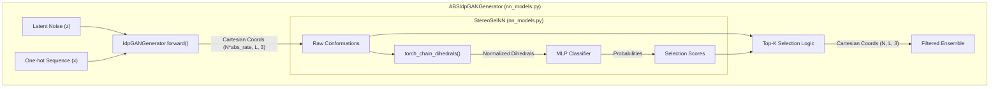

# Chirality Correction: StereoSelNN and ABSIdpGANGenerator

> **Relevant source files**
> - [idpgan/coords\.py](https://github.com/feiglab/idpgan/blob/aa26675c/idpgan/coords.py)
> - [idpgan/nn\_models\.py](https://github.com/feiglab/idpgan/blob/aa26675c/idpgan/nn_models.py)

 Generative Adversarial Networks \(GANs\) operating on Cartesian coordinates for protein structures frequently encounter a mirror\-image problem\. Because the generator learns spatial relationships primarily through pairwise distances and local geometries, it may produce ensembles that contain both the physically correct L\-amino acid conformations and their reflected, non\-physical enantiomers\.

 This page details the **StereoSelNN** classifier and the **ABSIdpGANGenerator** wrapper, which together implement a "generate\-then\-select" pipeline to ensure all generated Intrinsically Disordered Protein \(IDP\) conformations maintain correct chirality\.

## The Mirror\-Image Problem in IDP Generation

 In the `IdpGANGenerator` architecture, the network outputs $\(N, L, 3\)$ Cartesian coordinates [nn\_models\.py L371-L372](https://github.com/feiglab/idpgan/blob/aa26675c/idpgan/nn_models.py#L371-L372) Since the loss functions used during training \(such as MSE on distance matrices\) are often invariant to reflection, the generator may produce reflected structures that are mathematically similar in distance space but biologically impossible\.

 To resolve this, the `idpgan` library introduces a secondary classification network, `StereoSelNN`, which identifies and filters out these mirror\-image conformations\.

## StereoSelNN: The Chirality Classifier

 The `StereoSelNN` class is a specialized neural network designed to classify whether a given set of coordinates represents a "real" \(physically correct\) or "reflected" \(mirror\-image\) conformation [nn\_models\.py L534-L538](https://github.com/feiglab/idpgan/blob/aa26675c/idpgan/nn_models.py#L534-L538)

### Feature Extraction via Dihedral Angles

 Unlike the generator, which uses Cartesian coordinates, `StereoSelNN` operates on **dihedral angles**\. Dihedral angles are sensitive to chirality; reflecting a structure inverts the sign of its dihedrals\.

 1. **Coordinate Transformation**: The model takes Cartesian coordinates $\(N, L, 3\)$ as input\.
2. **Dihedral Calculation**: It uses `torch_chain_dihedrals` [coords\.py L5-L19](https://github.com/feiglab/idpgan/blob/aa26675c/idpgan/coords.py#L5-L19) to calculate the torsion angles along the protein backbone [nn\_models\.py L566](https://github.com/feiglab/idpgan/blob/aa26675c/idpgan/nn_models.py#L566-L566)
3. **Normalization**: The angles \(originally in radians\) are normalized by $\\pi$ to a range of $\[\-1, 1\]$ [nn\_models\.py L566](https://github.com/feiglab/idpgan/blob/aa26675c/idpgan/nn_models.py#L566-L566)

### Network Architecture

 The classifier consists of a simple feed\-forward architecture:

 - **Input**: Normalized dihedrals of length $L\-3$\.
- **Hidden Layers**: Two linear layers with `ReLU` activations [nn\_models\.py L553-L558](https://github.com/feiglab/idpgan/blob/aa26675c/idpgan/nn_models.py#L553-L558)
- **Output**: A single scalar value per conformation, passed through a `Sigmoid` function to produce a probability $P\(\\text\{correct\}\)$ [nn\_models\.py L569](https://github.com/feiglab/idpgan/blob/aa26675c/idpgan/nn_models.py#L569-L569)

| Layer | Component | Description |
| --- | --- | --- |
| Input | torch\_chain\_dihedrals | Converts $\(N, L, 3\)$ to $\(N, L\-3\)$ idpgan/nn\_models\.py566 |
| Linear 1 | nn\.Linear | Maps dihedrals to hidden dimension \(default 512\) idpgan/nn\_models\.py553 |
| Activation | nn\.ReLU | Non\-linear activation idpgan/nn\_models\.py554 |
| Linear 2 | nn\.Linear | Maps to output logit idpgan/nn\_models\.py557 |
| Output | nn\.Sigmoid | Probability of being a non\-reflected structure idpgan/nn\_models\.py569 |

 **Sources:** [nn\_models\.py L534-L570](https://github.com/feiglab/idpgan/blob/aa26675c/idpgan/nn_models.py#L534-L570) [coords\.py L5-L19](https://github.com/feiglab/idpgan/blob/aa26675c/idpgan/coords.py#L5-L19)

## ABSIdpGANGenerator: The Orchestration Layer

 The `ABSIdpGANGenerator` \(Absolute\-idpGAN\) class acts as a high\-level wrapper that encapsulates both the `IdpGANGenerator` and the `StereoSelNN` selector [nn\_models\.py L573-L581](https://github.com/feiglab/idpgan/blob/aa26675c/idpgan/nn_models.py#L573-L581) It manages the two\-step process of generating a large pool of candidates and selecting only the high\-fidelity, correctly\-chiral structures\.

### The Generate\-then\-Select Pipeline

 When `ABSIdpGANGenerator.forward()` is called, the following workflow is executed:

 1. **Oversampling**: The generator produces a larger batch of conformations than requested \(determined by `abs_rate`\) [nn\_models\.py L609-L610](https://github.com/feiglab/idpgan/blob/aa26675c/idpgan/nn_models.py#L609-L610)
2. **Scoring**: The `StereoSelNN` \(referred to as `self.selector`\) scores every generated conformation based on its backbone dihedrals [nn\_models\.py L613](https://github.com/feiglab/idpgan/blob/aa26675c/idpgan/nn_models.py#L613-L613)
3. **Ranking**: Conformations are ranked by their probability of being "correct" [nn\_models\.py L614](https://github.com/feiglab/idpgan/blob/aa26675c/idpgan/nn_models.py#L614-L614)
4. **Selection**: The top $N$ conformations \(where $N$ is the original requested batch size\) are selected and returned [nn\_models\.py L615-L617](https://github.com/feiglab/idpgan/blob/aa26675c/idpgan/nn_models.py#L615-L617)

### System Component Diagram

 The following diagram illustrates the data flow from latent noise to the final filtered ensemble\.

 **ABSIdpGANGenerator Workflow**

 **Sources:** [nn\_models\.py L573-L618](https://github.com/feiglab/idpgan/blob/aa26675c/idpgan/nn_models.py#L573-L618) [coords\.py L5-L19](https://github.com/feiglab/idpgan/blob/aa26675c/idpgan/coords.py#L5-L19)

## Key Implementation Details

### Coordinate Handling

 The selection process happens entirely within the `forward` pass of `ABSIdpGANGenerator`\. It is important to note that the `abs_rate` \(typically set to 2\.0\) ensures that even if 50% of the generated structures are mirror images, the network still has enough "correct" candidates to fulfill the requested batch size [nn\_models\.py L604-L610](https://github.com/feiglab/idpgan/blob/aa26675c/idpgan/nn_models.py#L604-L610)

### Class Definition Mapping

 The following table maps the logical roles in the chirality correction pipeline to their specific class implementations in the codebase\.

| System Name | Code Entity | File Path |
| --- | --- | --- |
| Generator | IdpGANGenerator | idpgan/nn\_models\.py281 |
| Chirality Classifier | StereoSelNN | idpgan/nn\_models\.py534 |
| Pipeline Wrapper | ABSIdpGANGenerator | idpgan/nn\_models\.py573 |
| Feature Extractor | torch\_chain\_dihedrals | idpgan/coords\.py5 |

 **Sources:** [nn\_models\.py L281-L618](https://github.com/feiglab/idpgan/blob/aa26675c/idpgan/nn_models.py#L281-L618) [coords\.py L5-L19](https://github.com/feiglab/idpgan/blob/aa26675c/idpgan/coords.py#L5-L19)

