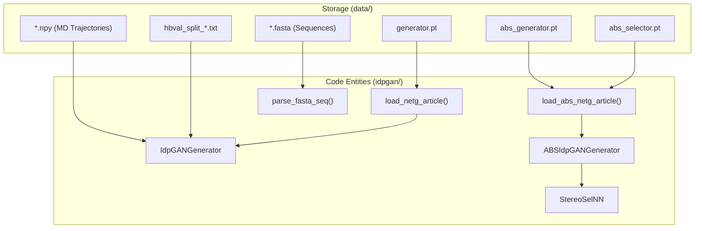
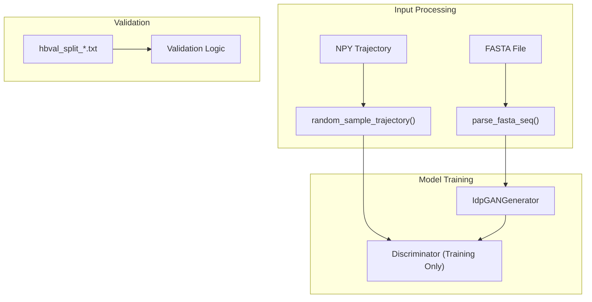

# Data Assets and Training Infrastructure

> **Relevant source files**
> * [data/abs_generator.pt](https://github.com/feiglab/idpgan/blob/aa26675c/data/abs_generator.pt)
> * [data/abs_selector.pt](https://github.com/feiglab/idpgan/blob/aa26675c/data/abs_selector.pt)
> * [data/cocomo_training_data_example.md](https://github.com/feiglab/idpgan/blob/aa26675c/data/cocomo_training_data_example.md?plain=1)
> * [data/generator.pt](https://github.com/feiglab/idpgan/blob/aa26675c/data/generator.pt)

This page provides a technical overview of the `data/` directory, which houses the essential artifacts required for running and training idpGAN. These assets include pre-trained PyTorch model weights, FASTA sequence sets for various protein systems, reference molecular dynamics (MD) trajectories, and validation split configurations.

The data infrastructure is designed to support both the standard generative workflow and the chirality-corrected (ABS) workflow.

### Data Ecosystem Overview

The following diagram illustrates the relationship between the physical data files and the core code entities that consume them.

**Data-to-Code Mapping**

**Sources:** [idpgan/__init__.py L1](https://github.com/feiglab/idpgan/blob/aa26675c/idpgan/__init__.py#L1-L1)

 [data/generator.pt L1-L10](https://github.com/feiglab/idpgan/blob/aa26675c/data/generator.pt#L1-L10)

 [data/abs_generator.pt L1-L10](https://github.com/feiglab/idpgan/blob/aa26675c/data/abs_generator.pt#L1-L10)

 [data/abs_selector.pt L1-L10](https://github.com/feiglab/idpgan/blob/aa26675c/data/abs_selector.pt#L1-L10)

---

## Pre-trained Model Weights

The repository includes three primary weight files that represent the state of the models after training on the COCOMO dataset. These files are serialized PyTorch `OrderedDict` objects containing the parameters for the transformer-based architectures.

| File | Associated Class | Loader Function |
| --- | --- | --- |
| `generator.pt` | `IdpGANGenerator` | `load_netg_article` |
| `abs_generator.pt` | `IdpGANGenerator` | `load_abs_netg_article` |
| `abs_selector.pt` | `StereoSelNN` | `load_abs_netg_article` |

The `abs_` variants are specifically used for the "Absolute" (ABS) version of idpGAN, which includes a selection mechanism to resolve the mirror-image ambiguity inherent in Cartesian coordinate generation.

For technical details on hyperparameter configurations and loading logic, see [Pre-trained Model Weights](/feiglab/idpgan/4.1-pre-trained-model-weights).

**Sources:** [idpgan/__init__.py L1](https://github.com/feiglab/idpgan/blob/aa26675c/idpgan/__init__.py#L1-L1)

 [data/generator.pt L1-L10](https://github.com/feiglab/idpgan/blob/aa26675c/data/generator.pt#L1-L10)

 [data/abs_generator.pt L1-L10](https://github.com/feiglab/idpgan/blob/aa26675c/data/abs_generator.pt#L1-L10)

 [data/abs_selector.pt L1-L10](https://github.com/feiglab/idpgan/blob/aa26675c/data/abs_selector.pt#L1-L10)

---

## Sequence Datasets and Reference Trajectories

idpGAN relies on a variety of FASTA files and NumPy arrays for both benchmarking and training.

### Sequence Sets (FASTA)

The `data/` directory contains sequence definitions for the systems discussed in the idpGAN publication:

* **`idpgan_training_set.fasta`**: The primary sequence list used for model development.
* **`idptest.fasta` / `abstest.fasta`**: Evaluation sets for standard and chirality-corrected models.
* **Homopolymer sets**: `polyala.fasta` (Poly-Alanine), `protan.fasta` (Poly-Antamanide), and `protac.fasta`.

### MD Reference Data

To evaluate the quality of generated ensembles, the system uses reference data:

* **`.npy` Files**: NumPy arrays containing coarse-grained (CG) Cartesian coordinates from MD simulations.
* **`.pdb` Templates**: Structural templates used by `seq_to_cg_pdb` to format output files.
* **COCOMO Data**: While an example is provided in `data/cocomo_training_data_example.md`, the full dataset is hosted externally due to size.

### Validation Splits

The files `hbval_split_[0-4].txt` define the five-fold cross-validation splits used to ensure the model generalizes across different protein sequences without leakage.

For details on file formats and how to obtain the full training set, see [Sequence Datasets and Reference Trajectories](/feiglab/idpgan/4.2-sequence-datasets-and-reference-trajectories).

**Sources:** [data/cocomo_training_data_example.md L1](https://github.com/feiglab/idpgan/blob/aa26675c/data/cocomo_training_data_example.md?plain=1#L1-L1)

 [idpgan/data.py L1-L50](https://github.com/feiglab/idpgan/blob/aa26675c/idpgan/data.py#L1-L50)

---

## Training Infrastructure Logic

The training process involves mapping these data assets through specific utility functions to feed the `IdpGANGenerator`.

**Training Data Flow**

**Sources:** [idpgan/data.py L11-L25](https://github.com/feiglab/idpgan/blob/aa26675c/idpgan/data.py#L11-L25)

 [idpgan/data.py L53](https://github.com/feiglab/idpgan/blob/aa26675c/idpgan/data.py#L53-L53)