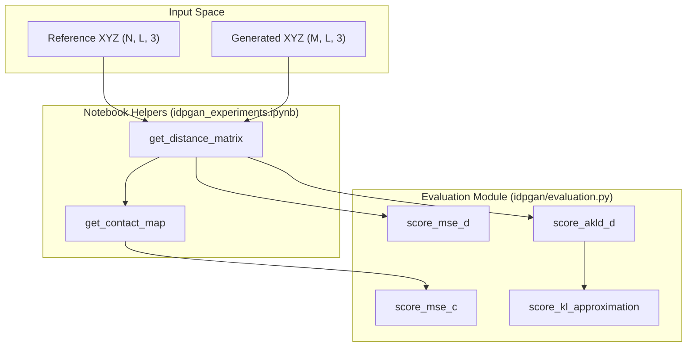
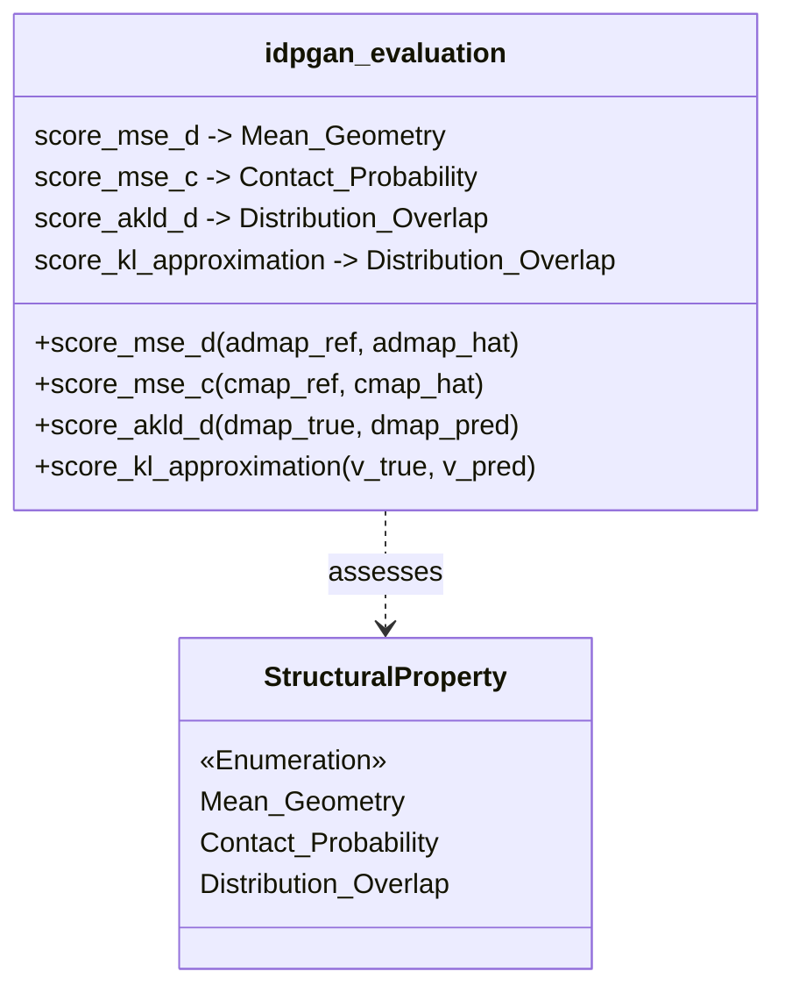

# Evaluation Metrics (idpgan/evaluation.py)

> **Relevant source files**
> * [idpgan/evaluation.py](https://github.com/feiglab/idpgan/blob/aa26675c/idpgan/evaluation.py)
> * [notebooks/idpgan_experiments.ipynb](https://github.com/feiglab/idpgan/blob/aa26675c/notebooks/idpgan_experiments.ipynb)

This page provides a detailed reference for the scoring functions used to evaluate the quality of conformational ensembles generated by idpGAN. These metrics compare generated structures against reference Molecular Dynamics (MD) data across different structural properties, including average distances, contact probabilities, and the distribution of pairwise distances.

### Overview of Metrics

The evaluation suite in `idpgan/evaluation.py` focuses on four primary metrics:

1. **MSE_d**: Mean Squared Error of the average distance map.
2. **MSE_c**: Mean Squared Error of the log-contact probability map.
3. **aKLD_d**: Average Kullback–Leibler Divergence of pairwise distance distributions.
4. **KL Approximation**: A discretized approximation of KL divergence for arbitrary 1D distributions.

---

### Distance and Contact Scoring

These functions assess how well the generated ensemble reproduces the mean spatial relationships between residues.

#### MSE of Average Distances (score_mse_d)

The `score_mse_d` function calculates the Mean Squared Error between the upper triangle of the reference average distance map and the generated average distance map [idpgan/evaluation.py L4-L13](https://github.com/feiglab/idpgan/blob/aa26675c/idpgan/evaluation.py#L4-L13)

* **Input**: Two matrices of shape `(L, L)` representing average distances between all residue pairs $i, j$.
* **Logic**: It extracts the upper triangular indices (including the diagonal) using `np.triu_indices` to avoid redundant calculations and then computes the mean of the squared differences [idpgan/evaluation.py L10-L13](https://github.com/feiglab/idpgan/blob/aa26675c/idpgan/evaluation.py#L10-L13)

#### MSE of Contact Maps (score_mse_c)

The `score_mse_c` function measures the error in contact probabilities, which are critical for identifying transient long-range interactions in IDPs [idpgan/evaluation.py L15-L24](https://github.com/feiglab/idpgan/blob/aa26675c/idpgan/evaluation.py#L15-L24)

* **Input**: Two contact probability matrices of shape `(L, L)`.
* **Mathematical Basis**: Because contact probabilities can span several orders of magnitude, the function computes the MSE in **log-space** [idpgan/evaluation.py L22-L23](https://github.com/feiglab/idpgan/blob/aa26675c/idpgan/evaluation.py#L22-L23)
* **Implementation**: Similar to `score_mse_d`, it only considers the upper triangle of the matrices [idpgan/evaluation.py L21](https://github.com/feiglab/idpgan/blob/aa26675c/idpgan/evaluation.py#L21-L21)

| Metric | Code Entity | Formula Basis | Target |
| --- | --- | --- | --- |
| **MSE_d** | `score_mse_d` | $\frac{1}{N_{pairs}} \sum (\bar{d}*{ref} - \bar{d}*{gen})^2$ | Average spatial geometry |
| **MSE_c** | `score_mse_c` | $\frac{1}{N_{pairs}} \sum (\ln C_{ref} - \ln C_{gen})^2$ | Contact probabilities |

**Sources:**

* [idpgan/evaluation.py L4-L24](https://github.com/feiglab/idpgan/blob/aa26675c/idpgan/evaluation.py#L4-L24)

---

### Distributional Scoring (KLD)

While MSE metrics evaluate averages, IDPs are characterized by broad distributions. The KLD-based metrics assess whether the model captures the full range of motion.

#### Average KLD of Distances (score_akld_d)

This function iterates through every unique pair of residues $(i, j)$ and calculates the KL divergence between the distribution of distances observed in the reference ensemble versus the generated ensemble [idpgan/evaluation.py L27-L44](https://github.com/feiglab/idpgan/blob/aa26675c/idpgan/evaluation.py#L27-L44)

* **Data Flow**: 1. Accepts distance matrices of shape `(N, L, L)` (reference) and `(M, L, L)` (predicted) [idpgan/evaluation.py L29-L30](https://github.com/feiglab/idpgan/blob/aa26675c/idpgan/evaluation.py#L29-L30) 2. Loops through the upper triangle $i < j$ [idpgan/evaluation.py L33-L36](https://github.com/feiglab/idpgan/blob/aa26675c/idpgan/evaluation.py#L33-L36) 3. Extracts the 1D distance vectors for that pair [idpgan/evaluation.py L37-L38](https://github.com/feiglab/idpgan/blob/aa26675c/idpgan/evaluation.py#L37-L38) 4. Calls `score_kl_approximation` for each pair [idpgan/evaluation.py L39](https://github.com/feiglab/idpgan/blob/aa26675c/idpgan/evaluation.py#L39-L39) 5. Returns either the mean KLD across all pairs or the full array of KLD values [idpgan/evaluation.py L41-L44](https://github.com/feiglab/idpgan/blob/aa26675c/idpgan/evaluation.py#L41-L44)

#### KL Divergence Approximation (score_kl_approximation)

Since the underlying probability density functions are unknown, this function approximates KLD using histograms [idpgan/evaluation.py L46-L60](https://github.com/feiglab/idpgan/blob/aa26675c/idpgan/evaluation.py#L46-L60)

* **Discretization**: It creates `n_bins` (default 50) between the global minimum and maximum values found in both distributions [idpgan/evaluation.py L53-L55](https://github.com/feiglab/idpgan/blob/aa26675c/idpgan/evaluation.py#L53-L55)
* **Regularization**: A `pseudo_c` (default 0.001) is added to the frequency counts to prevent division by zero or log of zero errors [idpgan/evaluation.py L57-L58](https://github.com/feiglab/idpgan/blob/aa26675c/idpgan/evaluation.py#L57-L58)
* **Formula**: $-\sum P(x) \ln \frac{Q(x)}{P(x)}$, where $P$ is the reference and $Q$ is the prediction [idpgan/evaluation.py L59](https://github.com/feiglab/idpgan/blob/aa26675c/idpgan/evaluation.py#L59-L59)

**Sources:**

* [idpgan/evaluation.py L27-L60](https://github.com/feiglab/idpgan/blob/aa26675c/idpgan/evaluation.py#L27-L60)

---

### Logic Flow: From Ensembles to Metrics

The following diagram illustrates how raw Cartesian coordinates are transformed into distance-based metrics within the evaluation pipeline.

**Evaluation Data Flow**

**Sources:**

* [idpgan/evaluation.py L4-L60](https://github.com/feiglab/idpgan/blob/aa26675c/idpgan/evaluation.py#L4-L60)
* [notebooks/idpgan_experiments.ipynb L117-L144](https://github.com/feiglab/idpgan/blob/aa26675c/notebooks/idpgan_experiments.ipynb#L117-L144)

---

### Code Entity Mapping

This diagram maps the evaluation functions to their specific roles in comparing the structural properties of protein ensembles.

**Metric to Property Mapping**

**Sources:**

* [idpgan/evaluation.py L1-L60](https://github.com/feiglab/idpgan/blob/aa26675c/idpgan/evaluation.py#L1-L60)
* [notebooks/idpgan_experiments.ipynb L105-L106](https://github.com/feiglab/idpgan/blob/aa26675c/notebooks/idpgan_experiments.ipynb#L105-L106)