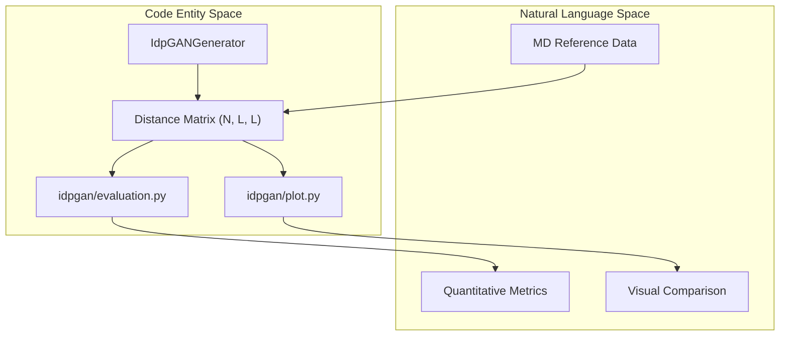
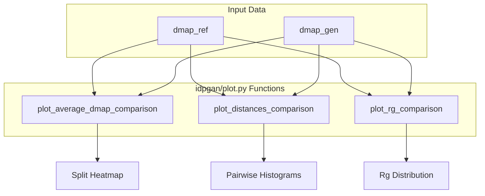

# Evaluation and Visualization

> **Relevant source files**
> * [idpgan/evaluation.py](https://github.com/feiglab/idpgan/blob/aa26675c/idpgan/evaluation.py)
> * [idpgan/plot.py](https://github.com/feiglab/idpgan/blob/aa26675c/idpgan/plot.py)

The `idpgan` repository provides a comprehensive suite of tools for assessing the quality of generated conformational ensembles. These tools are designed to compare the statistical properties of GAN-generated structures against Molecular Dynamics (MD) reference data, focusing on distance distributions, contact maps, and global properties like the Radius of Gyration ($R_g$).

The evaluation framework is split into two primary modules:

1. **`idpgan/evaluation.py`**: Quantitative metrics for measuring the divergence between generated and reference distributions.
2. **`idpgan/plot.py`**: Qualitative visualization tools for side-by-side comparisons of ensemble properties.

### Evaluation Workflow Overview

The evaluation process typically involves computing distance matrices from generated Cartesian coordinates and comparing their distributions to reference ensembles.

Title: Evaluation System Architecture

Sources: [idpgan/evaluation.py L1-L60](https://github.com/feiglab/idpgan/blob/aa26675c/idpgan/evaluation.py#L1-L60)

 [idpgan/plot.py L1-L176](https://github.com/feiglab/idpgan/blob/aa26675c/idpgan/plot.py#L1-L176)

---

### Quantitative Metrics

The quantitative assessment of idpGAN focuses on how well the generated ensemble reproduces the structural statistics of the training or test data. The `idpgan/evaluation.py` module implements several scoring functions:

* **MSE Scores**: Mean Squared Error calculations for average distance matrices (`score_mse_d`) and log-contact matrices (`score_mse_c`).
* **KLD Approximations**: Tools for measuring the Kullback–Leibler divergence between distance distributions of specific residue pairs. The `score_akld_d` function provides an average KLD across all residue pairs in the chain.

For a detailed reference on mathematical implementations and function signatures, see [Evaluation Metrics (idpgan/evaluation.py)](/feiglab/idpgan/3.1-evaluation-metrics-(idpganevaluation.py)).

Sources: [idpgan/evaluation.py L4-L13](https://github.com/feiglab/idpgan/blob/aa26675c/idpgan/evaluation.py#L4-L13)

 [idpgan/evaluation.py L15-L24](https://github.com/feiglab/idpgan/blob/aa26675c/idpgan/evaluation.py#L15-L24)

 [idpgan/evaluation.py L27-L44](https://github.com/feiglab/idpgan/blob/aa26675c/idpgan/evaluation.py#L27-L44)

---

### Visualization Suite

The visualization suite in `idpgan/plot.py` is designed to provide intuitive comparisons between generated (GEN) and reference (MD) ensembles. A key feature of this module is the use of split-triangle heatmaps, where the upper triangle represents the reference data and the lower triangle represents the generated data.

#### Key Visualization Types

| Function | Purpose | Key Feature |
| --- | --- | --- |
| `plot_average_dmap_comparison` | Compares mean inter-residue distances. | Split-triangle heatmap [idpgan/plot.py L6-L39](https://github.com/feiglab/idpgan/blob/aa26675c/idpgan/plot.py#L6-L39) |
| `plot_cmap_comparison` | Compares contact probabilities ($p_{ij}$). | Log-scale color mapping [idpgan/plot.py L42-L75](https://github.com/feiglab/idpgan/blob/aa26675c/idpgan/plot.py#L42-L75) |
| `plot_distances_comparison` | Compares specific pair-wise distance distributions. | Multi-panel histograms [idpgan/plot.py L78-L128](https://github.com/feiglab/idpgan/blob/aa26675c/idpgan/plot.py#L78-L128) |
| `plot_rg_comparison` | Compares global compactness. | $R_g$ density plots across systems [idpgan/plot.py L130-L152](https://github.com/feiglab/idpgan/blob/aa26675c/idpgan/plot.py#L130-L152) |

For details on plotting parameters and snapshot visualization, see [Visualization Suite (idpgan/plot.py)](/feiglab/idpgan/3.2-visualization-suite-(idpganplot.py)).

Title: Visualization Data Flow

Sources: [idpgan/plot.py L6-L27](https://github.com/feiglab/idpgan/blob/aa26675c/idpgan/plot.py#L6-L27)

 [idpgan/plot.py L78-L91](https://github.com/feiglab/idpgan/blob/aa26675c/idpgan/plot.py#L78-L91)

 [idpgan/plot.py L130-L135](https://github.com/feiglab/idpgan/blob/aa26675c/idpgan/plot.py#L130-L135)