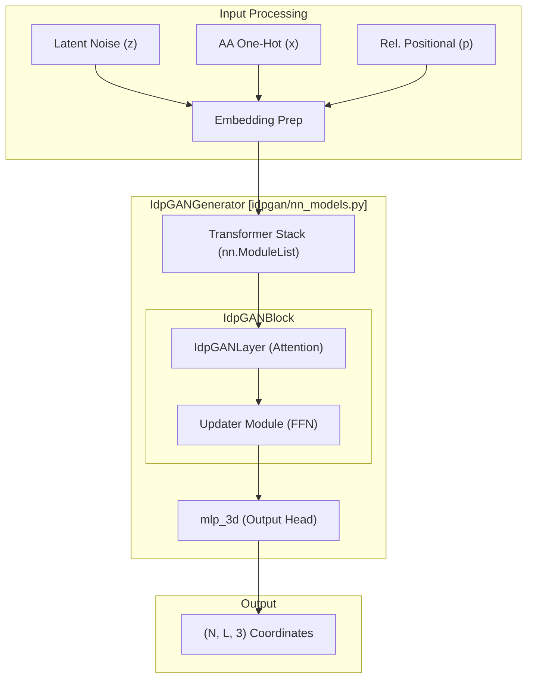
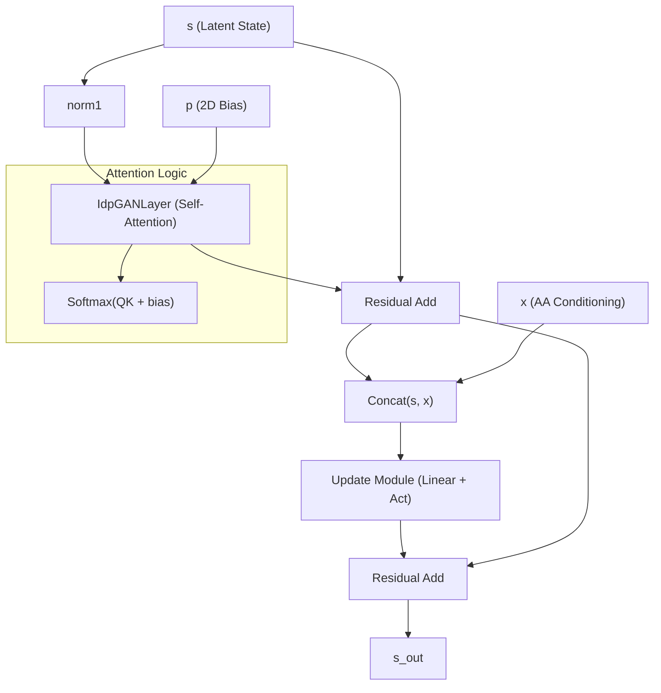

# Generator Network (IdpGANGenerator)

> **Relevant source files**
> * [idpgan/nn_models.py](https://github.com/feiglab/idpgan/blob/aa26675c/idpgan/nn_models.py)

The `IdpGANGenerator` is the core generative component of the idpGAN architecture. It is designed to transform latent noise and amino acid sequence information into three-dimensional Cartesian coordinates $(N, L, 3)$ representing the $C_\alpha$ trace of an Intrinsically Disordered Protein (IDP) ensemble. The network utilizes a transformer-based architecture that incorporates both 1D sequence features and 2D relative positional embeddings to capture the long-range dependencies inherent in disordered protein chains.

## Architecture Overview

The generator follows a modular design centered around a stack of transformer blocks. It processes a combination of latent noise (sampled from a normal distribution) and conditioning information (amino acid one-hot encodings) to output structural coordinates.

### Data Flow and Input Processing

The input to the generator consists of:

1. **Latent Noise ($z$):** Random noise sampled to provide diversity for ensemble generation.
2. **Amino Acid Conditioning:** One-hot encoded amino acid types.
3. **Relative Positional Embeddings:** A 2D representation of the sequence distance between residues.

The model first prepares these inputs before passing them through a series of `IdpGANBlock` layers. The final output is projected into 3D space via a specialized MLP head.

### System Diagram: Code Entity Space

The following diagram maps the logical flow of the generator to the specific classes and methods implemented in the codebase.

"Generator Data Flow and Entity Mapping"

**Sources:** [idpgan/nn_models.py L204-L220](https://github.com/feiglab/idpgan/blob/aa26675c/idpgan/nn_models.py#L204-L220)

 [idpgan/nn_models.py L270-L300](https://github.com/feiglab/idpgan/blob/aa26675c/idpgan/nn_models.py#L270-L300)

---

## Core Components

### 1. IdpGANBlock

The `IdpGANBlock` is the fundamental repeating unit of the generator. Unlike standard transformer blocks, it is explicitly designed to handle 2D bias information and 1D conditioning at multiple stages of the forward pass.

* **Transformer Layer:** Uses `IdpGANLayer` to perform multi-head attention [idpgan/nn_models.py L35-L40](https://github.com/feiglab/idpgan/blob/aa26675c/idpgan/nn_models.py#L35-L40)
* **Updater Module:** A feed-forward network (FFN) that implements the "Feedforward" model of the original transformer, but with the ability to re-inject amino acid conditional information (`x`) [idpgan/nn_models.py L47-L67](https://github.com/feiglab/idpgan/blob/aa26675c/idpgan/nn_models.py#L47-L67)
* **Normalization and Residuals:** Supports both "pre" and "post" layer normalization [idpgan/nn_models.py L50-L60](https://github.com/feiglab/idpgan/blob/aa26675c/idpgan/nn_models.py#L50-L60)

**Sources:** [idpgan/nn_models.py L10-L67](https://github.com/feiglab/idpgan/blob/aa26675c/idpgan/nn_models.py#L10-L67)

### 2. IdpGANLayer (2D Attention Branch)

The `IdpGANLayer` implements a modified attention mechanism. While standard attention relies solely on $Q, K, V$ dot products, this layer incorporates a **2D representation branch** (`mlp_2d`).

* **Dot Product Affinities:** Standard $Q, K, V$ linear projections [idpgan/nn_models.py L138-L140](https://github.com/feiglab/idpgan/blob/aa26675c/idpgan/nn_models.py#L138-L140)
* **2D Bias Injection:** The `mlp_2d` processes relative positional embeddings ($p$) and adds them directly to the attention weights before the softmax operation. This allows the model to explicitly learn how sequence distance influences spatial contact probability [idpgan/nn_models.py L147-L151](https://github.com/feiglab/idpgan/blob/aa26675c/idpgan/nn_models.py#L147-L151)  [idpgan/nn_models.py L200-L202](https://github.com/feiglab/idpgan/blob/aa26675c/idpgan/nn_models.py#L200-L202)

**Sources:** [idpgan/nn_models.py L116-L151](https://github.com/feiglab/idpgan/blob/aa26675c/idpgan/nn_models.py#L116-L151)

### 3. The mlp_3d Output Head

After the final transformer block, the resulting latent representation is passed through `mlp_3d`. This is a simple linear projection that maps the high-dimensional hidden states back to 3 Cartesian coordinates ($x, y, z$) for each residue in the sequence.

**Sources:** [idpgan/nn_models.py L240-L245](https://github.com/feiglab/idpgan/blob/aa26675c/idpgan/nn_models.py#L240-L245)

---

## Technical Implementation Details

### Forward Pass Logic

The `forward` method of `IdpGANGenerator` orchestrates the transformation from noise to coordinates:

| Step | Operation | Code Reference |
| --- | --- | --- |
| 1 | Reshape/Tile Latent Noise | [idpgan/nn_models.py L278-L285](https://github.com/feiglab/idpgan/blob/aa26675c/idpgan/nn_models.py#L278-L285) |
| 2 | Concatenate Noise and AA Conditioning | [idpgan/nn_models.py L288-L290](https://github.com/feiglab/idpgan/blob/aa26675c/idpgan/nn_models.py#L288-L290) |
| 3 | Apply Initial Linear Projection | [idpgan/nn_models.py L291](https://github.com/feiglab/idpgan/blob/aa26675c/idpgan/nn_models.py#L291-L291) |
| 4 | Iterate through `IdpGANBlock` stack | [idpgan/nn_models.py L294-L296](https://github.com/feiglab/idpgan/blob/aa26675c/idpgan/nn_models.py#L294-L296) |
| 5 | Project to 3D via `mlp_3d` | [idpgan/nn_models.py L299](https://github.com/feiglab/idpgan/blob/aa26675c/idpgan/nn_models.py#L299-L299) |

### Summary of Hyperparameters

The standard configuration used in the article (accessible via `load_netg_article`) utilizes the following dimensions:

* `d_model`: 192 [idpgan/nn_models.py L12](https://github.com/feiglab/idpgan/blob/aa26675c/idpgan/nn_models.py#L12-L12)
* `nhead`: 12 [idpgan/nn_models.py L12](https://github.com/feiglab/idpgan/blob/aa26675c/idpgan/nn_models.py#L12-L12)
* `dim_feedforward`: 128 [idpgan/nn_models.py L13](https://github.com/feiglab/idpgan/blob/aa26675c/idpgan/nn_models.py#L13-L13)

"IdpGANBlock Internal Connectivity"

**Sources:** [idpgan/nn_models.py L81-L113](https://github.com/feiglab/idpgan/blob/aa26675c/idpgan/nn_models.py#L81-L113)

 [idpgan/nn_models.py L181-L202](https://github.com/feiglab/idpgan/blob/aa26675c/idpgan/nn_models.py#L181-L202)