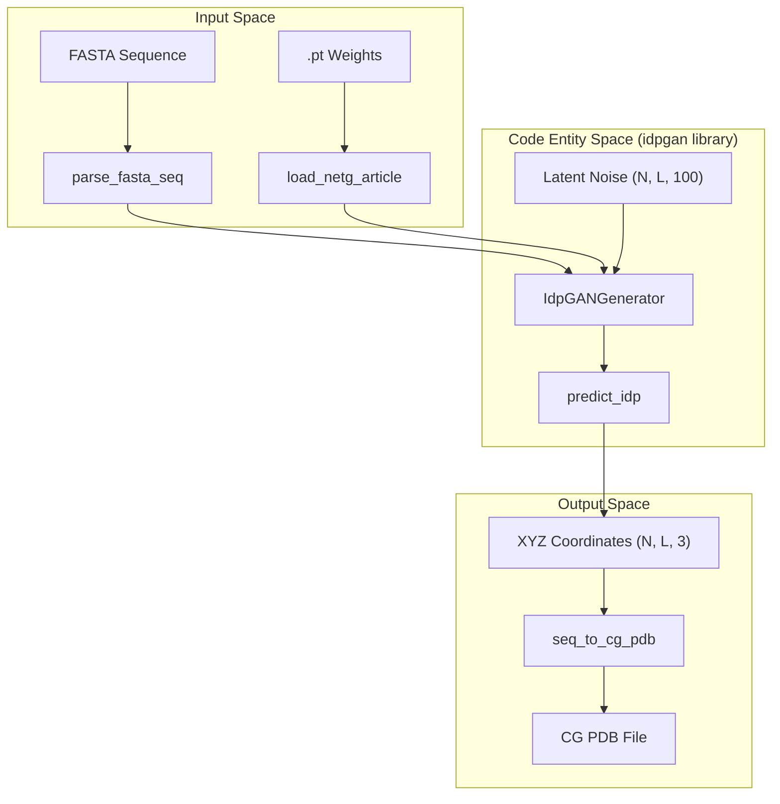
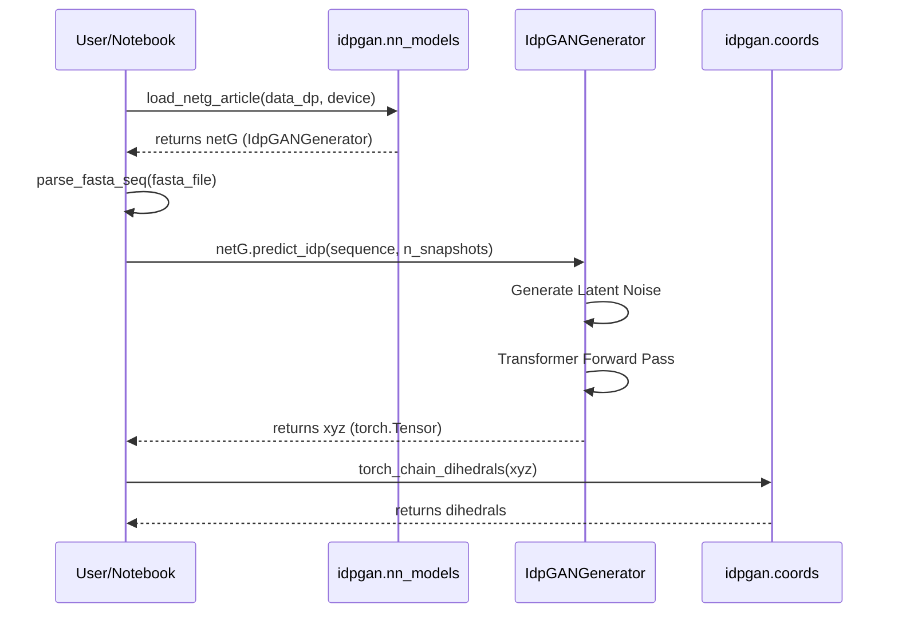

# Getting Started

> **Relevant source files**
> * [LICENSE](https://github.com/feiglab/idpgan/blob/aa26675c/LICENSE)
> * [README.md](https://github.com/feiglab/idpgan/blob/aa26675c/README.md?plain=1)
> * [notebooks/idpgan_experiments.ipynb](https://github.com/feiglab/idpgan/blob/aa26675c/notebooks/idpgan_experiments.ipynb)

This page provides a comprehensive technical guide for setting up the idpGAN environment and running initial conformational ensemble generations. idpGAN is a Generative Adversarial Network designed to produce 3D coarse-grained (CG) structures of Intrinsically Disordered Proteins (IDPs) [README.md L1-L5](https://github.com/feiglab/idpgan/blob/aa26675c/README.md?plain=1#L1-L5)

## Environment Setup

idpGAN requires Python 3.8+ and is primarily built on PyTorch [README.md L58-L59](https://github.com/feiglab/idpgan/blob/aa26675c/README.md?plain=1#L58-L59)

 Users can choose between a cloud-based setup via Google Colab or a local installation.

### 1. Dependencies

The core functionality relies on `torch`, `numpy`, and `matplotlib`. For 3D visualization and trajectory handling, `mdtraj` and `nglview` are required [README.md L28-L29](https://github.com/feiglab/idpgan/blob/aa26675c/README.md?plain=1#L28-L29)

| Category | Library | Purpose |
| --- | --- | --- |
| **Core ML** | `torch` | Neural network execution (Generator/Selector) |
| **Math/Plot** | `numpy`, `matplotlib` | Data manipulation and metric plotting |
| **Structural** | `mdtraj` | PDB handling and trajectory processing |
| **Visualization** | `nglview` | 3D interactive viewer in Jupyter |

**Sources:** [README.md L28-L29](https://github.com/feiglab/idpgan/blob/aa26675c/README.md?plain=1#L28-L29)

 [notebooks/idpgan_experiments.ipynb L53-L56](https://github.com/feiglab/idpgan/blob/aa26675c/notebooks/idpgan_experiments.ipynb#L53-L56)

 [notebooks/idpgan_experiments.ipynb L92-L97](https://github.com/feiglab/idpgan/blob/aa26675c/notebooks/idpgan_experiments.ipynb#L92-L97)

### 2. Local Installation

To set up the repository locally:

1. Clone the repository and ensure the `idpgan` directory is in your `PYTHONPATH` [README.md L30-L31](https://github.com/feiglab/idpgan/blob/aa26675c/README.md?plain=1#L30-L31)
2. Configure the data path in your script or notebook: `data_dp = "data"` must point to the directory containing `.pt` weights and `.fasta` files [README.md L33](https://github.com/feiglab/idpgan/blob/aa26675c/README.md?plain=1#L33-L33)
3. **Hardware Acceleration:** While it runs on CPU, using a GPU (`cuda`) is highly recommended for generating large ensembles (>5000 snapshots) [README.md L60](https://github.com/feiglab/idpgan/blob/aa26675c/README.md?plain=1#L60-L60)

**Sources:** [README.md L25-L34](https://github.com/feiglab/idpgan/blob/aa26675c/README.md?plain=1#L25-L34)

 [notebooks/idpgan_experiments.ipynb L162-L163](https://github.com/feiglab/idpgan/blob/aa26675c/notebooks/idpgan_experiments.ipynb#L162-L163)

## System Data Flow

The following diagram illustrates how user input (FASTA) and pre-trained weights are processed by the library entities to generate 3D coordinates.

### Ensemble Generation Logic

"idpGAN Generation Pipeline"

**Sources:** [notebooks/idpgan_experiments.ipynb L99-L101](https://github.com/feiglab/idpgan/blob/aa26675c/notebooks/idpgan_experiments.ipynb#L99-L101)

 [README.md L43](https://github.com/feiglab/idpgan/blob/aa26675c/README.md?plain=1#L43-L43)

## Configuration and Data Paths

The `data/` directory is central to the operation of idpGAN. It contains the learned parameters for the different model variants.

| File | Associated Loader | Model Type |
| --- | --- | --- |
| `generator.pt` | `load_netg_article()` | Standard CG-based model |
| `abs_generator.pt` | `load_abs_netg_article()` | ABSINTH implicit solvent model |
| `abs_selector.pt` | `load_abs_netg_article()` | Chirality correction (Stereo-selector) |

**Sources:** [README.md L35-L52](https://github.com/feiglab/idpgan/blob/aa26675c/README.md?plain=1#L35-L52)

 [notebooks/idpgan_experiments.ipynb L101](https://github.com/feiglab/idpgan/blob/aa26675c/notebooks/idpgan_experiments.ipynb#L101-L101)

## Running the First Generation

The primary interface for generation is the `predict_idp` function (available via the `idpgan` package). The workflow involves loading the model, providing a sequence, and specifying the number of snapshots.

### Execution Workflow

"Model Loading and Inference"

**Sources:** [notebooks/idpgan_experiments.ipynb L99-L107](https://github.com/feiglab/idpgan/blob/aa26675c/notebooks/idpgan_experiments.ipynb#L99-L107)

 [README.md L33](https://github.com/feiglab/idpgan/blob/aa26675c/README.md?plain=1#L33-L33)

### Key Functions for Getting Started

* `parse_fasta_seq`: Reads amino acid sequences from FASTA files [notebooks/idpgan_experiments.ipynb L99](https://github.com/feiglab/idpgan/blob/aa26675c/notebooks/idpgan_experiments.ipynb#L99-L99)
* `load_netg_article`: Initializes the `IdpGANGenerator` with pre-trained weights from `generator.pt` [notebooks/idpgan_experiments.ipynb L101](https://github.com/feiglab/idpgan/blob/aa26675c/notebooks/idpgan_experiments.ipynb#L101-L101)
* `predict_idp`: The high-level method used to generate Cartesian coordinates `(N, L, 3)` where `N` is the number of conformations and `L` is sequence length [notebooks/idpgan_experiments.ipynb L119](https://github.com/feiglab/idpgan/blob/aa26675c/notebooks/idpgan_experiments.ipynb#L119-L119)
* `seq_to_cg_pdb`: Converts generated coordinates into a PDB format compatible with MDTraj and NGLview [notebooks/idpgan_experiments.ipynb L99](https://github.com/feiglab/idpgan/blob/aa26675c/notebooks/idpgan_experiments.ipynb#L99-L99)

**Sources:** [notebooks/idpgan_experiments.ipynb L99-L107](https://github.com/feiglab/idpgan/blob/aa26675c/notebooks/idpgan_experiments.ipynb#L99-L107)

 [README.md L42-L44](https://github.com/feiglab/idpgan/blob/aa26675c/README.md?plain=1#L42-L44)