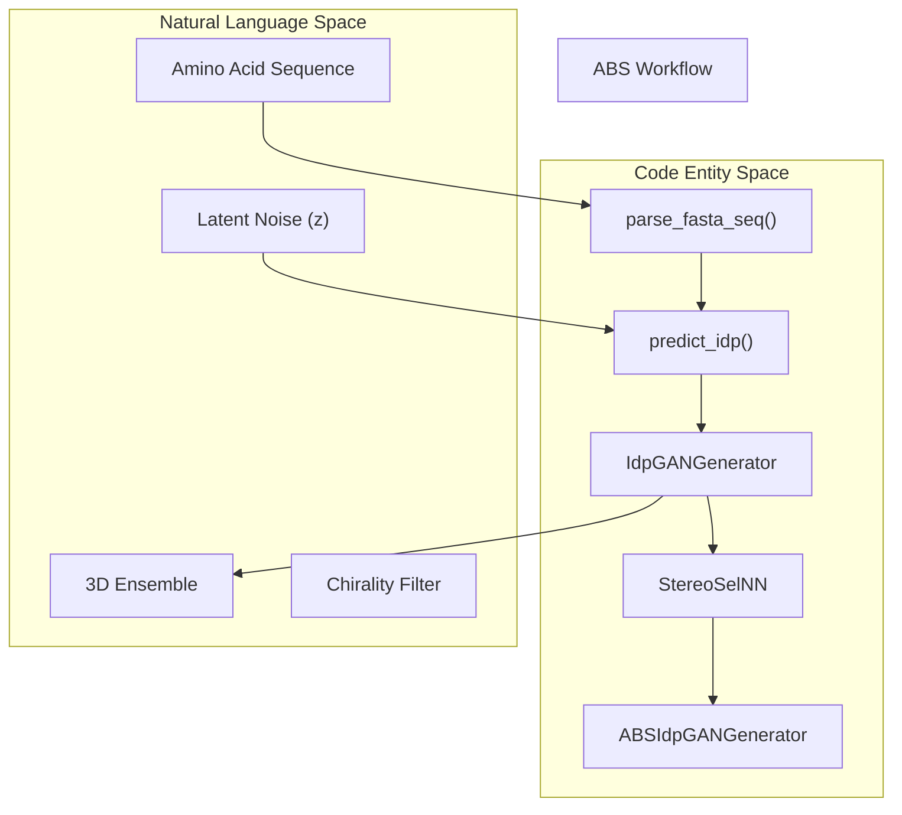
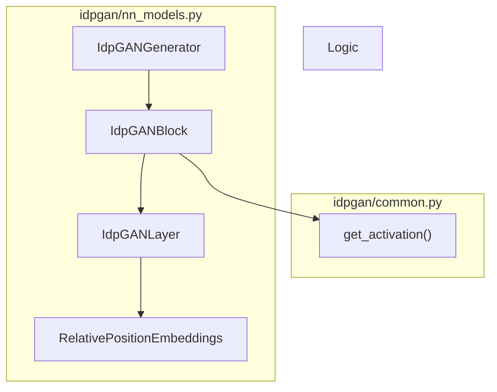

# Glossary

> **Relevant source files**
> * [LICENSE](https://github.com/feiglab/idpgan/blob/aa26675c/LICENSE)
> * [README.md](https://github.com/feiglab/idpgan/blob/aa26675c/README.md?plain=1)
> * [data/cocomo_training_data_example.md](https://github.com/feiglab/idpgan/blob/aa26675c/data/cocomo_training_data_example.md?plain=1)
> * [idpgan/common.py](https://github.com/feiglab/idpgan/blob/aa26675c/idpgan/common.py)
> * [idpgan/coords.py](https://github.com/feiglab/idpgan/blob/aa26675c/idpgan/coords.py)
> * [idpgan/data.py](https://github.com/feiglab/idpgan/blob/aa26675c/idpgan/data.py)
> * [idpgan/evaluation.py](https://github.com/feiglab/idpgan/blob/aa26675c/idpgan/evaluation.py)
> * [idpgan/nn_models.py](https://github.com/feiglab/idpgan/blob/aa26675c/idpgan/nn_models.py)
> * [idpgan/plot.py](https://github.com/feiglab/idpgan/blob/aa26675c/idpgan/plot.py)
> * [notebooks/idpgan_experiments.ipynb](https://github.com/feiglab/idpgan/blob/aa26675c/notebooks/idpgan_experiments.ipynb)

This glossary provides definitions for codebase-specific terms, biological concepts, and technical abbreviations used throughout the idpGAN repository. It serves as a reference for onboarding engineers to understand the mapping between scientific domain knowledge and the implementation details in the code.

## 1. Core Biological & Physical Concepts

| Term | Definition | Code Pointer |
| --- | --- | --- |
| **IDP** | **Intrinsically Disordered Protein**. A protein that lacks a fixed or ordered three-dimensional structure under physiological conditions. | [README.md L3-L5](https://github.com/feiglab/idpgan/blob/aa26675c/README.md?plain=1#L3-L5) |
| **Conformational Ensemble** | A collection of different 3D shapes (conformations) that a single protein molecule can adopt. idpGAN generates these as a trajectory of snapshots. | [notebooks/idpgan_experiments.ipynb L10-L14](https://github.com/feiglab/idpgan/blob/aa26675c/notebooks/idpgan_experiments.ipynb#L10-L14) |
| **Coarse-Grained (CG)** | A simplification where groups of atoms (like a whole amino acid) are represented by a single "bead" or node to reduce computational complexity. | [idpgan/data.py L26-L34](https://github.com/feiglab/idpgan/blob/aa26675c/idpgan/data.py#L26-L34) |
| **$R_g$ (Radius of Gyration)** | A measure of the compactness of a protein conformation. Calculated as the root-mean-square distance of the atoms from their common center of gravity. | [notebooks/idpgan_experiments.ipynb L133-L144](https://github.com/feiglab/idpgan/blob/aa26675c/notebooks/idpgan_experiments.ipynb#L133-L144) |
| **Dihedral Angle** | The angle between two intersecting planes defined by four atoms. In idpGAN, these are used to characterize the backbone geometry and detect chirality. | [idpgan/coords.py L5-L19](https://github.com/feiglab/idpgan/blob/aa26675c/idpgan/coords.py#L5-L19) |

**Sources:** [README.md L3-L5](https://github.com/feiglab/idpgan/blob/aa26675c/README.md?plain=1#L3-L5)

 [notebooks/idpgan_experiments.ipynb L10-L14](https://github.com/feiglab/idpgan/blob/aa26675c/notebooks/idpgan_experiments.ipynb#L10-L14)

 [idpgan/data.py L26-L34](https://github.com/feiglab/idpgan/blob/aa26675c/idpgan/data.py#L26-L34)

 [idpgan/coords.py L5-L19](https://github.com/feiglab/idpgan/blob/aa26675c/idpgan/coords.py#L5-L19)

## 2. Machine Learning Architecture Terms

### ABS-idpGAN

A specialized version of the generator trained on **ABSINTH** implicit solvent simulation data. Because the standard generator may produce mirror-image (incorrect chirality) structures, this version includes a selection step.

* **Implementation:** `ABSIdpGANGenerator` in [idpgan/nn_models.py L653](https://github.com/feiglab/idpgan/blob/aa26675c/idpgan/nn_models.py#L653-L653)
* **Weights:** `abs_generator.pt` and `abs_selector.pt`.

### Stereo-Selector

A binary classifier (`StereoSelNN`) that identifies whether a generated 3D conformation has the correct biological chirality or is a mirror image. It operates on dihedral angles calculated by `torch_chain_dihedrals`.

* **Implementation:** `StereoSelNN` in [idpgan/nn_models.py L653](https://github.com/feiglab/idpgan/blob/aa26675c/idpgan/nn_models.py#L653-L653)
* **Feature Extraction:** [idpgan/nn_models.py L653](https://github.com/feiglab/idpgan/blob/aa26675c/idpgan/nn_models.py#L653-L653)

### 2D Attention Branch

A component of the `IdpGANLayer` that incorporates pairwise (2D) information into the transformer's attention mechanism. This allows the model to bias attention based on relative positions or contact constraints.

* **Implementation:** `self.mlp_2d` in [idpgan/nn_models.py L147-L151](https://github.com/feiglab/idpgan/blob/aa26675c/idpgan/nn_models.py#L147-L151)
* **Integration:** Added to dot-product affinities in [idpgan/nn_models.py L202-L205](https://github.com/feiglab/idpgan/blob/aa26675c/idpgan/nn_models.py#L202-L205)

### Positional Embedding (PE)

Embeddings that inform the transformer about the relative distance between residues in a sequence. idpGAN uses `RelativePositionEmbeddings` to handle varying sequence lengths.

* **Implementation:** `RelativePositionEmbeddings` in [idpgan/nn_models.py L236-L237](https://github.com/feiglab/idpgan/blob/aa26675c/idpgan/nn_models.py#L236-L237)

**Sources:** [idpgan/nn_models.py L147-L151](https://github.com/feiglab/idpgan/blob/aa26675c/idpgan/nn_models.py#L147-L151)

 [idpgan/nn_models.py L236-L237](https://github.com/feiglab/idpgan/blob/aa26675c/idpgan/nn_models.py#L236-L237)

 [idpgan/nn_models.py L653](https://github.com/feiglab/idpgan/blob/aa26675c/idpgan/nn_models.py#L653-L653)

 [idpgan/nn_models.py L653](https://github.com/feiglab/idpgan/blob/aa26675c/idpgan/nn_models.py#L653-L653)

## 3. Data Flow & Entity Mapping

The following diagram bridges the natural language concepts of protein generation to the specific classes and functions in the `idpgan` package.

### Ensemble Generation Workflow

**Sources:** [idpgan/data.py L4-L18](https://github.com/feiglab/idpgan/blob/aa26675c/idpgan/data.py#L4-L18)

 [idpgan/nn_models.py L333-L335](https://github.com/feiglab/idpgan/blob/aa26675c/idpgan/nn_models.py#L333-L335)

 [idpgan/nn_models.py L653](https://github.com/feiglab/idpgan/blob/aa26675c/idpgan/nn_models.py#L653-L653)

 [idpgan/nn_models.py L653](https://github.com/feiglab/idpgan/blob/aa26675c/idpgan/nn_models.py#L653-L653)

## 4. Evaluation Metrics

These metrics are used to compare the generated ensemble ($\hat{X}$) against a reference Molecular Dynamics ensemble ($X$).

| Metric | Definition | Function |
| --- | --- | --- |
| **$MSE_d$** | Mean Squared Error of the average distance matrix. Measures global shape accuracy. | `score_mse_d` [idpgan/evaluation.py L4-L13](https://github.com/feiglab/idpgan/blob/aa26675c/idpgan/evaluation.py#L4-L13) |
| **$MSE_c$** | Mean Squared Error of the log-contact map. Measures local interaction accuracy. | `score_mse_c` [idpgan/evaluation.py L15-L24](https://github.com/feiglab/idpgan/blob/aa26675c/idpgan/evaluation.py#L15-L24) |
| **$aKLD_d$** | Average Kullback-Leibler Divergence of all pairwise distance distributions. | `score_akld_d` [idpgan/evaluation.py L27-L44](https://github.com/feiglab/idpgan/blob/aa26675c/idpgan/evaluation.py#L27-L44) |
| **KL Approx** | Discretized approximation of KLD using histogram bins. | `score_kl_approximation` [idpgan/evaluation.py L46-L60](https://github.com/feiglab/idpgan/blob/aa26675c/idpgan/evaluation.py#L46-L60) |

**Sources:** [idpgan/evaluation.py L4-L60](https://github.com/feiglab/idpgan/blob/aa26675c/idpgan/evaluation.py#L4-L60)

## 5. File & Artifact Mapping

### Neural Network Component Mapping

**Sources:** [idpgan/nn_models.py L10-L23](https://github.com/feiglab/idpgan/blob/aa26675c/idpgan/nn_models.py#L10-L23)

 [idpgan/nn_models.py L116-L123](https://github.com/feiglab/idpgan/blob/aa26675c/idpgan/nn_models.py#L116-L123)

 [idpgan/nn_models.py L333-L335](https://github.com/feiglab/idpgan/blob/aa26675c/idpgan/nn_models.py#L333-L335)

 [idpgan/common.py L7-L17](https://github.com/feiglab/idpgan/blob/aa26675c/idpgan/common.py#L7-L17)

### Data Artifacts

* **`generator.pt`**: Weights for the standard `IdpGANGenerator` trained on COCOMO CG data [README.md L42-L43](https://github.com/feiglab/idpgan/blob/aa26675c/README.md?plain=1#L42-L43)
* **`abs_generator.pt`**: Weights for the generator trained on ABSINTH all-atom traces [README.md L51](https://github.com/feiglab/idpgan/blob/aa26675c/README.md?plain=1#L51-L51)
* **`abs_selector.pt`**: Weights for the `StereoSelNN` classifier [README.md L52](https://github.com/feiglab/idpgan/blob/aa26675c/README.md?plain=1#L52-L52)
* **`idptest.fasta`**: Test set sequences for the CG model [README.md L40-L41](https://github.com/feiglab/idpgan/blob/aa26675c/README.md?plain=1#L40-L41)

**Sources:** [README.md L35-L53](https://github.com/feiglab/idpgan/blob/aa26675c/README.md?plain=1#L35-L53)