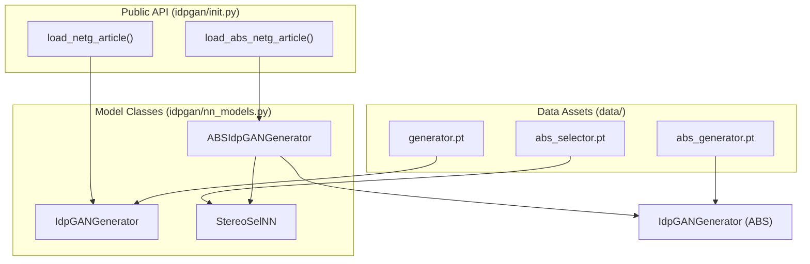
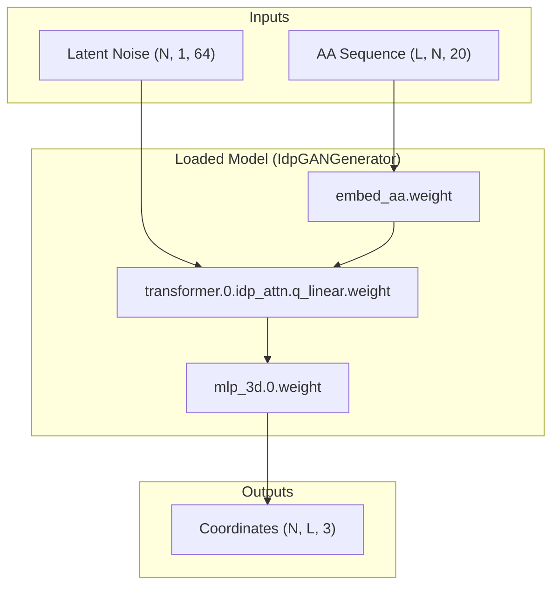

# Pre-trained Model Weights

> **Relevant source files**
> * [data/abs_generator.pt](https://github.com/feiglab/idpgan/blob/aa26675c/data/abs_generator.pt)
> * [data/abs_selector.pt](https://github.com/feiglab/idpgan/blob/aa26675c/data/abs_selector.pt)
> * [data/generator.pt](https://github.com/feiglab/idpgan/blob/aa26675c/data/generator.pt)
> * [idpgan/nn_models.py](https://github.com/feiglab/idpgan/blob/aa26675c/idpgan/nn_models.py)

This page describes the pre-trained neural network artifacts provided in the `data/` directory. These weights represent the finalized models used in the idpGAN research article, covering the standard coarse-grained (CG) generator, the absolute-chirality (ABS) generator, and the stereo-selector used for chirality correction.

## Weight Artifacts Overview

The repository includes three primary `.pt` files, each corresponding to a specific model architecture and role within the generation pipeline. These artifacts contain both the learned parameters and implicit hyperparameter configurations required to instantiate the correct model classes.

| File Path | Model Class | Purpose |
| --- | --- | --- |
| `data/generator.pt` | `IdpGANGenerator` | Standard idpGAN generator for CG protein ensembles. |
| `data/abs_generator.pt` | `IdpGANGenerator` | Generator trained specifically for the ABS-idpGAN pipeline. |
| `data/abs_selector.pt` | `StereoSelNN` | Classifier used to identify correct chirality in generated structures. |

**Sources:** [data/generator.pt L1-L10](https://github.com/feiglab/idpgan/blob/aa26675c/data/generator.pt#L1-L10)

 [data/abs_generator.pt L1-L10](https://github.com/feiglab/idpgan/blob/aa26675c/data/abs_generator.pt#L1-L10)

 [data/abs_selector.pt L1-L10](https://github.com/feiglab/idpgan/blob/aa26675c/data/abs_selector.pt#L1-L10)

## Loading Mechanisms

The `idpgan` package provides two high-level utility functions in the root `__init__.py` to facilitate loading these weights into their respective architectures. These functions handle device placement (CPU/CUDA) and the instantiation of the complex `IdpGANGenerator` class with the specific hyperparameters used during training.

### load_netg_article

Used to load the standard generator. It initializes an `IdpGANGenerator` with a 12-layer transformer stack, 192-dimensional embeddings, and 12 attention heads.

### load_abs_netg_article

Used to load the ABS-idpGAN pipeline. This function returns an `ABSIdpGANGenerator` object, which encapsulates both the `abs_generator.pt` weights (a 6-layer transformer) and the `abs_selector.pt` weights (a 6-layer `StereoSelNN`).

### Code Entity Mapping: Loading Flow

The following diagram illustrates how the natural language request to "load a model" maps to specific code entities and weight files.

"Model Loading Logic"

**Sources:** [idpgan/__init__.py L1](https://github.com/feiglab/idpgan/blob/aa26675c/idpgan/__init__.py#L1-L1)

 [idpgan/nn_models.py L228-L250](https://github.com/feiglab/idpgan/blob/aa26675c/idpgan/nn_models.py#L228-L250)

 [idpgan/nn_models.py L653](https://github.com/feiglab/idpgan/blob/aa26675c/idpgan/nn_models.py#L653-L653)

## Hyperparameter Configurations

The pre-trained weights are compatible only with specific architectural configurations. The loading functions bake these parameters into the instantiation calls.

### Standard Generator (generator.pt)

The standard model is optimized for general CG ensemble generation:

* **Layers:** 12 `IdpGANBlock` units [idpgan/__init__.py L1](https://github.com/feiglab/idpgan/blob/aa26675c/idpgan/__init__.py#L1-L1)
* **Embedding Dimension:** 192 [idpgan/__init__.py L1](https://github.com/feiglab/idpgan/blob/aa26675c/idpgan/__init__.py#L1-L1)
* **Attention Heads:** 12 [idpgan/__init__.py L1](https://github.com/feiglab/idpgan/blob/aa26675c/idpgan/__init__.py#L1-L1)
* **2D Embeddings:** Uses `embed_dim_2d=8` for relative positional information [idpgan/__init__.py L1](https://github.com/feiglab/idpgan/blob/aa26675c/idpgan/__init__.py#L1-L1)

### ABS Pipeline (abs_generator.pt & abs_selector.pt)

The ABS pipeline uses a more compact generator paired with a selector:

* **Generator Layers:** 6 `IdpGANBlock` units [idpgan/__init__.py L1](https://github.com/feiglab/idpgan/blob/aa26675c/idpgan/__init__.py#L1-L1)
* **Selector Layers:** 6 `StereoSelNN` layers [idpgan/__init__.py L1](https://github.com/feiglab/idpgan/blob/aa26675c/idpgan/__init__.py#L1-L1)
* **Latent Dimension:** 64 [idpgan/__init__.py L1](https://github.com/feiglab/idpgan/blob/aa26675c/idpgan/__init__.py#L1-L1)

**Sources:** [idpgan/__init__.py L1](https://github.com/feiglab/idpgan/blob/aa26675c/idpgan/__init__.py#L1-L1)

 [idpgan/nn_models.py L10-L21](https://github.com/feiglab/idpgan/blob/aa26675c/idpgan/nn_models.py#L10-L21)

## Data Flow: Weights to Coordinates

The pre-trained weights define the transformations applied to input latent noise and amino acid sequences to produce 3D coordinates.

"Weight-Driven Transformation Flow"

### Component Breakdown

* **`embed_aa.weight`**: Found in `generator.pt` and `abs_generator.pt`, this handles the one-hot encoding of the 20 standard amino acids [idpgan/nn_models.py L270-L272](https://github.com/feiglab/idpgan/blob/aa26675c/idpgan/nn_models.py#L270-L272)
* **`transformer.[n].idp_attn`**: Contains the attention weights (Q, K, V) that manage long-range spatial dependencies [idpgan/nn_models.py L138-L140](https://github.com/feiglab/idpgan/blob/aa26675c/idpgan/nn_models.py#L138-L140)
* **`mlp_3d`**: The output head that projects high-dimensional embeddings back to Cartesian $(x, y, z)$ space [idpgan/nn_models.py L321-L325](https://github.com/feiglab/idpgan/blob/aa26675c/idpgan/nn_models.py#L321-L325)

**Sources:** [idpgan/nn_models.py L255-L330](https://github.com/feiglab/idpgan/blob/aa26675c/idpgan/nn_models.py#L255-L330)

 [data/generator.pt L1-L10](https://github.com/feiglab/idpgan/blob/aa26675c/data/generator.pt#L1-L10)