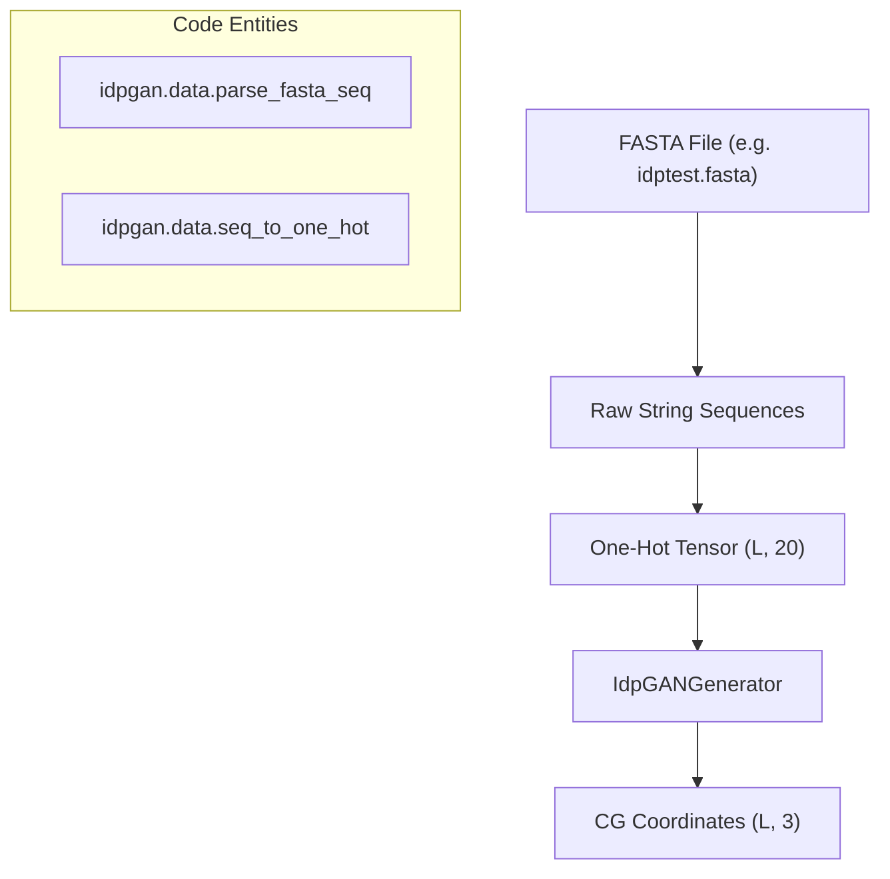
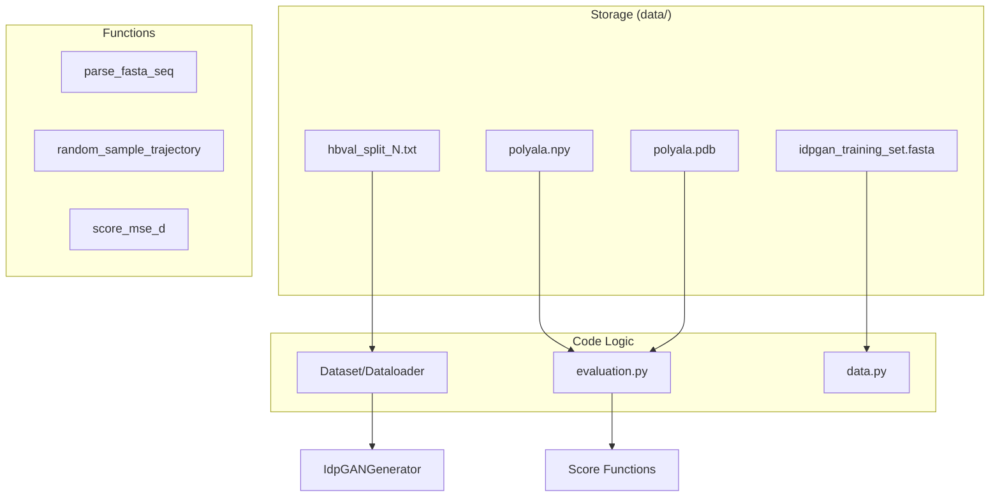

# Sequence Datasets and Reference Trajectories

> **Relevant source files**
> * [data/abstest.fasta](https://github.com/feiglab/idpgan/blob/aa26675c/data/abstest.fasta)
> * [data/cocomo_training_data_example.md](https://github.com/feiglab/idpgan/blob/aa26675c/data/cocomo_training_data_example.md?plain=1)
> * [data/hbval_split_0.txt](https://github.com/feiglab/idpgan/blob/aa26675c/data/hbval_split_0.txt)
> * [data/hbval_split_1.txt](https://github.com/feiglab/idpgan/blob/aa26675c/data/hbval_split_1.txt)
> * [data/hbval_split_2.txt](https://github.com/feiglab/idpgan/blob/aa26675c/data/hbval_split_2.txt)
> * [data/hbval_split_3.txt](https://github.com/feiglab/idpgan/blob/aa26675c/data/hbval_split_3.txt)
> * [data/hbval_split_4.txt](https://github.com/feiglab/idpgan/blob/aa26675c/data/hbval_split_4.txt)
> * [data/idpgan_training_set.fasta](https://github.com/feiglab/idpgan/blob/aa26675c/data/idpgan_training_set.fasta)
> * [data/idptest.fasta](https://github.com/feiglab/idpgan/blob/aa26675c/data/idptest.fasta)
> * [data/polyala.fasta](https://github.com/feiglab/idpgan/blob/aa26675c/data/polyala.fasta)
> * [data/polyala.npy](https://github.com/feiglab/idpgan/blob/aa26675c/data/polyala.npy)
> * [data/polyala.pdb](https://github.com/feiglab/idpgan/blob/aa26675c/data/polyala.pdb)
> * [data/protac.fasta](https://github.com/feiglab/idpgan/blob/aa26675c/data/protac.fasta)
> * [data/protac.npy](https://github.com/feiglab/idpgan/blob/aa26675c/data/protac.npy)
> * [data/protac.pdb](https://github.com/feiglab/idpgan/blob/aa26675c/data/protac.pdb)
> * [data/protan.fasta](https://github.com/feiglab/idpgan/blob/aa26675c/data/protan.fasta)
> * [data/protan.npy](https://github.com/feiglab/idpgan/blob/aa26675c/data/protan.npy)
> * [data/protan.pdb](https://github.com/feiglab/idpgan/blob/aa26675c/data/protan.pdb)

This page documents the sequence data, validation splits, and Molecular Dynamics (MD) reference trajectories used to train and evaluate idpGAN. These assets are stored in the `data/` directory and form the basis for the model's ability to generalize across the disordered protein sequence space.

## Sequence Datasets (.fasta)

The repository includes several FASTA files serving different roles in the machine learning pipeline, from large-scale training to specific benchmarks for chirality and homopolymers.

| File | Description | Purpose |
| --- | --- | --- |
| `idpgan_training_set.fasta` | Contains ~8,000 IDR sequences derived from the COCOMO MD dataset [data/idpgan_training_set.fasta L1-L359](https://github.com/feiglab/idpgan/blob/aa26675c/data/idpgan_training_set.fasta#L1-L359) | Primary training data for `IdpGANGenerator`. |
| `idptest.fasta` | A collection of 25 well-characterized IDPs and disordered regions (e.g., $\alpha$-synuclein, p53, Sic1) [data/idptest.fasta L1-L93](https://github.com/feiglab/idpgan/blob/aa26675c/data/idptest.fasta#L1-L93) | Out-of-distribution testing and ensemble comparison. |
| `abstest.fasta` | 15 sequences including highly charged synthetic variants like `poly-R` [data/abstest.fasta L1-L44](https://github.com/feiglab/idpgan/blob/aa26675c/data/abstest.fasta#L1-L44) | Testing `ABSIdpGANGenerator` chirality selection. |
| `polyala.fasta` | A 55-residue Poly-Alanine homopolymer [data/polyala.fasta L1-L2](https://github.com/feiglab/idpgan/blob/aa26675c/data/polyala.fasta#L1-L2) | Homopolymer baseline testing. |
| `protan.fasta` / `protac.fasta` | Specific acidic/basic sequences used for charge-based evaluation [data/protan.fasta L1-L2](https://github.com/feiglab/idpgan/blob/aa26675c/data/protan.fasta#L1-L2) | Charge-balance sensitivity testing. |

### Data Flow: Sequence to Model Input

The following diagram illustrates how FASTA sequences are processed into the one-hot encodings required by the generator.

**Sequence Processing Pipeline**

**Sources:** [idpgan/data.py L8-L35](https://github.com/feiglab/idpgan/blob/aa26675c/idpgan/data.py#L8-L35)

 [data/idptest.fasta L1-L10](https://github.com/feiglab/idpgan/blob/aa26675c/data/idptest.fasta#L1-L10)

## Reference Trajectories (.npy and .pdb)

For benchmarking and evaluation, the repository provides pre-computed MD trajectories for specific systems. These are stored as NumPy arrays containing Cartesian coordinates for the Coarse-Grained (CG) $C_\alpha$ (or equivalent) atoms.

### Trajectory Format

Trajectory files (e.g., `polyala.npy`, `protac.npy`, `protan.npy`) follow a fixed shape convention: `(N_frames, L_residues, 3)`.

* **Example:** `polyala.npy` contains 25,000 frames for a 55-residue sequence [data/polyala.npy L1](https://github.com/feiglab/idpgan/blob/aa26675c/data/polyala.npy#L1-L1)
* **PDB Templates:** Accompanying PDB files (e.g., `polyala.pdb`) provide the topology and atom naming required by `mdtraj` to load and visualize these ensembles [data/polyala.pdb L1-L58](https://github.com/feiglab/idpgan/blob/aa26675c/data/polyala.pdb#L1-L58)

### COCOMO Training Data

The original idpGAN was trained on the COCOMO dataset. While the full multi-terabyte dataset is not in the repo, an example subset of 10 IDRs is provided via an external release link [data/cocomo_training_data_example.md L1](https://github.com/feiglab/idpgan/blob/aa26675c/data/cocomo_training_data_example.md?plain=1#L1-L1)

**Sources:** [data/polyala.npy L1](https://github.com/feiglab/idpgan/blob/aa26675c/data/polyala.npy#L1-L1)

 [data/polyala.pdb L4-L8](https://github.com/feiglab/idpgan/blob/aa26675c/data/polyala.pdb#L4-L8)

 [data/cocomo_training_data_example.md L1](https://github.com/feiglab/idpgan/blob/aa26675c/data/cocomo_training_data_example.md?plain=1#L1-L1)

## Validation Splits (hbval_split_[0-4].txt)

To ensure robust evaluation, the training set is partitioned into a five-fold cross-validation scheme. These split files list the identifiers of the sequences used for validation in each fold.

* **File Naming:** `hbval_split_0.txt` through `hbval_split_4.txt`.
* **Content:** Each file contains ~240 unique IDR identifiers (e.g., `DP00806r001`) [data/hbval_split_0.txt L1-L241](https://github.com/feiglab/idpgan/blob/aa26675c/data/hbval_split_0.txt#L1-L241)
* **Usage:** During training, these IDs are used to filter the master FASTA and trajectory lists to prevent data leakage between training and validation sets.

**Cross-Validation Organization**

| Split File | Count | Example ID |
| --- | --- | --- |
| `hbval_split_0.txt` | 241 IDs | `DP00806r001` [data/hbval_split_0.txt L1](https://github.com/feiglab/idpgan/blob/aa26675c/data/hbval_split_0.txt#L1-L1) |
| `hbval_split_1.txt` | 240 IDs | `DP02533r001` [data/hbval_split_1.txt L1](https://github.com/feiglab/idpgan/blob/aa26675c/data/hbval_split_1.txt#L1-L1) |
| `hbval_split_2.txt` | 240 IDs | `DP00238r012` [data/hbval_split_2.txt L1](https://github.com/feiglab/idpgan/blob/aa26675c/data/hbval_split_2.txt#L1-L1) |
| `hbval_split_3.txt` | 240 IDs | `DP02208r001` [data/hbval_split_3.txt L1](https://github.com/feiglab/idpgan/blob/aa26675c/data/hbval_split_3.txt#L1-L1) |
| `hbval_split_4.txt` | 240 IDs | `DP00182r004` [data/hbval_split_4.txt L1](https://github.com/feiglab/idpgan/blob/aa26675c/data/hbval_split_4.txt#L1-L1) |

**Sources:** [data/hbval_split_0.txt L1-L241](https://github.com/feiglab/idpgan/blob/aa26675c/data/hbval_split_0.txt#L1-L241)

 [data/hbval_split_1.txt L1-L240](https://github.com/feiglab/idpgan/blob/aa26675c/data/hbval_split_1.txt#L1-L240)

 [data/hbval_split_2.txt L1-L240](https://github.com/feiglab/idpgan/blob/aa26675c/data/hbval_split_2.txt#L1-L240)

 [data/hbval_split_3.txt L1-L240](https://github.com/feiglab/idpgan/blob/aa26675c/data/hbval_split_3.txt#L1-L240)

 [data/hbval_split_4.txt L1-L240](https://github.com/feiglab/idpgan/blob/aa26675c/data/hbval_split_4.txt#L1-L240)

## Data Infrastructure Diagram

This diagram maps the relationship between the physical files in the `data/` directory and the internal Python classes that consume them.

**Code-Data Association**

**Sources:** [idpgan/data.py L8-L15](https://github.com/feiglab/idpgan/blob/aa26675c/idpgan/data.py#L8-L15)

 [idpgan/evaluation.py L20-L40](https://github.com/feiglab/idpgan/blob/aa26675c/idpgan/evaluation.py#L20-L40)

 [data/hbval_split_0.txt L1-L10](https://github.com/feiglab/idpgan/blob/aa26675c/data/hbval_split_0.txt#L1-L10)