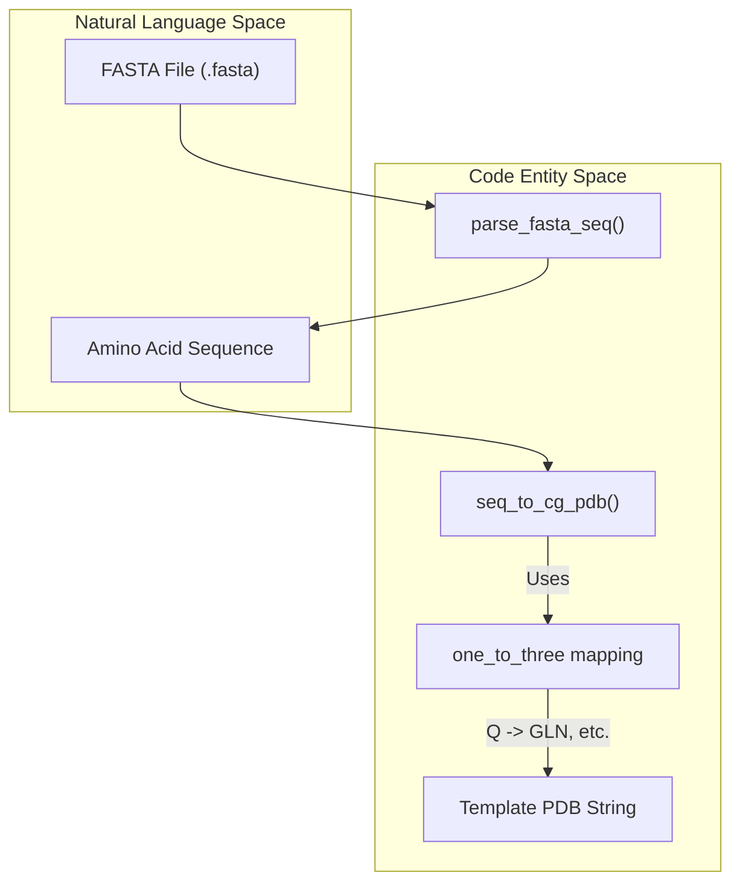
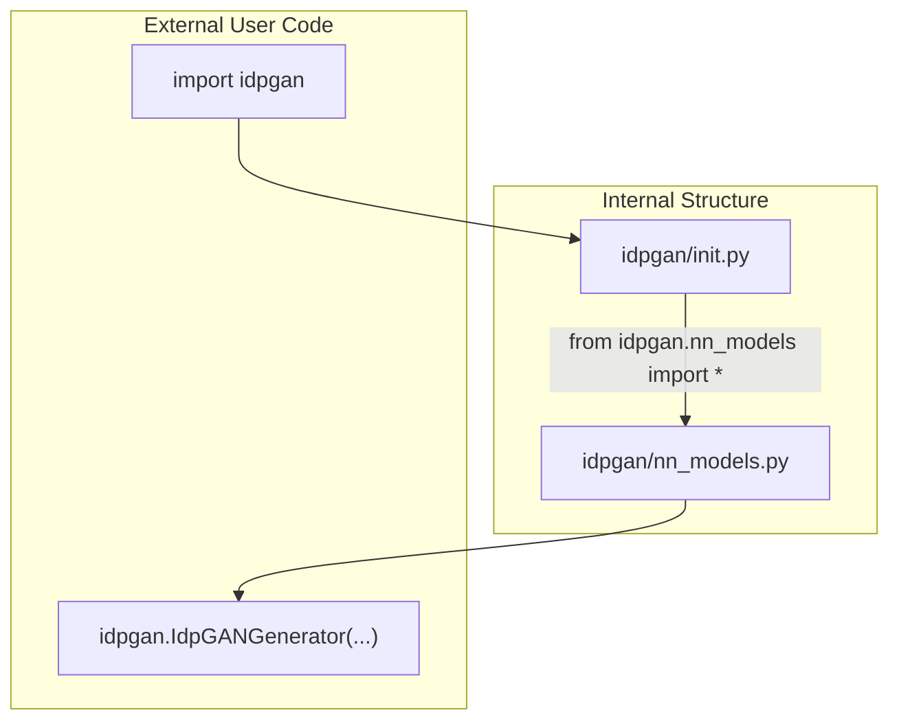

# Supporting Utilities: Data, Coordinates, and Common Modules

> **Relevant source files**
> - [idpgan/\_\_init\_\_\.py](https://github.com/feiglab/idpgan/blob/aa26675c/idpgan/__init__.py)
> - [idpgan/common\.py](https://github.com/feiglab/idpgan/blob/aa26675c/idpgan/common.py)
> - [idpgan/coords\.py](https://github.com/feiglab/idpgan/blob/aa26675c/idpgan/coords.py)
> - [idpgan/data\.py](https://github.com/feiglab/idpgan/blob/aa26675c/idpgan/data.py)

 This section documents the auxiliary modules that provide essential data processing, geometric calculations, and architectural building blocks for the idpGAN framework\. These utilities bridge the gap between raw biological sequences and the tensor representations required by the neural networks\.

## Data Handling \(`idpgan/data.py`\)

 The `idpgan/data.py` module contains functions for parsing protein sequences, generating template PDB files for coarse\-grained \(CG\) models, and managing trajectory sampling\.

### Sequence Parsing and Template Generation

 The system operates on single\-chain intrinsically disordered proteins \(IDPs\)\. The `parse_fasta_seq` function enforces a single\-entry constraint to ensure data integrity during inference [data\.py L4-L18](https://github.com/feiglab/idpgan/blob/aa26675c/idpgan/data.py#L4-L18)

 Once a sequence is parsed, it must be converted into a format compatible with molecular visualization tools\. The `seq_to_cg_pdb` function generates a PDB\-formatted string or file where each residue is represented by a single atom at the origin `(0.0, 0.0, 0.0)` [data\.py L26-L46](https://github.com/feiglab/idpgan/blob/aa26675c/idpgan/data.py#L26-L46) This serves as a structural template that tools like `MDTraj` or `NGLview` use to map the generated Cartesian coordinates back onto a chemical topology\.

| Function | Input | Output | Description |
| --- | --- | --- | --- |
| parse\_fasta\_seq | Path to \.fasta | str \(sequence\) | Reads a single\-entry FASTA file; raises ValueError if multiple or zero entries are found idpgan/data\.py10\-13 |
| seq\_to\_cg\_pdb | str \(sequence\) | str \(PDB content\) | Creates a template PDB\. Can label atoms as CG \(default\) or CA idpgan/data\.py31\-34 |
| random\_sample\_trajectory | np\.ndarray | np\.ndarray | Samples n\_samples from a trajectory\. Uses replacement if the requested size exceeds the trajectory length idpgan/data\.py51\-52 |

### Entity Mapping: Data Flow

 The following diagram illustrates how raw sequence data is transformed into a structural template used by the generator's output\.

 **Sequence to Topology Mapping**

 **Sources:** [data\.py L4-L46](https://github.com/feiglab/idpgan/blob/aa26675c/idpgan/data.py#L4-L46)

---

## Geometric Calculations \(`idpgan/coords.py`\)

 The `idpgan/coords.py` module provides differentiable geometric operations implemented in PyTorch\. The primary utility is `torch_chain_dihedrals`, which calculates the dihedral angles along a protein backbone given a set of Cartesian coordinates\.

### Dihedral Angle Calculation

 The function calculates the angle between two intersecting planes defined by four consecutive atoms \($r\_0, r\_1, r\_2, r\_3$\)\.

 1. **Vector Definition**: It computes bond vectors $b\_0, b\_1, b\_2$ [coords\.py L7-L9](https://github.com/feiglab/idpgan/blob/aa26675c/idpgan/coords.py#L7-L9)
2. **Cross Products**: It determines the plane normals using `torch.cross` [coords\.py L10-L11](https://github.com/feiglab/idpgan/blob/aa26675c/idpgan/coords.py#L10-L11)
3. **Angle Extraction**: It uses `torch.atan2` on the dot products of the normals and bond vectors to produce the dihedral value in radians [coords\.py L13-L15](https://github.com/feiglab/idpgan/blob/aa26675c/idpgan/coords.py#L13-L15)

 This implementation is critical for the `StereoSelNN` classifier, which uses these dihedrals to distinguish between L\-amino acid structures and their mirror images [coords\.py L5-L19](https://github.com/feiglab/idpgan/blob/aa26675c/idpgan/coords.py#L5-L19)

 **Sources:** [coords\.py L5-L19](https://github.com/feiglab/idpgan/blob/aa26675c/idpgan/coords.py#L5-L19)

---

## Common Neural Network Modules \(`idpgan/common.py`\)

 The `idpgan/common.py` module serves as a factory for activation functions used throughout the generator and discriminator architectures\.

### Activation Factory

 The `get_activation` function provides a unified interface for selecting non\-linearities\. It supports standard activations and the `SiLU` \(Swish\) activation used in modern transformer architectures [common\.py L7-L17](https://github.com/feiglab/idpgan/blob/aa26675c/idpgan/common.py#L7-L17)

| Key | PyTorch Module | Notes |
| --- | --- | --- |
| "relu" | nn\.ReLU\(\) | Standard rectified linear unit\. |
| "elu" | nn\.ELU\(\) | Exponential linear unit\. |
| "lrelu" | nn\.LeakyReLU\(slope\) | Leaky ReLU with configurable negative slope \(default 0\.2\) idpgan/common\.py7\-13 |
| "swish" | nn\.SiLU\(\) | Sigmoid Linear Unit\. |

 **Sources:** [common\.py L7-L17](https://github.com/feiglab/idpgan/blob/aa26675c/idpgan/common.py#L7-L17)

---

## Public API Surface \(`idpgan/__init__.py`\)

 The `idpgan/__init__.py` file exposes the core neural network models to the package level\. By performing a wildcard import from `idpgan.nn_models`, it allows users to instantiate the primary generators and selectors directly from the base `idpgan` namespace [\_\_init\_\_\.py L1](https://github.com/feiglab/idpgan/blob/aa26675c/idpgan/__init__.py#L1-L1)

 **Entity Mapping: API Access**

 **Sources:** [\_\_init\_\_\.py L1](https://github.com/feiglab/idpgan/blob/aa26675c/idpgan/__init__.py#L1-L1)

