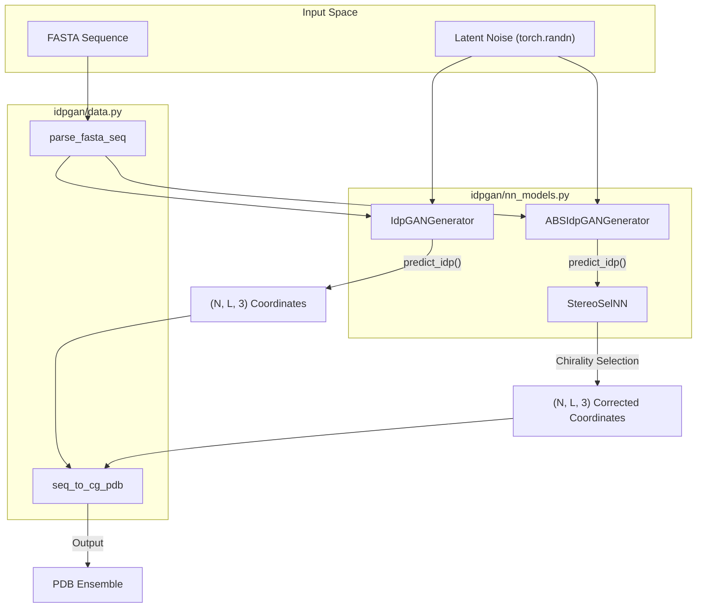
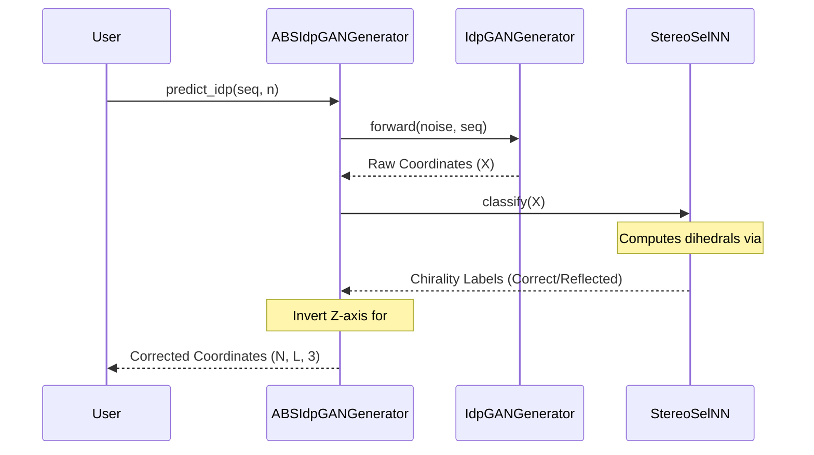

# Usage Guide: Generating Conformational Ensembles

> **Relevant source files**
> - [idpgan/nn\_models\.py](https://github.com/feiglab/idpgan/blob/aa26675c/idpgan/nn_models.py)
> - [notebooks/idpgan\_experiments\.ipynb](https://github.com/feiglab/idpgan/blob/aa26675c/notebooks/idpgan_experiments.ipynb)

 This page provides a practical walkthrough for generating conformational ensembles of Intrinsically Disordered Proteins \(IDPs\) using idpGAN\. It covers the two primary workflows: the standard Coarse\-Grained \(CG\) model and the `abs-idpGAN` model, which includes chirality correction for ABSINTH\-based simulations\.

## Workflow Overview

 The generation process follows a structured data flow where sequence information and latent noise are transformed into 3D Cartesian coordinates\.

### Ensemble Generation Pipeline

 The diagram below maps the conceptual generation steps to the specific code entities involved in the process\.

 **Conformational Generation Data Flow**



 **Sources:** [nn\_models\.py L284-L335](https://github.com/feiglab/idpgan/blob/aa26675c/idpgan/nn_models.py#L284-L335) [nn\_models\.py L534-L590](https://github.com/feiglab/idpgan/blob/aa26675c/idpgan/nn_models.py#L534-L590) [data\.py L10-L44](https://github.com/feiglab/idpgan/blob/aa26675c/idpgan/data.py#L10-L44) [idpgan\_experiments\.ipynb L99-L107](https://github.com/feiglab/idpgan/blob/aa26675c/notebooks/idpgan_experiments.ipynb#L99-L107)

---

## Standard CG Ensemble Generation

 The standard workflow uses a model trained on COCOMO coarse\-grained molecular dynamics data\. It generates ensembles where each residue is represented by a single CG bead\.

### 1\. Model Initialization

 To load the pre\-trained weights for the standard generator, use `load_netg_article`\. This function initializes the `IdpGANGenerator` with the specific architecture parameters used in the published work and loads the weights from `data/generator.pt`\.

```python
from idpgan.nn_models import load_netg_article # Load the standard CG generatornetg = load_netg_article("data/generator.pt", device=device)netg.eval()
```

 **Sources:** [nn\_models\.py L612-L632](https://github.com/feiglab/idpgan/blob/aa26675c/idpgan/nn_models.py#L612-L632) [idpgan\_experiments\.ipynb L242-L246](https://github.com/feiglab/idpgan/blob/aa26675c/notebooks/idpgan_experiments.ipynb#L242-L246)

### 2\. Sequence Preparation

 Sequences must be converted from FASTA format to one\-hot encodings that the generator can process\.

```python
from idpgan.data import parse_fasta_seq sequence = "GSGSGSGSGS" # Example sequence# Returns (1, L, 20) tensorseq_tensor = parse_fasta_seq(sequence).to(device)
```

 **Sources:** [data\.py L10-L25](https://github.com/feiglab/idpgan/blob/aa26675c/idpgan/data.py#L10-L25) [idpgan\_experiments\.ipynb L296-L297](https://github.com/feiglab/idpgan/blob/aa26675c/notebooks/idpgan_experiments.ipynb#L296-L297)

### 3\. Coordinate Prediction

 The `predict_idp` method handles the generation of $N$ conformations\. It internally samples the required latent noise\.

```
# Generate 1000 conformations# Returns numpy array of shape (1000, L, 3)with torch.no_grad():    xyz_generated = netg.predict_idp(seq_tensor, n_conformations=1000)
```

 **Sources:** [nn\_models\.py L388-L410](https://github.com/feiglab/idpgan/blob/aa26675c/idpgan/nn_models.py#L388-L410) [idpgan\_experiments\.ipynb L301-L303](https://github.com/feiglab/idpgan/blob/aa26675c/notebooks/idpgan_experiments.ipynb#L301-L303)

---

## ABS\-idpGAN with Chirality Correction

 When using models trained on higher\-resolution data \(like ABSINTH implicit solvent\), the generator may produce mirror\-image conformations because the loss functions \(MSE on distances\) are often rotationally and reflectionally invariant\. `ABSIdpGANGenerator` solves this by using a `StereoSelNN` to filter or correct the chirality of generated structures\.

### 1\. Loading the ABS Model

 The `load_abs_netg_article` function loads both the generator \(`abs_generator.pt`\) and the stereo\-selector \(`abs_selector.pt`\)\.

```python
from idpgan.nn_models import load_abs_netg_article # Loads a composite ABSIdpGANGenerator objectabs_netg = load_abs_netg_article("data/abs_generator.pt",                                  "data/abs_selector.pt",                                  device=device)
```

 **Sources:** [nn\_models\.py L635-L653](https://github.com/feiglab/idpgan/blob/aa26675c/idpgan/nn_models.py#L635-L653) [idpgan\_experiments\.ipynb L390-L394](https://github.com/feiglab/idpgan/blob/aa26675c/notebooks/idpgan_experiments.ipynb#L390-L394)

### 2\. The Correction Mechanism

 The `ABSIdpGANGenerator` overrides the prediction logic to ensure physical validity\.

 **Stereo\-Selection Logic**



 **Sources:** [nn\_models\.py L534-L590](https://github.com/feiglab/idpgan/blob/aa26675c/idpgan/nn_models.py#L534-L590) [nn\_models\.py L469-L507](https://github.com/feiglab/idpgan/blob/aa26675c/idpgan/nn_models.py#L469-L507) [coords\.py L11-L19](https://github.com/feiglab/idpgan/blob/aa26675c/idpgan/coords.py#L11-L19)

---

## Exporting Ensembles

 Generated coordinates are raw NumPy arrays\. To use them in molecular analysis tools, they must be wrapped in a PDB format\.

### Sequence to PDB Template

 The `seq_to_cg_pdb` utility creates a template PDB file where each residue is represented by a "CA" atom \(alpha\-carbon\) to represent the CG bead\.

```python
from idpgan.data import seq_to_cg_pdbimport mdtraj # Create a template topologypdb_template = seq_to_cg_pdb(sequence, "template.pdb") # Create an MDTraj trajectory objecttraj = mdtraj.Trajectory(xyz_generated, pdb_template.topology) # Save to disktraj.save_xtc("ensemble.xtc")traj[0].save_pdb("first_frame.pdb")
```

 **Sources:** [data\.py L28-L44](https://github.com/feiglab/idpgan/blob/aa26675c/idpgan/data.py#L28-L44) [idpgan\_experiments\.ipynb L306-L311](https://github.com/feiglab/idpgan/blob/aa26675c/notebooks/idpgan_experiments.ipynb#L306-L311)

## Key Implementation Details

| Component | Class/Function | Role |
| --- | --- | --- |
| Generator | IdpGANGenerator | Main Transformer\-based architecture that maps noise \+ sequence to 3D space\. |
| Stereo Selector | StereoSelNN | A MLP that classifies the chirality of a chain based on its dihedral angles\. |
| ABS Wrapper | ABSIdpGANGenerator | Orchestrates the generation and subsequent chirality correction\. |
| Dihedral Calc | torch\_chain\_dihedrals | Differentiable calculation of $\\phi/\\psi$\-like angles for the selector\. |

 **Sources:** [nn\_models\.py L284-L335](https://github.com/feiglab/idpgan/blob/aa26675c/idpgan/nn_models.py#L284-L335) [nn\_models\.py L469-L507](https://github.com/feiglab/idpgan/blob/aa26675c/idpgan/nn_models.py#L469-L507) [nn\_models\.py L534-L590](https://github.com/feiglab/idpgan/blob/aa26675c/idpgan/nn_models.py#L534-L590) [coords\.py L11-L19](https://github.com/feiglab/idpgan/blob/aa26675c/idpgan/coords.py#L11-L19)

