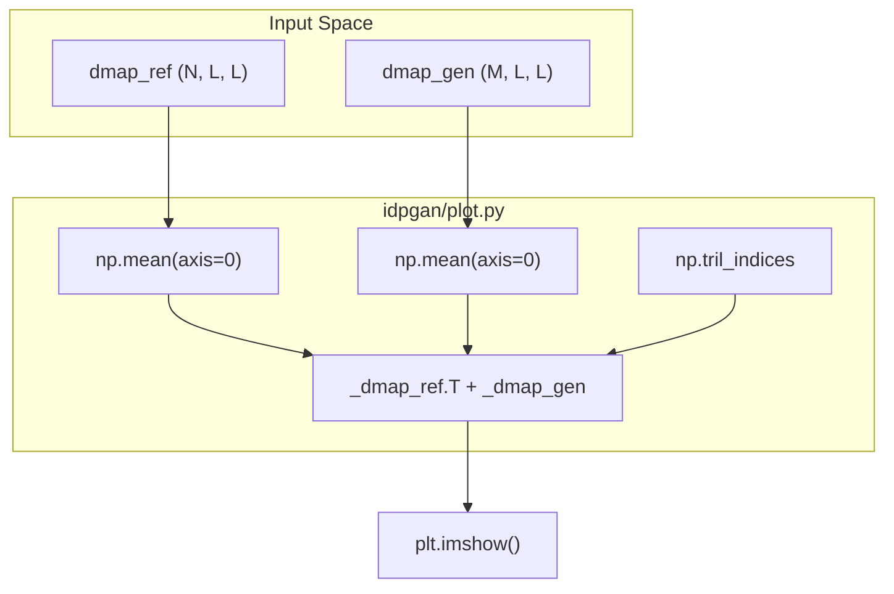
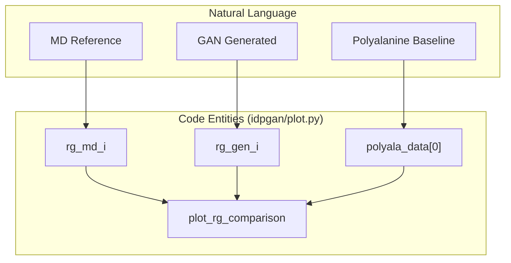

# Visualization Suite (idpgan/plot.py)

> **Relevant source files**
> * [idpgan/plot.py](https://github.com/feiglab/idpgan/blob/aa26675c/idpgan/plot.py)

The `idpgan/plot.py` module provides a specialized visualization suite for assessing the quality of generated intrinsically disordered protein (IDP) ensembles. It facilitates direct comparisons between Molecular Dynamics (MD) reference data and idpGAN-generated conformations using heatmaps, histograms, and distribution plots.

## Split-Triangle Heatmap Comparisons

A core visualization pattern in this module is the split-triangle heatmap, used in `plot_average_dmap_comparison` and `plot_cmap_comparison`. This technique allows for the simultaneous inspection of two different ensembles (Reference vs. Generated) within a single square matrix plot.

### Distance Map Comparison

The `plot_average_dmap_comparison` function visualizes the average inter-residue distances ($d_{ij}$).

* **Logic**: It calculates the mean distance matrix for both reference and generated ensembles [idpgan/plot.py L15-L18](https://github.com/feiglab/idpgan/blob/aa26675c/idpgan/plot.py#L15-L18)
* **Split Construction**: The upper triangle represents the reference data, while the lower triangle represents the generated data [idpgan/plot.py L19-L22](https://github.com/feiglab/idpgan/blob/aa26675c/idpgan/plot.py#L19-L22)
* **Normalization**: The color scale is typically capped (default 6.8 nm) to highlight structural differences in the relevant IDP range [idpgan/plot.py L11-L38](https://github.com/feiglab/idpgan/blob/aa26675c/idpgan/plot.py#L11-L38)

### Contact Map Comparison

The `plot_cmap_comparison` function visualizes contact probabilities ($p_{ij}$).

* **Scaling**: Data is visualized on a $log_{10}$ scale to emphasize rare contact events [idpgan/plot.py L52-L55](https://github.com/feiglab/idpgan/blob/aa26675c/idpgan/plot.py#L52-L55)
* **Implementation**: Similar to the distance map, it uses `np.tril_indices` to merge the two datasets into one matrix [idpgan/plot.py L56-L59](https://github.com/feiglab/idpgan/blob/aa26675c/idpgan/plot.py#L56-L59)
* **Color Mapping**: Uses the "jet" colormap with a default minimum of -3.5 (representing $10^{-3.5}$ probability) [idpgan/plot.py L46-L50](https://github.com/feiglab/idpgan/blob/aa26675c/idpgan/plot.py#L46-L50)

### Data Flow for Heatmap Generation

The following diagram illustrates how the code transforms two 3D trajectory arrays into a single 2D comparison heatmap.

**Heatmap Construction Flow**

Sources: [idpgan/plot.py L6-L39](https://github.com/feiglab/idpgan/blob/aa26675c/idpgan/plot.py#L6-L39)

 [idpgan/plot.py L42-L75](https://github.com/feiglab/idpgan/blob/aa26675c/idpgan/plot.py#L42-L75)

---

## Distribution and Histogram Analysis

To evaluate the statistical properties of the ensemble, the suite provides functions for comparing distance distributions and Radius of Gyration ($R_g$).

### Pairwise Distance Distributions

`plot_distances_comparison` selects random pairs of residues and plots their distance histograms [idpgan/plot.py L78-L84](https://github.com/feiglab/idpgan/blob/aa26675c/idpgan/plot.py#L78-L84)

* **Multi-System Support**: It can iterate through multiple proteins provided in `prot_data`, comparing MD, idpGAN-Generated (GEN), and Polyalanine MD (ALA MD) baselines [idpgan/plot.py L90-L118](https://github.com/feiglab/idpgan/blob/aa26675c/idpgan/plot.py#L90-L118)
* **Consistency**: To ensure fair comparison, bins calculated for the first protein system are reused for subsequent systems in the loop [idpgan/plot.py L98-L102](https://github.com/feiglab/idpgan/blob/aa26675c/idpgan/plot.py#L98-L102)

### Radius of Gyration ($R_g$) Comparison

`plot_rg_comparison` provides a side-by-side histogram comparison of $R_g$ across multiple systems [idpgan/plot.py L130-L135](https://github.com/feiglab/idpgan/blob/aa26675c/idpgan/plot.py#L130-L135)

* **Structure**: It creates a subplot for each protein system plus one final subplot specifically for the `polyala` baseline [idpgan/plot.py L133-L149](https://github.com/feiglab/idpgan/blob/aa26675c/idpgan/plot.py#L133-L149)
* **Normalization**: Histograms are plotted as densities (`density=True`) using step lines (`histtype="step"`) to allow clear overlapping of distributions [idpgan/plot.py L132-L140](https://github.com/feiglab/idpgan/blob/aa26675c/idpgan/plot.py#L132-L140)

**Entity Mapping: Distribution Plotting**

Sources: [idpgan/plot.py L78-L127](https://github.com/feiglab/idpgan/blob/aa26675c/idpgan/plot.py#L78-L127)

 [idpgan/plot.py L130-L152](https://github.com/feiglab/idpgan/blob/aa26675c/idpgan/plot.py#L130-L152)

---

## Snapshot Visualization

The `plot_dmap_snapshots` function is used for qualitative inspection of individual generated frames.

* **Random Sampling**: It selects `n_snapshots` at random from the provided distance map array [idpgan/plot.py L168-L169](https://github.com/feiglab/idpgan/blob/aa26675c/idpgan/plot.py#L168-L169)
* **Layout**: Snapshots are displayed in a single row with a shared colorbar indicating distance in nanometers [idpgan/plot.py L165-L175](https://github.com/feiglab/idpgan/blob/aa26675c/idpgan/plot.py#L165-L175)

Sources: [idpgan/plot.py L164-L176](https://github.com/feiglab/idpgan/blob/aa26675c/idpgan/plot.py#L164-L176)

## Function Reference Table

| Function | Primary Purpose | Key Visual Features |
| --- | --- | --- |
| `plot_average_dmap_comparison` | Mean distance comparison | Split-triangle matrix, linear scale [idpgan/plot.py L6](https://github.com/feiglab/idpgan/blob/aa26675c/idpgan/plot.py#L6-L6) |
| `plot_cmap_comparison` | Contact probability comparison | Split-triangle matrix, log-scale ($log_{10} p_{ij}$) [idpgan/plot.py L42](https://github.com/feiglab/idpgan/blob/aa26675c/idpgan/plot.py#L42-L42) |
| `plot_distances_comparison` | Local structural distributions | Multi-panel histograms for specific residue pairs [idpgan/plot.py L78](https://github.com/feiglab/idpgan/blob/aa26675c/idpgan/plot.py#L78-L78) |
| `plot_rg_comparison` | Global ensemble size comparison | Multi-system $R_g$ histograms vs. MD and Poly-Ala [idpgan/plot.py L130](https://github.com/feiglab/idpgan/blob/aa26675c/idpgan/plot.py#L130-L130) |
| `plot_rg_distribution` | Single ensemble $R_g$ check | Simple density histogram for one dataset [idpgan/plot.py L155](https://github.com/feiglab/idpgan/blob/aa26675c/idpgan/plot.py#L155-L155) |
| `plot_dmap_snapshots` | Diversity inspection | Individual distance map frames [idpgan/plot.py L164](https://github.com/feiglab/idpgan/blob/aa26675c/idpgan/plot.py#L164-L164) |

Sources: [idpgan/plot.py L1-L176](https://github.com/feiglab/idpgan/blob/aa26675c/idpgan/plot.py#L1-L176)